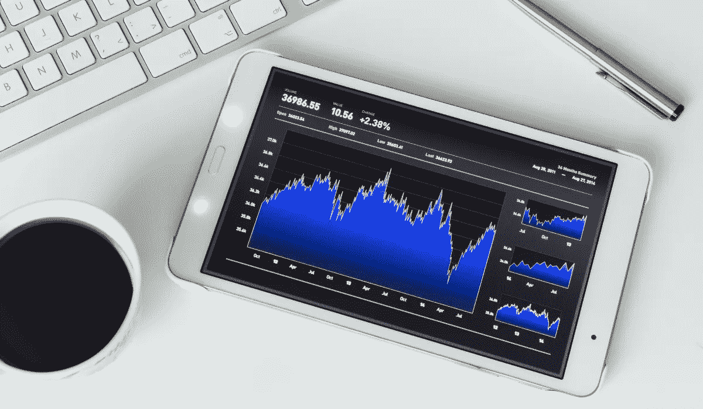

# 我 19 岁时买了第一只股票。以下是我从那以后学到的东西

> 原文：<https://medium.datadriveninvestor.com/i-bought-my-first-stock-at-19-heres-what-i-ve-learned-since-then-5490b6041286?source=collection_archive---------0----------------------->

## 成功、错误和巨大的遗憾

我 19 岁时做了第一笔投资，以每股 150 美元的价格买了 5 股脸书股票。这是一段投资旅程的开始，其中的错误比我最初回忆的要多，但随着时间的推移，这些错误把我变成了一个更好的投资者。

我希望我能说我不会再犯同样的错误，但动物精神可以战胜任何投资者。

我写这篇文章的原因是要讲述一个关于过去错误的警示故事，这样你就可以自己避免它们。这篇文章也可以提醒我自己过去犯过的错误，这样我就不会对未来的成功过于自信。

我投资股票已经三年多了，有很多经验可以分享。

# 坚持你所知道的

只买你知道的。如果有人告诉你一家公司很好，但你对这家公司一无所知，你会在任何下跌时卖出，因为你不知道长期前景。

我读过一些关于为什么某些公司很好并基于这些文章进行投资的文章。然而，当这些公司的股价下跌时，我变得紧张起来，因为我对这些公司不够了解。我能够持有我知道的股票，但我也很快卖掉我不知道的股票。

这让我在下跌时赔了钱，因为在这些时候，我基本上是恐慌性抛售，在某些情况下，当股票从下跌中恢复时，我是在上涨。

# 尽管有短期的噪音，但始终要留住你的赢家

最令人痛苦的错误是，以低于每股 150 美元的成本价持有 40 股 Shopify 股票，然后过早出售，因为该股票被“高估”。

我知道 Shopify 是赢家，但我担心它的估值，于是卖掉了我的股份。我涉足 Shopify 的次数比我记忆中购买 200 美元左右的股票的次数还多，只是为了在稍后卖出实现盈利。

那 4706.44 美元的投资现在值 4.2 万美元。这是我第一次计算损失。我知道这将继续困扰我，所以我最终决定购买 10 股，并可能在某个时候重建到 40 股，但我不着急。

今年我在 Etsy 犯了一个类似的错误，在收益报告发布前，我在 60 多美元的价位卖出了 4 股股票，眼睁睁地看着股票涨到了 80 多美元。这是我最后一次犯这样的错误，我迅速买进了 Etsy 和 Roku 的股票，并将永远持有它们……不管短期的噪音如何。

有一天，我相信我可以做一个 10 倍于未来的投资。Shopify 可能是我的股票，但我从这个错误中学到了很多。

# 独立思考

如果你听价值投资者的话，每只科技股都被高估了，而且注定要下跌。你可以同意价值投资者观点，但你不应该相信他们的话。

我们在股票市场上有太多的人会仅仅因为凯西·伍德买了一只股票就买它，或者仅仅因为迈克尔·伯里(大空头*的投资者*)正在做空它就对特斯拉股票的估值感到紧张。

投资者必须更好地独立思考，并确定他们对高估和低估股票的定义。我喜欢保诚的股票，认为这是一种价值分红策略。它的股息收益率目前接近 6%，目前市净率和市净率都低于 1。这些指标表明保诚被低估了。

同时，我会购买 Etsy 和 Roku 的股票，它们的市净率和市净率都很高。那些惊呼这两只股票估值过高的文章不再吸引我了，因为我是长线投资。

# 不要过度投资一家公司

Roku 和 Etsy 各占我投资组合的 10%左右。这是我希望我的投资组合中有一家公司的高端，所以虽然我不出售任何股票，但我不急于增加我目前的头寸。

有一段时间，我的投资组合中大约有 50%是亚马逊股票。作为投资者，这是一个可怕的时期，我最终大幅削减了头寸。如果我持有这些股票，我本可以做得更好，但我不喜欢将我投资组合的 50%投资于一家公司。

我太关注亚马逊的股票了，只要它下跌 2%，我就会紧张，因为我投资组合中的其他股票没有多少分量。这不会影响我现在的投资组合，因为我的投资组合更加多元化，但当亚马逊占我投资组合的 50%时，它肯定会影响我。

每个人都有不同的风险承受能力和投资标准。在你进行另一项投资之前，了解这些是什么。

# 不要关注分析师

分析师是自私的，他们的价格目标不应该成为你决策过程的一部分。在我早期投资的时候，我非常重视分析师，尤其是大公司的分析师。

然而，随着时间的推移，我开始越来越少关注他们。观看《大空头》让我对华尔街的黑暗面有了更好的认识。我已经对分析师失去了信任，但这条推文为我敲定了这笔交易。

在你认真对待任何人的建议之前，重要的是考虑谁是给出建议的人。

最好的投资者是那些做足功课而不是等待聪明人给他们答案的人。他们知道自己想从投资组合中得到什么，并根据自己的标准做出相应的调整。

一路上你会犯错误，这没关系。在查看我的账户历史时，我意识到我已经提前卖出了几只股票。Shopify 恰好是我记忆最深刻的一个。

不管你犯了多大的错误，重要的是翻过这一页，关注你现在能做什么，而不是你错过的收获。

[***想学习如何投资股市赚钱？确保你订阅了我的 YouTube 频道***](http://bit.ly/2W4ag01)