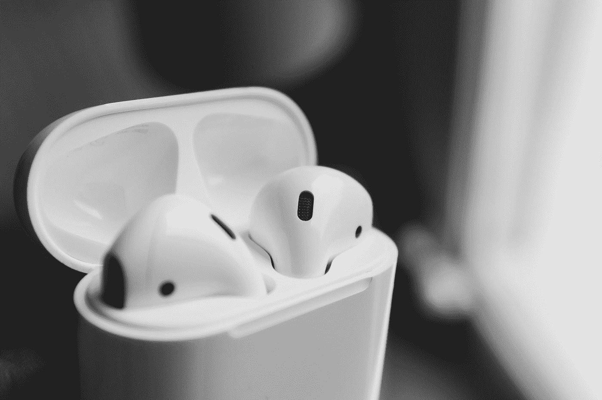
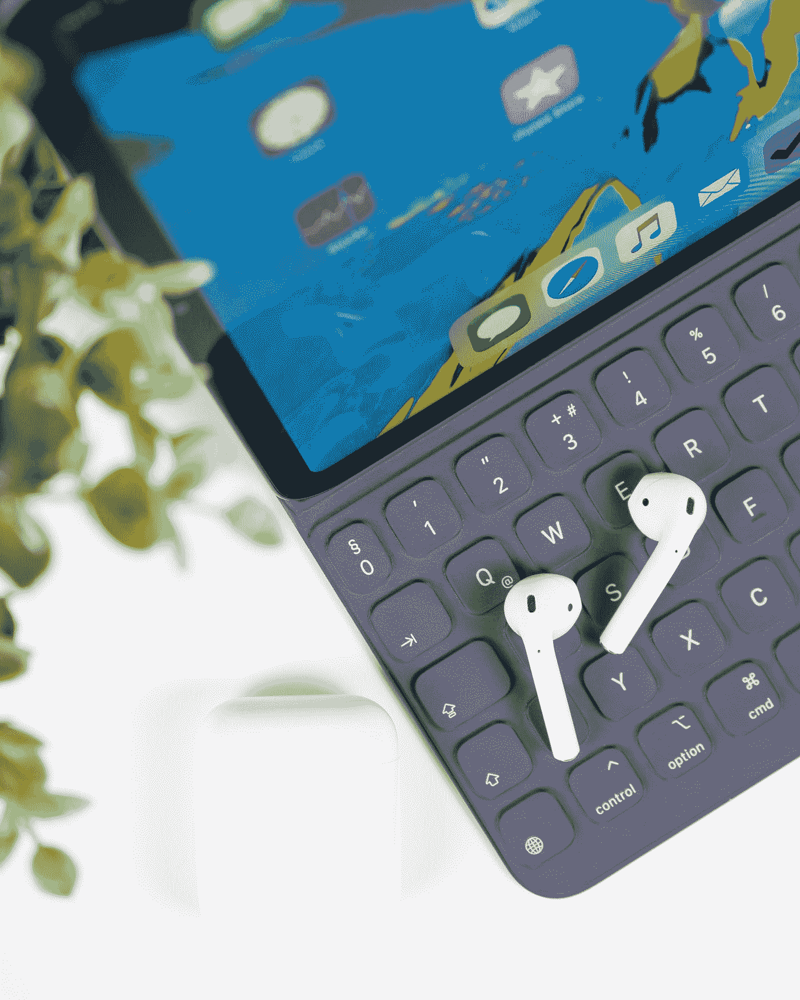
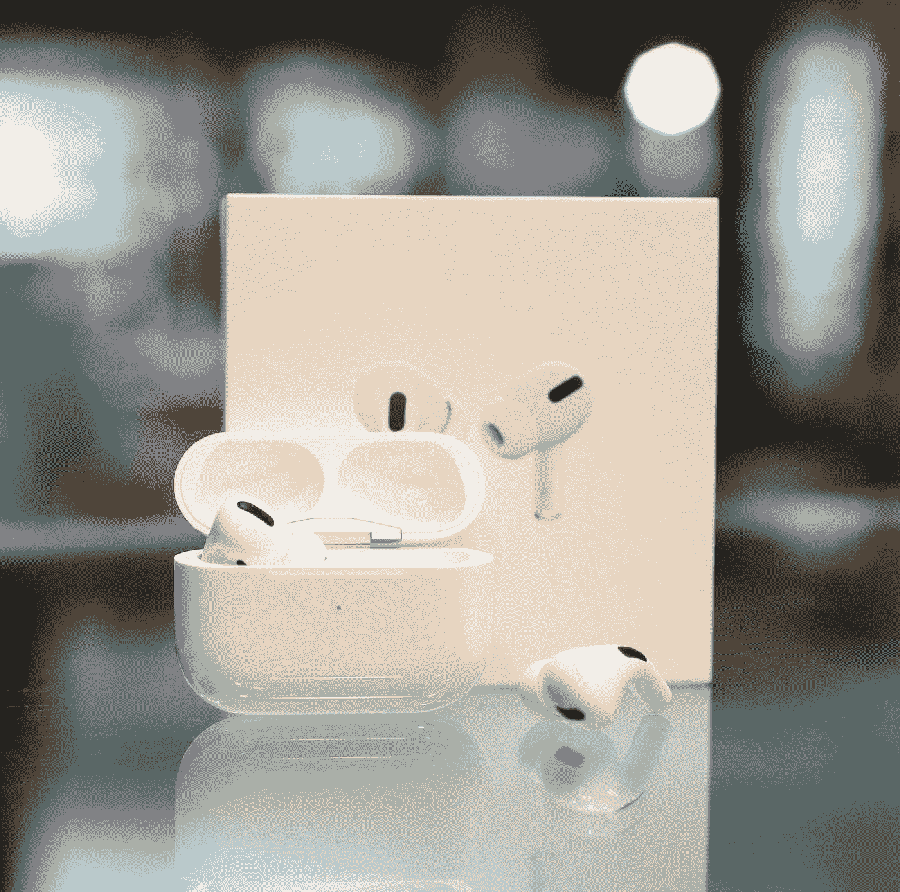

# 我买了苹果 AirPods，非常喜欢它！

> 原文：<https://medium.datadriveninvestor.com/i-bought-the-apple-airpods-and-totally-love-it-4d0cb38ae83a?source=collection_archive---------22----------------------->

Photo by [Howard Bouchevereau](https://unsplash.com/@howardbouchevereau?utm_source=medium&utm_medium=referral) on [Unsplash](https://unsplash.com?utm_source=medium&utm_medium=referral)

## 无线技术

## 我也会考虑 AirPods Pro 吗？

如果你已经关注我一段时间了，你现在应该知道我有多喜欢音乐，尤其是在我锻炼的时候。我健身的时候绝对要听音乐。对我来说，在没有音乐的情况下锻炼感觉怪怪的。

这些年来，我在健身房/跑步中用过不少耳机，每一副都很好用。

然后，随着技术的进步，我的耳机/头戴式耳机也进步了。我开始使用无线的，并且很喜欢。在过去的几年里，我一直在使用索尼 WF1000X，它棒极了。但就我个人而言，我从来都不是入耳式耳机的粉丝。只是有一些关于吸入区的东西有助于淹没让我有点不舒服的外部噪音。我一直更喜欢传统的，如果不合适的话，通常很容易从你的耳朵里掉出来。

 [## 科技日记:苹果的革新，Starlink 的推出和微软转向区块链|数据…

### 欢迎来到科技日记的第一版——我的新博客系列，讲述与科技相关的重要问题…

www.datadriveninvestor.com](https://www.datadriveninvestor.com/2019/05/16/tech-diaries-apples-reinvention-starlink-launch-microsofts-pivot-towards-blockchain/) 

所以，当苹果在 2012 年首次发布 iPhone 5 的 EarPods 时，我立刻就爱上了它。最后，一副耳机非常适合我的耳朵，设计很好，不是入耳式设计。

你可以想象当 AirPods 在 2016 年问世时我有多兴奋，它的设计和 EarPods 一模一样——但却是无线的！

对我来说不幸的是，价格没有我希望的那么好。相比之下，EarPods 售价为 29 美元(129 令吉)，AirPods 公布时的价格为 159 美元(699 令吉)，略高于马来西亚半个月的最低工资。

我的收入可能比最低工资多一点，但由于个人和家庭的承诺，直到近 4 年后，我才最终拿到 AirPods，它是我很长时间以来购买的最好的小工具之一。

问题中的 AirPods 是第二代 AirPods，带有无线充电外壳，零售价为 199 美元(RM879)。我大约一个月前得到它，除了我的手机，它是我经常带在身边的小玩意之一。

Photo by [Daniel Korpai](https://unsplash.com/@danielkorpai?utm_source=medium&utm_medium=referral) on [Unsplash](https://unsplash.com?utm_source=medium&utm_medium=referral)

# 设计

首先，是设计和合身。由于它几乎与 EarPods 完全相同，它完全适合我的耳朵，当我在没有它的情况下剧烈摇头时，这一点很明显。

到目前为止，它一直伴随着我，没有一次让我失望。

因为它不是入耳式设计，我仍然很清楚周围发生了什么，仍然可以听到我喜欢的周围的声音。我知道新的专业版有透明功能，但它必须启用。

至少在这种情况下，我只需要调高音量(如果我想淹没外面的噪音)或者把音量控制在一个我的耳朵不会为此丧命的可接受的水平。

# 质量

包括 AirPods 在内，我有 3 个无线耳机，索尼 one 是其中之一。你可以称我为苹果粉丝，但 AirPods 的质量绝对是所有产品中最好的。设计和声音的质量。

也许我有偏见，因为我只是更喜欢非入耳式设计类型，但在过去的一个月里，我可以肯定地说(至少对我来说)AirPods 的音质是我所有的耳机中最好的。

而且摸起来结实结实。此外，因为它是苹果产品，所以当我在它们之间切换时，它可以无缝地与我所有的其他苹果产品(我有 iPhone、iPad、Apple Watch 和 MacBook Air)相结合。每当我使用耳机时，我不需要不断地将它们连接到每台设备上。AirPods 会自动检测我正在使用的设备，并连接到该设备，我就可以开始听音乐或看视频了。

Photo by [Flo Karr](https://unsplash.com/@flo_karr?utm_source=medium&utm_medium=referral) on [Unsplash](https://unsplash.com?utm_source=medium&utm_medium=referral)

# 健身伴侣

正如我之前提到的，我非常喜欢在健身的时候听音乐。无论是在健身房做力量训练还是出去跑步，我都要随身带着音乐。

在我有无线耳机之前，它都是有线的，我的耳机是我最好的伴侣。然而，这是一个大麻烦，因为这意味着我必须随时带着我的手机。当我不得不经常随身携带手机以便听音乐时，这确实有点麻烦。

然后无线技术出现了，它帮助很大。现在，它甚至更好，因为我还有 Apple Watch，并且因为它自带的 32GB 存储空间(适用于 Series 5)，我可以直接在我的手表中存储音乐，当它连接到我的 AirPods 时，我甚至不需要带着我的手机。这真的很有帮助，尤其是当我在跑步的时候，因为这意味着我不必为了听音乐而带着手机跑步。

到目前为止，我喜欢 AirPods 的一切，但它回避了 249 美元的问题。我现在会考虑购买 AirPods 的专业版吗？它比普通的带无线充电盒的 AirPods 贵 50 美元(200 令吉)，但也有很多升级。

Photo by [Zana Latif](https://unsplash.com/@zan_ilm?utm_source=medium&utm_medium=referral) on [Unsplash](https://unsplash.com?utm_source=medium&utm_medium=referral)

更短的时尚新设计，主动噪音消除和透明模式等技术进步。，它吹嘘了许多理由让那些拥有原始 AirPods 的人升级到 Pro。

然而，我不喜欢 Pro 的一点当然是入耳式设计，这不是我最喜欢的。

我确实用了索尼 WF1000X 整整 3 年，但自从我换成 AirPods 后，我真的更喜欢它了，我不确定我是否想回到入耳式设计。当然，你永远不能说永远，老实说，在我考虑之前，我必须先测试一下它的优点。

如果我最终得到了 Pro，我有一种感觉，我可能不会像普通的 AirPods 那样经常使用它。

这就是为什么这位用户喜欢他的 AirPods，并且在未来很长一段时间内都会喜欢它！

**进入专家视角—** [**订阅 DDI 英特尔**](https://datadriveninvestor.com/ddi-intel)