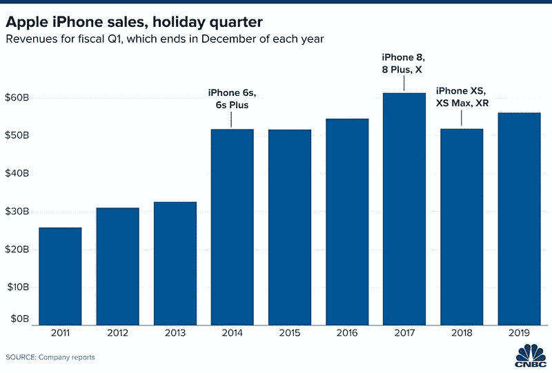
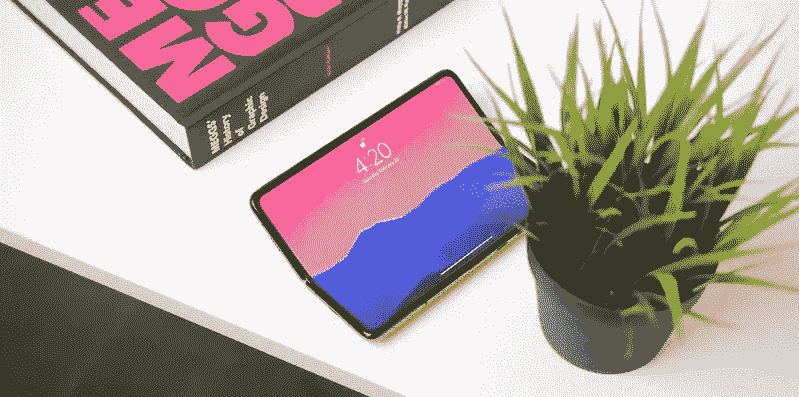

# 我等不及 2027 年的 iPhone 了

> 原文：<https://medium.datadriveninvestor.com/i-cannot-wait-for-the-2027-iphone-60028ad03e9b?source=collection_archive---------22----------------------->

又是一年，又是一部改动极小的 iPhone。除了平坦的边缘之外，与 2017 年的设计几乎相同，苹果最近发布的 iPhone 12 并不令人惊讶。它令人愉快，但并不耀眼。5G 和一系列名为 MagSafe 的背面磁铁，完成了一款将会卖得很好的设备的亮点，但这不会对推动信封做任何事情。

苹果还能对未来的 iPhone 做些什么吗？当然:高频显示屏、更多更好的摄像头、消除“缺口”、复兴触控 ID……所有的迭代改进。对一些人来说很有趣，对大多数人来说很无聊。

苹果在 2017 年达到了 iPhone 的销售高峰，金融分析师预测，2020 年将迎来一个新的高峰，这是由于自 iPhone X 问世以来，没有升级的客户数量增加。在冠状病毒疫情肆虐之际，看看这一预测是否会成为现实将是一件有趣的事情，这种病毒已经让世界上很大一部分地区陷入了严重的经济困境。

*iPhone holiday sales revenue over the years*

多年来，苹果一直因他们如何利用现有技术并将其称为“再发明”而受到批评。苹果做得最好的是通过改善用户体验并使他们易于使用来扩大成熟技术的采用。触控 ID 是一个很好的例子；指纹扫描仪是一种古老的技术，直到苹果公司通过一种易于设置和快速使用的解决方案使其真正流行起来。

把发明和创新混为一谈是问题所在。即使苹果没有发明它所采用的关键技术，当它找到一种方法将它包装在一个简单有趣的产品中时，它就是创新。最初的 iPhone 通过触摸屏做到了这一点，iPhone 5S 通过指纹传感器做到了这一点，iPhone X 通过面部扫描仪做到了这一点。可以说，这是唯一真正创新的 iPhones。

新的 iPhone 12 为苹果赢得了时间，因为在运营商部署适当的 5G 网络之前，其 5G 天线不会积极有用；用户将无法体验苹果吹嘘的高速。对于那些每隔几年才升级一次的客户来说，这意味着更长的寿命，但对于那些将 5G 作为主要原因在这个假期升级的客户来说，这意味着失望。A14 芯片也将扩展 iPhone 12 的相关性，因为它是第一款采用 5 纳米处理器技术的苹果芯片。

 [## 医疗保健的垂直化==初创公司的机会|数据驱动的投资者

### 诸如此类的头条新闻体现了美国医疗保健业的发展趋势——大公司越来越少。它已经发生了很多…

www.datadriveninvestor.com](https://www.datadriveninvestor.com/2020/10/18/verticalization-of-healthcare-opportunities-for-startups/) 

在接下来的 4 年里，iPhone 将会看到相同的机身设计，120Hz 的显示屏，四摄像头模块，更小的凹槽，允许更薄的边框，导致边到边的屏幕，触控 ID 嵌入在电源按钮上或屏幕下，甚至可能采用 USB-C。所有这些“革命性”的改进将会无聊地分散在多个 iPhone 版本中。与此同时，苹果已经在努力工作，用初期技术制作原型，试图在成熟的稳定性、制造成本和公众需求之间找到一个微妙的平衡。

那么，什么样的新技术正在迈出它的第一步呢？可折叠屏幕。苹果正在等待可折叠屏幕的成熟，失败和改进，测试市场，找到合适的材料。其他公司，如三星，愿意无畏地带头努力，用不同的外形充斥市场；在科技世界里，反复试验是一个常见的过程，但苹果公司不是这种类型的实验。对苹果来说，这是一个等待游戏，然后是最后一英里的良好营销。库比蒂诺公司是玩这种游戏的专家。

虽然不能保证可折叠显示器将很快为苹果的消费做好准备，但 Galaxy Fold 2 等努力证明了我们所说的技术正在改进。再过几年，像在外层使用易碎材料这样的问题将会得到解决，像本月早些时候苹果公司展示的一项专利表明，该公司渴望实现 iPhone 和 iPad 之间的成功交叉。随着 2030 年的临近，可折叠设备将变得越来越普遍，为眼镜或耳机上的手机和口袋里的折叠平板电脑等场景腾出空间。

可折叠显示屏目前的发展似乎与苹果将在这个十年结束时跨越的一个里程碑完美吻合:iPhone 20 周年。我相信苹果在可折叠市场的份额将会变成 iPhone 20，预计在 2027 年左右上市。正如 iPhone X 以其第一个近乎窄边框的屏幕、圆角和人脸识别庆祝 iPhone 10 周年一样，苹果很可能会为这款纪念史蒂夫·乔布斯推出 iPhone 20 周年的设备准备一个大惊喜。

我可以想象 2027 年“新 iPad”的展示，新的屏幕尺寸使超薄平板电脑变得更加矩形，几乎看不见边缘。当蒂姆·库克把新 iPad 对折，揭示出实际上是新的 iPhone 20 时，一场演讲以激动人心的观众结束。

*Screenshot from* [*Canoopsy’s video*](https://youtu.be/Wmn46abnz6Q) *“The 2020 iPad Pro Of My Dreams”*

在那之前，有足够多的人会继续欢迎苹果的迭代更新，更多的人会渴望一个令人兴奋的变化。该公司将通过推进服务继续繁荣发展，等待合适的时机向我们出售一项披着闪亮外衣的并不算新的技术。我们只需要再等 7 年，让 iPhone 再次变得有趣。

你喜欢这篇文章吗？ [**订阅**](https://geekonrecord.com/subscribe/) **通过邮件获取新帖。**

*原载于 2020 年 10 月 20 日 http://geekonrecord.com**的* [*。*](https://geekonrecord.com/2020/10/19/i-cannot-wait-for-the-2027-iphone/)

## 访问专家视图— [订阅 DDI 英特尔](https://datadriveninvestor.com/ddi-intel)