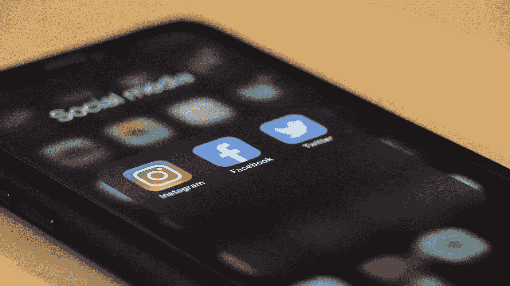

# 我删除了 30 天的所有社交媒体。

> 原文：<https://medium.datadriveninvestor.com/i-deleted-all-social-media-for-30-days-790937a8d152?source=collection_archive---------29----------------------->

Image by [dole777](https://unsplash.com/@dole777) on Unsplash.com

2020 年一项针对*一万一千*个人的研究得出，平均屏幕时间不到*四个*小时。一个人平均每天查看手机 58 次。当你考虑到有其他对你更有效率和更好的事情可以填补这个空白时，这是很疯狂的。2020 年对我们所有人来说都是艰难的一年，当我们被限制在家里时，我们被迫让大脑被所有帮助我们应对的事情占据。无论是迷因、视频，还是社交网站上无休止的滚动。浪费了很多宝贵的时间，至少在我这种情况下。有了这些，在 2021 年，我想删除我所有的社交媒体应用，看看会发生什么。

## **本次实验的目标:**

1.)花更多的时间做有成效的活动，而不是在社交媒体上浪费时间。

2.)看自尊心*有没有提高*。

3.)*降低*屏幕时间。

# 第一周:

我开始去除任何诱惑。删除所有的应用程序让我可以找到其他事情来让我有事可做。以前我花时间浏览社交媒体，现在我不得不寻找其他事情去做。我从阅读新闻或玩糖果粉碎游戏开始，因为这只是一个熟悉的动作，是我创造的一个自然的精神肌肉习惯。没有什么比浏览社交媒体更浪费时间了。现在我仍然住在一个我不熟悉的城市。所以我不打算把手机留在家里以避免诱惑。然而，我不会在公交车上查看 Instagram 或脸书，而是凝视窗外，思考生活或阅读当天的世界新闻。我原以为 FOMO 会是删除应用程序的重要一环，但仅仅一周之后，我就完全忘记了。我不需要接触或看到其他人的生活中发生了什么。感觉*如释重负*。我越想越觉得，总是一样的。同一个地方同一群人。这没什么错，但不是特别吸引人的信息，让我成为一个更好的人。

# 第 2 周:

在社交媒体世界里，一切都是完美的。太完美了。从某种意义上说，人们有时太害怕展示他们生活中发生的事情。不知何故，这变成了一种炫耀和炫耀的游戏，以获得屏幕另一边的人的某种尊重或欣赏。一张陌生人兰博基尼的照片会比买了他们车的人更受关注。悲伤却真实。眼睛和大脑对我们看到的第一件东西做出反应，我们喜欢闪亮和昂贵的东西。这创造了一种比较文化。我会在 Instagram 上看到完美的个人，但不知何故，我会觉得自己不太像人，因为我看起来不像他们，或者赚不了那么多钱，或者其他类似的事情。有毒而且是假的。我开始怀疑自己。不是因为其他人，而是因为我会让它阻碍我实现自己的梦想。我的*抱负*、*目标*和*梦想*。两周没有社交媒体应用，我不再有这种感觉。我已经完全重新组织了我的思想。对自己和自己的外表感觉越来越好。随着滚雪球效应的产生，这意味着在日常活动中变得更加自信。我感到焦虑减少了，我也觉得我每天做的决定更具体了。

# 第 3 周:

到第三周，浪费时间变成了生产力。攀比文化变成了自立和自信。而那句“我没时间做任何事”变成了“我能做那件事，我能做更多”。我生活中的大部分杂念都被清除了。然而，这是我 30 天中唯一一次打嗝。我和我的朋友们在用 skype 通话，其中一个话题是我们一起上学的一个女孩怀了她的男朋友。21 岁，怀孕了。这是我第一次体验到 FOMO 的真实情况。在那之后不久就被关闭了，因为我的朋友们向我保证，在社交媒体的世界里，我没有错过任何东西。在第三周，我还注意到自己比以往走了更多的路。起床出去散步并不总是容易的。尤其是在奥斯陆这个时候。一月很冷。因为封锁而无法去健身房。我需要以某种方式保持健康，在家锻炼并不总是奏效。

# 第 4 周:

为了结束 30 次社交媒体戒毒，我意识到在这个非常小的社交媒体泡沫中，我没有错过太多东西。我花了更多的时间去决定和做我这辈子想做的事情，而不是光想着它。我正在采取措施来实现我的下一个目标。我发现我没有错过社交媒体方面发生的任何事情。我已经看到有一个个人资料是*而不是*必要的。我滚动得越少，感觉越好。

我认为 30 天的挑战是一个强有力的开始，让我重新掌控自己。我将继续保持现状，因为我认为*不需要重新下载我的社交网站。很难忽略这些应用的所有负面因素，而获得非常少的正面因素。例如与朋友和家人保持联系，并与他们保持广泛的联系。没有社交媒体的好处使得删除社交媒体的理由更加充分，这正是我要做的。*

我相信在三十天结束的时候，我实现了这个实验的所有三个目标。我变得更有效率，我的自尊也确实提高了，我的屏幕时间也明显减少了。