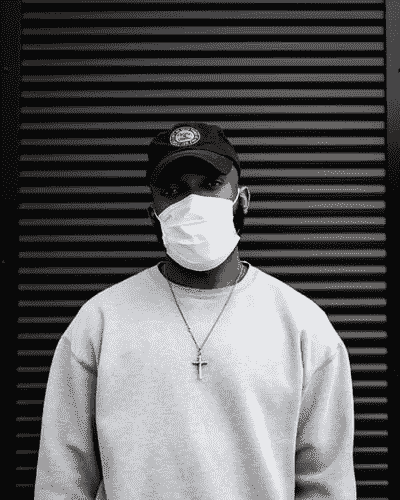
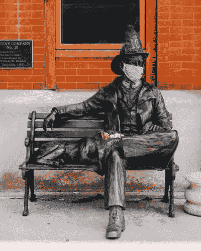

# 我不认为我能习惯看到人们戴口罩

> 原文：<https://medium.datadriveninvestor.com/i-dont-think-i-can-get-used-to-seeing-people-wear-facemasks-fab3bde571ca?source=collection_archive---------19----------------------->

[https://unsplash.com/@wellschan_](https://unsplash.com/@wellschan_)

在尼日利亚的拉各斯，封锁已经解除，取而代之的是宵禁。人们现在已经回到了日常工作中，但每个人都必须戴上口罩，晚上 8 点以后不能外出。

几天前我出去拿东西，看到每个人都戴着口罩感觉很奇怪

新冠肺炎不是我喜欢谈论的话题，但我只想说出我的想法。

谁知道我们真的会因为疾病而不得不戴上口罩。当我不得不戴上口罩出门时，我才明白*狗屎*是真的。

在此之前，我只呆在室内，不需要戴口罩。但是现在，这是必须的，因为没有疫苗，任何人都可以接种。

现在每个人都戴着不同图案、设计和功效水平的口罩——你能责怪我们吗？我们必须以某种方式表达我们的独特性。

我注意到与人交谈变得越来越难了。首先，你无法分辨某人是在微笑还是皱眉，因为口罩遮住了他们的半张脸。

 [## 现金为王，比我们想象的更强大|数据驱动的投资者

### 2020 年 3 月 12 日，在川普总统宣布新冠肺炎进入国家紧急状态的前夕，纽约时报报道…

www.datadriveninvestor.com](https://www.datadriveninvestor.com/2020/03/26/cash-is-king-more-potent-than-we-think/) 

你真的听不清下一个人在说什么，因为一切听起来都很奇怪。你必须不断要求人们重复他们自己，才能正确理解他们在说什么。

我们都可以看到事情不正常，我们可能不会回到 2019 年或前几年的情况。

但这是好是坏呢？我只是觉得，这完全取决于我们如何看待它。有些人可能会把这种封锁视为重塑自我，成为他们梦想中的人的一种方式。

而其他人可能只是交叉双臂，抱怨已经灭绝的“美好的旧时光”，抱怨他们如何迫不及待地再次到外面去，像以前一样过自己的生活。

虽然我支持事情回归正常，但我们必须诚实面对自己——事情不会也不可能回归正常，因为已经发生了太多事情。

公司倒闭了，人们看到他们可以在家工作，而不是通勤。以硅谷为例。租金高得离谱，但随着事态的发展，人们将不必再住在价格如此高昂的社区，因为他们可以在成本更低的地方远程做同样的工作。

[https://unsplash.com/@wistomsin](https://unsplash.com/@wistomsin)

我想到了学校，想到了事情会有多么不同。想象一下，重新适应一个班级的学习会有多不舒服。现在有远程教育，父母可能只是希望他们的孩子在家上学——因为这实际上是划算的。

任何认为或希望事情会恢复正常的人不仅仅是想接受现实。我只是把这段时间看作是对未来的一次考验。在工作、教育、房地产、旅行和健康方面。

工作和学校将远程进行，商业地产将受到影响，而住宅和工业地产将承受更大压力。

健康领域将会有重大的技术进步，帮助我们更好地保护自己，抗击类似的疾病。

对于旅行，城市化将会减少，因为有了快速的互联网——5G，每个人都会决定在生活成本更低的地方工作。

世界在变化，2020 年来了个急转弯，加速我们进入新世界。所以，如果你一直认为世界会保持不变，你应该打消这个想法。

称之为第四次工业革命或数字革命，或者随便你怎么称呼，但确实有一场革命。世界过去的样子明天就不一样了。你能做的就是做好准备。在家工作的时代和零工经济正在全面展开，要从中受益，你不应该回头看。想想你如何为更多的观众创造价值(使用互联网)。

[https://unsplash.com/@danny_lincoln](https://unsplash.com/@danny_lincoln)

如果我继续说下去，而不考虑那些因为被解雇或从事多余的职业而失去理智的人，我就是一个伪君子——他们无法支付下个月的房租或其他账单。

但是，每个人现在都需要的建议并不涉及陈词滥调——“不要浪费这段时间，利用这段时间学习一项技能”建议是——利用这段时间清理你的头脑，为自己创造一条出路。没有人能像你劝告自己那样劝告你。你可能会从别人那里接受一千条建议，但我们是人，我们可能会接受的建议是我们自己的。

所以，利用这段时间想想什么活动最适合你，可以使用互联网并继续下去——因为这是我们前进的方向。