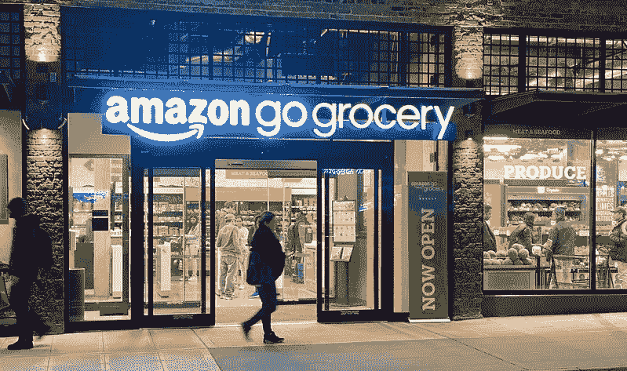
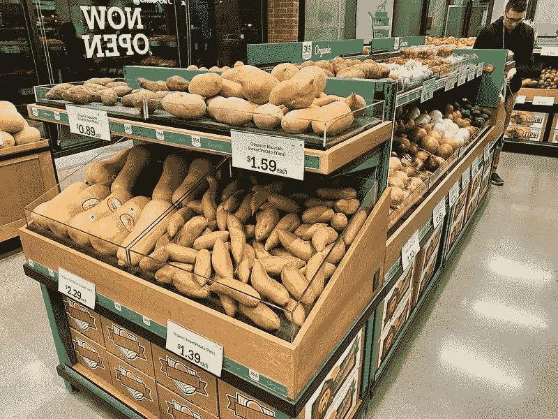
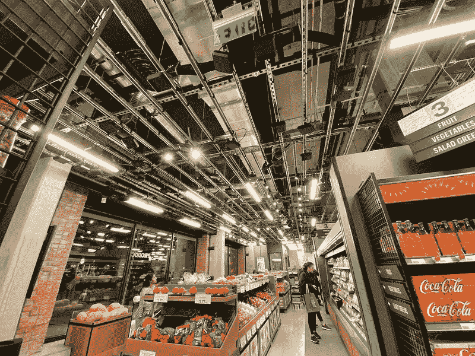
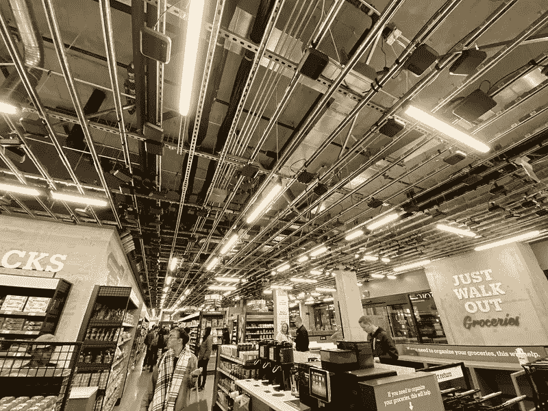

# 我体验了超市的未来:亚马逊 Go 杂货店

> 原文：<https://medium.datadriveninvestor.com/i-experienced-the-future-of-supermarkets-amazon-go-grocery-cb0071811d40?source=collection_archive---------15----------------------->

国会山，西雅图。这是地球上最具未来感的超市亚马逊 Go 杂货店的所在地。今天它第一次向公众开放，这是我的经历。

我在下午 6:30 左右到达那里，准备探索亚马逊最新的人工智能(AI)和图像识别算法。我脑子里只有两年多前亚马逊 Go 商店开张时我去过的那家商店。

最初的商店面临的最大挑战之一是处理水果和农产品。出售的每件商品都单独包装，以简化识别；新鲜的食物必须切片和/或装在塑料盒子里。从那以后，每次我带顾客去 Go 商店，我都会和他们讨论亚马逊解决这个问题的不同方法。添加“智能秤”，连接到与摄像机相同的网络，是我最喜欢的选择；相机会检测客户选择的水果类型，人工智能会将它与秤测量的重量进行匹配。亚马逊找到了更好的解决方案吗？我就要知道了。

 [## 今年值得关注的 5 大人工智能趋势|数据驱动的投资者

### 预计 2019 年人工智能将取得广泛的重大进展。从谷歌搜索到处理复杂的工作，如…

www.datadriveninvestor.com](https://www.datadriveninvestor.com/2019/02/19/artificial-intelligence-trends-to-watch-this-year/) 

商店的入口很熟悉，一名亚马逊员工欢迎人们，并帮助他们在手机上设置亚马逊 Go 应用程序，这是用来进入的。我立即走向农产品区，有那么一瞬间，我失望了。没有未来的规模或任何来自科幻电影的东西。我找到了农产品和水果篮，仅此而已。人工智能怎么知道我拿了什么？事实证明，摄像头和传感器已经足够了！

我的测试者思维开始发挥作用:我抓起一个中国茄子(它的颜色和我的夹克相似)，把它的形状藏在我的前臂下，然后把它放在我的包里；我单手拿了两个罗马番茄；我从它的农产品篮子的最深处拿了一个红薯(如下图)，这绝对是相机够不到的。

的确，亚马逊的解决方案对顾客来说是最方便的；通过完全依赖现有的传感器和人工智能来检测客户拿走的产品，体验是无摩擦的。比用“智能秤”好多了。最精彩的部分？人工智能没有失败，并且能够准确地对我拿走的东西收费。

Amazon Go 杂货店的天花板一如既往地令人生畏，摄像头指向每个方向，覆盖了每个角落。形状像黑匣子的摄像机监视着每一个进入商店的人，记录下他们接触的东西和去的地方。从这里可以很好地看到农产品区上方的天花板。

有趣的是，产品通道中的摄像头数量与其他通道中的数量相似。因为亚马逊 Go 杂货店是一个全尺寸的超市，它必须覆盖比常规 Go 商店更大的表面，但这并不意味着摄像头的密度需要根本不同。

这是商店另一部分的天花板，靠近入口。请注意，即使购物车被退回的地方也有摄像头。

其余的购物体验与你在普通亚马逊 Go 商店所能期待的一样:边走边打包，然后在完成后离开。一旦您的访问结束，并且您的信用卡已付款，收据将自动发送到您的电子邮件地址。这就是我注意到的一个不同之处:我的收据在我离开商店两个多小时后才被提供，而我去普通亚马逊 Go 商店的收据在离开后几分钟内就被送到了。

是什么导致了延迟？我的访问记录是由人类审查的吗？由于这家商店刚刚向公众开放，如果亚马逊正在进行质量审查，以确保人工智能在大规模下工作良好，我不会感到惊讶。我的一个朋友开玩笑说:“*大概他们让人从不同的角度看视频来数你拿了多少西红柿”*。他可能终究没有错。

回到 2018 年，我想知道亚马逊需要多长时间才能将他们的“走出去”技术推广到他们的连锁超市全食超市。这个新的亚马逊 Go 杂货店实验证明，这一天可能比以往任何时候都近。通过自动化收银员，对就业影响的永恒问题重新浮出水面。我们的社会准备好迎接一个收银员成为历史的世界了吗？目前没有，但这并不意味着我们应该抵制自动化。事实上，即使是 Amazon Go 的理念也一直在适应，以避免排除没有智能手机或信用卡的人；这些商店接受现金付款。

现在，我不是说人工智能对我们的工作社会没有任何影响。那将是虚伪的。我确实相信，当机器人和人工智能的结合足够可靠、足够便宜以取代人类时，许多工作将会消失。但我也认为，我们需要从长远来看这种情况；今天由少数专业人员从事的工作将成为下一代的标准。

就在 2018 年第一家亚马逊 Go 商店开业的一周前，谷歌首席执行官桑德尔·皮帅这样评价人工智能[:*历史表明，退缩的国家不善于改变。所以你必须拥抱变化。”今天，我仍然觉得这句话非常贴切。*](https://www.theverge.com/2018/1/19/16911354/google-ceo-sundar-pichai-ai-artificial-intelligence-fire-electricity-jobs-cancer)

当我离开 Amazon Go 杂货店，拐过街角时，一个路人开玩笑地对他的朋友喊道“【to】未来！”。我笑了笑，心想“*没错，没错就是“*”。

相关:[微软的数字货架是亚马逊 Go](https://geekonrecord.com/2019/02/04/microsofts-digital-shelf-is-a-messy-competitor-of-amazon-go/) 的(凌乱)竞争对手

*全面披露:我在 2018 年写了我对 Amazon Go 的第一篇评论，当时我在微软工作。今天，我在亚马逊工作，但这篇文章中的观点是我个人的，并不代表亚马逊。*

你喜欢这篇文章吗？ [**订阅**](https://geekonrecord.com/subscribe/) **通过邮件获取新帖。**

*原载于 2020 年 2 月 26 日*[*geekonrecord.com*](https://geekonrecord.com/2020/02/25/i-experienced-the-future-of-supermarkets-amazon-go-grocery/)T22。