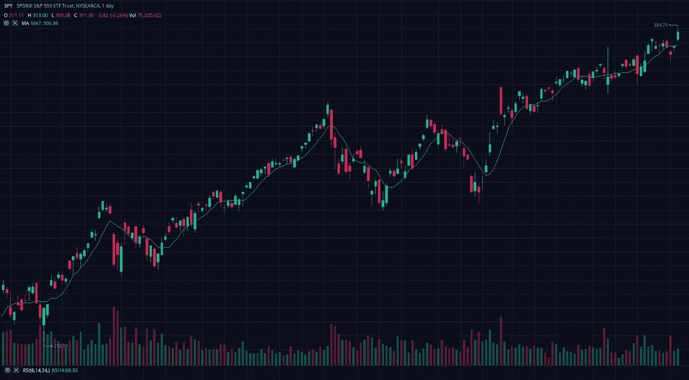
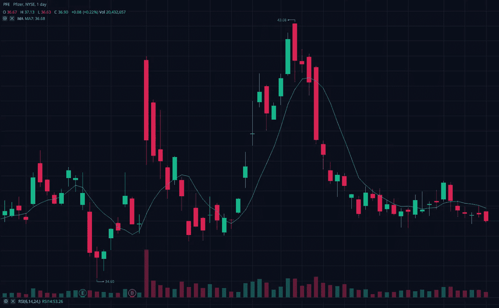

# 当我投资股票市场时，我感到内疚

> 原文：<https://medium.datadriveninvestor.com/i-feel-guilt-when-i-invest-in-the-stock-market-ebc3d4fb632b?source=collection_archive---------23----------------------->

## 首席执行官不是我最喜欢的人。

作为一名投资者，我知道一家公司会竭尽全力让自己的股票价格上涨。我喜欢这个。作为一名投资者，我喜欢知道一位首席执行官会做后空翻，犯下多项罪行，这样他们就可以获得数百万美元的奖金，并保住自己的最高职位。这对我有帮助。一瞬间。

作为一个人，我对一家公司竭尽所能让他们的股票价格上涨感到内疚，我不喜欢这位首席执行官，因为我大部分时间都在支持他们的主张。我开始质疑工人们的待遇。有多少偷工减料影响到日常员工的幸福感？每个问题都会引出另一个问题。

然而我投资是因为我需要赚那 20 美元？这是我唯一希望兑现的，我并不富有。我需要那二十美元。如果我能利用一个好的一天或摆动交易，我会抓住它。它们可以相加。

当我看到这样的东西时。数据。我喜欢数据。

Phizer 在这里找到了一个支撑点。我想我必须试着利用这种情况。可能不会是一个好的日交易，但如果我持有几天，我会看到一些收益。那我就卖了。

当我购买时，内疚感开始产生，但没有那么强烈，因为在这种情况下，它是一家制药公司。但是它仍然存在。我开始思考辉瑞公司的一名员工，他目前的工作很糟糕，辉瑞公司可以让他的工作变得更好，但辉瑞公司不会解决这个问题。上头的命令。不需要做任何改变。

我敢肯定，我们当中有许多人在太大的公司工作，并不真正关心基层发生的事情。如果公司赚了钱，就不给员工提供激励的地方。我个人曾试图避免这种情况。

我不喜欢一群西装革履的人控制着一个行业的日常运作，除了公司办公室，他们从未真正工作过。让他们先在入门级岗位或零售店工作！

在我看来，继续说下去，当一个公司从一个商店变成两个商店时，对员工来说一切都变了。确实如此。

我理解为什么一个公司的老板想要开多家商店。这很有道理。商店是成功的。两个会更好。我明白了。你有抵押贷款，还有很多人要养活。如果你能记住帮助你到达那里的员工的辛勤工作，并像对待一号店的第一批员工一样对待所有员工，那就太好了。

不要扩大差距！

我知道小企业爱他们的员工。大生意，没那么多。

我在这里确实有一些生活经验。我曾为一家公司工作，这家公司在几年内从一家商店发展到两家，然后发展到十家。变化是惊人的。不是变得更好。高层收入越多，每个人的压力越大。我没有看到任何好处，只有更多的工作来宣传我工作的地方。公司不错。

今天，似乎不可能避免为大企业工作。展望未来，情况似乎不会很快改变。炒股是我一直在做的赚点外快的事情之一。我很擅长这个。我赚钱。我要是停下来就太傻了。

尽管如此，罪恶感仍然存在。它总是在那里。还有其他人对投资有这种感觉吗？我不可能是唯一一个。我可以吗？

蟋蟀。

