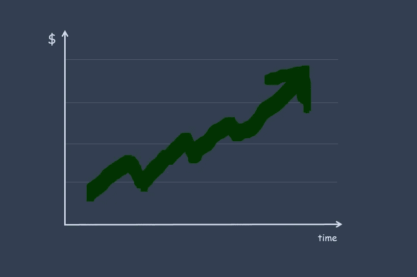
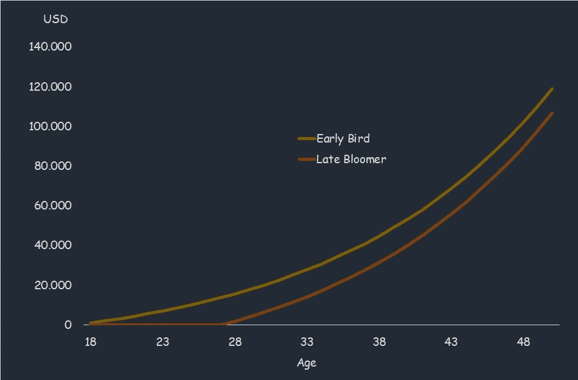

# 在我哥哥 18 岁生日那天，我送了他股票——原因如下

> 原文：<https://medium.datadriveninvestor.com/i-gifted-stocks-to-my-brother-on-his-18th-birthday-heres-why-a8029dddfbb4?source=collection_archive---------8----------------------->

## 个人理财—投资

## 投资不仅仅是为了积累财富。它帮助你发现你生命中的价值。

Picture by the author

我最小的弟弟刚满 18 岁。比我小十岁的我，很难领悟他已经到了成年的边缘。他一直是个小家伙，但现在可以开车，经常去酒吧，并在选举中投票。时光飞逝，而时间恰恰是我们最宝贵的财富。受自然的限制，我们不得不尽我们所能使用它。

我和我的兄弟们很幸运，在一个发达国家被充满爱心、受过良好教育的父母抚养长大。有了沉迷于我们渴望的任何职业和业余兴趣的能力，我们就有机会享受充实的生活。我们应该努力充分利用它。

那么，为什么是股票呢？几年来我一直在投资我的储蓄。目前 28，我希望我能早点开始。原因有几个，但都归结到以下几点:

> 投资极大地提高了我的生活质量——甚至在我开始收获经济利益之前。

下面，我将讨论我希望向我弟弟介绍投资能帮助他做些什么，因为他将继续他的年轻成年之旅。

## **了解机会成本**

作为一名训练有素的经济学家，思考*权衡*是第二天性。但不是每个人都不自觉地考虑自己选择的机会成本。这种思维方式在投资时变得清晰，因为你不断面临许多不同的选择和不断变化的价格。

你可能擅长分清主次。但是，即使你考虑到在做出某些选择时你必须放弃什么，投资也增加了另一个维度:时间。在经济学中，涉及当下的权衡被称为*期内*。然而，机会成本有时也会跨时间发生作用——跨期*。*

*如果你决定买一双你不需要的昂贵的鞋子，你将限制你目前的消费可能性。你也将放弃存钱的机会——以及让钱发挥作用的机会。*

*随着时间的推移，储蓄可以让你和家人去度假，或者买一辆更好的车。这些选择可能比衣柜后面多了三双积满灰尘的鞋子更有价值。*

*同样的，选择呆在家里不去健身房狂看最新的网飞秀不仅仅意味着你那天燃烧了更少的卡路里。在不久的将来，当你去健身房的时候，你将不会意识到从之前的锻炼中得到的好处。你身体发展的道路已经稍微改变了。*

> *当你理解跨期机会成本时，你会有动力去做那些不会给你即时满足感，但会让你过上更好生活的事情。*

*无论是健身，读书，还是健康饮食。当你决定犒劳自己的时候——这是有理由的——你很少会后悔。*

## ***发现偏好并进行长期思考***

*我们都有一些潜在的偏好来指导我们的选择。当我们坐下来思考我们真正想要的是什么时，我们往往能够弄清楚。但我们也是非理性的存在。通常，我们会因为很多原因而偏离最佳行为。*

*一个原因是我们不幸遗传的懒惰。即使我们知道自己想要什么，我们的本能也常常会让我们做出容易的选择。我们的本能也让我们比现代社会要求的更厌恶风险。*

*对失败的恐惧深深植根于我们心中。当我们面临不确定性时，我们的本能会引诱我们远离我们想要的结果，让我们选择一个不太理想的结果(因为它降低了不确定性)。*

*另一个是我们没有能力承诺。像动物一样，我们经常选择小的即时奖励，而不是大的延期奖励。发现偏好首先是关于自我意识——识别生活中什么是重要的。致力于遵循这些偏好需要自律和长期思考。*

*进入游戏后，我变得更善于长远考虑。投资就是采用一种心态。这种心态也有益于生活的其他领域。意识到我的偏好也意味着意识到我有多重视能够在未来采取某些行动。*

*考虑长远并不意味着忽视短期。我们大多数人都不希望在 80 岁时生活在岩石上变得尽可能富有。相反，长期思考意味着我意识到我所面临的权衡，并在现在和未来之间找到最符合我偏好的平衡。*

> *在即时回报和延期回报之间找到平衡感觉就像鱼和熊掌兼得——投资帮助我实现了平衡。*

## ***追求并实现目标***

*通过促使自己意识到自己的偏好，从而记住我对长期利益的重视程度，投资让我意识到了旅行的乐趣。*

> *让我满意的不仅仅是目的地。也是朝着正确方向前进的感觉。*

*通过追求培养这种心态是可能的——在工作中，做运动，或者练习不同的艺术形式。我发现，为实现某个目标而努力给了我一种归属感，并让我做的许多小事有了更深刻的意义。它让我专注于做我喜欢的事情，或者让我更接近我想要的生活。*

> *实现目标是一种很棒的感觉。它击败了我能通过吃零食、狂看连续剧或玩电子游戏给大脑提供的所有形式的快速修复多巴胺刺激。*

*回报不是立竿见影的，但却更加有力和持久。*

*设定目标不必过于雄心勃勃，也不必总是非常具体。具体的目标可以是动力的助推器，也可以是动力的杀手。看情况吧。*

*在我以结构化的方式朝着可衡量和现实的目标努力的情况下，我会设定具体的目标——比如在我的下一个生日之前，将我的卧推从 105 公斤增加到 120 公斤。*

*说到投资，我没有。相反，我忠于自己的价值观。缺乏具体的目标意味着随着生活的展开，我可以调整增加多少储蓄。强迫自己存一定数量的钱不会给我带来任何价值，因为有几个月我会比别人存更多的钱。*

*此外，预测市场在短期内的走向不是我所能做到的。追求投资组合价值的目标会让我紧张。*

* [## 这么说一家大型风投基金正在投资你的初创公司？4 实际考虑|数据驱动的投资者

### 首先，恭喜你。融资总是需要努力的，一个大的风险投资基金当然是一个大的…

www.datadriveninvestor.com](https://www.datadriveninvestor.com/2020/08/09/so-a-big-vc-fund-is-investing-in-your-startup-4-practical-considerations/) 

自从采用了这种思维模式，我存钱的能力直线上升。我的回报率也在上升，但经验对此有所贡献——这在一定程度上可能是巧合。

重要的是要注意，对我有效的，对其他人可能不是最佳的。我不会强迫我的兄弟完全按照我的方式去做。

> 相反，让他了解股票市场应该有助于他确定自己的价值观，激励他追求自己渴望的目标，并一路享受其中。

Photo by [Markus Winkler](https://unsplash.com/@markuswinkler?utm_source=medium&utm_medium=referral) on [Unsplash](https://unsplash.com?utm_source=medium&utm_medium=referral)* 

## ***思考塑造未来的想法***

*投资的一个额外好处是，它鼓励我从不同的角度思考这个世界。可再生能源传输、自动化程度提高、云/边缘计算、基因组学、数字支付、最后一公里交付和电子商务等大趋势将在未来几十年对世界产生巨大影响。*

*人类取得了令人难以置信的成就。我们能够发明和创新，改善我们的生活，远远超出几代人之前的想象。然而，我们也面临着复杂而有趣的挑战。*

*被激励去更好地理解这些主题是真正的付出。我对这个世界、它的运行方式以及我们如何改善它感到好奇。这就是我学习经济学的原因，也是我为政府做政策分析的原因。*

> *拓宽你的视野是一份会持续给予的礼物。*

## ***让复利的力量发挥它的魔力***

*当然，根据喜好行事，有长远的眼光，追求我想要的目标不仅仅是投资的结果。我的投资活动和投资组合规模与另一个重要因素相关:年龄。*

*随着年龄的增长，我作为一个个体不断成长，并从错误中学习。这是一个持续的过程。我哥哥也必须这么做。我既不能也不期望他在 18 岁时有 28 岁人的成熟。他不应该着急。但是在一些指导下，他可能会比其他人长得更快。*

*不过，有一样东西让早期开始变得极其重要:复利。让我们不要隐瞒这样一个事实:投资首先是一个积累财富的问题，以便将来有更多的选择。财富越早开始积累越好。*

*复利是世界第八大奇迹。它让财富呈指数增长。阿尔伯特·爱因斯坦认为它是宇宙中最强大的力量，据说他指出:*

> *“理解它的人赢得它；谁不付钱，谁就付钱。”*

*为了说明尽早释放复利的重要性，考虑下面的例子。*

*两个人——早起的鸟儿和大器晚成的人——会投资到 50 岁。从 18 岁到 50 岁，Early Bird 每年将投资 1000 美元。*

*大器晚成者享受二十几岁，因此在 28 岁之前不会投资任何东西。为了弥补这一点，大器晚成者将从 28 岁到 50 岁每年投资 2000 美元。*

*两者的回报率相似，假设为每年 7%，与过去 20 年道琼斯工业平均指数的平均年回报率相对应。*

*在 50 岁时，早起的人会有 119.000 美元，晚熟的人会有 108.000 美元。区别好像不是太大。但是晚熟者在 23 年里保存了双倍的早起鸟数量。*

*总的来说，Early Bird 在 33 年的时间里留出了 33，000 美元。大器晚成的人在 23 年里存了 46000 美元，但在 50 岁时钱更少了。*

*早鸟的总利润是 86.000 美元。大器晚成的总利润是 61.000 美元。*

*关键的区别是:早期的投资有更多的时间来赚取利息，以及利息的利息。这两个投资组合的价值随着时间的推移概述如下。*

**

*The curves show the value of the two portfolios over time. Due to compound interest, they both exhibit exponential growth. Picture by the author.*

## ***那么，我给他买了哪些股票？***

*首先，这篇文章并不是建议投资哪些公司。其次，如果财富增加是唯一重要的因素，大多数人最好购买跟踪主要指数的交易所交易基金。但是如果你好奇的话，我可以分享我的选择:*

***Unity Software(在纽约证券交易所上市)** Unity 开发并维护一个游戏引擎，游戏开发者可以在这个引擎上开发游戏。iOS 应用商店中约一半的游戏使用 Unity。游戏行业的几个大玩家也在使用它。比如动视暴雪的炉石、Rust、Pokémon GO。但是 Unity 的潜力远远超出了游戏。他们的软件也用于电影和 VR/AR(虚拟和增强现实)。*

*我哥哥喜欢玩电子游戏，因此已经很了解这家公司了。他玩过几款基于他们引擎的游戏，对 Unity 的产品有一个大致的了解。这让他有机会了解这家公司，并预测它未来的发展。*

> *激发他对商业方面的兴趣很重要。选择一家与他相关的公司会更好地实现这一点。*

*当然，该业务也应该是一个很好的投资案例。*

*目前的估值过高，意味着未来高增长中的价格因素——这是非常可能的，但不能保证。但从长远来看，我相信这是一个赢家，我期待着享受乘坐我的兄弟在船上。*

*我希望投资能在经济上和精神上帮助他。它不仅让我清楚地知道我重视什么，喜欢什么。这也给了我经济自由和采取行动的精神能力。*

## *访问专家视图— [订阅 DDI 英特尔](https://datadriveninvestor.com/ddi-intel)*