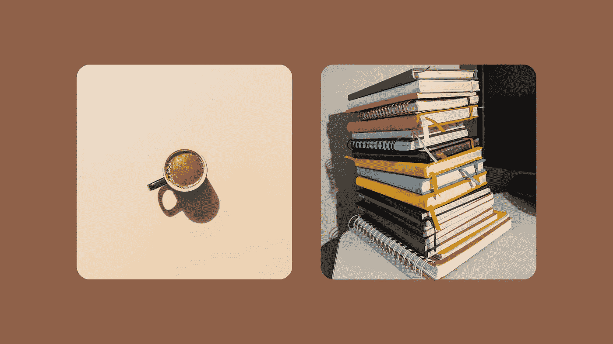
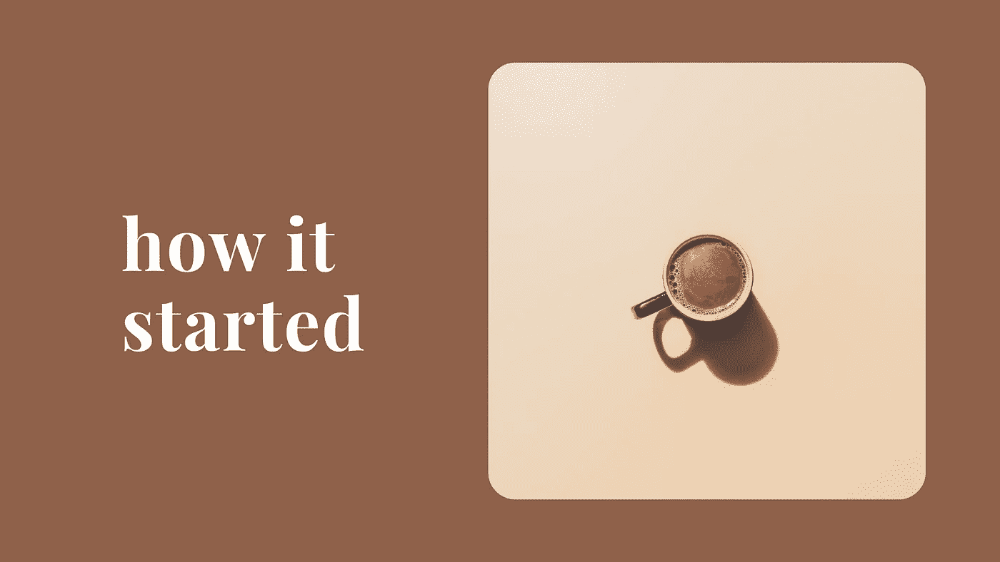
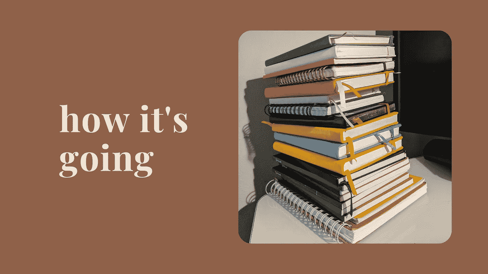
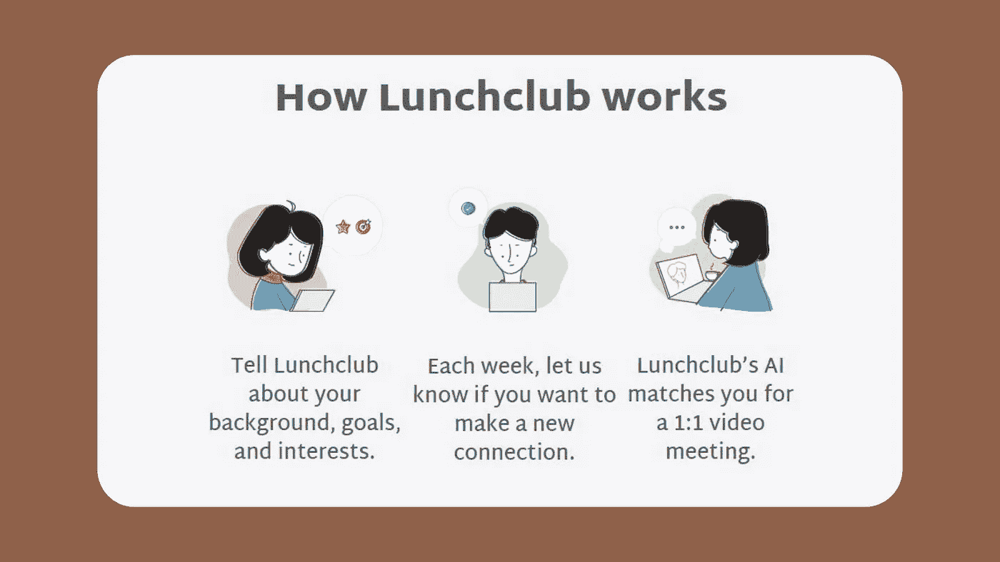
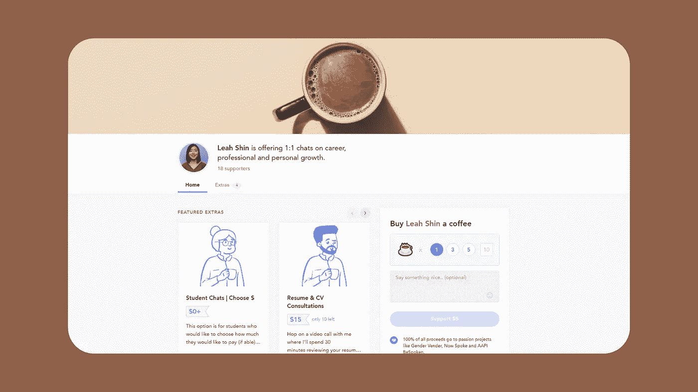
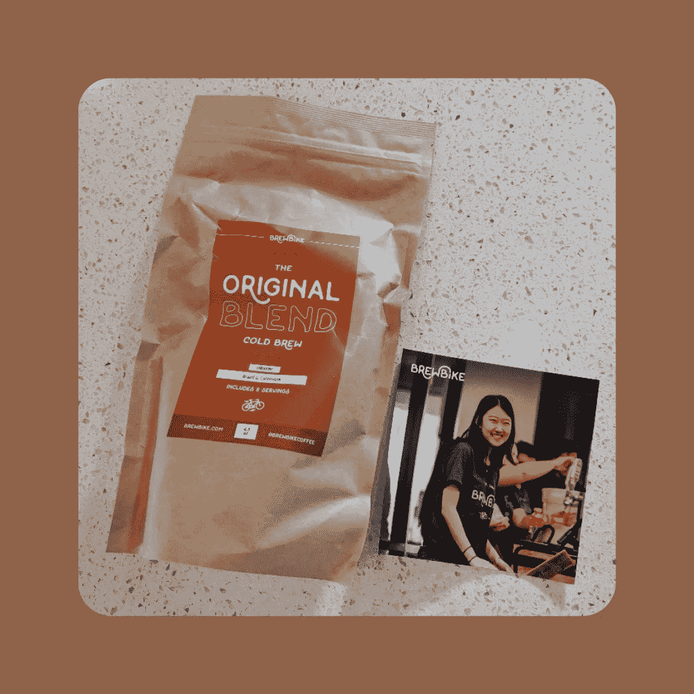

# 我有超过 200 次的咖啡聊天，以下是它是如何开始的，以及它将如何进行

> 原文：<https://medium.datadriveninvestor.com/i-had-200-coffee-chats-heres-how-it-started-and-how-it-s-going-fb0a582035ec?source=collection_archive---------5----------------------->

How it started vs. How it’s going.

我第一次真正理解“咖啡聊天”是在我大学二年级的时候。我在 T-Mobile 进行了我的第一次暑期实习，这太不可思议了——我有了第一个职业徽章，上面有我的名字和照片*，参与的项目给我带来了如此多的兴奋(我不得不提醒自己要保持冷静)，厨房里的免费咖啡机给了我第一杯咖啡(我没有加牛奶或糖，所以那次经历非常痛苦)。*

我的经理当时鼓励我与团队成员、组织中的其他人以及公司内部的其他人进行咖啡聊天。她分享了咖啡聊天的重要性，说道:

> “这对你来说是一个很好的机会，你可以介绍自己，听取他人的意见，从他们的经验中学习，并有可能找到未来合作或共事的方式。”

从那时起，我开始了第一次令人紧张的咖啡聊天，直到今天，我结束了第 279 次聊天。

# 怎么开始的

## 1.伸手

当我第一次开始我的咖啡聊天之旅时，我的经理通过向她认识的联系人发送电子邮件来帮助我。随着我越来越习惯安排自己的咖啡聊天，我会开始介绍自己(姓名、头衔和角色)，包括为什么我对与他们联系感兴趣，以及没有人欠我咖啡聊天的心态。

这让我在准备时非常细致，并主动让日程安排过程变得天衣无缝。

**边栏:如果你不想给你社交网络之外的人发电子邮件或 LinkedIn 信息，先研究一下，看看你的熟人中有没有人可以通过电子邮件介绍你。这将导致更高的响应或看到率。*

## 2.战略准备

随着我最初几次咖啡聊天的安排，我精心准备。我在他们的 LinkedIn 上做了深入研究，准备相关问题，通过日历邀请发出项目议程，并总是在手边准备好钱包，提供一杯咖啡或他们选择的饮料。

> ***议程示例:***
> 
> *感谢您抽出时间与我联系。我很乐意就以下主题向您请教:*
> 
> *-你今天的旅程。
> -针对他们的主题领域的问题。
> -关注他们的兴趣或身份领域的问题。
> -在职业生涯早期，你会给别人什么建议或提示？*

**边栏:在 30-45 分钟内回答 4-5 个问题就足够了，因为后续问题或对话会自然出现。*

## 3.安抚我的神经

为了缓解我的紧张和尴尬，我问一位亲密的实习朋友是否愿意和我一起聊天。我很早就发现，有第三个人参加咖啡聊天让我建立了与一个全新的人联系的信心。它还创造了如此具有传染性的能量，我们在那里相互弹开对方的问题，这总是让我们忘记时间(很多次导致我们安排后续聊天)。

侧边栏:我总是会征得同意，或者提前通知第二个人加入我们的咖啡聊天。

## 4.后续行动

在聊天过程中，我在笔记本上草草记下关键主题和笔记，以便在交谈后进行反思。我需要时间来消化之后分享的智慧或建议。这些笔记也是很好的致谢和总结邮件。在我的后续笔记中，我包括了以下内容:

> ***简介:*** *问候。* ***第一段:*** *谢谢和大家分享一下自己的背景。* ***第二段:*** *我总结了 3-4 个主题。* ***第三段:*** *重申你的激情以及它是如何与他们的保持一致的。* ***第四:*** *号召行动起来或者你想保持怎样的联系。* ***第五:*** *来自 convo 的一段妙语或瞬间的可选附文。* ***落款:*** *签名。*

侧边栏:并不是每次聊天都需要发送这样一份极其详细的跟进说明。当我没有遵循上述流程时，我会通过 LinkedIn 连接请求发送一封较短的感谢信。

# 怎么样了

这些年来，我做的咖啡聊天越多，我的自信和笔记本收藏就越多。现在，在我大学毕业一年的职业生涯中，我正在实践自己许下的诺言。

 [## 拥抱商业成功的网络|数据驱动的投资者

### 作为一个企业主或企业家，网络是至关重要的，你可以获得更多的业务线索，完成交易，并…

www.datadriveninvestor.com](https://www.datadriveninvestor.com/2019/07/20/embracing-networking-for-success-in-business/) 

## **每月一次的咖啡聊天**

每个月，我都尽力在公司内外继续我的个人咖啡聊天之旅。我最喜欢做的一件事是，在喝咖啡的时候，跟踪我以前联系过的人，看看他们过得怎么样。我采取的另一条途径是，在小组活动或虚拟活动中，接触我在 LinkedIn 上找到的有趣的人。

我还发现了像[午餐俱乐部](https://lunchclub.com/?invite_code=leahs4)这样的社区，它们使用人工智能将你与具有相似背景、兴趣或激情领域的人联系起来。我最喜欢午餐俱乐部的是每周的电子邮件提醒来选择你的时间，总是让你有责任去认识新的人。

Source: Lunchclub website.

## 每周咖啡聊天

每周四，我会花 1-2 个小时通过虚拟咖啡聊天与学生、应届毕业生和教室联系。我通过女孩们建立的，[拉格兰特基金会](https://www.lagrantfoundation.org/)，以及我留出的[时间段](https://www.buymeacoffee.com/leahshin)来做这件事。

The timeslots I set aiside via buymeacoffee [here](https://www.buymeacoffee.com/leahshin).

我把这段时间奉献给向前支付，成为一种资源，并与将成为我们下一任领导人的年轻人保持联系。

BrewBike coffee sample sent by a student I connected with.

当我大学毕业时，我最大的担忧之一是失去对 18-20 岁意味着什么的了解——他们带来挑战现状的火焰，标出需要创新的领域，以及以我们从未想象过的方式使用技术。

通过这些咖啡聊天，我偶然发现了一个在他们的校园里经营 [BrewBike](https://www.ivyfol.io/brewbike) 的学生，一个经营 [Gen Z 时事通讯](https://www.linkedin.com/pulse/influencers-why-so-many-gen-zers-want-pursue-careers-neal-sivadas-/)拥有 8000 多订户的学生，以及一个领导 PNW[最大黑客马拉松](https://dubhacks.co/about)之一的学生。

## 我们去喝咖啡吧

自从我第一次喝咖啡醒来，我就知道我必须在喝咖啡的时候加点牛奶和糖。同样地，我也知道了我应该采取什么步骤来准备一次很棒的咖啡聊天。它是实践、准备和开放的混合物。

如果你想喝咖啡，请点击[这里](https://www.buymeacoffee.com/leahshin)或者直接通过我的 LinkedIn [这里](https://www.linkedin.com/in/leahshin/)联系我。

## 访问专家视图— [订阅 DDI 英特尔](https://datadriveninvestor.com/ddi-intel)