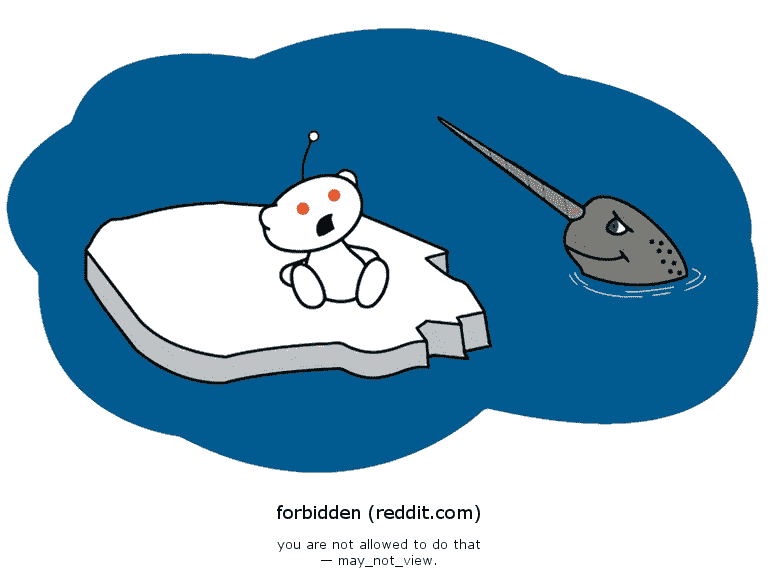

# 我讨厌 Reddit

> 原文：<https://medium.datadriveninvestor.com/i-hate-reddit-1a199fee4991?source=collection_archive---------5----------------------->

## 它是互联网上最权威的空间

Photo by [engin akyurt](https://unsplash.com/@enginakyurt?utm_source=medium&utm_medium=referral) on [Unsplash](https://unsplash.com?utm_source=medium&utm_medium=referral)

你有一个关于足球的博客。我写了一篇史诗般的帖子，非常好，质量很高。加入 Reddit 足球社区，发布这个帖子的链接。立刻，成千上万的人访问你的博客。你的帖子得到了很多支持和评论。当一切似乎进展顺利时，Reddit 频道管理员认定你是垃圾邮件发送者，删除你的帖子，有时甚至将你逐出频道。

你会收到一个通知，引用了一堆规则，有些对于这样的网站来说太普通了，还有 reddiquette 频道。

# 你的 Reddit 生活结束了

不管你的帖子有多有趣。它与会员有多相关并不重要。重要的是主持人的意愿。
如果你是新人，更糟。有些频道几乎不让你做任何事。

> 所以，我全力讨厌 Reddit。

我曾经在《纽约时报》上发布了一篇文章的链接，被禁止自我宣传。如果我是 NYT 的老板，这将是自我推销。如果我是 NYT 的老板，我会买下 Reddit 并改变一些规则。

# 另一个例子

一些人不得不创建 https://www.reddit.com/r/brasilivre/ T2 自由巴西区，因为这个巴西区有着独裁的立场。
见频道描述说:

> 未经审查的巴西 subreddit，说出你的想法。

最初频道上的许多帖子被简单地审查了(通常是出于政治原因)。

# Reddit 支持威权主义

人们没有被平等对待。新手几乎什么都不会。没有业障，就没有权利。因为看起来目标不是合作，而是只有某些人是信息的来源。这和传统媒体有什么区别？

# 我不相信是为了质量

Reddit 表示，它采取这些措施来保持质量。但是他们有其他的方法。旗帜、赞成票、反对票……让社区决定什么对他们是正确的。

# 我最讨厌 Reddit 的是

我最讨厌 Reddit 的一点是，它有潜力成为互联网上最好的地方之一。但事实并非如此。或者说它只是为少数人，为精英们主导和支配着规则。这可能是一次难忘的经历。

它可能真的是互联网的首页，但对我来说，首页总是返回 403 禁止

如果你讨厌 Reddit，但喜欢阅读高质量的故事，可以考虑报名成为 Medium 会员。每月 5 美元，你可以无限制地阅读媒体上的故事。如果你注册使用我的链接，我会赚一小笔佣金。

[**这里是无限阅读优质文章的链接**](https://auhlrich.medium.com/membership)

查看更多:

 [## 如何通过写作赚钱

### 一个地方获得有关与 medium.com 博客赚钱的信息。特色主题与写作，交通…

medium.com](https://medium.com/how-to-make-money-writing) 

在 [**沟通与写作**](https://app.ddichat.com/category/communication-and-writing) **:** 中安排一次 DDIChat 会话

 [## 专家-交流和写作- DDIChat

### DDIChat 允许个人和企业直接与主题专家交流。它使咨询变得快速…

app.ddichat.com](https://app.ddichat.com/category/communication-and-writing) 

在这里申请成为 DDIChat 专家[。
与 DDI 合作:](https://app.ddichat.com/expertsignup)[https://datadriveninvestor.com/collaborate](https://datadriveninvestor.com/collaborate)
点击此处订阅 DDIntel [。](https://ddintel.datadriveninvestor.com/)