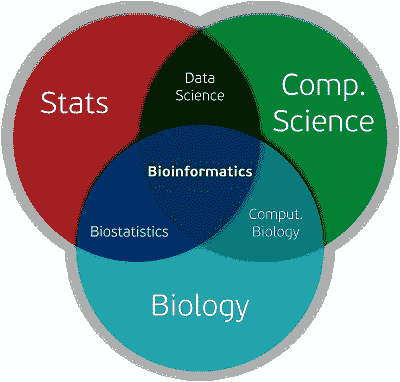

# 我设计了自己的生物信息学学位

> 原文：<https://medium.datadriveninvestor.com/i-have-designed-my-own-bioinformatics-degree-260b24767d87?source=collection_archive---------9----------------------->

我最近完成了毕业，目前正在寻找机会开始攻读博士学位。我的背景几乎是基于 CS 的，我以前的大部分研究工作都是基于机器学习、认知无线电、无线通信和水下通信。所以，我应该搜索无线通信领域的教授。但是随着机器学习和人工智能的广泛传播，我对数据科学的兴趣与日俱增。从一开始学习机器学习和 Python 的时候，我就倾向于它。这个世界被大量的数据所包围。数据是一种现在和将来都将主宰世界的东西。那是 2020 年 8 月，在仁荷大学上研究生课程时，我遇到了生物信息学领域。当接近这个词的时候，我想它可能是我非常害怕的生物学。但是在读了几篇研究论文和一些教程后不久，我对这方面的想法发生了巨大的变化。我对开始攻读博士学位非常感兴趣，完全专注于机器学习和数据科学。有了计算生物学/生物信息学领域的基本想法，我已经下定决心要更进一步。虽然目前我不具备生物信息学领域的那么多知识，但这个领域的第一印象让我对它产生了太多的关注。我已经开始准备在生物信息学领域前进。

Bioinformatics Venn Diagram ([Source](https://amnairfan.github.io/cs501/img/bioinfomatics_venn_diagram.png))

**生物信息学**是存储、检索和分析大量生物信息(数据)的科学。如上图所示，生物信息学是统计学、计算机科学和生物学的结合。但是，也涵盖了生物化学。由于我是计算机科学出身，我将尝试用机器学习技术更多地关注生物信息学领域的数据分析部分。我一直在寻找工具来熟悉生物学和大数据分析的基础知识。挖掘了几个星期后，我列出了要完成的课程和书籍的清单，以获得基础知识，并向我想要的研究领域前进。从今天起，我将试着每周发表一篇文章，包含我每周的生物信息学计划。我会尽量叙述每本书和每门在线课程。

为了接触生物信息学领域，我认为你应该关注一些社会团体和网站。我在这里放了一些重要的链接/群，你必须关注它们才能得到更新。

1.  [Reddit](https://www.reddit.com/r/bioinformatics/) : `[r/bioinformatics](https://www.reddit.com/r/bioinformatics/)`是生物信息学领域最活跃的社区之一。你将有机会与一些非常有才华的人分享你的想法和问题。还有一个[资源](https://www.reddit.com/r/bioinformatics/comments/191ykr/resources_for_learning_bioinformatics/)页面，你可以跟随它进入这个领域。
2.  Biostars :另一个联系、广告、讨论、分享问题的伟大网站。你将从这里获得教程、工作信息、评论等等。
3.  [Rosalind](http://rosalind.info/problems/locations/) :这是一个通过解决问题来学习生物信息学和编程的平台。你可以带着不同类型的问题与世界各地的人练习和竞争。对于实践来说，这是最好的网站。
4.  生物信息学指南:一个免费的在线生物信息学教育材料网站。你会得到你需要学习的数学、计算机科学和生物课程。

从这些来源以及其他一些研究中，我获得了自己的生物信息学硕士课程，其中包括几本重要的书籍以及一些世界级的资源(在线课程、小抄、博客等)。).我会在一个缓慢的过程中分享它，让我每周都有进步。我的生物背景确实很弱。如果你和我一样，那么你可以在我的旅程中跟随我。有经验的也可以走同样的流程快速复习一下。在下一个教程中，我会尽可能早地讲述我的学位大纲和完成课程的计划。

你可以关注我的其他教程简介。我已经发表了**机器学习和数据分析**系列的 4 个部分，这是基于 Inha 大学提供的研究生课程。你可以按照**[**Part-1**](https://towardsdatascience.com/machine-learning-and-data-analysis-inha-university-part-1-be288b619fb5?source=friends_link&sk=583ba29a0766ad36bc993cddc642b11f)**，**[**Part-2**](https://towardsdatascience.com/machine-learning-and-data-analysis-inha-university-part-2-3fb599732021?source=friends_link&sk=80523165c66560e46f907da4c8af0d95)**，**[**Part-3**](https://towardsdatascience.com/machine-learning-and-data-analysis-inha-university-part-3-51cb64c10901?source=friends_link&sk=a735571ab8f7bc418703fc3147eb6ecb)**，** [**Part-4**](https://towardsdatascience.com/machine-learning-and-data-analysis-inha-university-part-4-67aa1aa9c95d?source=friends_link&sk=9f1a2d1a77df1e9019cfea70b9de7edb) 来获得用 Python 进行机器学习移动的起始思路。非常感谢任何建议或批评。**

**[**Part-1**](https://towardsdatascience.com/machine-learning-and-data-analysis-inha-university-part-1-be288b619fb5?source=friends_link&sk=583ba29a0766ad36bc993cddc642b11f)**:**python 基础及安装
[**Part-2**](https://towardsdatascience.com/machine-learning-and-data-analysis-inha-university-part-2-3fb599732021?source=friends_link&sk=80523165c66560e46f907da4c8af0d95)**:**第二章:Python 数据结构—数据类型
[**Part-3**](https://towardsdatascience.com/machine-learning-and-data-analysis-inha-university-part-3-51cb64c10901?source=friends_link&sk=a735571ab8f7bc418703fc3147eb6ecb)**:**Python 中的控制语句(循环)
[**Part:4**](https://towardsdatascience.com/machine-learning-and-data-analysis-inha-university-part-4-67aa1aa9c95d?source=friends_link&sk=9f1a2d1a77df1e9019cfea70b9de7edb)**:****

** [## Md Arman Hossen - Medium

### 阅读媒体上的 Md Arman Hossen 的文章。韩国仁荷大学 ICE 硕士。数据科学| ML |大数据|…

medium.com](https://medium.com/@armanruet)**