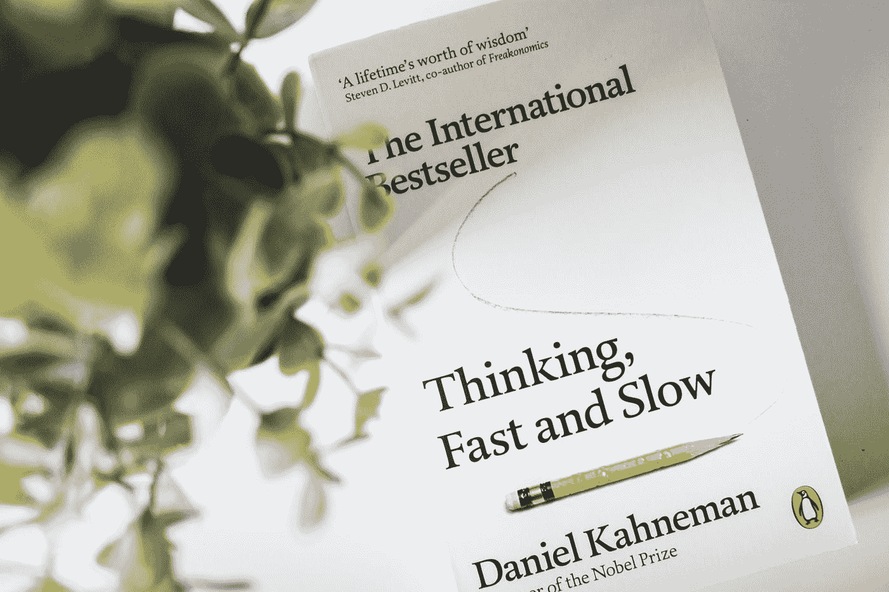

# 我已经学了语法，现在该学些什么？

> 原文：<https://medium.datadriveninvestor.com/i-have-learned-syntax-now-what-to-boost-up-a9711c5685dc?source=collection_archive---------15----------------------->

Photo by [Tim Mossholder](https://unsplash.com/@timmossholder?utm_source=medium&utm_medium=referral) on [Unsplash](https://unsplash.com?utm_source=medium&utm_medium=referral)

你一定在开始学习计算机编程之后，脑子里也出现过类似的问题。

您熟悉任何编程语言(如 Python、C++、Java)的语法和数据结构，但您却无法真正构建一个可靠的应用程序。

在浏览其他人的项目时，您一定感觉到他们在使用其他资源而不仅仅是文本编辑器来创建他们的应用程序。

你如何找到这些资源，这样你就不会不断地重新发明轮子？

是的，你的问题很有道理，我是来给你建议的。

所以我说:

> **现在你学习编程的其他 99.99%。**

开个玩笑！

Photo by [Jake Hills](https://unsplash.com/@jakehills?utm_source=medium&utm_medium=referral) on [Unsplash](https://unsplash.com?utm_source=medium&utm_medium=referral)

# 第一步是:

*   开始做东西。

试着做点什么。

如果你可以完全用你已经知道的东西来做，那么试着做一些更复杂的东西。

在某些时候，你会发现你需要你不知道的东西。这就是学习发生的时候。

你一定会边走边学，这是旅程的一部分。

> **一个好的谷歌搜索是程序员工具箱中最有价值的工具之一。**

以下是我的亲身经历。

每当我想用 python 做些新东西，但不知道怎么做时，我就把问题分成小部分，然后谷歌每个部分。

如果谷歌没有任何有用的东西，我会问堆栈溢出。

[**Stack Overflow**](https://stackoverflow.com/) 是最大、最值得信赖的在线社区，供开发者学习、分享他们的编程知识，并建立他们的职业生涯。

Photo by [William White](https://unsplash.com/@wrwhite3?utm_source=medium&utm_medium=referral) on [Unsplash](https://unsplash.com?utm_source=medium&utm_medium=referral)

我们在新手开发者身上看到了一个反复出现的主题。

当你是一个新手时，你会花时间学习一两种编程语言的基础知识，并且在做编程练习时感觉很舒服。

但是你不知道如何学以致用。

它通常出现在类似于“我知道如何编程，但我不知道编程什么”的短语中典型的回答是“挑战编程”、“为开源项目做贡献”或者“做一个游戏”

做编程挑战是很好的脑力练习。

但是它们对于帮助人们学习如何创建一个新程序几乎没有帮助。

为开源项目做贡献是一种进步。

您可能会了解到一个真实项目是如何构建的，并提高您的编程语言技能，但不会了解到项目的整个生命周期。

有些项目也非常复杂，这对新手来说可能是一种威胁。

制作游戏是另一个进步。

游戏很好玩！

然而，同样的困境出现了。“我想做一个游戏，但是不知道做什么。”

> **如果你在学习编程的同时也注意学习音乐，你会认识到与音乐相同的模式。**

Photo by [Matija Sundalic](https://unsplash.com/@matija_810?utm_source=medium&utm_medium=referral) on [Unsplash](https://unsplash.com?utm_source=medium&utm_medium=referral)

“我知道所有的和弦，我的手感觉很舒服，但我不知道如何写一首歌。”

有了音乐，我们其实有了很好的答案。

有一条学习创造的路径。

音乐家通常不会从头开始创作自己的音乐。

一些音乐家从未进步到作曲，他们一生只演奏别人的音乐。

但是在编程世界里，这种态度有点不同。

在软件社区，普遍的态度是“不要重新发明轮子。”

当一个成熟稳定的选项存在时，如果你重写一个库，这几乎是不被允许的。

虽然这是一个很好的规则，但新手不应该害怕重新发明轮子。

当它是为了学习或者练习而做的时候，做一个轮子完全可以！

这是学习的一个重要部分。

如果你想走游戏路线，那就克隆 Pong、俄罗斯方块或太空入侵者。

Photo by [Riho Kroll](https://unsplash.com/@rihok?utm_source=medium&utm_medium=referral) on [Unsplash](https://unsplash.com?utm_source=medium&utm_medium=referral)

他们不需要所有相同的功能或必须是精确的复制品，但你从你的目标和一张白纸开始，你让它发生。

也不要认为在你写程序之前你需要有最好的想法。

我在音乐家身上看到了同样的心态。

试图在他们的第一次尝试中创造一个杰作，把所有的精力都放在一首歌上，而没有看到更大的画面。

更重要的是，随着时间的推移，你会写很多首歌，而不是一首！

你写的第一首歌，很可能会很烂，很可能会折腾。

没关系！不要试图在第一次尝试时就想写出最史诗般的 10 分钟令人瞠目结舌的传奇音乐。

你需要学习写歌的过程，从自己的经历中学习，每周花几个小时练习。

在你写出好的程序之前，你会先写出坏的程序。

克服它，熬过它，获得经验，这样你就可以开始在任何调上按需即兴创作。

Photo by [KOBU Agency](https://unsplash.com/@kobuagency?utm_source=medium&utm_medium=referral) on [Unsplash](https://unsplash.com?utm_source=medium&utm_medium=referral)

> 我们告诉人们从“你好，世界”开始是有原因的

因为在他们旅程的那个点上，完成那个意味着已经征服了一定数量的基础。

你知道如何编译，如何运行，如何调用函数和传递参数。

编写一个现有程序的克隆是另一个重要的步骤，几乎与 hello world 步骤一样重要，只是在您旅程的不同阶段。

当你完成它时，你已经克服了某些挑战。

你必须弄清楚从哪里开始，如何计划，如何组织，如何处理错误，给它一个个人风格，并在最后打包，这样它就是一个可用的东西。

即使克隆一个简单的程序，你也在学习所有的过程。

简而言之，它是经验和创造力的结合。

创造力是人们在编程中经常忽视的一个方面，但却是至关重要的。

> **你有没有注意到有多少程序员也是音乐家？**

音乐包含了大量的技术分析、结构和模式，尽管许多人认为这纯粹是一种创造性的努力。

编程通常被视为一种严格的技术行为，尽管它主要是一种创造性的努力。

你可以通过克隆程序来培养创造力。

当你做的时候，你会发现自己在想新的方法来调整程序，或者甚至是添加个人特征。

这也将激发全新项目的灵感。

创意一路走来，但你需要先学会弹一些翻唱的歌曲。

随着时间的推移，您将会看到如何将编程应用到几乎所有事情上。

你可以自动完成任务，解决实际问题。

你可以毫不费力地列出一长串你想做但没有时间做的事情。

你也能在飞行中解决问题。

“哦，有一个包含 100 张表格的 Excel 电子表格，需要重新格式化，分割成单独的文件，然后转换成 CSV 格式？

马上就来。"

不要纠结于试图想出下一个最好的东西。

写下你将要使用的程序。

其他项目的想法也会随之而来。

你们中有多少人遇到过这样的情况，你认为“我不知道该编程什么？”你是怎么处理的？

在那种情况下，你会给别人什么建议？

> **想想吧。**

这就是你的答案。

Photo by [Monica Sauro](https://unsplash.com/@monicasauro?utm_source=medium&utm_medium=referral) on [Unsplash](https://unsplash.com?utm_source=medium&utm_medium=referral)

# 你的下一步是什么？

> *如果你喜欢这篇文章，点击下面的推荐会很有帮助！
> 关注我上* [*推特*](https://twitter.com/imPraveenPareek) *，*[*LinkedIn*](https://www.linkedin.com/in/praveenpareek/)*，* [*中*](https://medium.com/@praveen.pareek)
> 
> ***在这里阅读我的所有帖子/文章:***[***Praveen Pareek***](https://medium.com/@praveen.pareek)

 [## 在学校编程的 11 个惊人好处

### 尽管计算机编程曾被视为是极客和电脑虫的专有技能，但现在它被认为是一种…

medium.com](https://medium.com/@praveen.pareek/11-amazing-benefits-of-programming-in-school-14acf21fd350)