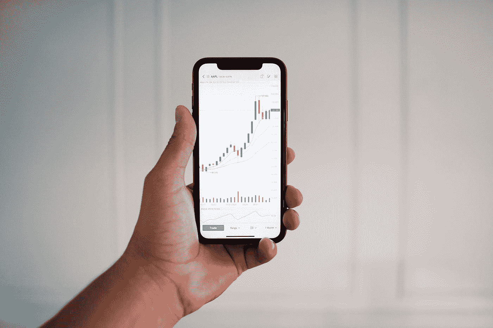
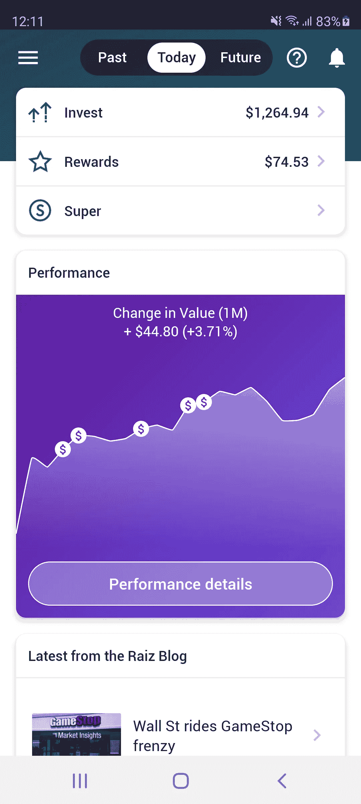
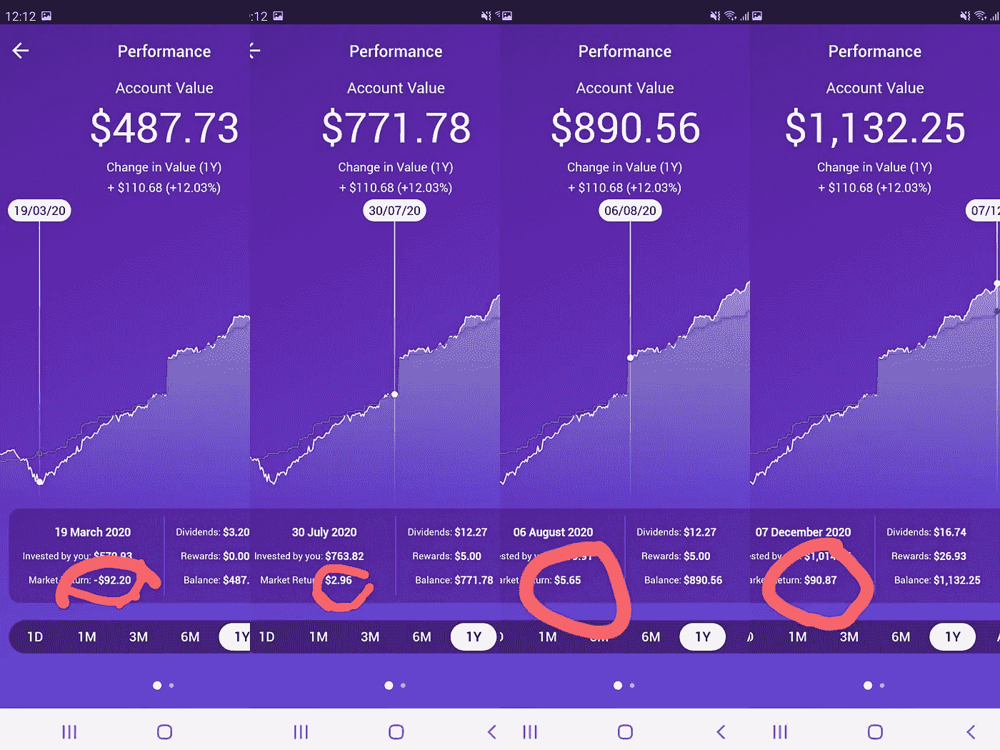
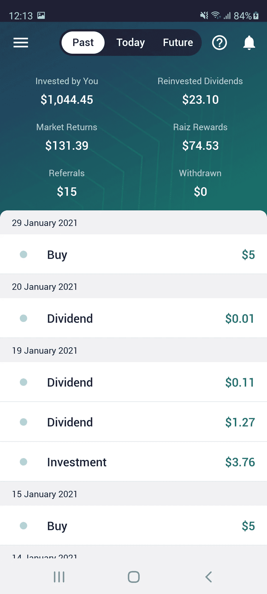

# 我每周在股票市场投资大约 5 美元。进展如何，附截图

> 原文：<https://medium.datadriveninvestor.com/i-invested-around-5-dollars-a-week-in-the-stock-market-how-it-went-with-screenshots-c8b78ebb14d7?source=collection_archive---------9----------------------->

## 通过澳大利亚 Raiz(在美国，Acorn)。金额因时间和“奖励”而异。

Photo by [Adeolu Eletu](https://unsplash.com/@adeolueletu?utm_source=medium&utm_medium=referral) on [Unsplash](https://unsplash.com?utm_source=medium&utm_medium=referral)

## 什么是 Raiz

*首先简单解释一下我一直使用的平台:*

R**aiz**投资**澳洲**等**太平洋国家，**实际上就是美国 ***robo-advisor*** 投资 app: ***橡子*** 。对于不了解这两个版本的人来说:

> Raiz 是一款**小额投资产品**，它提供了一种简单的方法，可以通过手机或网站上的应用程序定期进行小额或大额投资。该基金是一个注册管理投资计划。如果您申请加入 Raiz，您就申请获得一个称为 Raiz 投资账户的基金权益。

实际上，Raiz 让你有可能以每月 5 美元开始投资。然而，这并不是最明智的做法，因为每月还有大约 2.50 澳元的管理费。但是，如果你手头很紧，你仍然可以用这个数额开始投资，或者像我一样，平均每周 5 美元左右(我用另一个账户投资稍多一点)。

这为那些总是想开始投资，但不知道如何投资，或者没有大量资金的人提供了一个进入市场的机会。这可能是投资界的绝对初学者、学生、因果工作者等的情况

Raiz 提供了多种投资方式:每周、每两周或每月。但也可以通过**围捕**(点击*这个* [*链接*](https://raizinvest.com.au/support/#:~:text=Raiz%20works%20by%20allowing%20you%20to%20invest%20small,investing%20the%20spare%20change%20into%20your%20Raiz%20account.) ，而不是一个附属机构，以了解更多关于此功能的信息)或奖励(如通过购买附属于他们的物品，或参加调查)。

Photo by [MayoFi](https://unsplash.com/@mayofi?utm_source=medium&utm_medium=referral) on [Unsplash](https://unsplash.com?utm_source=medium&utm_medium=referral)

## 我和他们一起投资的一年

***注:截图海量。我不知道如何调整它们的大小。***

Screenshot by Author.

这里看一下主页。老实说，我投资的时间已经超过 1 年了。更确切地说是一年零三个月左右。但我现在就在这里，坐在 **1，264.94 澳元**的位置上。稳扎稳打赢得马拉松，对吗？

带美元符号的小圆圈代表我收到的股息。

> [当你购买一家公司的股票时，你就成为了这家公司的部分所有者，股息是你的利润份额。然而，并不是所有的公司都分红。](https://www.canstar.com.au/investor-hub/explainer-what-are-dividends/)

幸运的是，Raiz 知道。他们最终真的会随着时间而成长。一开始，只要投资 100 美元，你就可能开始获得低至**T5 o . O1 audT7 的股息。然而，随着时间的推移，随着你的投资组合的增长，你的股息将成为持续增长和复利的重要组成部分。现在，我有时会收到大约 6 到 9 英镑的股息，对吗？想象几年后…**

Screenshot by Author

闪光粉和玫瑰…不是在三月。没有先生。不，夫人。几个月来，我几乎负了 100 美元，这让我感到害怕和焦虑。但是，我必须坚持到底。我认为这是对新冠肺炎事件导致的世界变化的一种回应，而且我认为一旦事情开始正常化，价格肯定会再次上涨。

另外，我从不投资我需要的钱。事实上，我个人认为这是小额投资的好处之一:**置身于风险很小的市场中。**

到了 7 月份，情况开始好转，我终于乐观了。的***2.56 aud***……哇，我的蓝宝伙计们呢？

但对我来说，投资不是一个快速致富的把戏，而是我必须保持一致，并长期坚持下去的事情。是的，到 2021 年，事情看起来终于变好了，我大约 90 岁。

我冒着失去钱的风险吗？是的，就像所有的事情一样。但是，虽然我不是顾问，你应该在做任何决定之前获得更多的信息，我相信这种投资方式比其他方式稍微安全一些。

1.  它投资于[***ETF***](https://www.investopedia.com/terms/e/etf.asp)，因此投资组合更加多元化
2.  我不做超出我能力范围的投资(这有意义吗？不过，你抓到我了，对吧？)
3.  它可以让我 [***美元-成本-平均***](https://www.investopedia.com/terms/d/dollarcostaveraging.asp) ，慢慢来，看看进展如何。

## 我们现在在哪里

嗯，我截图的时候:

Screenshot by Author

不算太坏，嗯？

总之，我相信一件事(不是我原来的想法):

> ***市场中的时间节拍市场中的时机***

如果你在澳大利亚，并且想试试的话，我有一个推荐链接。如果你注册的话，我们都会得到 5 美元。但是，你要知道，你没有必要这样做，而且，在做任何决定之前要获取更多的信息。我分享一下是因为我有，而且试一试也不用花钱吧？

 [## raiz——头号投资应用

### 编辑描述

links.raizinvest.com.au](https://links.raizinvest.com.au/AvxH)  [## 加入介质

### 作为一个媒体会员，你的会员费的一部分会给你阅读的作家，你可以完全接触到每一个故事…

avocadoforbrunch.medium.com](https://avocadoforbrunch.medium.com/membership) 

Photo by [Anastase Maragos](https://unsplash.com/@visualsbyroyalz?utm_source=medium&utm_medium=referral) on [Unsplash](https://unsplash.com?utm_source=medium&utm_medium=referral)

不是我的房子，不是我的车。做梦也无妨，对吧？