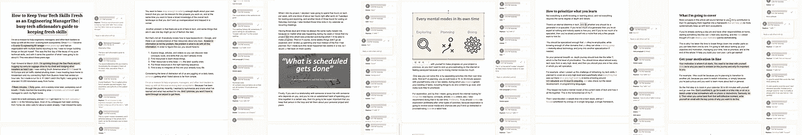
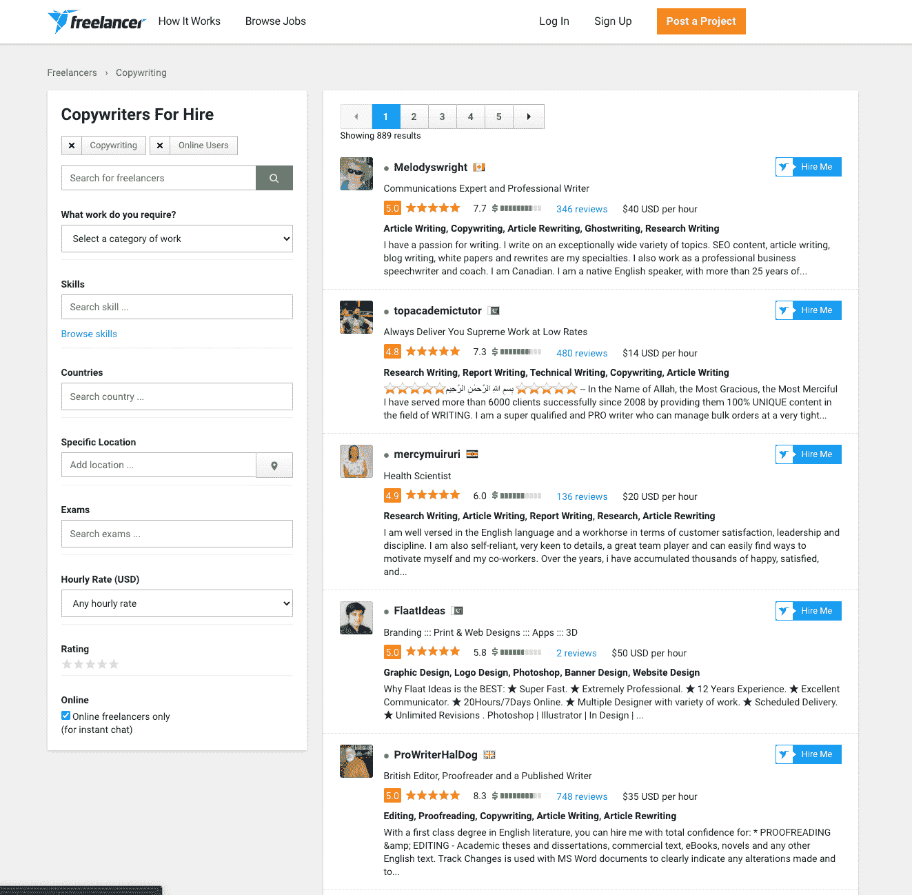
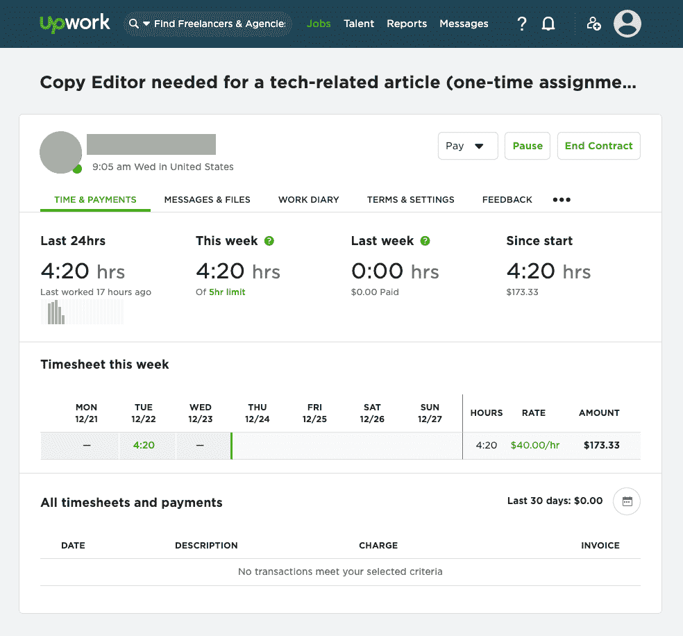
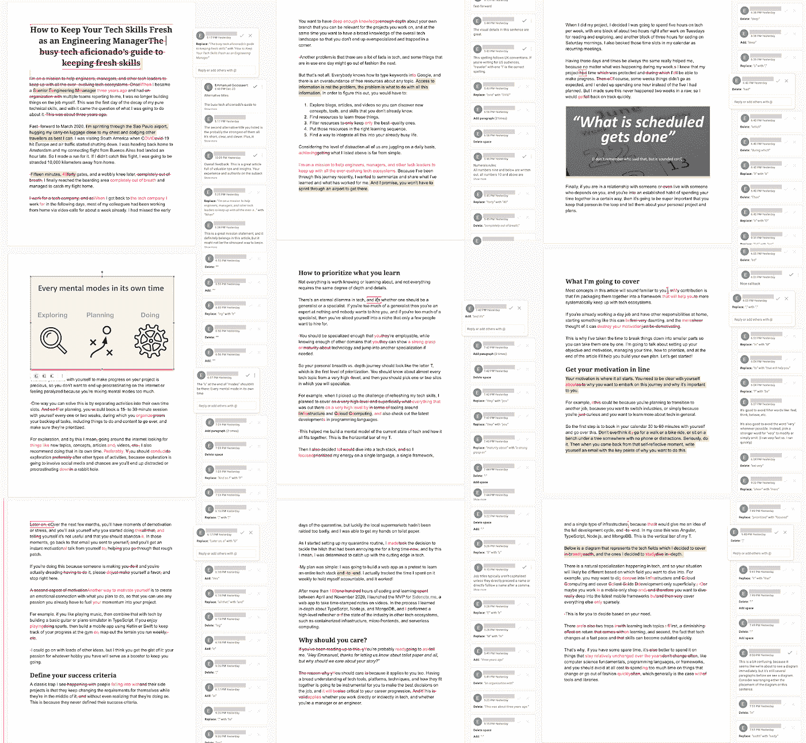
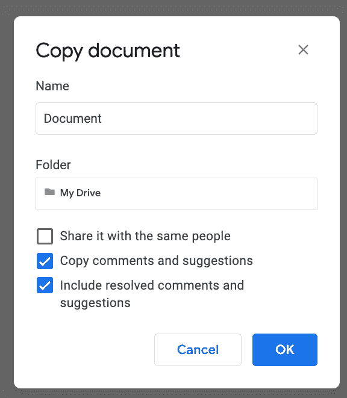
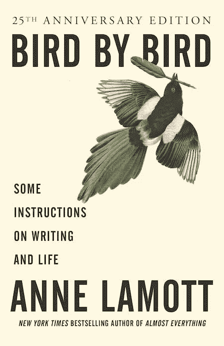
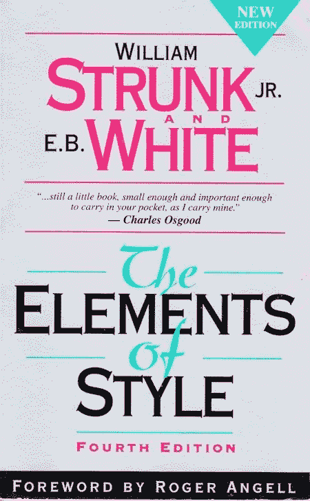

# 我投资于自己:我雇了一个文字编辑来提高我的写作水平

> 原文：<https://medium.datadriveninvestor.com/i-invested-in-myself-i-hired-a-copy-editor-to-improve-my-writing-97affeaf02ca?source=collection_archive---------34----------------------->

我投资了自己。

我雇了一名文字编辑来审阅我正在写的一份 4000 字的草稿。48 小时后，花了 180 美元，他给我的草稿留下了 439 条编辑和评论，还有一个关于如何提高我写作技巧的反馈金矿。

为什么要在乎写作？在这个持续封锁和远程工作的时代，更多的交流是以书面形式进行的，无论是电子邮件、消息还是长篇报告和文章。比以往任何时候，你对书面文字的掌握能以意想不到的方式促进你的职业生涯。

此外，写作技能对你未来的任何工作都是有用的，不管是什么行业。这是完全可以转移的技能之一，就像公开演讲和谈判一样。

雇佣一个编辑来评论你的文章并给你反馈是给你自己最好的礼物之一。

在这里，我分享了我的经验，以及如何使这个过程尽可能富有成效的技巧，希望对你也有帮助。

# 我当初为什么要这么做？

写作一直是我认为重要的事情。我写博客已经超过 10 年了，我希望我可以宣称我的写作质量有所提高。

有几次，我的博客将我推上了[黑客新闻](http://news.ycombinator.com)版块的顶端，这是一个为科技和创业行业提供的专业在线论坛。第一次经历给我带来了一份利润丰厚的咨询合同，第二次经历让我得到了一份工作面试，并因此得到了一份工作邀请，我搬到了阿姆斯特丹，至今仍住在那里。

我曾想继续写作，但像许多事情一样，我给自己找借口，却没有付诸行动。我也认为雇佣一个文案并得到反馈来提高我的写作水平会很酷，但是我也没有付诸行动。

直到我在黑客新闻上偶然发现了一篇被推荐的文章，标题是“[我为我的博客](https://news.ycombinator.com/item?id=25262272)雇佣了一名自由撰稿人”，作者在文章中分享了雇佣专业人士并获得反馈的情况。于是我想，这家伙做到了，听起来不太复杂，我也能做到！

当时，我正在写一篇 4000 字的文章，讲述我在[过渡到管理职业](https://codecapsule.com/2021/01/05/how-to-keep-your-tech-skills-sharp-in-a-leadership-role/)后保持技术技能的旅程。

因为这是我中断写作很长时间后的第一篇文章，所以我希望有一个专业的编辑来帮助我使它尽可能吸引人和有影响力，并在发布它时给我一个自信的提升。

下面我描述了我雇用和与编辑一起工作的过程，以及最佳实践，为了更加清晰，分为三个阶段。我们开始吧！

# 你在哪里可以找到文字编辑？

如果是 1994 年，我会告诉你在当地报纸上登一则广告。谢天谢地，今天我们有了互联网，它通过 Upwork.com、Freelancer.com、FreeeUp.com 和 Fiverr.com 等网站为我们解决了这个问题。

在我看完所有四个网站后，我决定选择 Upwork.com。但是真的，全部检查一下，相信你的直觉。

你的第一步是联系有这个项目技能的人，从写一份合适的招聘广告开始。

# 阶段 1:职务发布和申请者筛选

我想吸引顶尖人才，为此，我必须表达出我不是一个难相处或令人讨厌的顾客。我决定简洁明了地表达我的目标，所以我确保我的招聘信息包括:

*   一个我正在寻找的标题。
*   我的文章包含多少字。
*   这是一次性任务，而不是重复性工作。
*   我为什么贴这个广告。

以下是我写的帖子:

我还搜索了“面试问题文案编辑器”来了解应该向申请人提什么问题，我将其提炼为以下五个问题:

1.  你是如何获得编辑技能并从事这份工作的？
2.  你有什么工作经验？
3.  你擅长哪种类型或体裁的写作？
4.  你个人的编辑风格是什么，你使用哪种风格指南？
5.  你最擅长什么，你在纠结什么？

关于风格指南的问题，如果你的申请人不知道它是什么，或者用除了 CMS、AP 或 MLA 之外的任何东西回复，那么你知道他们是不合法的。这就好像有人申请了一份软件开发工作，却不知道 for 循环是如何工作的——如果你想知道，是的，有些人就是这样做的。

这些缩写分别代表芝加哥文体手册(CMS)、美联社文体手册(AP)和现代语言协会文体手册(MLA)。它们是整个行业最常用的风格指南。

我的工作在网上发布不到一天，就已经有一些申请人了。然而，我必须承认，我感到失望的是，申请的主要是非专业人士，其中一些人的母语不是英语。

其中一个写道:“*先生，我有最高质量的技能，将为您提供最好的价值。*“我不骗你，有人用这个申请编辑工作。

我没有勇气回复他。我能做的就是 Picard 风格的 facepalm。

我在周六发布了这份工作，所以时间可能限制了申请人的数量，这反过来解释了为什么很少有顶尖人才申请。

我决定自己来处理这件事:Upwork.com 有一个功能，可以根据技能、评级等来搜索专业人士，我曾用它来寻找评级最高的英语母语人士，我邀请了其中三位来看看我的招聘启事。

其中一个在两小时内回复并申请了。很明显，写作是他的职业，所以我决定带他进入我选择过程的下一个阶段:阐明期望。

# 第 2 阶段:在达成交易前明确预期

在我与我的最佳申请人达成协议之前，我想澄清一些事情，以确保双方的期望是明确的，并避免我和他感到意外。

归结起来就是:

*   向你的申请人询问这项工作大概需要多少小时。
*   询问工作中有多少个来回的反馈环节。
*   如果你心里有一个时间表，要明确。

千万不要把这些放在最初的招聘启事里，一次就太多了。保持你的招聘信息简洁，一旦你缩小了申请人的范围，就问一些澄清性的问题。

在这一点上，你不必雇用申请人，你还在评估他们。如果经过短暂的交谈后，你有不好的感觉，那么礼貌地拒绝，并尝试与他人合作。

在与我的申请人交流了一些信息并澄清了我提到的几点后，我相信他是合适的人选，所以我给了他这份工作。整个过程，从发布职位到筛选申请人，并与其中一人协商我的需求，用了不到 24 小时。

作为一个经验法则，对于一个以英语为母语的专业人士来说，期望每小时支付 35-45 美元。大部分平台都是显示小时费率的，所以不会有什么惊喜。

当他们专注于某个特定的领域或知识领域时，一些文字编辑每小时收费高达 55-60 美元。问问你自己是否需要那么多的专业化。如果是，就去买，如果不是，就去买更便宜的。

就速度而言，一个严肃的文字编辑大约需要一个小时来审阅 1000 个左右的单词。不管怎样，问你的申请人一个粗略的估计，以符合我前面提到的期望。

到目前为止，我所描述的只是选择和雇佣阶段。一旦这些都完成了，你就必须和这个人合作。但是你如何引导一个文字编辑得到你需要的结果呢？

# 阶段 3:有效地与你的文字编辑一起工作

在我的编辑开始工作之前，我给了他一些指导，告诉他我想通过我的文章达到什么目的，以及我想让读者从中获得什么。

如果你计划在社交媒体上发布你的文章以增加流量，你也可以让你的编辑标记出他认为真实或听起来朗朗上口的段落和句子。这样，您以后可以将这些摘录作为微内容重用。

有些编辑会把他们的笔记保存在 PDF 文件中，你必须和你的草稿并排打开才能建立联系。这是低效和混乱的。

相反，使用谷歌文档，让你的编辑在他们应该在的地方输入他的建议。把所有东西都放在一个地方会让对话和整合变得更加愉快。

这是我为我的文章所做的:我同意我的编辑，我们将使用谷歌文档，他将在其中添加他的编辑。

48 小时后，编辑按照我们商定的时间表完成了。他在这上面花了四小时二十分钟。

当我打开我的文档时，我所看到的让我大吃一惊。

# 这个结果是值得的

编辑留下了 439 条让文章更好的建议，除此之外，他还就如何提高我的写作水平给了我切实可行的反馈。

我在下面分享一些他给我的写作建议，这些建议可以应用到我以后的写作中。

> 为了可读性，我把一些较大的段落分开了。一般来说，如果有东西出现在你的博客上，那么你应该把段落长度限制在 6 行以内。四更好。但是对于一个段落来说，没有最少的行数。如果你想吸引更多的注意力，一个段落可以是一个单词。所以一般来说，如果一个段落可以分解，那就去做吧。
> 
> “只是”这个词几乎总是可以省略的。它通常有点像一个填充词。然而，当它对一个句子的意义绝对关键时，使用它是没问题的。在这种情况下，单词“simply”在句子的前面已经达到了相同的目的，所以不需要“just”。
> 
> 最好不要用这样的过滤词，因为它们会削弱你在这个问题上的权威。这是你的文章，我们是来学习你的经验和推荐的，所以没必要告诉我们你推荐了什么。请告诉我们，我们会理解这是您的推荐。
> 
> 最好避免“等”只要有可能。相反，要么在清单上增加更多的项目，要么清楚地表明清单并不详尽。很明显，这个列表并不详尽，所以真的没有必要在这里使用它。

# 如何充分利用这段经历？

我刚刚为谷歌文档的反馈支付了 180 美元(€140 美元)。

我告诉自己我最好利用这一点！当然，编辑帮助我使文章更加扎实和吸引人，但是，我也想把这变成一个提高我写作技巧的机会。

就在编辑完成时，在我开始整合他的任何建议之前，我创建了一份完整的文档副本，包括他的所有评论和建议。

这样，我就可以保留这些建议的完整历史，并且我知道如果需要的话，我可以在将来重新访问它们。为此，我在谷歌文档中做了以下工作:

*   转到文件= >制作副本
*   勾选“复制意见和建议”
*   选中“包括已解决的评论和建议”
*   取消选中“与相同的人共享”

我还决定更进一步，创建一个文档来跟踪反馈和我反复出现的错误，我计划在未来与其他编辑合作时更新这些文档。

例如，在我的文件中，我有多个类别:

我经常出错的一些英语习语:

*   做出决定= >做出决定
*   帮自己一个忙= >帮自己一个忙
*   是这种情况= >是这种情况

我应该更加注意的一般错误和替代措辞:

*   有两条= >有两条
*   无论如何= >任何、任何、其他
*   学习= >学习
*   超级重要= >非常重要

要避免的填充词:

*   事实上
*   准备去
*   平的
*   关于
*   很
*   …

通过与这位编辑合作撰写我的 4000 字文章，我能够收集到 8 页的错误和建议，现在我可以用它们作为将来编辑我的文章的通用清单。

例如，你正在阅读的这篇文章经过了几次编辑，这些编辑是我自己根据我从这位专业编辑那里学到的东西并使用我建立的清单完成的。

# 雇用编辑的替代方案

如果你负担得起，就去雇一个编辑。我很幸运能在这么短的时间内找到一个有才华的人，你可能没有第一次经历那么幸运。如果发生这种情况，不要失去信心，至少和其他人再试一次，或者向你的关系网寻求建议。

我计划在未来雇佣同一个编辑来进一步提高我的写作水平，并雇佣其他人来获得不同的建议。我当然不能为我写的每篇文章都这样做，但是每年几次听起来是可行的。

当然，并不是每个人都有花费 180 美元在文字编辑上的奢侈。如果这是你的情况，你想提高你的写作，下面是你可以从今天开始做的更便宜的事情。

首先，你可以加入一个作家的在线社区，通过你对他们的反馈来获得对你写作的反馈。一些活跃的社区有[critters.org](http://www.critters.org/)和子社区如 [r/DestructiveReaders/](https://www.reddit.com/r/DestructiveReaders/) 。

第二，你可以使用 LanguageTool.org 或 Grammarly.com 的[这样的工具，从算法中获得对你写作的反馈。它不会取代人类的接触，但它是免费的，它会迅速捕捉到很多错误。出于隐私考虑，我建议您不要安装他们的浏览器扩展，而是像使用 web 应用程序一样使用该服务，将您的文本粘贴到其中。](http://LanguageTool.org)

第二，你可以挑选几本关于写作的书，并努力将它们的建议应用到你的写作中。我最喜欢的两本书是小威廉·斯特伦克的《风格要素》第四版 和安妮·拉莫特的《一只鸟接一只鸟》*】，这两本书都很轻松，并提供了初级到中级作家将受益的一般性建议。我发现自己定期回到他们身边。*

*我希望我的故事对你有用，并能激励你写更多！*

*你喜欢这篇文章吗？[加入我的邮件列表](http://emgo.cc/nl-medium)。*

****

**原载于 2021 年 1 月 14 日 https://codecapsule.com***。***