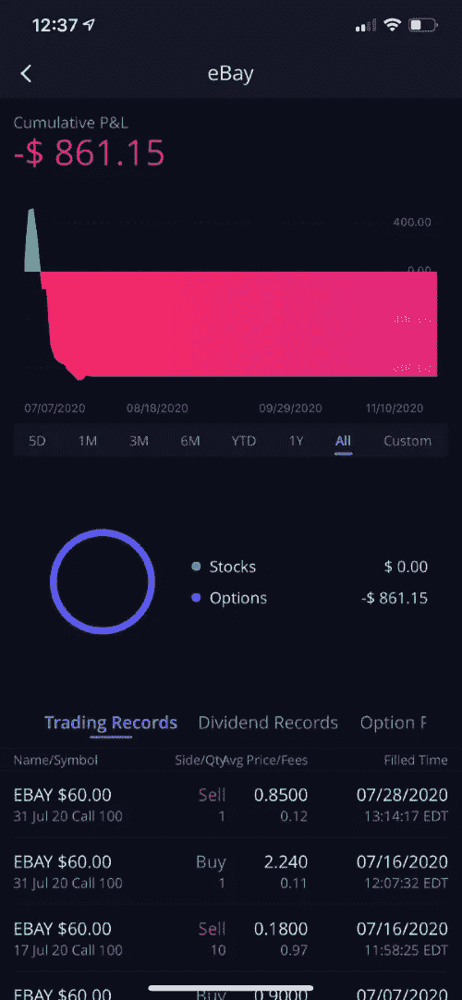
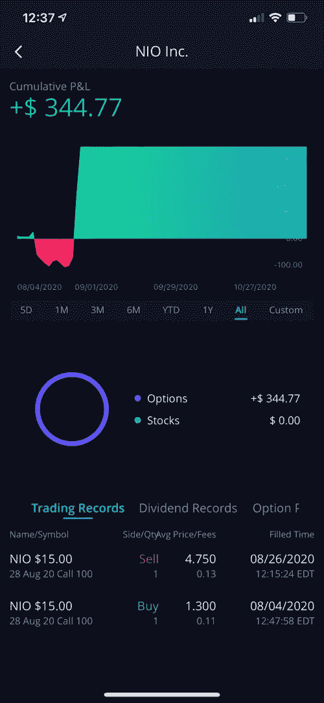
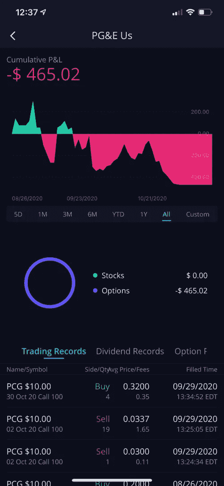
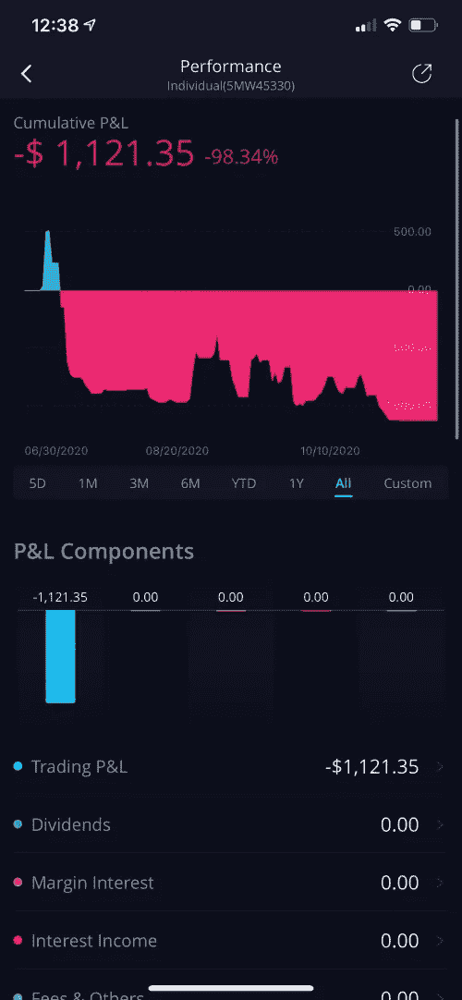

# 我只根据华尔街投资公司的建议进行投资

> 原文：<https://medium.datadriveninvestor.com/i-invested-only-using-advice-from-r-wallstreetbets-491040df5584?source=collection_archive---------0----------------------->

Photo by [Austin Distel](https://unsplash.com/@austindistel?utm_source=medium&utm_medium=referral) on [Unsplash](https://unsplash.com?utm_source=medium&utm_medium=referral)

对于那些不熟悉的人来说， [r/WallstreetBets](https://www.reddit.com/r/wallstreetbets/) 是一个投资子栏目，人们在这里讨论股票和期权交易。它因偏好极端激进的交易策略而臭名昭著，大多数人会认为这是赌博。

看到会员将他们一生的积蓄投入到一场高度投机的游戏中并不罕见。这通常会导致人们的净资产要么增加十倍，要么全部损失。

有人像这个家伙一样把几千美元的[变成了 100 万美元，另一方面，也有人像这个家伙](https://www.reddit.com/r/wallstreetbets/comments/hnk0r9/35k_125m_in_4_months/)一样把自己[一生的积蓄变成了 0 美元。](https://ns.reddit.com/r/wallstreetbets/comments/g6pmji/for_the_first_time_in_my_life_i_feel_at_home/)

正如你可能猜到的，我想参与其中，所以我决定进行一个小实验。

如果我遵循华尔街投资者的顶级建议，我能赚多少钱？

## 语境

在华尔街 bets 上，有些帖子被标记为“DD ”,这是尽职调查的缩写。这些帖子包含关于交易哪些股票和进入哪些准确位置的投资建议。

这些帖子的质量可能相差很大。所以，我找了有最多支持票的帖子。

我会输入这些“DD”帖子推荐的准确或接近准确的职位。当然，在典型的华尔街投资方式中，我会把我的整个账户投入到每一笔交易中。

在这个实验中，我用 Webull 创建了一个新的投资账户，存入了 1000 美元。

让我们看看我做得怎么样。

## 1.通过易趣网购买

这里是华尔街赌注的链接。

原因:老实说，我也不知道为什么。Reddit 上的帖子很长，有很多链接。它看起来相当可信，我只是很兴奋地开始。

**交易**:2017 年 7 月 60 美元，2017 年 7 月 31 日 60 美元

**结果** : -$861。相当期待。市场出现了回调。易贝勉强超过收益。我在合约到期前平仓。

**账户金额:** $139

## 2.尼奥

华尔街赌的现任甜心。

NIO DD 职位并不短缺。但是这里有一个链接。

理由 : TSLA 电话太贵，我不想错过电动汽车淘金热。我只剩下 139 美元了。NIO 期权价格昂贵，所以我不得不接受到期日更近的合约。

**交易** : 8/28 美元 15 美分

**结果**:+345 美元。我把我的账户翻了 3 倍。如果这是我的第一笔交易就好了…

**账户金额:** $484

 [## 这么说一家大型风投基金正在投资你的初创公司？4 实际考虑|数据驱动的投资者

### 首先，恭喜你。融资总是需要努力的，一个大的风险投资基金当然是一个大的…

www.datadriveninvestor.com](https://www.datadriveninvestor.com/2020/08/09/so-a-big-vc-fund-is-investing-in-your-startup-4-practical-considerations/) 

## 3.PCG

华尔街赌注的另一个最爱。[链接到帖子。](https://ns.reddit.com/r/wallstreetbets/comments/j7xgnk/why_i_just_bet_25k_on_pcg_calls/)

**原因:**湾区火势开始稳定。此外，这些股票的期权非常便宜。

**交易**:2002 年 10 月$10C，10 月 30 日$10C

**结果** : -$465。又一次市场修正。如果我选择了其他的到期日，它会是有利可图的。

**账户价值**:19 美元

# **外卖**

好吧，我只玩了三次就把我的账户搞砸了，所以事情本可以变得更好。

然而，这是一次有趣的经历，当然比指数基金更令人兴奋。

以下是我的心得:

*   华尔街赌注式的交易不适合胆小的人。你的账户价值可能在几个小时内翻倍或减半。
*   你不能总是完美地把握时间。时机也很重要，尤其是如果你购买的合约距离到期不到一个月。因此，我在市场修正中损失了大部分资金。对于投机性较低的交易，为离到期更远的合约支付更多的钱。
*   不要买入看涨期权，而是研究借方利差。通常情况下，这样你会赚更多的钱。
*   不要听华尔街赌注。

r/WallStreetBets 的成员也喜欢炫耀他们的损失。为了纪念他们，这是我的。

## 获得专家观点— [订阅 DDI 英特尔](https://datadriveninvestor.com/ddi-intel)