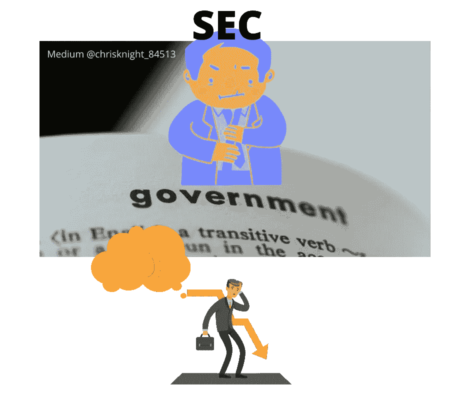

# 我杀了 ICOs，我是监管之王，现在我杀了 PPMs 我是 SEC

> 原文：<https://medium.datadriveninvestor.com/i-kill-icos-i-am-king-of-regulation-now-i-kill-ppms-i-am-the-sec-f913e9c9735e?source=collection_archive---------12----------------------->

## 我解释我想要的。我会用罚款关闭任何商店。如果我不能理解，你就错了。我不在乎投资者是否高兴。

Source: Self Created Image with Canva

我在民事诉讼中从你那里拿钱。我没有足够的免税资金，所以我打算关闭它们。我会诽谤你来得到我想要的。即使你的行为不是犯罪…我也会让人们觉得你是个罪犯。

我是证交会。

2020 年 5 月 12 日，Telegram 首席执行官帕维尔·杜罗夫发布了一篇博文。《邮报》宣布了该公司雄心勃勃的 TON(电报开放网络)项目的结束。就像加密货币社区观看的日界线、60 分钟或戏剧性的电视连续剧。

法律大戏展开了。这场比赛是美国证券交易委员会(SEC)对 Telegram。这一结果重新点燃了人们对证交会的愤怒。如果你想了解 Telegram 损失的影响…从头开始。

 [## 加密货币行业是死是活？数据驱动的投资者

### 九月初，我们在 X-Order 内部就代币市场的未来进行了一场辩论。有趣的是，我们的观点是…

www.datadriveninvestor.com](https://www.datadriveninvestor.com/2019/12/12/will-the-cryptocurrency-industry-be-dead-or-alive/) 

**吨的位置**

汤在律师、注册会计师和有执照的专业人士的指导下。在 TON 的裁决之前，认为有一天你可以转售你的受限证券是可以的；只要你遵守转售的规则。美国证券交易委员会(SEC)决定，任何投资者在获得豁免的情况下转售其证券，都是违反美国法规的。这是在没有明确的数字货币监管指引的情况下发生的。

吨是一种货币吗？

TON 是安全的吗？

TON 是一场硬仗。

银行和金融部将介入吗？当 TON 似乎照章办事时，SEC 决定从另一个层面打击 Telegram 的加密货币梦想。

*投资者的期望。*

根据新的规定，如果你投资一个 PPM，根据美国证券交易委员会的说法，你需要认为你永远不会出售证券，以符合豁免条件。

**什么是吨，世卫组织是杜罗夫&什么是电报**

根据该公司的网站，Telegram 成立于 2013 年 10 月。这种形成是由于 Android 开发者的竞争。电报是由杜罗夫兄弟帕维尔和尼古拉设计的。电报的初衷是安全的加密信息。

2014 年 2 月，Telegram 获得了巨大的市场份额。这一市场份额使得 Telegram 在 2014 年成为 46 个不同国家的顶级免费应用。Telegram 还在 2014 年初被评为美国排名第一的社交网络应用。Telegram 一度领先于脸书和 WhatsApp。

**2018 年 ICO 年**

2018 年是创新之年。首次发行硬币(ico)成为 2018 年的所有热潮。术语“*提供*”最有可能在美国为失败设立 ico。SEC 认为“*提供*这个词非常具体。我敢肯定，将代币的销售贴上“ICO”的标签在当时听起来是个好主意，但回过头来看，可能并非如此。无论是谁想出了“ICO”这个词，都引起了 SEC 的注意。

尽管存在不确定性，Telegram 继续出售其克代币。我在 2018 年为[国际货币专家](http://ims.money/patent-presentation/)写了一份白皮书。我的白皮书被用来证实与一家合作上市公司的交易( [VSMR](https://www.marketwatch.com/investing/stock/vsmr) )。我的想法是称之为一种安全，就这样结束了。电报显然也同意这个想法。电报做了我所想的，做了一个奉献。

回避 SEC 通常不会有好结果。

为了资助 TON 的开发，电报跨过了宣布 ICO 的不确定的桥。Telegram 小心翼翼地编写了一份私募备忘录(PPM ),并试图在证券规则范围内开展工作。

2018 年，该网站拥有 1.8 亿用户。Telegram 还充当了项目、投资者和交易者讨论战略的虚拟会议渠道。

Telegram 撰写了一份 132 页的白皮书，展示了 TON 的稳健愿景。白皮书讨论了用于分散应用、智能合同、网络地址、支付系统和区块链兼容性的平台。

杜罗夫计划通过他的 PPM 筹集资金，并咨询了他的法律团队。每个人都祝福这个想法，在 2018 年 1 月至 3 月期间，Telegram 向私人投资者出售了克。Telegram 最终从 175 个“初始购买者”那里筹集了 17 亿美元。

**第 506 条规则&证券法**

一份私募备忘录(PPM)从何而来？1933 年，美国正遭受大萧条。1929 年股市崩盘后，颁布了 1933 年证券法。《1933 年证券法》要求证券卖家向美国证券交易委员会登记销售情况。注册可以确保卖家向潜在买家提供重要信息。该流程旨在防范错误信息、信息披露不足和潜在欺诈。

证券卖方有资格要求免除美国证券交易委员会的注册要求(称为“规则 D 的规则 506”)。

为了利用规则 D 的规则 506，如果行使规则 506c，卖方必须证明个人只与“合格的”投资者交易。规则 506c 允许招揽，这是如何进行众筹的。规则 506b 允许最多 35 个非合格投资者和无限合格投资者，但禁止招揽。

规则 506b 可能是模糊的，最好留给“朋友&家人”来讨论。

规则 506 背后的想法是，合格的投资者是金融头脑清醒的个人。如果一个人寻求对冲基金(就像 Telegram 所做的)或银行，思维过程是这些机构能够独立评估。理想的合格投资者可以发展自己对投资风险的理解。理想情况下，任何机构都应该能够在没有证交会太多帮助的情况下审查交易。

**SEC 关于扼杀一笔好交易的论点**

美国证券交易委员会和 Telegram 同意该公司与初始购买者之间的 2018 年交易符合证券销售的条件。双方同意 Telegram 采取适当措施确保所有 175 名初始购买者符合合格投资者的资格。各方同意遵循招标指南。每个人都同意有效的私募备忘录(PPM)的存在。各方都同意存在正确的披露。

有什么问题？

双方对初始购买者潜在后续行动的性质存在分歧。

这意味着发行人现在要为投资后其他人的所作所为或所想承担一些责任。

*糟透了。*

**美国证券交易委员会称豁免投资者无权认为他们可以出售股票获利**

2019 年 10 月是投资者清算的一个月。美国证交会采取紧急行动，阻止 Telegram 的第二阶段融资。第二阶段预计是成功的公开销售克代币。

书面辩论和法庭诉讼打击了士气。最后，2020 年 3 月，纽约南区的美国地区法官 P. Kevin Castel 做出了有利于 SEC 的裁决。

你需要提前告诉投资者，“我需要你认为你甚至不能考虑转售你的投资。如果证交会要求你必须说出来，否则我不能拿你的钱。”

因口头陈述而非书面事实而有罪。

**规则 506C 的新标准**

要符合“规则 D 第 506 条”的豁免登记条件，卖方不仅必须证明其金融复杂性，还必须证明初始购买者将持有证券，并且没有“*意图”或“预期”*转售证券。

免税证券的发行人再也不能告诉一个人，他们有一天可能通过转售获利。不再推销首次公开募股，不再推销未来。

**期望从来不意味着许可**。

现在，公司所有者不允许出售预期，即使他们明确表示需要获得批准。几十年来，经纪交易商、律师和投资专业人士一直使用这一理念。现在，美国证券交易委员会改变了主意，通知了所有人。

恭喜你秒你刚刚暴跌 PPM 产品。预计新创企业将出现大幅收缩，这将影响我们 99.7%的经济(即来源: [SBA](https://www.sba.gov/sites/default/files/FAQ_Sept_2012.pdf) )。

**裁决的临界点**

在[法官 Castel](https://www.natlawreview.com/article/sec-v-telegram-groundbreaking-decision-cryptocurrency-enforcement) 的判决中的关键点被引用为，“Telegram 知道并理解理性的购买者不会愿意支付 17 亿美元来收购克，仅仅作为一种储存或转移价值的手段。相反，Telegram 开发了一种方案，通过创建一种结构，允许初始购买者在公开市场转售时获得最大价值，从而最大化初始购买者愿意向 Telegram 支付的金额。

由于这一裁决，Telegram 不符合《证券法》要求的注册例外。如果你以这种方式进行融资，你也不再有资格。

> 如果你告诉任何人，他们可能会在未来通过首次公开募股实现盈利，并能够转售他们获得的 506 证券，你就等于宣布你的整个交易无效。

同样值得注意的是，卡斯特尔法官说了“合理”这个词。这是真的…没有一个理性的人投资任何东西，如果他们有一天不能卖掉它。

**总结**

这项裁决最令人不安的问题是，它强调了美国监管体系的力量。美国证券交易委员会可以随心所欲地解释其规则。只要有足够的动机，所有的法官都可以顺从美国政府机构。

**上市还是回家**。这就是这项裁决的含义。许多律师可以对这篇文章发表评论，说“这太过分了”或者“他不懂法律”。

我不是律师。所以我不能说这是官方的意思。我能说的是，我的经历教会了我一个简单的叙述:

> “豁免就像一个陷阱。师哥让你进去拿诱饵(钱)。一旦你陷入了一个豁免陷阱，如果你试图逃脱，这个陷阱会勒死你。你反抗得越厉害，你死得越快。你的向导(律师)通常会让你(通过赔偿)自生自灭，你会孤独终老。”

如果没有独立的评估，预期公开备案的私有 ppm 不会被真正接受。那正好是我的事。对我有利，但对企业家不利。小心我梦想中的企业家。你的梦想可能会变成一场噩梦。

祝你知识成功！

****

关于 Christopher:Christopher Knight Lopez 是一名职业骗子，在他的职业生涯中，他与职业企业家进行了广泛的合作。在他 14 年的职业生涯中，Christopher 已经开了超过 7 家公司。克里斯托弗的目的是利用各种市场驱动的机会。Christopher 是注册项目经理(MPM)和认证财务分析师(AFA)。Christopher 之前通过了 65 系列证券执照考试。克里斯托弗也有他的总路线——人寿、意外、健康和健康维护组织。Christopher 已经管理了总计 2 . 86 亿美元的报告管理资产和建议资产。Christopher 在 29 个国家有工作经验，为各种业务筹集了超过 5000 万美元，在他的个人职业生涯中总收入超过 1300 万美元。Christopher 曾在高科技行业工作:生物技术、金融、证券、制造、房地产和住房抵押贷款。克里斯托弗是一名美国空军老兵。克里斯托弗热爱家庭、竞技体育、钓鱼、武术，并倡导企业家精神。克里斯托弗为崭露头角的企业家提供自助课程。克里斯托弗对导师的热情来自于企业家和骗子需要指导的信念。这个世界充满了关于企业家身份的相互矛盾的信息。在[www.christopherklopez.com 看更多。](http://www.christopherklopez.com.)

免责声明:这些信息并不意味着是一种投资建议或财务建议。不要把这种情况应用到你自己的个人环境中。各种风险包括:商业风险、投资风险、政治风险和其他风险。此信息仅用于信息和教育目的。请不要向作者寻求任何投资策略或哲学。针对自己的情况，请咨询自己的理财顾问或法律顾问。不是任何形式的推荐或认可。

**访问专家视图—** [**订阅 DDI 英特尔**](https://datadriveninvestor.com/ddi-intel)