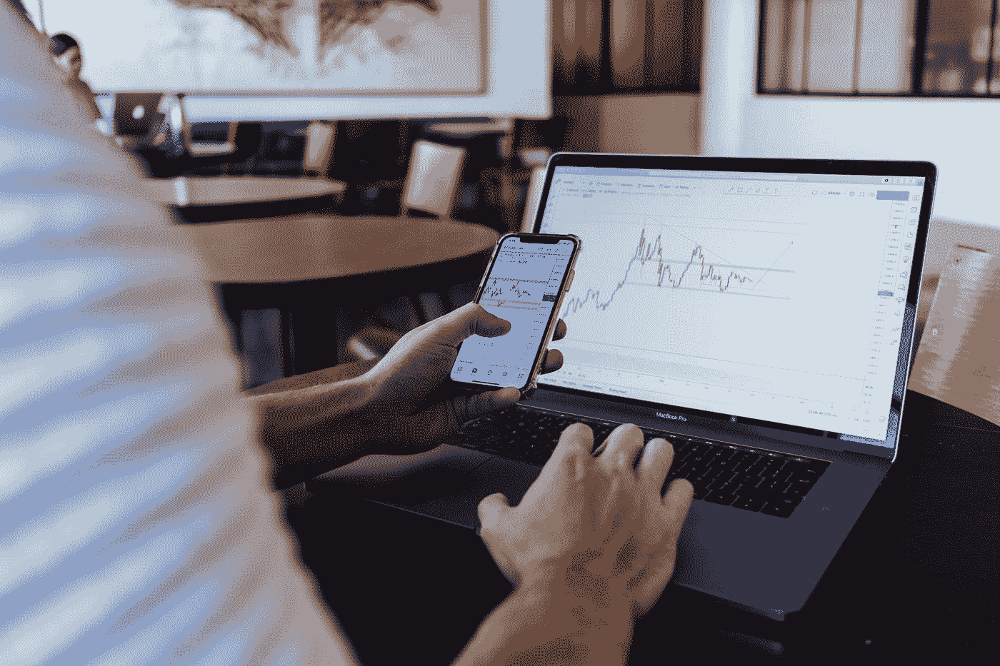

# 做空市场让我损失了毕生积蓄

> 原文：<https://medium.datadriveninvestor.com/i-lost-my-life-savings-shorting-the-market-5657dcbd96e0?source=collection_archive---------0----------------------->

## 一个真实的故事，讲的是一个朋友在动荡的市场中囤积现金

Photo by [Jason Briscoe](https://unsplash.com/@jsnbrsc?utm_source=medium&utm_medium=referral) on [Unsplash](https://unsplash.com?utm_source=medium&utm_medium=referral)

上涨，下跌，然后再上涨——图表上的蜡烛似乎表明了一个潜在的趋势，媒体要么炒作市场反弹，要么预测急剧下跌。有很多数据迷雾，但投资者不会放弃他们的短期保证金交易:要么让他们赚几十万，要么让他们追加保证金。

“我失去了一切。”

他在银行里存了几十万元现金。在他听说当前的市场形势之前，一切都很好。当受影响的国家与传染性越来越强的冠状病毒作斗争时，数万亿美元被从市场上抹去。道琼斯、纳斯达克和标准普尔 500 [比 1987 年下跌得更深](https://techcrunch.com/2020/03/12/stocks-dive-on-dows-worst-day-since-1987-tech-crashes-and-bitcoin-is-no-haven/)，尽管[出台了 2 万亿美元的新冠肺炎刺激法案](https://www.visualcapitalist.com/the-anatomy-of-the-2-trillion-covid-19-stimulus-bill/)，以及 5000 亿美元的回购操作[以将利率保持在美联储偏好的范围内。](https://www.usatoday.com/story/money/2020/03/12/coronavirus-new-york-federal-reserve-stock-market-liquidity/5032970002/)

一切都崩溃了，对吧？

首先，这是五千到标准普尔 500 短。效果很好。

 [## 投资区块链前要问的三个简单问题(也是一个困难的问题)|数据…

### 现在是了解区块链的最佳时机。不同货币之间的增长率，比如…

www.datadriveninvestor.com](https://www.datadriveninvestor.com/2020/03/12/three-simple-questions-and-one-difficult-one-to-ask-before-investing-in-a-blockchain/) 

然后，这是一万成标准普尔 500 短。这一次，有了杠杆——从经纪人那里借钱来增加他的收入。

失败了。几个小时后，价格飙升了 10%，这意味着做空被认为是错误的。保证金被追缴，他不得不抛售几千美元来维持账户。

赌徒的逻辑是这样的:当你输了一美元，你下注两美元赢回你的本金*，再加上从你的赌注中获得的*。这种逻辑在他心中根深蒂固，这一次的赌注要高得多——要“赢”回一万元，你必须投入两倍的钱。

这种情况持续了几天。

在一周的交易中，他看到十年的积蓄化为乌有。在偿还了经纪人的贷款后，他的保证金账户被关闭了。他的不断做空让他除了现金短缺和充满遗憾之外一无所有。

不幸的是，他只能责怪自己:贪婪、无能和缺乏经验。

这是一个男人的故事，他失去了一生的积蓄，冒险进入一个未知的领域，他一无所有。这意味着要靠个人贷款(除了住房和汽车贷款之外)来维持生活，每天打些送外卖之类的零工来赚取额外的现金，还要度过哀叹和悔恨的夜晚。

借钱赚更多的钱听起来是个好主意，但前提是你真的知道你为什么这么做。

融资融券交易，按照 [Investopedia](https://www.investopedia.com/terms/b/buying-on-margin.asp) 的说法，一般“不适合新手”。通常，一项投资已经带有一些风险——资产可能会贬值。由于从经纪人那里借钱来增加收益，这种投资现在的风险更大，同时利润也有可能飙升。这是一种高风险、高回报的投资方式，因为你是在借钱(即承担[保证金债务](https://www.investopedia.com/terms/m/margin_debt.asp))进行投资，并希望价值按照你希望的方向发展。

这是一个巨大的市场——大到足以让[银行对此感到担忧——而且在这场冠状病毒疫情期间，这个市场依然生机勃勃，欣欣向荣。使用简单的因果关系:边境封锁将扰乱供应链，企业因传播最小化措施而关闭，失业率因大规模裁员而飙升。](https://www.bloomberg.com/opinion/articles/2018-03-28/banks-are-worried-about-margin-loans)

这意味着跟踪 500 家大型美国公司股票的标准普尔 500 指数将会受到重创。

这很有道理，但是标准普尔 500 的反弹创造了历史。

然而，这并不预示着真正的市场反弹。交易者习惯上称之为“[死猫反弹](https://www.forbes.com/sites/investor/2020/03/30/municipal-credit-warren-buffett-and-the-dead-cat-bounce/)”，是暂时的反弹。这可能是确认偏差(即阅读关于死猫反弹的分析，并相信它是一个)，但有一个市场悲观主义者的阵营，他们不会对冲市场。那么这是一个短暂的机会吗？没有人真正知道，一些分析表明[过于谨慎](https://www.bloomberg.com/opinion/articles/2020-03-28/coronavirus-don-t-read-too-much-into-stocks-sudden-rebound)。

现实是，死猫反弹抹去了数以亿计的空头头寸，因为股票价值上涨，跟踪它们的指数也随之上涨。

在这数亿美元中，有一个人收集了不同的空头头寸，他预测市场将像媒体预言的那样继续崩盘。

我朋友的故事只是每天发生的许多投资和交易失败中的一个——另一方面，还有许多其他人成功地进行了伟大的交易。无论是交易货币对(如美元/日元)、股票还是商品，每个市场都有赢家和输家。有时，损失可能很小。

那么，亏损怎么会变得如此之大？贪婪地试图挽回损失，或者过度扩大自己的风险承受能力而产生的滚雪球效应。

然而，在一个高度动荡的市场中保持活力并不困难。在大多数情况下，它是行使谨慎，监测图表，并从数据和趋势中得出结论。然而，当投资者缺乏经验，风险偏好超出他们的承受能力时，亏损很容易出现。

永远不要交易你不真正理解的东西，永远不要借钱去赚你不知道为什么要赚的东西的钱。关键是:如果你不知道你对冲或做空的是什么，你只是在赌博。它看起来很复杂，因为它是用图表和数字而不是卡片和筹码完成的。