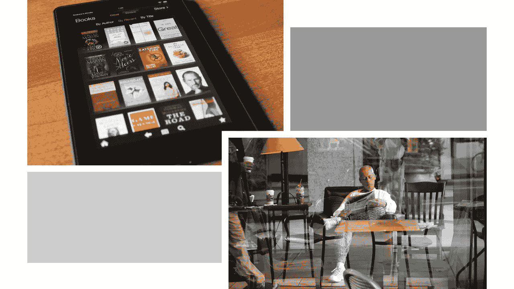

# 我爱我的 Kindle，但让我保留我的报纸。

> 原文：<https://medium.datadriveninvestor.com/i-love-my-kindle-but-let-me-keep-my-newspaper-b68a17aaabf2?source=collection_archive---------18----------------------->

Love my Kindle — but I still like the feel of a newspaper!

## 电子书阅读器是颠覆性的技术，改变了我们看待书籍的方式。

在任何一天，我的办公室都堆满了书——上百本。如果我角落里的桌子和电脑没有占据房间的 35%，你可能会误以为我的办公室是图书馆。

一个已经过时 10 到 15 年的图书馆。

为什么？因为这大概是我读完大部分书的时间。我一直告诉自己，总有一天我会“清理房间”,扔掉所有不用的书。我不这样做的唯一原因是，我知道我会在这个过程中拉伤一些肌肉。我不准备拿出所有那些沉重的箱子，所以我让这些书放在我的书架上积灰。

 [## 幸福的算法？数据驱动的投资者

### 从一开始，我们就认为技术正在使我们的生活变得更好、更快、更容易和更实用。社交媒体…

www.datadriveninvestor.com](https://www.datadriveninvestor.com/2019/03/08/an-algorithm-for-happiness/) 

我不再需要这些书了。我有我的 Kindle 电子书——这可能是我需要的最后一本书。

我使用电子阅读器已经快九年了，但我真正爱上电子阅读器是在我读研究生的时候。我参加了一个在线神学硕士项目，课程需要一些真正深奥的教科书。在最初的几个学期，神学系的办公室助理很有风度地亲自去书店，购买所需的教科书，并通过国际邮件运送。虽然我们可以用书的价格来邮寄它们，但是这些书从来没有准时到达——它们经常在课程开始后两周才到。这让我远远落后于班上的阅读曲线，我总是努力跟上。一定有更好的方法。

有过。我的 Kindle Fire 救了我。

我急切地想找到一种方法来跟上阅读。我不愿意尝试使用我的电子阅读器，因为我认为我不能在网上找到我的任何教科书。即使我看到了，我也不知道它们是电子阅读器格式的。

我在这两方面都错了。

除了一个例外，所有的书都列在亚马逊上，并且是电子阅读器格式。问题解决了。毕业有保证。

这是我与 Kindle 恋爱的开始。但是当我只需要一两次的时候，我还没有准备好去购买一本书并把它放在我的 Kindle 上。

进入 Kindle unlimited 计划。我仍然可以购买我想要的书，但如果我想“尝试阅读几章”，我可以在决定购买与否之前使用我的 Kindle 点数来查看一本书。

我的 Kindle 不仅是一个很棒的电子阅读器，它还能让我观看电视节目、电影和其他我从网上下载的视频。我在 Kindle 上也有几个应用程序为我提供有用的信息。

尽管 Kindle 改变了我的阅读方式，但它也有一些明显的局限性。第一个是续航。它声称电池寿命约为 10 小时，但一旦拔掉插头，即使关机，它似乎也无法保持电量。如果我忘记给我的 Kindle 充电，一周后，它最终会失去充电。这可能很烦人。

我把另一个限制归因于我这一代人，因为我成长在一个没有互联网的时代。哦，我很喜欢 Kindle。但是感觉不像…书。当我读它的时候，我似乎总是在努力把它放在正确的位置。我为它买了一个摇篮，这样我就可以把它立起来，但是它不太好用。尽管我喜欢电子阅读器的便利，但它看起来……嗯，有点尴尬。

我想这是我传统的‘新闻’。当我吃早餐、午餐或喝咖啡时，我喜欢拿着报纸或把它摊开在我面前的桌子上的感觉。当你慢慢翻开面前的书页，浏览署名，俯身阅读那些激起你兴趣的故事时，你会享受到一种舒适、悠闲的阅读。

所以，在一天结束的时候，我想要两种形式的媒体。我爱我的电子阅读器。我喜欢它把我从庞大的物理图书馆的暴政中解放出来。我喜欢 Kindle 的点播功能，可以随时随地阅读我电子图书馆里的任何内容。

但是我不想放弃我的纸质报纸。再说一次，没有什么比在悠闲地喝完茶的时候能够翻阅印刷好的书页更让人放松的了。

也许这就是为什么关于印刷报纸消亡的声明可能有点为时过早。