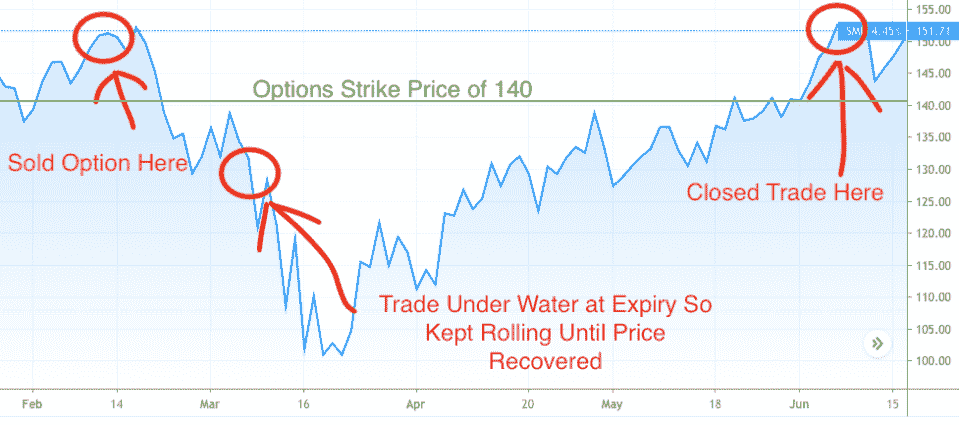
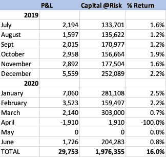
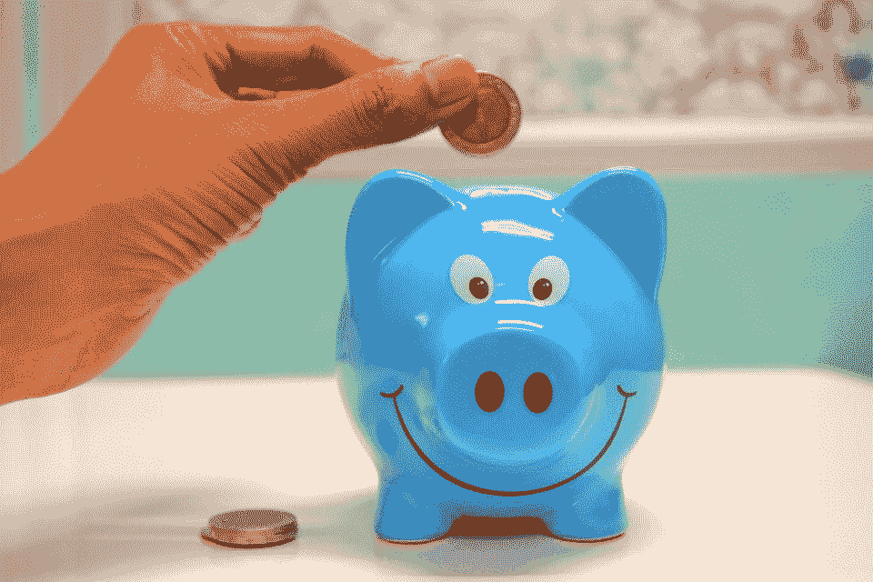

# 我第一年做期权交易赚了 30，000 美元，下面是我的方法

> 原文：<https://medium.datadriveninvestor.com/i-made-30-000-in-my-first-year-trading-options-heres-how-888d35a8831a?source=collection_archive---------0----------------------->

$29,753.那是我一整年交易股票期权的利润。

考虑到我每年的生活成本在 40，000 美元左右，这是真正的钱。

我一岁的孩子在我旁边，站在他的学步车里拍手流口水。他很兴奋。我奖励他一个肚子发痒，他笑了。

我上辈子的工作是给大机构炒股。我做了十多年了。很简单。我会收到很多购买股票的订单，然后按下按钮执行。然后，我会收到大量的卖出订单，并按下一组不同的按钮。我在按按钮这件事上非常有天赋。我甚至偶尔戴一条领带，以此来感觉自己很重要。

不出所料，我厌倦了按那些该死的按钮。

我幻想着在家赚钱。我读过一些成功的故事，讲述了一些人通过兼职工作辞职的故事。我甚至认识几个。但是直到我偶然发现期权交易，我才知道我的超能力是什么。

我认为交易期权是为智力水平疯狂的人准备的。不幸的是，那不是我。当我参加 GMAT 大学申请研究生院的考试时，我的口语成绩排在前十名(英语文学课！)但是数学倒数十名。当人们发现我从事金融工作时，他们感到震惊。毫不奇怪，我最终没有申请研究生院…

但我说了去他妈的。我想看看能不能学会期权交易。

试用一年后，我赚了 29753 美元。

事情是这样的。

# 发现股票期权

我喜欢思考生活中的重大变化，你可以将这些变化归结为一个事件——所谓的岔路口。

在这个故事里，是一次偶然的机会遇到了我在金融行业的第一个老板。最初指导和教我如何交易股票的人。在这篇文章中，我将称他为苏西。

有一天上班时，苏西伸出手来，说他和家人在香港(我当时在那里工作)，想一起喝杯啤酒。自从他在这次会面前几年离开这个行业，我就和他完全失去了联系。我既兴奋又好奇，想看看他在干什么。

在例行公事和一杯啤酒下肚后，我问他。

他回答说，我以交易期权为生。

我很困惑。我的脸就像一只鹿在车灯前模仿苏戴力。

他试图解释它的要点，但我理解不了。我所能想到的只有“我以交易期权为生”这几个字，因为那天晚上我一直皱着眉头。

然后第二天我又回到了按按钮的状态。

但是期权交易这件事一直在我脑海中纠缠着我。我花了几个月的时间阅读它，了解一些基本概念。一旦我觉得我知道的足够问一些不完全弱智的问题，我就给苏西发了电子邮件。

在接下来的两年里，我在做大量笔记的同时通读了一些相当枯燥的材料。工作中的同事会问我桌上的《傻瓜期权交易》一书。虽然我开始理解一些理论，但我很难想象它们是如何运作的。

苏西在我们的电子邮件交流中承认，这是一件只有当你开始做的时候才有意义的事情。

不幸的是，当你在银行工作时，合规部门试图阻止你做任何有意义的事情，包括交易期权。是的，我可能听起来愤世嫉俗，但我就是这么说的。

虽然我很想进行一些交易，但我不得不等到辞职。

这让我想到…

# 为自己按下按钮的快乐

追到苏西两年后，我正式失业了。

是啊！

自从我进入金融行业以来，这是我第一次可以自由地登录我的经纪账户，随心所欲地交易。

> ***‘他妈的当黑帮感觉真好’***
> 
> **Geto 男生 **

现在是时候建立对子，开始交易期权了。

我已经注册了一份苏西推荐的时事通讯，它提供常规的交易思路。这是完美的，因为它提供了一个遵循的框架。

伙计，太令人兴奋了。

尽管我的职业是股票交易，但期权交易是全新的。一切看起来都不一样了。

如果股票是二维的，只有简单的买价和卖价，交易期权就像进入了第四维。每个特定价位都有出价和出价，每个出价和出价的到期日都不同。

就像生活中的大多数事情一样，一开始会让人望而生畏，但后来你就掌握了窍门。甚至变得很有趣。

让我吃惊的是我有多喜欢再次按下那个该死的按钮！过去十年被束缚在办公室里，在家赚钱是不现实的。

# 把握期权交易

期权交易让我想起了孩子们玩的磁性积木。你可以用任何方式来安排它们，这取决于你想要达到的目标。

我的意思是，根据你对市场的看法，你可以设定无数的策略组合。如果你认为市场正在上涨，你可以使用一套策略。如果你不确定股票会往哪个方向走，但认为任何一个方向都会有不错的走势，那么这里有一些策略。如果你认为市场处于下跌趋势，就使用这些策略！这些策略有一些很酷的名字:铁秃鹰，牛市蔓延，日历跨，铁蝴蝶。

好吧，这听起来很棒，但是什么是真正的股票期权呢？

> 简单地说，股票期权合约赋予持有者在规定的时间框架内以预定的价格购买或出售一定数量股票的权利 
> 
> 【Investopedia.com】T5**T6**

这很简单。你可以把它当成一份保险单。如果你是一名投资组合经理，管理着某人的退休金，那么你可能会认为这是一个保护你的投资组合免受大幅下跌影响的好主意。

如果标准普尔 500 在 3000 点左右交易，那么也许你会希望避免超过 20%的下跌。这种保护可以通过以 2400(低于当前市场 20%)的价格购买期权合约来实现。值得注意的是，在这个例子中，你或我都可以卖出期权合约。我们需要做的就是在期权交易所下一个卖出订单。

最初让我困惑的是，学习如何交易期权来获得收入与做一名保险推销员没有什么不同。许多期权交易者认为自己是在保险行业。

当我读这本书的时候，我感到敬畏:[期权交易者对冲基金](https://www.amazon.com/Option-Traders-Hedge-Fund-Framework-ebook/dp/B00844NXC6)。作者的中心前提是期权交易者是一个人的保险公司，独自经营业务。

保险业务可以总结为几个要点:

*   计算售出保险单的风险
*   为这些保险单收取足够的保费
*   购买“再保险”以防范自然灾害(如洪水)等末端风险。
*   投资销售保险积累的现金

这正是期权交易者所做的。

所以让我们进入杂草。

# 深入细节

期权和保险单一样，都有合同期限。他们可以从一个星期到几年不等，直到保单到期。然而，现实是，超过 90%的期权合约到期时毫无价值。获得稳定收入的方法是卖出期权合约，而不是买入。

这个策略已经成为我的谋生之道，被称为信用看跌价差。简而言之，我向股票持有人出售一份保单，允许他以略低于当前市场价格的价格向我出售股票(称为“看跌期权”)，以防股价暴跌。然后，我用收到的一小部分保费为自己买了一份再保险，以便以更低的价格卖出这些股票。

通过一个例子最容易理解:

耐克股票的价格是 100 美元。我向耐克股票持有者出售一份为期两周的短期保单，以 95 美元(比当前价格低 5%)保护他的投资。如果在此期间耐克的股价跌破 95 美元，他可以把自己的股份以约定的 95 美元的价格卖给我。

在这个例子中，他为这项保险支付了我 1 美元。然后我可能会出去花 0.2 美元买一份再保险，花 90 美元保护自己(比市场低 10%)。这样，如果股价下跌 20%，我就必须以 95 美元买入。但我的下跌受到保护，因为我可以在 90 美元卖出同样的股票。

*两周之后，如果因为耐克的股价仍高于 95 美元，保险单到期时一文不值，那么我就赚了 80 美分(我最初收到的 1 美元，减去我为再保险支付的 0.2 美元)。*

不像交易股票，你需要价格上涨才能获利，如果股价上涨，保持不变，或者下跌不太多，我就赚钱。

如果你做十笔这样的交易，每笔都有 90%的盈利概率，那么你可以预期其中九笔交易盈利，只有一笔交易不盈利。

锦上添花的是，没有成功的那一笔交易并没有结束。你可以做很多事情来“修复”它，让它再次盈利。

交易期权的一个主要概念是“滚动”，这是我在交易仅一个月时，当市场大幅下跌，导致我的大部分交易失败时，我必须学会的东西。

所有的滚动方式都是将期权的到期日提前。

你通过回购卖出的期权合约，然后在更远的时间卖出相同名称的另一份合约来实现这一点。美妙之处在于，你甚至可以在做这件事的同时获得额外的收入。

我可以用我最近完成的一笔真实交易来最好地说明这一点(显然是精心挑选的):

*今年 2 月 12 日，在新冠肺炎股市开始自由落体前一周，SMH·瓦内克半导体交易所交易基金的交易价格为 150 美元。我以 140 美元卖出了 3 月 6 日到期的看跌期权，获得了 100 美元的溢价/收入。当然，市场暴跌，交易失败。*

因此，我继续及时平仓，直到价格回升。6 月 5 日，我终于以 500 美元的利润完成了交易，比我最初收到的保费多得多。利润增加的原因是因为随着股价下跌，波动性大幅上升。当波动性较高时，卖出期权的溢价也会增加，这样我就可以在每一次交易中获得额外的溢价。

以上是我交易期间的名称图表。绿线是我卖出看跌期权/保险合同的 140 美元的执行价，所以交易一直在这条线以下。

值得一提的是，我在一遍又一遍的用同一个名字交易期权。我有一份股票和交易所交易基金的清单，我很乐意直接持有，并持有多年。我只交易这些股票的期权。原因很简单。即使交易失败，我也能在晚上睡觉，因为我相信股价最终会回升。

在上述半导体 ETF 的例子中，我决定以这个名字建仓，因为我相信全球对电脑和智能手机中半导体芯片的需求会不断增长。随着疫情的蔓延，股价随着市场的其他部分一起暴跌。但它很快复苏，甚至创下新高，因为世界需要更多的半导体来跟上他们对游戏和虎王的新热爱。

我在过去的一年里反复进行类似的交易，所以让我们来看看结果。

# 这是我的记分卡

开始一年后，通过超过一千次的执行，很多次深夜从亚洲交易美国市场，还有无数个小时的学习，我总共赚了 29，753 美元。

以下是每月的细目。

今年 4 月和 5 月是销账，因为我不活跃。当市场自由落体时，我藏在毯子下面。我在 3 月份非常狡猾，交易看跌策略，但我在 4 月份只做了一笔交易，买入 S&P 的看跌期权，以防市场进一步下跌。我们知道那没有发生，所以我失去了那笔钱。在 5 月份，我没有进行任何新的交易。我唯一的活动是将现有头寸及时展期。

剔除这两个月，我的风险资本平均回报率为 1.6%，年总回报率为 16.4%

值得注意的是，尽管我的平均风险资本是 186，000 美元/月，但我的交易持续时间平均不到两周。这意味着我在任何时候都只有 9.6 万美元的资本处于风险之中，而不是 18.6 万美元。在进入新的交易之前，我会关闭现有的交易，从而回收相同的资本。

为什么这很重要？

因为它让我的回报翻倍到 32.8%而不是 16.4%(29753 除以 96k 而不是 186k)。

但把这些会计骗局放在一边，让我们看看 16.4%的回报率这一更保守的计算意味着什么。

如果我去年 7 月将 186，000 美元投资到 S&P500，我将获得 5%(9，300 美元)的收益，因为这是该指数同期的涨幅。就在一个月前，这一数字还处于负值区域，因为该指数更低。

相比之下，我在每次期权交易结束后锁定我的收入。我喜欢我的利润是一个真实的数字加到我的经纪账户的现金部分，而不是一个基于市场趋势上升的抽象概念。

关于风险资本，另一点需要注意的是，它不需要以现金的形式存在于你的账户中。如果是这样的话，它绝对会让你安心，但你可以随心所欲地投资，以提高你的回报。当我一年前开始做这个的时候，我的经纪人为我账户中的闲置美元支付了 1.9%的利息，所以我很高兴离开了。然而，现在显然不是这样了，利率为零。但我可以将这笔钱配置到一些安全的股息股票上，这样可以提高我的回报。这也是我正在采取的方法。

# 我前进的道路

交易期权听起来可能很性感，但是很乏味。在过去的一年里，我已经在我的电子表格中输入了一千多个执行结果，这是我喜欢做的事情。我过去在工作中必须手动确认交易。现在我这样做是为了记录我的利润！

我感觉像一个孩子在数他的存钱罐里的硬币。

除了这个能养活我的家人！

也就是说，你学的越多，你就越意识到你知道的是多么少。

这就是我现在的感觉。

我没有为过去一年的盈利而沾沾自喜，而是犹豫是否应该骄傲。我意识到我知道的是多么少，我仅仅是触及了我需要的知识的表面，我需要对以交易期权为生充满信心。也知道我还需要多用功。

就我需要采取的具体行动而言，它们主要包括扩大我的交易策略库。在市场崩溃之前，我在寻找一对我愿意轮流使用的夫妇。

一个是听起来非常酷的反向铁秃鹰，用于从收益公布前后的重大波动中获利。当你认为会有一个上涨或下跌，但不确定是哪个方向时，这是可以使用的策略。

另一个是除息日前后的资金回笼。

我对这两种策略感兴趣的原因是，它们通常会在几天内平仓，从而将市场风险降至最低。

因此，有可能在增加回报的同时减少我对市场波动的敞口。当然，这将涉及无数个小时的学习，但尽管我的大脑在数学上有挑战，这还是很有趣的。

想象一下，你回到学校，你的代数 101 老师告诉你，如果你解出这道题，他会给你一叠现金。

正是如此。

# 皮条客

即使你讨厌你的工作，你也可能从你的经历中获得一些智慧，将它转化为有利可图的副业。

我受够了按按钮谋生。因此，我投入时间和精力，将我的经历转化为一种可以提供个人和经济回报的副业。

最重要的是，在办公室之外。

我在某处读到过，最富有的人有七种不同的收入来源。我们家目前有四个，我计划增加到七个。

我会继续努力，看看我的哪些技能可以转化为收入。

你也可以这样做。

> ***我宁愿一周 7 天 24 小时忙碌，也不愿朝九晚五***
> 
> ****未知****

*这是我的感觉，也许你也是。*