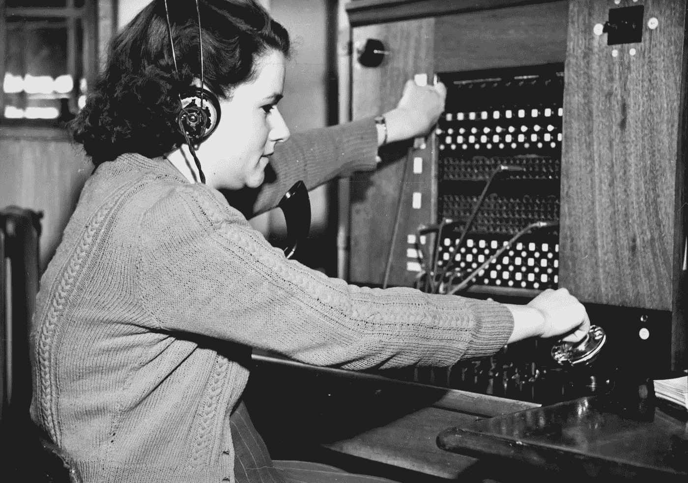

# 我曾经在一天之内刮了 3000 多张彩票

> 原文：<https://medium.datadriveninvestor.com/i-once-scratched-over-3000-lottery-tickets-in-one-day-479df5d3bb3c?source=collection_archive---------30----------------------->

虽然广播电台为彩票做了广告，但我对 T2 从不感兴趣；宁愿以其他方式输掉我的钱。

Photo by Museums Victoria on Unsplash

商品交易一直是世界商业的神圣传统。对许多企业来说，这是经济上的必需品。无线电业务是那些依靠不换手的交易的业务之一。只有商品和服务。

我可以和你分享一个奇怪的故事吗？当你拥有一个小镇广播电台——WSER 时会发生什么？

在这里，让我来解释一下:对于买卖双方来说，有时正常的结算过程不如易货系统有吸引力。

通过有限的例子；巴尔的摩乌鸦队给了 WSER 队比赛的转播权。该组织支付的门票和外地通行证，反过来，WSER 应该给它的听众。*我必须承认我自己也用过一两次特权。*

该电视台与马里兰州彩票委员会也有类似的安排。作为广告费用，委员会给了我们 1 美元的刮刮乐彩票。电视台应该把这些票作为促销商品。这些彩票将在交易会和其他远程广播活动中分发，以进一步宣传彩票。双赢！

至少事情应该是这样的。

小镇广播电台的电台经理通常会有很大的变动。每一个雄心勃勃的经理都在努力向更大的电视台、更大的城镇、更多的观众前进。这就是钱的所在:越大越多。WSER 的情况无疑就是如此。你可以变得更小:1000 瓦，计时器。

我的新任电视台经理几周前已经离开了。在我找到合格的替代者之前，我妻子是目前的临时经理。她最终在临时职位上干了 3 年——但那是另一回事了。

一天晚上，在她工作大约一个月后，她带着两个巨大的草坪和装满东西的树叶袋子回家了。她扑通一声把它们放在厨房的地板上。

**什么？**

在整理离去的车站经理办公室时，她在办公室壁橱深处发现了这两个巨大的袋子。

它们可能包含什么？

**试试这个:**

**数千张 1.00 美元的刮开型彩票**

显然，他们是在支付近一年的马里兰州彩票广告费用。

似乎 WSER 亲爱的已故电台经理在给自己发奖金。她的努力因为她旧办公室门上的锁的更换而受挫。

整个事件变得更加复杂，因为票的有效期是在下一周内。电视台没有安排集市、游戏或购物中心遥控器。

亲爱的，把孩子们集合起来！

第二天早上，我的女儿和她的男朋友，我的两个儿子和他们的一个朋友，还有我的妻子和我坐在餐桌旁。我们面前有一张可以坐 6 个人的桌子。桌子上放着一堆彩票，当我女儿的男朋友坐着的时候，彩票已经快到他的头顶了——他身高 6 英尺 6 英寸

我们早上 9 点 20 分出发。

我知道这一点，因为在厨房的墙上有一个时钟。

我们快乐的小团队开始工作了。我从没想过要花多大力气才能暴露那些彩票上的数字。那灰色的东西需要好好擦一擦。在看了 20 或 30 张票后，我感到筋疲力尽。

我可以说抓挠的新鲜感也在孩子们身上消失了。去洗手间的次数越来越多，超出了青少年的自然需求。

虽然广播电台为彩票做了广告，但我从来都不是一个粉丝；宁愿以其他方式输掉我的钱。这个抓挠练习只是证实了我之前的负面情绪。

我们 7 个人一直工作到下午 4 点才把那些该死的东西刮干净。

我们用 25 美分硬币来抓痒，尽管事后我才知道*我们本可以通过使用酒精和纸巾来让事情变得简单些。似乎每个人都有自己的建议，让事情变得更简单。不幸的是，所有出色的建议都是在事后提出的。*

孩子们数着票的尸体；大概 3000 左右。

相比之下，守门员的数量似乎微不足道。

我在一家出售和赎回门票的零售商那里兑现了我们的奖金。

我有足够的钱来招待所有努力在中奖彩票上显示中奖号码的孩子们。

下周六给他们买了披萨。

甚至还剩下足够的钱为加油站买清洁用品和 24 包卫生纸。

从那以后就没有痒过。