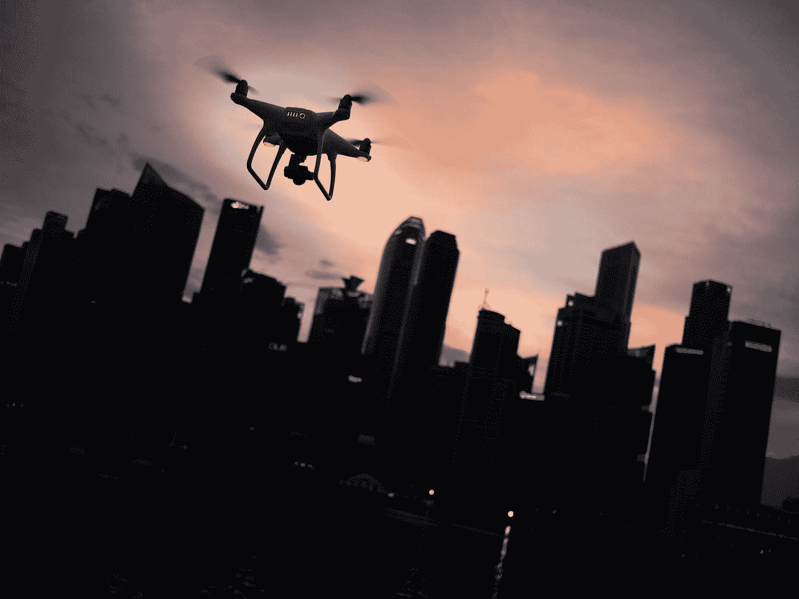
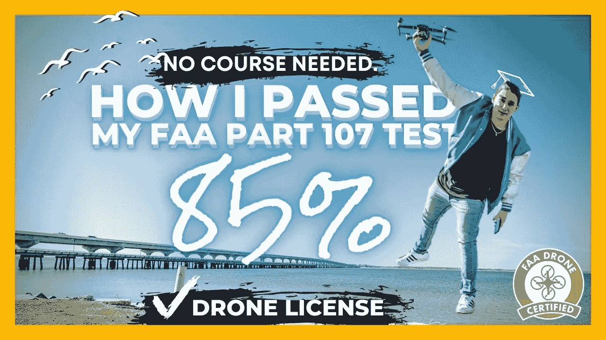

# 我在不到一周的时间里(2021 年)以 85%的成绩通过了我的无人机考试(FAA Part 107)

> 原文：<https://medium.datadriveninvestor.com/i-passed-my-drone-exam-with-85-in-less-than-a-week-2021-faa-part-107-d3c92a187a18?source=collection_archive---------27----------------------->

Photo by [Goh Rhy Yan](https://unsplash.com/@gohrhyyan?utm_source=medium&utm_medium=referral) on [Unsplash](https://unsplash.com?utm_source=medium&utm_medium=referral)

我终于以 85 分的成绩通过了我的无人机考试，并获得了我的无人机执照。这个视频分解了我曾经在不到一周的学习中通过考试的过程。我有飞行执照，宝贝！！

老实说，我原以为这会比实际困难得多。我第一次参加这个测试的时候，我觉得我准备得很不充分，或者说我不够聪明。不管哪一个是真的，我很高兴能完成这件事！！我带着 85 分的高分和灿烂的笑容走出了考试中心。

# 所以我是这样做的:

考试前半周左右开始学习。我首先(以 1.5 倍的速度)看了托尼·诺斯鲁普的视频，让自己重新熟悉了这个素材。是的，即使几年后，这份材料仍然非常重要。老实说，你可能只是看几遍这个视频就通过了，但这不是我做的全部。他的[学习指南](https://northrup.photo/free-faa-part-107-suas-drone-certification-study-guide/)也很有帮助。我对这些概念没有信心，所以我决定做更多的研究。

我总共学习了大约 2-3 天，一天不超过 4-5 个小时。我最后看了两遍托尼的视频，但我也看了这些视频，它们真的帮助我理解了 **TAF、气象、空域和剖面图的概念。**

更好的 B 卷使这个神奇的视频通过了全面的实践考试。这对于全面掌握问题的措辞很有帮助，甚至可以进一步分解概念。

看完这两个视频后，我觉得很有信心，但我仍然需要更多的内容来确保我 100%理解。下面的两个视频澄清了任何困惑，所以看完之后，我只是回到托尼的视频，以充分掌握这些数字。

## 总的来说，你需要完全理解托尼在视频开头提到的数字，TAF/梅塔，截面图，空间和风险管理。

你不需要支付课程或练习题的费用(尤其是如果你手头紧的话)。我再说一遍:**如果你掌握了这些概念，你就会通过**。专注于理解，答案就会到来。逻辑地思考问题，理解美国联邦航空局希望你理解的内容。

你能行的！如果我能做到，你也能。你将开始你新的无人机生涯。另外，有趣的事实:**如果你想在考试后尽快拿到驾照，拿到临时驾照需要 7-10 天。请确保您为该时间范围做好准备！**

# 让我知道你做得怎么样，如果你有任何问题，我在这里。