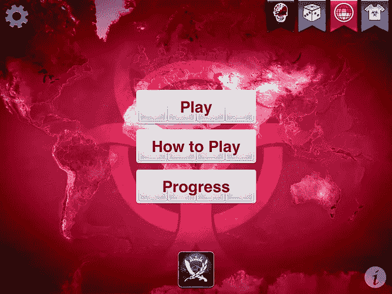

# 我在《瘟疫公司》中重现了新冠肺炎，世界在 562 天后灭亡

> 原文：<https://medium.datadriveninvestor.com/i-recreated-covid-19-in-plague-inc-and-the-world-died-in-592-days-50b7da24dd9f?source=collection_archive---------0----------------------->

## 这是一个古老的游戏，表明了我们在疾病爆发时的弱点。

Johns Hopkins Coronavirus [map](https://coronavirus.jhu.edu/map.html), March 18, 2020

# **人性**

在我们开始这个不寻常的实验之前，我想强调一下，这个世界可能不会在 562 天后结束**。我认为世界末日不会很快到来。瘟疫公司是一个视频游戏。仅此而已。**

尽管如此，意识到 2012 年的 iPhone 应用程序可以轻松模拟当前的全球危机还是很可怕的。

新冠肺炎激起了一种永不满足的欲望，想重温我少年时代的一款游戏。我高中时玩过一次瘟疫。在这个游戏中，你进化出一种病原体来终结人类。我记得那很有趣，也很有教育意义。但是我从来没有真正达到过游戏中的目标——**，直到现在**。

> ***“瘟疫公司*** 是一款由英国独立游戏工作室 Ndemic Creations 开发并发布的[即时战略](https://en.wikipedia.org/wiki/Real-time_strategy) [模拟](https://en.wikipedia.org/wiki/Simulation_game) [视频游戏](https://en.wikipedia.org/wiki/Video_game)。玩家创造并进化出一种[病原体](https://en.wikipedia.org/wiki/Pathogen)，试图用一种致命的[瘟疫](https://en.wikipedia.org/wiki/Pandemic)消灭人类。这个游戏使用一个[流行病模型](https://en.wikipedia.org/wiki/Epidemic_model)和一组复杂而现实的变量来模拟瘟疫的传播和严重程度。”

2 月 27 日，中国网络空间管理局将这款游戏从苹果应用商店下架，并称其为非法游戏。

随着世界面临大范围的隔离，我认为重现冠状病毒(2019-nCoV /新型冠状病毒/新冠肺炎)的状况，看看它会如何影响地球会很有趣。

后来我能想到的只有 OMG。

Plague Inc

# 新冠肺炎（新型冠状病毒肺炎）

我想你已经对冠状病毒了如指掌。为了这个*实验*我简单介绍一下特点和症状。

新冠肺炎是一种新型冠状病毒，可导致从普通感冒到严重呼吸系统问题的疾病。这可能是致命的。据信这是一种潜伏期很长的气溶胶(这种病毒具有难以置信的病毒性，可以在几周内不被发现)。五分之一的病例需要住院治疗。因为它是一种病毒，所以它会不断变异。

主要症状([美国医学会杂志](https://jamanetwork.com/journals/jama/pages/coronavirus-alert)):

*   发烧(98%)
*   疲劳(70%)
*   干咳(60%)
*   食欲不振(40%)
*   肌肉疼痛(34%)
*   呼吸急促(31%)
*   腹泻(10%)
*   恶心(10%)
*   头晕(10%)
*   呕吐(4%)

大多数感染者出现轻微症状，但住院人数很关键。这可能会使医疗机构超负荷运转，导致死亡率激增。

**我们正在观察一种极易传染的疾病，它随时都可能变异。**

目前还没有治愈新冠肺炎的方法。只有疫苗和提高认识方面的预防。

Plague Inc

# 预防

预防措施在于人群的行为。

[世卫组织](https://www.who.int/health-topics/coronavirus)官方预防指南包括**定期洗手；** **咳嗽、打喷嚏时捂住嘴**和鼻子；烹调肉和蛋；和**远离**每个有明显症状的人。

 [## 保护主义、政治和经济动荡|数据驱动的投资者

### 美国股市昨日出现 400 多点的大幅反转，为未来的事情发出了警告信号。市场…

www.datadriveninvestor.com](https://www.datadriveninvestor.com/2018/06/28/protectionism-politics-economic-turmoil/) 

此外，附加措施是一般的社会距离和自我隔离。你应该避免公共场所和与人近距离接触。强硬的预防措施是开发疫苗。可悲的是，人体试验可能需要几个月才能证明其广泛使用的安全性。据信，这可能会在 2021 年全年发生。然后，疫苗分发需要几个月的时间。到那时，这种病毒可能已经肆虐了大部分人口。

Plague Inc

# 受教育的场景

全球医学专家做出了许多有根据的预测。

我列举两个。

**场景 1** :病毒变异，病毒性减弱，最终自行消失。这是最好的情况，过去也发生过。

**场景二**:病毒传播更快，危害更大。它导致数百万人死亡，并在未来几年扰乱医疗系统。经济和社会影响是灾难性的。这种病毒在发展中国家杀死了更多的人。

Plague Inc

# 游戏

在我玩瘟疫公司之前，我并没有打算写这篇文章。我只是有一个小时的时间来消磨，并决定重温一个旧游戏。

我在 iPad 上打开苹果商店，找到了这个应用。价格大约是 0.80 美元。八年前是免费的。他们可能认为受欢迎程度会随着时事而上升。说得好。

我打开了游戏。第一件事是一个教程，描述如何发展你的疾病。您可以升级类别，如传输，症状和能力。

游戏中的一个特色是提供全球新闻。您可以关注疫情和世界重大事件的全球报道。

免费选项只提供细菌，所以我决定再花 1.2 美元解锁病毒。这是一种快速变异的病原体。完美。

我把它命名为新冠肺炎，并选择普通难度，那里有 67.3%的人洗手。我认为与当前的现实相比，这个数字太高了。

我在中国办了第一个案子。它逐渐蔓延，然后突然。我获得了用来进化病毒的 DNA 点。我选择给新冠肺炎配备空气和牲畜传输设备。真正的病毒源于菜市场，是气溶胶。

游戏中的病毒变异不可预测，你必须付出 DNA 点来转移症状。我去掉了皮肤损伤和皮疹，因为它们不符合叙述。其余的突变遵循当前的情景。该病毒自行发展成持续咳嗽和肺部并发症。接下来是发烧，然后是呕吐、腹泻和恶心。病毒像野火一样蔓延。我认为这主要是由于轻微的症状和极端的病毒传播。

游戏中的新闻报道了边境关闭，引发了排外情绪，科学家们急于找到解决办法。听起来很熟悉？

2021 年 3 月之前，病毒感染了全世界。用了一年时间感染了全人类。

此时，我让病毒自行变异。科学家们已经接近找到治疗方法了。然后，免疫抑制和耐药性的突然袭击破坏了这一进展。

2021 年 5 月，也就是在中国开始感染后的第 562 天，这种病毒消灭了整个人类。这场比赛持续了不超过 15 分钟。

从那以后，我试着再次玩瘟疫并且发展我的战术。我把症状发展得太快了，试图变得更致命。事实证明，这是一个战略失误，因为游戏中的人类开发了一种治疗方法并拯救了自己。这场比赛不容易赢。

Plague Inc

# 外卖

这不是一个科学实验。瘟疫公司是一个游戏。仅此而已。

话虽如此，但我觉得重现新冠肺炎疫情的类似情况导致人类迅速死亡是很可怕的。

更可怕的是，应用不同的策略**并不那么有效**。当疾病一开始太致命时，游戏会迅速开发出治疗方法。

也有可能我没那么会运筹帷幄。但这是题外话。

这表明一些我们已经知道的事情。我们本可以为这次爆发做好准备。医学权威知道这种情况。几十年来他们一直在警告我们。但是我们的政治家和我们不在乎。总司令更关心金钱、工作和看法，而不是公共安全。

这些年来，美国逐渐减少了疾病预防控制中心办公室的数量——这使得美国极易受到时事的影响。

比尔·盖茨五年前就警告过我们潜在的灾难。现在听这个 TED 演讲感觉很怪异。

我们听到了，但没有听进去。

不知何故，我们忘记了我们一直处于无形的小细菌的威胁之中。病毒有能力通过关闭学校和工作场所来扰乱我们的生活。这些微生物会让你连续几周甚至几个月与世隔绝。它有可能用纯粹的觉知来发泄你的精神健康。不确定性。全球经济衰退。社会动荡。死亡。

仍然有人生活在否认中。

令人痛心的事实是，由于我们的集体无知，我们正面临二战以来最大的全球性灾难。