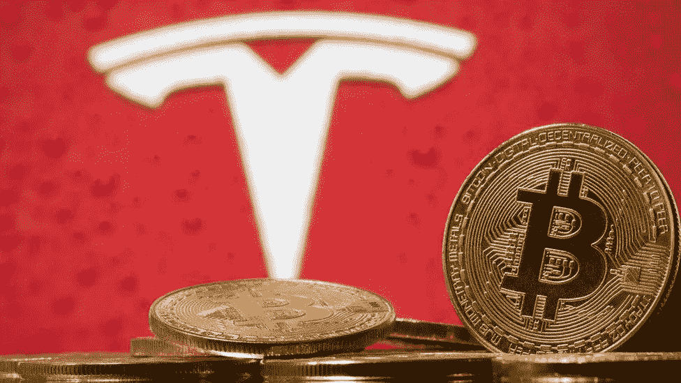

# 我卖了我的特斯拉股票为了什么？！

> 原文：<https://medium.datadriveninvestor.com/i-sold-my-tesla-stock-for-what-257d3ea507ab?source=collection_archive---------11----------------------->

## 我的下一笔大投资

特斯拉股票对我来说是一份不断送出的礼物。我已经从中获得了一些巨大的利润，我确信如果我继续以目前的价格持有特斯拉的股票，我仍将在未来几年内获得可观的利润。特斯拉是一家了不起的公司，有一位富有远见的掌门人——埃隆·马斯克。如果人类的总统选举来了；我会投他一票。我当然看好特斯拉。然而我卖掉了我所有的特斯拉股票。我也卖掉了我所有的股票。我没有非常多元化的投资组合——我只持有 3 家公司，特斯拉、索尼和 Palantir 全是利润。可能会有一些波动，但经济崩溃最糟糕的部分似乎已经过去。美国和世界其他地方正在慢慢开放，经济正在接受来自中央银行的直升机撒钱作为“刺激”。随着美国大选的临近，我预计会有更多的波动，但我认为选举结束后，无论选举结果如何，股市都将继续攀升。如果特朗普获胜，股票将因为公司税收减免而上涨。如果拜登获胜，由于更多/更高的刺激方案，股票将会上涨。那么，如果这是我所相信的，那我为什么要卖掉我的股票投资组合呢？仅仅因为我相信我有更好的投资机会。

# 获取利润

今年，由于新冠肺炎股市崩盘，加上我的一些幸运时机，我在股市崩盘时买入这些股票，并一直持有到昨天，从而在股票投资组合中获得了可观的利润。我可能会很贪婪，持有这些股票以进一步增加收益，但我认为在特斯拉和其他股票上赚 2 倍、3 倍和 4 倍的时间已经过去了。也许我的索尼股票可以在未来 12 个月内为 PS5 的销售带来可观的收益，但把这些都拿出来，并“兑现”过去 9 个月左右的收益，对我来说似乎是一个非常好的主意。现在，随着钱回到我的银行账户，我确信我已经摆脱了由美国大选或其他黑天鹅事件(如二次封锁)引起的意外市场调整的风险。

Photo by [T](https://unsplash.com/@titouanc?utm_source=medium&utm_medium=referral) on [Unsplash](https://unsplash.com?utm_source=medium&utm_medium=referral)

# 接下来呢？

美国今年为“刺激计划”印刷了超过 9 万亿美元。这比它过去两个世纪印刷的都多。在这种情况下，把你的钱放在储蓄账户里无异于金融自杀，因为即将到来的恶性通货膨胀至少美国，很可能还有欧盟经济也将受到影响。由于这种凭空创造货币的行为，黄金价格出现了前所未有的飙升。我相信，作为对通胀和不确定性的对冲，人民币将继续升值。但黄金并不是我心目中的下一项重大投资。我认为下一个大投资是比特币和以太坊。我如此相信它们，以至于它们代表了我净值的大约 50%,我现在已经卖掉了我全部的股票投资组合来增加这些头寸。

# 我怎么这么确定？

把一半以上的鸡蛋放在一个篮子里肯定是有风险的，这是我通常会反对的。然而，我不是唯一一个这样想的人。下面是传奇投资人兼亿万富翁保罗·都铎·琼斯的一句话:

> “利润最大化的最佳策略是拥有最快的马……如果我被迫预测，我的赌注是比特币。”

这是具有里程碑意义的，因为现在比特币不仅仅是极客们用来买披萨的神奇互联网货币，而是 gray 等华尔街公司、保罗·都铎·琼斯等对冲基金经理和 Square Inc .等上市公司投入资金的东西。所谓的“聪明钱”正在支持比特币。它不再被视为投机资产。保罗·都铎·琼斯来到美国消费者新闻与商业频道，谈论比特币。劳尔·帕尔来到雅虎财经，谈论比特币。6 年前，你绝不会听到这样的事情。比特币被认为是犯罪分子绕过当局、匿名在线购买武器的媒介。现在，它被视为防范政治危机、制裁和通胀的对冲工具。如果你仍然不明白为什么比特币很重要，读读[这个](https://medium.com/@angadsingh_40633/how-the-us-gov-proves-a-need-for-bitcoin-4a92cf9be0f1)。

随着数万亿美元的印刷；恶性通货膨胀只是时间问题。如果你想保住你的财富，你有几个传统的选择；股票，黄金，房地产。对我来说，所有这些资产都是好的，但不像新上市的公司那样被低估；比特币。它充当价值储存手段，做的和黄金一样，只是更好——它比黄金更易于运输和储存。几天前，价值 10 亿美元的比特币从一个账户转移到另一个账户。你知道这个的交易费用是多少吗？$3.你能想象黄金会这样吗？你能想象你的银行为了完成这笔转账会要求多少 KYC 吗？你能想象一个小银行能转这么多钱吗？(如果他们发放部分准备金贷款，这可能是不可能的)。

对于一些投资者来说，特斯拉今年的股价上涨了 2 倍、3 倍、4 倍，甚至 5 倍或 6 倍。我希望这种情况继续下去吗？不。我宁愿投资比特币，我认为比特币在未来 12 个月内有 10 倍的机会。我为什么这样说呢？因为比特币的价格以 4 年为周期变化。我们的上一个峰值是 2017 年的比特币，价格为 2 万美元。在此之前的高峰是在 2013 年。这是因为比特币的采矿奖励每 4 年“减半”一次，这降低了比特币的通胀率，并导致比特币价格上涨。按照目前的发展趋势，比特币极有可能在 2021 年达到下一个高峰。保守估计，比特币每 4 年周期至少做 10x。在上一个周期中，比特币在 2016 年至 2017 年从数百到数千。然后在 2017 年末短暂到几万。如果我们预期相同，那么比特币将从数万美元(目前的水平)上升到另一个数量级，达到数十万美元(也就是超过或接近 10 万美元)。

## **Tl；博士——我在卖特斯拉，买比特币。**

# 我的比特币购买策略

自从 2018 年比特币在 6000 美元时，我就一直在慢慢地购买比特币(几乎每天都有一点)。现在是 13000 美元+。如果我把从股票中获得的所有利润直接投入比特币，我的平均买入价格就会提高。在我看来，这是不可避免的，但我打算遵循一个类似的策略，将美元成本平均到这个数额，这样我的风险就分散到一段时间，而不是一天。反正我每天都会投资一点钱到比特币和以太坊，所以我唯一要做的改变就是增加每天的投资额。我不希望这篇博文永无止境，所以我将在另一篇博文中省略为什么我认为以太坊和比特币一样好(如果不是更好的话)。投资愉快！请务必阅读下面的免责声明:

***免责声明:*** *这是我个人分析过的我用过的。我已经从上述策略中获利，但我不能保证你会。如果你选择在加密货币上交易你自己的血汗钱，做自己的研究，自己的分析，自己拿主意。如果你赔钱，那将完全是你的责任。如果你赚了钱，那将是你唯一的收获！不要相信网上的人多过相信你自己。*