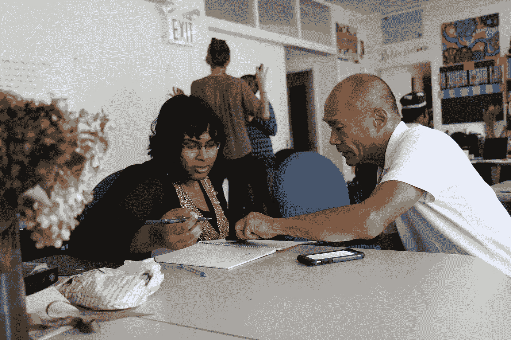

# 给新创业者和苦苦挣扎的企业的 13 条创业建议。(数字 1-6)

> 原文：<https://medium.datadriveninvestor.com/i-started-at-28-opening-my-first-company-from-scratch-a6e671c2453a?source=collection_archive---------24----------------------->

我从 28 岁开始，从零开始开了我的第一家公司。前四年我们做了 300 万美元、800 万美元、1200 万美元和 1400 万美元。在整个过程中，我们每年增加 75 名员工，同时几乎每天都在实施新的政策、程序、操作标准、路线和系统。有了这样的经历，我谦卑地向任何有抱负的、奋斗中的或新的企业家提供这十条建议。

需要注意的是，这些没有特定的顺序:

# 提示 1。找一个导师

Photo by [Monica Melton](https://unsplash.com/@monicomelty?utm_source=unsplash&utm_medium=referral&utm_content=creditCopyText) on [Unsplash](https://unsplash.com/s/photos/mentor?utm_source=unsplash&utm_medium=referral&utm_content=creditCopyText)

为愿意教你的人工作。找一个能让你提问并给你好答案的人。从做过这件事的人那里寻求建议是很重要的。有许多想要创业的人，也有积极、善意的人，他们相信自己对什么是创业有所了解。相信我；如果他们没有经历过，他们不知道。

 [## 在创业之旅中，拥抱学习|数据驱动的投资者

### 好像建立一个数百万美元的公司还不够困难，企业家必须额外照顾他们的…

www.datadriveninvestor.com](https://www.datadriveninvestor.com/2018/10/16/on-the-entrepreneurial-trek-embrace-the-learning/) 

# 技巧二。相信你是超人

相信你能克服任何逆境；征服一切竞争；战胜你面前的每一个困难，战胜你遇到的每一件事情。你是不可摧毁的。不仅有生存的能力，还能繁荣发展。

Photo by [TK Hammonds](https://unsplash.com/@tkristin?utm_source=unsplash&utm_medium=referral&utm_content=creditCopyText) on [Unsplash](https://unsplash.com/s/photos/superman?utm_source=unsplash&utm_medium=referral&utm_content=creditCopyText)

如果你失败了，一切都出错了呢？坚强起来，用同样的方法重新开始。你一定要成为超人！

# 技巧三。利用机会

成功就是寻找机会，并有勇气去尝试和利用它们。我们以后会谈到做你喜欢的事情，但是寻找机会是我看到大多数人成功的地方。它们会从你想象不到的方向出现。

# 技巧四。准备好牺牲。

你可能在吃剩饭，错过电影或活动，在假期工作，等等。成为一名企业家需要做出重大牺牲。这并不意味着你不能远离工作，但这需要努力。

此外，要明白你所做的牺牲并不是你失去了什么，而是你为自己和家人的未来所做的重大投资。

(旁注:我不相信我有一分钟后悔过下海。我喜欢挑战和生活方式。我确实后悔过自己一路走来所做的决定，但从未跳过这一步。

# 技巧五。只把时间花在能带来即时价值的事情上。

在那些早期你买不起别的东西。

不要因为制作 YouTube 视频或付费参加研讨会而分心。不是说在某个时候你不会想要这些，但是对于大多数新业务来说，销售来自于面对面和口头互动。没有什么能取代好的、老式的谈话。唯一需要注意的是高管团队或导师。一旦决定创业，马上找一个。

Photo by [Markus Spiske](https://unsplash.com/@markusspiske?utm_source=unsplash&utm_medium=referral&utm_content=creditCopyText) on [Unsplash](https://unsplash.com/s/photos/breaking-technology?utm_source=unsplash&utm_medium=referral&utm_content=creditCopyText)

在每个人都开始叫嚷在线广告的重要性之前，我已经看到相当一部分公司在等待他们的“在线存在”建立的时候倒闭了。不要以为你需要的只是一个网站和一些脸书广告，顾客就会找上门来。与普遍的看法相反，这对于许多人来说还没有成为现实。在线是一个工具，但只是工具箱中的一个。

性格内向的人会发现这很难，因为互联网在你和客户之间架起了一堵舒适的墙。同样，对于大多数公司来说，这并不是现实。网络可以帮助推动销售，但个性和关系是最关键的。

# 6.经营企业的大部分知识都是通过实际操作获得的。在大多数行业，教育不会让你走得很远。

正规教育很好，会有所帮助，但它既不是必要的，也不会让你走得很远。你必须经历工作才能接受教育。这些年来，有很多受过良好教育的人为我工作。我没有受过正规教育或培训。我所拥有的是一生的现实生活经验和在痛苦中学习的意愿。

这些是我给新创业者和企业的 13 条建议中的第 1-6 条。期待未来几天发布的 7–13。同意还是不同意？请让我知道，因为我感谢所有的意见和建议。

【关于我的更多信息，请到 jerrybrazie.com 链接到我的播客，我们的脸书组在 Jerry Brazie 商业页面，我的脸书组在 Jerry Brazie 播客组页面，以及 Twitter 和 insta gram[*@ jerrybrazie*](http://twitter.com/jerrybrazie)*。*