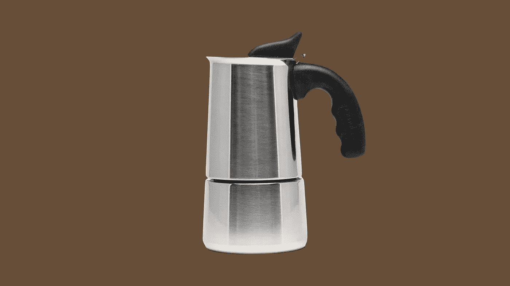
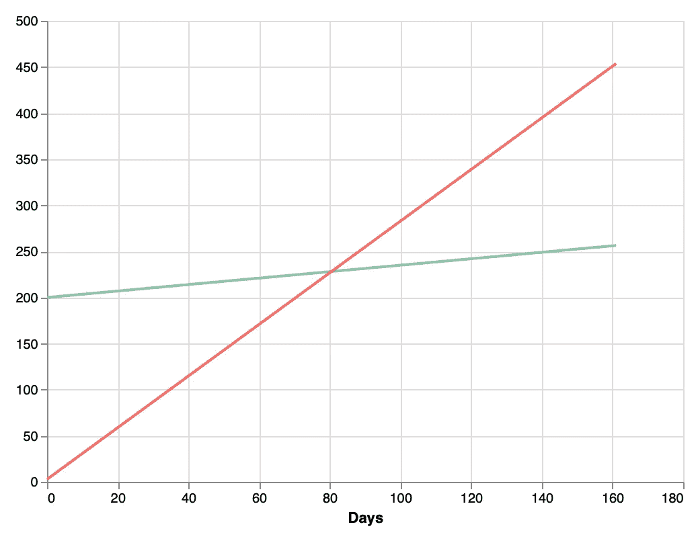

# 通过购买一台新的咖啡机，我开始每年节省 1000 美元

> 原文：<https://medium.datadriveninvestor.com/i-started-saving-1000-a-year-by-buying-a-new-coffee-machine-b6bdb917babf?source=collection_archive---------18----------------------->

我如何开发一个 Streamlit 仪表板来计算新投资的节省和出租能力。



我最近做了一个案例研究，买了一个新的咖啡机来代替我的胶囊咖啡机。我想要一个全谷机，因为它味道更好，我发现的结果是，如果我买了它，我会节省很多钱。

所以就买了。

问题是，当我把这件事告诉我的朋友时，他们不相信我存了那么多钱。所以我决定做一个仪表板给他们看。你可能会想:“真是浪费时间”，但如果你在学习，时间是不会浪费的。所以我把这个项目看作是学习 [Streamlit](http://streamlit.io/) 的一个机会，我听到了很多关于它的抱怨。

我现在理解这种忙乱，因为我在一个早上完成了这个项目**。是的，两到三个小时。很神奇吧？**

你可以看看[最终产品](http://coffee-rentability.herokuapp.com/)，现在我将分享这个过程(它部署在 Heroku，所以拿一件外套，等待冷启动)。

# 计算

首先，我们需要计算新机器中一杯咖啡的**成本。要做到这一点，我们只需输入一袋谷物的成本和我们能从袋子里得到的杯子数量。**

```
cost_of_cup = bag_cost / number_of_cups_per_bag
```

要计算每天的**成本**我们只需要用每杯咖啡的成本乘以我们每天喝的咖啡数量。

```
cost_per_day = cost_of_cup * number_of_cups_per_day
```

有了这些信息，我们可以计算从购买之日起两台机器的**累计成本**:

```
cummulative_cost = machine_cost + (cost_per_day * number_of_days_since_purchase)
```

通过这个函数，我们得到了下面的图表:



Cummulative cost of new machine (green) and current machine (red)

两条线相交的地方就是我们开始存钱的时候。正如你所看到的，在短短的 3 个月内，你开始节省了很多钱。

你可以试试我做的[仪表盘](http://coffee-rentability.herokuapp.com)里你自己的数据，开始自己省下一大笔钱。

# 我的想法

Streamlit 是一个 Python 库，允许您用几行代码创建一个仪表板。这既有好处也有坏处:

## 好东西

1.  在很短的时间内做出好看的产品非常简单容易。
2.  它与最大的绘图提供商兼容(不是 Seaborn，但你可以绕过它)。
3.  缓存方法非常有用。它只加载数据集或您决定的信息一次。这使得应用程序的响应速度更快。

## 不太好的事情

1.  您不能个性化样式。不能改变字体或颜色，坚持简单的降价风格，这很烦人。
2.  基于前面的缺点，它不适合专业外观的仪表板。

*你可以在这里查看代码[。](https://github.com/danicrg/coffee-rentability)

*如果你好奇，这里有咖啡机的[链接](https://amzn.to/2HbXDtn)。