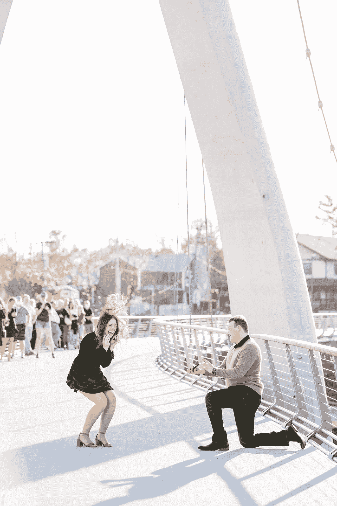
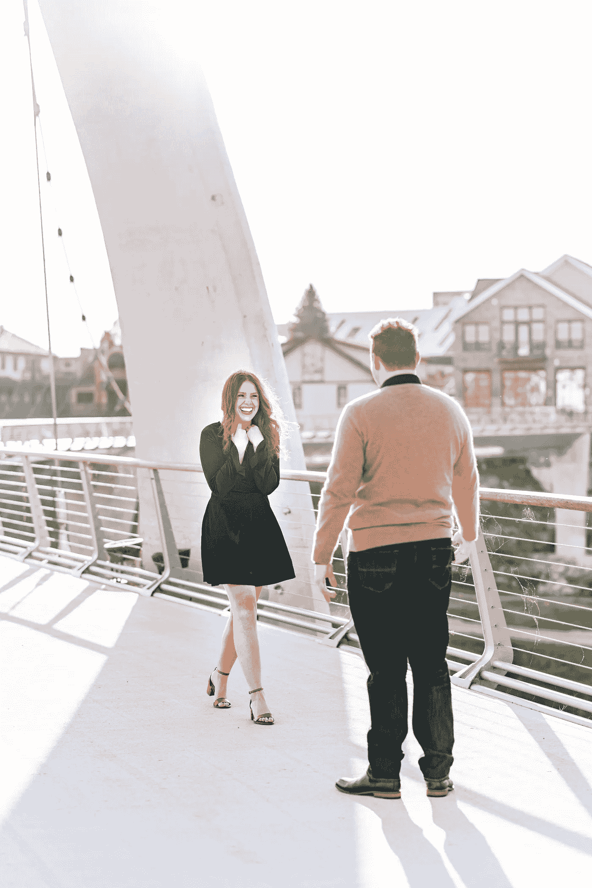
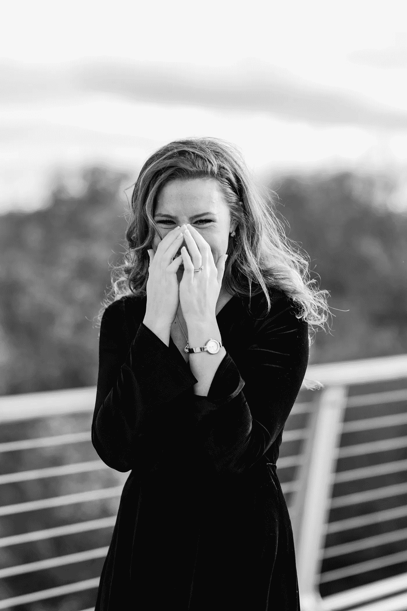
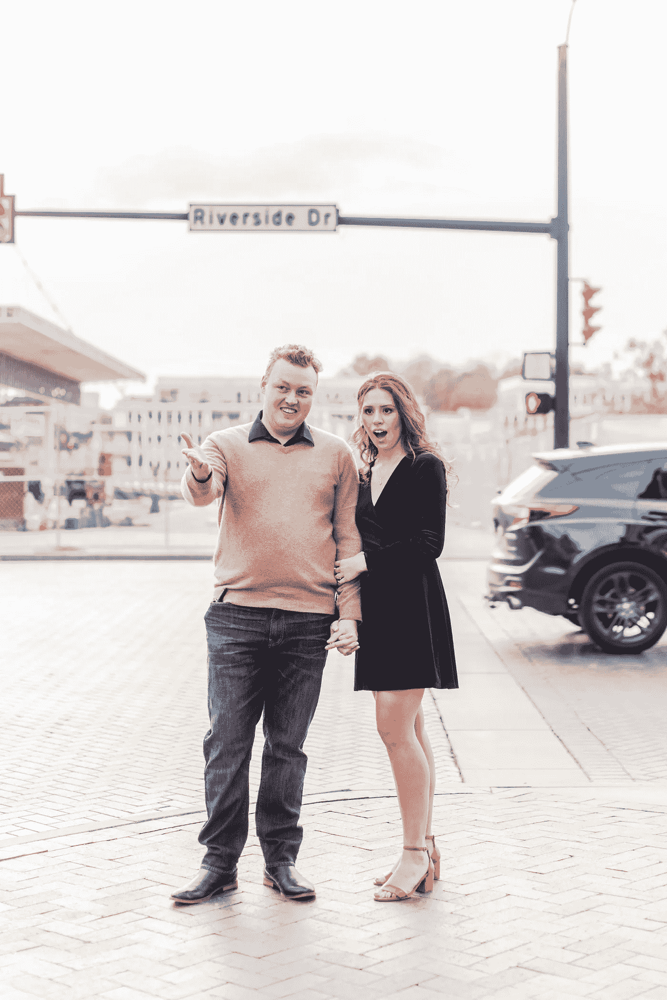
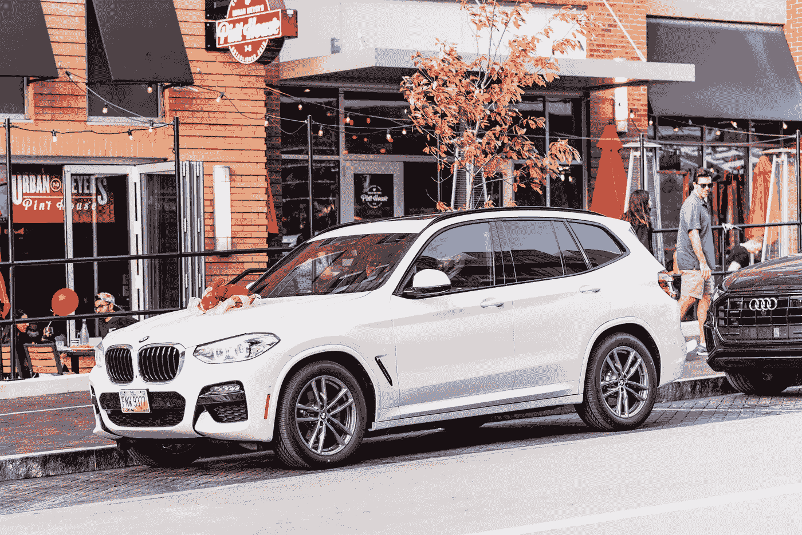
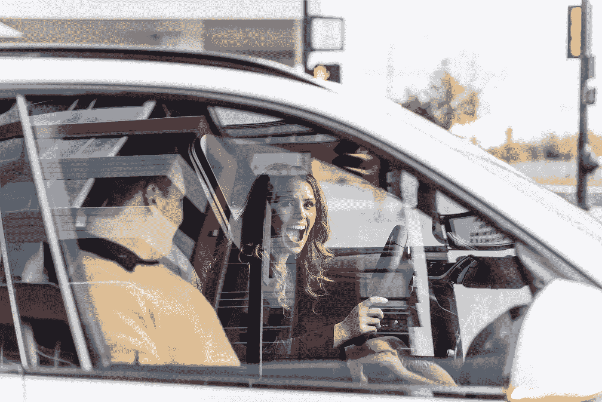
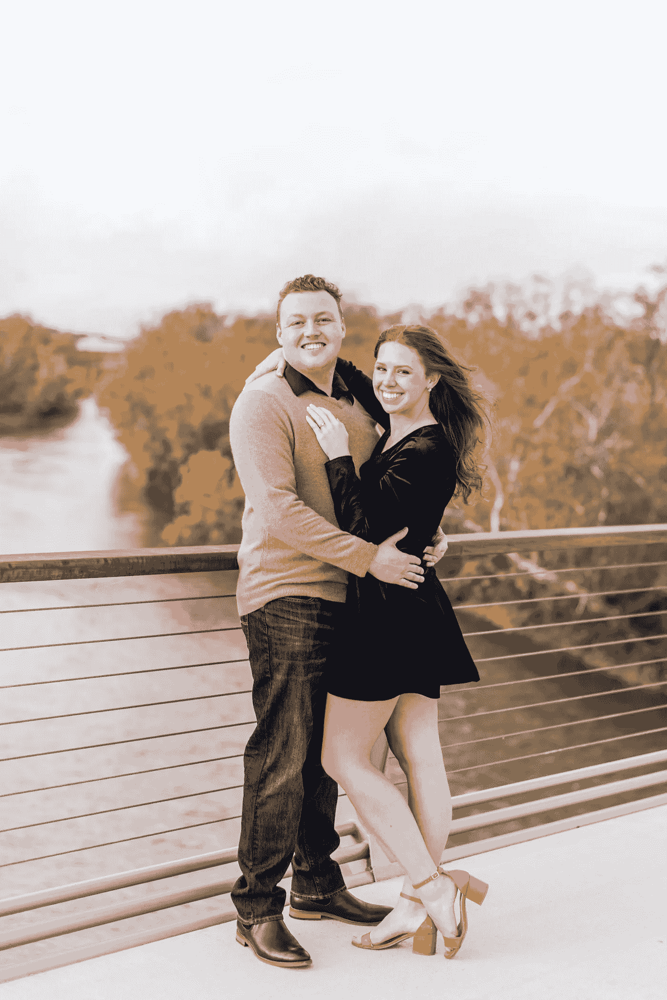

# 我用一辆宝马 X3 给我的新未婚夫一个惊喜

> 原文：<https://medium.datadriveninvestor.com/i-surprised-my-new-fianc%C3%A9-with-a-bmw-x3-c468edce0156?source=collection_archive---------0----------------------->

She said Yes

这是 2019 年夏天的一个非常闷热的晚上，大约在 6 月中旬。按照标准程序，我穿着蓝色超柔拉夫劳伦西装，浅棕色切尔西靴。我扑通一声坐在长凳上，向下看着长长的看台。我们在看棒球比赛，我看到了一些新面孔。我认出了一个红头发卷发的人，她正在有点戏剧性地和似乎是她姐姐的人说话。感兴趣的是，我靠在长椅上，开始和她和她的妹妹交谈。为了给她留下深刻印象，我开始吹嘘佩恩集团。她的回答是，她有多项业务，我应该问她是否需要帮助。我就在那里求婚了。开玩笑而已；她的无礼给我留下了深刻的印象，但我决定不再谈论这个话题。她喜欢说我叫她专业的“走开”，这当然是真的。我不知道我刚刚遇见了我的妻子。

快进到大约一年后的 7 月，我带着摩根去堪萨斯城看望我的家人。这是一个关键的考验，因为我的直系亲属包括一名律师、一名工程师和一名空中交通管制员。不是最容易相处的一群人。和家人度过了美妙的一周之后，我开始意识到摩根就是我的真命天子。我以前没有带多少女孩来家里，但她表现得很自然。我的家人很崇拜她。最后一天晚上，我去找我姐姐，向她要钻石。我已故的母亲从我父亲那里得到了一对钻石耳环作为周年纪念礼物。当她去世的时候，我们同意每一对耳环中的一个将用于我们未来妻子的订婚戒指。我姐姐把耳环给了我，在那个时候，我知道我需要开始认真对待和我女朋友结婚的事情。

到 10 月中旬，我已经协调了近 2 个月的极其复杂的参与计划。快到比赛日了。我雇了一名摄影师，预定了一家很棒的意大利餐厅，订购了她的宝马，并为我的兄弟姐妹们预订了机票。一切都井井有条。在订婚的前一周，我们遇到了一个大麻烦。摩根非常敏锐，开始怀疑她马上就要订婚了。她的姐姐问她是否愿意在订婚那天放下工作，和她以及她的姐妹们一起过一个“女孩日”。摩根知道我想在秋天求婚。我们需要一个幌子来阻止摩根破坏计划。

订婚那天早上，摩根把我和我的朋友送到了机场。我们计划飞往佛罗里达度周末。她用我的车送我们去那里，我告诉她周末可以用车。为了进一步推销诱饵，一个朋友帮我把她崭新的宝马 X3 停在机场，作为我们逃跑的车。她把我们放下后，我们乘机场班车去停车场取回了 X3。下午两点，我的家人从堪萨斯飞来给她一个惊喜。一切准备就绪。

下午 5 点，我手持双向收音机，站在俄亥俄州都柏林高档区的一座吊桥上。她的姐姐带她去做头发和化妆，负责把摩根送到桥的西边。我决定在桥上求婚，因为我觉得这象征着她要离开过去的生活，和我开始新的生活。我用双向无线电与她的新车司机联系，这样它就能及时开过来。大约 5 点 15 分，摩根和她的姐妹们开始走过桥，慢慢向我靠近。我用无线电发出“老鹰正在接近”，这意味着她在桥上。

Morgan saw me on the bridge waiting for her.

她在桥上遇见我时对我说，“你不应该在这里。”我问她是否记得我给她订婚暗示时告诉她的话。第一个暗示是指这座桥。她不记得了，因为那一刻太激动了。我解释了这座桥的象征意义，然后拿出了戒指。我跪下来说:“那么，摩根，你愿意嫁给我吗？”她跳上跳下，答应了。一些随机的陌生人走过桥，组成了一小群人来见证订婚。当我把戒指戴错手指时，他们开始欢呼起来。摩根很快纠正了我，这让我把戒指戴在了正确的手指上。毕竟这是一个 50%的机会。我用无线电呼叫“贵宾 1 号和贵宾 2 号”就位。我的家人飞来给她一个惊喜，被护送到桥上，然后跳了出来。

Her reaction when she saw my family there to surprise her.

在我们拍了数量惊人的照片后，我让桥上的所有人以及摄影师去捕捉真相:用一辆宝马 X3 给我的新未婚夫一个惊喜。我在无线电里大喊“鸡蛋在篮子里”，意思是:把车开到指定位置。我们穿过街道，汽车开了过来。这是她看到那辆车时的反应:

Morgan saw her BMW X3 the first time.

The new car, driven by my friends in black suits.

Morgan driving her brand new BMW X3.

Meet The (Future) Harmans