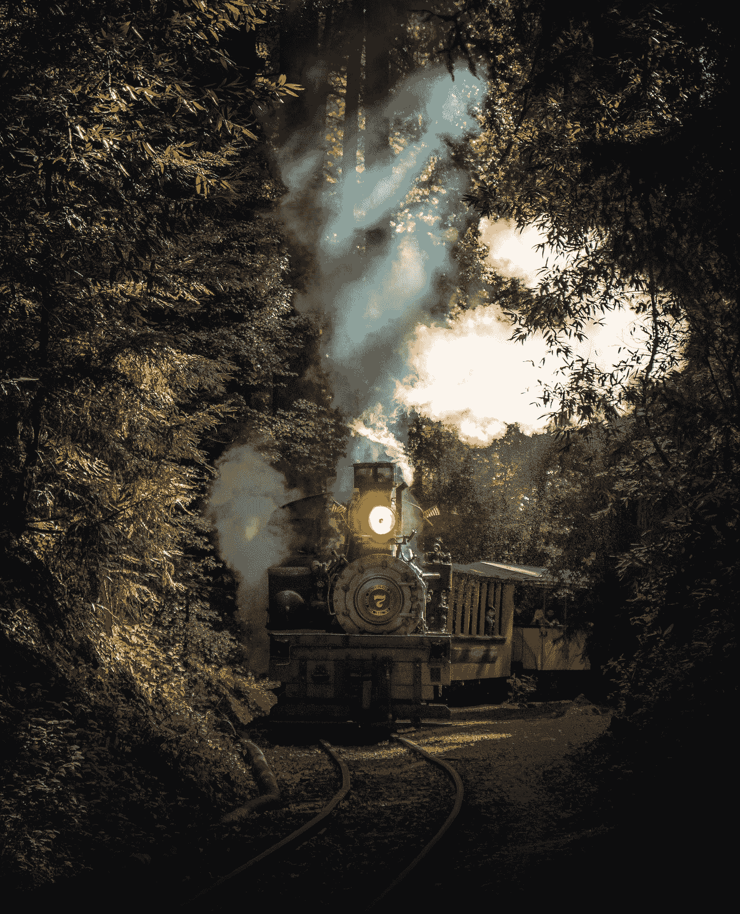

# 我想我能，我知道我能

> 原文：<https://medium.datadriveninvestor.com/i-think-i-can-i-know-i-can-43e83ace3d1b?source=collection_archive---------20----------------------->

## 关于我攀登写作高峰的思考

Disney pics are like… super copyrighted. Photo by [Casey Horner](https://unsplash.com/@mischievous_penguins?utm_source=medium&utm_medium=referral) on [Unsplash](https://unsplash.com?utm_source=medium&utm_medium=referral)

你读过《小引擎》吗？

不要破坏任何人的百年老故事，但在这个故事中，一个小引擎不得不拉着一系列汽车爬上一座大山。他开始一遍又一遍地唱“我想我能，我想我能”，很快就变成了“我知道我能，我知道我能”。

或者如果你喜欢小飞象版本，“我想我可以。”

对你来说，引擎最终会超越顶峰可能并不奇怪。

在我博客旅程的两个月里，我发现自己在引导这个小引擎。我正拖着自己爬上一座大山，提醒自己我能做到，我能越过顶峰，成为一名“作家”。

但是该死的，现在很难爬上这座山。

最初为自己而不是为客户写作的兴奋感已经消退。我越来越不可怕，但不是幻想的观点和阅读我的文章。我的灵感源泉已经慢慢变成了涓涓细流。

一天写一篇文章突然感觉很像工作。

我知道这是我旅程的一部分，很多文章都警告过我。这是事情变得困难的时刻，许多人放弃了。我知道答案是通过让我的追随者参与进来，学习我的手艺，建立关系网，拓展和写作，直到我的手指流血。

我知道，如果我做到了这一切，“我想我能”就会变成“我知道我能”。

在那之前，我只要不断提醒自己，我是那个可以做到的小艾米丽。