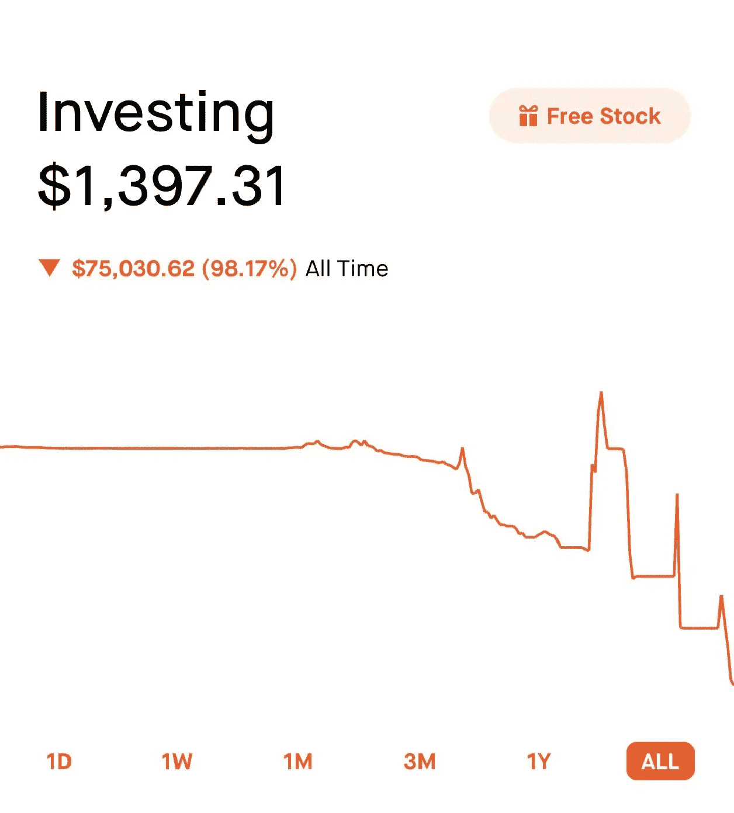

# 我接受了 Reddit 上陌生人的投资建议

> 原文：<https://medium.datadriveninvestor.com/i-took-investment-advice-from-strangers-on-reddit-8b7f1408e610?source=collection_archive---------3----------------------->

www.reddit.com/r/wallstreetbets

## 迷因股票能赚钱吗？

当冠状病毒疫情在今年年初来袭时，全球经济陷入停滞。在不确定性中，投资者逃离股市，道琼斯工业平均指数在 2020 年 2 月 12 日至 2020 年 3 月 11 日期间下跌了 8000 点。

自那以来，股市一直在大幅上涨，标准普尔 500 完全抹去了今年早些时候的损失，目前处于历史高点，今年回报率为+15%。虽然+15%的回报率并不值得你嗤之以鼻，但今年为投资者创造最大回报的却是个股，比如:

*   特斯拉—今年迄今增长了 579%
*   Peloton —今年迄今增长了 303%
*   Etsy —年初至今增长了 224%

这只是少数几家今年提供了出色回报的公司，名单还在继续。等等，等等，等等。

# 沃伦·巴菲特，认识一下华尔街投资者

在股市崩盘的几周前，我正准备把以前工作时的养老金转移到一个单一账户中，这个账户很容易取用。这给了我适量的钱来投资。

我开始尽可能多地阅读有关投资的书籍。无论是在《市场观察》、《商业内幕》还是《华尔街日报》,我都尽可能多地吸收有关投资股票的信息。不久之后，我发现了 r/wallstreetbets。

华尔街 Bets 是你在 Reddit 上能找到的最有趣的社区之一。它被描述为“想要赚钱并在赚钱时得到乐趣的人”的子编辑，你会发现大多数帖子都包含迷因、火箭表情符号，或许还有一些关于特定股票的信息。社区中的许多人承认对他们投入资金的公司**一无所知**，他们只是跟着“炒作”走——把钱投入讨论最多的股票。

发布“盈利色情”或“亏损色情”是受到高度鼓励的，事实上，这个社区唯一比那些赚了一船钱的人更喜欢的事情就是看着某人**失去**一切。

Screenshot by the author

在高风险交易中遭受巨大损失被认为是一种荣誉——但如果你最终没有损失 100%的投资组合，那么被称为“手无缚鸡之力的家伙”可能是对你最好的称呼。

这是一个非常奇怪的地方，不适合胆小或容易被冒犯的人。

 [## 另类投资——它们在后疫情时代的角色|数据驱动的投资者

### 全球疫情的经济影响继续波及全球各行各业。的…

www.datadriveninvestor.com](https://www.datadriveninvestor.com/2020/10/27/alternative-investments-their-role-in-the-post-pandemic-landscape/) 

# 我的 Reddit 实验

考虑到我在页面上看到的一些惊人的回报，我决定进行一次实验。我把我投资组合中的一小部分指定为我的“该死的基金”——我不在乎我是否会完全失去这笔钱，并决定在几周内密切关注这一页面，特别是寻找那些被谈论得最多的股票。

没过多久，我就有了两个竞争者:*尼奥*和 *PLTR* 。我对这两家公司的所作所为一无所知，我只知道华尔街的 Bets 社区对他们口吐白沫，他们被期望“去月球”。对于外行人来说，“上月球”这个短语指的是一只股票的股价大幅上涨，通常伴随着一个或多个火箭表情符号。

请放心，两人都有超过公平份额的火箭表情符号，所以我决定把我的钱分给他们，购买了以下物品:

*   我在 11 月 9 日以每股 15.27 美元(包括费用)的价格购买了 *PLTR*
*   11 月 10 日，我以每股 42.74 美元(包括费用)的价格购买了 NIO

# 那么，结果如何呢？

三个星期过去了，我还没有成为百万富翁，但我相对来说很高兴:

*   *PLTR* 经历了一次辉煌的运行，达到每股 33 美元左右的峰值，比我最初支付的价格高出两倍多。随着股票小幅下跌，我卖掉了最初的投资，以防止任何损失，但仍持有一些股票。在撰写本文时，PLTR 的交易价格约为每股 24 美元。
*   在我购买后，NIO 继续上涨，最高时达到每股 55 美元，比我最初的投资上涨了大约 30%。从那以后，股票价格略有下降，但我仍然乐观。在撰写本文时，NIO 的交易价格约为每股 46 美元。

当然，跟随网络上随机出现的陌生人推送的“迷因”股票赚钱是有可能的。这两只股票的价格增长速度大大高于你可以从标准普尔 500 每年预期的 8%。

*然而。*

购买“迷因”股票不是投资。是**赌博**，就应该这样对待。我没有声称自己有高超的交易技巧或知识。我买了我一无所知的股票，因为我很好奇跟着炒作能得到什么。

用这种方式赚钱看起来很容易。但是，虽然我似乎有相当好的运气，我也可能很容易失去一切。事实上，在 PLTR 达到顶峰后的几天里，红迪网上到处都是愤怒的个人发帖，他们以每股 33 美元的价格买入，却眼睁睁地看着自己的投资在接下来的几天里缩水了三分之一。

听从网络陌生人的建议能赚钱吗？是的。

你会轻易失去一切吗？*也是，是的。*

我会推荐你试试吗？*绝对不是。*

*本文内容不构成投资建议。*

29 岁的作家乔恩·彼得斯与妻子和两个孩子住在英国康沃尔。如果你喜欢这件作品，你会喜欢我的其他作品，你可以在这里找到****。感谢阅读。****

## **访问专家视图— [订阅 DDI 英特尔](https://datadriveninvestor.com/ddi-intel)**