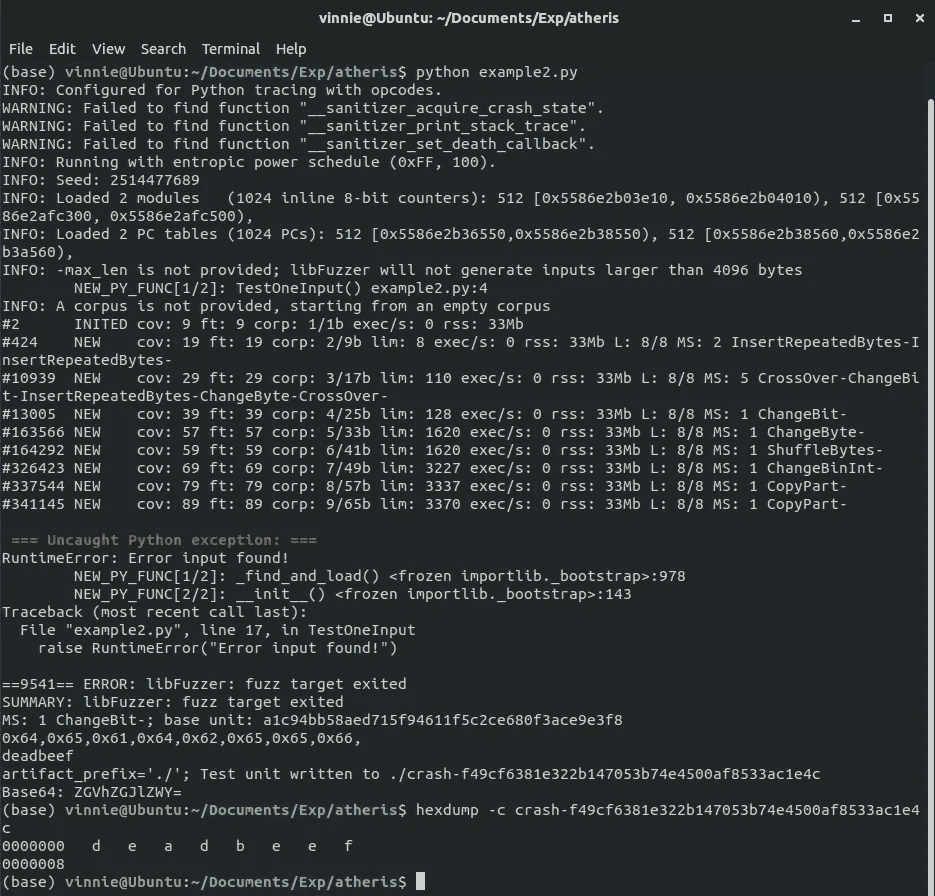

# 我尝试了谷歌的新 Python fuzzer: Atheris

> 原文：<https://medium.datadriveninvestor.com/i-tried-googles-new-python-fuzzer-atheris-f0b8b667794?source=collection_archive---------4----------------------->


[Atheris viper](https://pixabay.com/photos/green-buschviper-atheris-squamigera-1571957/)

模糊化是最近最流行的自动查找 bug 的方法之一。而像[美国 Fuzzy Lop](https://github.com/AFLplusplus/AFLplusplus) 、[hongfuzz](https://github.com/google/honggfuzz)等 fuzzers。主要关注 C/C++代码，直到现在 Python 还没有突破。最近，谷歌开源了他们的 Python fuzzer [Atheris](https://github.com/google/atheris) ！

你可以在这里阅读他们的博文:[宣布 Atheris Python Fuzzer](https://opensource.googleblog.com/2020/12/announcing-atheris-python-fuzzer.html)

在我开始之前，让我快速解释一下关于 fuzzing 的一些事情。每次我告诉我的朋友我在研究 fuzzing/fuzzers，10 次中有 8 次我得到的回答是“哦，是的，我知道模糊逻辑”。如果你是这些人中的一员，请花几分钟时间阅读下一节中的一些定义，然后再继续，否则你可以跳到下一节。

## 起毛/起毛器:什么和类型？

模糊测试是发现软件中的错误或漏洞的有效方法。用来模糊的程序叫做模糊器，被模糊的程序就是我们的目标。模糊器通常在观察目标程序的行为时开始向其输入随机输入。每当目标崩溃时，fuzzer 会将导致崩溃的输入作为 bug 报告给用户。

有不同种类的起毛:

**黑盒模糊化:**在没有关于被模糊化代码的信息的情况下进行模糊化。

**白盒模糊化:**这里的模糊化器知道目标的完整结构，主要遵循符号执行。

**灰箱模糊化:**模糊化器知道目标的部分信息，主要度量代码覆盖率。

灰盒模糊化的有趣之处在于，每当模糊化器发现一个生成唯一代码覆盖的新输入时，它会保存这个输入，以便在下一次迭代中进一步变异它。这被称为**覆盖引导的模糊化**。

# atheris:Python fuzzer

Atheris 是第一个覆盖导向的 Python fuzzers 之一。这意味着，模糊器测量代码覆盖率，并在执行过程中观察目标程序，记下导致独特执行行为的输入。

Atheris 是一个高性能的 fuzzer，支持本地和纯 Python fuzzing。但我迫不及待想探索的功能是它的*差分模糊*！顾名思义，fuzzer 试图找出两个不同库的行为差异，这两个库打算做同样的事情！！
(我会单独写一篇关于微分模糊化的帖子。)

## 装置

我在我的 Linux 机器上试了 Atheris，安装很简单。

```
pip install atheris
```

是的，就这样。如果你在 MacOS 上(很快会尝试)，你需要安装完全成熟的 Clang，而不是苹果发布的残缺版本，因为 Artheris 利用 [libFuzzer](https://llvm.org/docs/LibFuzzer.html) 进行代码覆盖和输入生成。
Atheris github 上的安装说明简单易懂。

## **我们开始起毛吧**

Atheris github 页面和 blogposts 上给出的例子很少。先试用一下吧！

**示例程序 1:**

```
import atheris
import sys

def TestOneInput(data):
  if data == b"bad":
    raise RuntimeError("Badness!")

atheris.Setup(sys.argv, TestOneInput)
atheris.Fuzz()
```

将上述程序保存在您的计算机上。比如我保存为 *example1.py*

在上面的例子中，我们模糊了函数“TestOneInput ”,它接受一个参数。如果参数为“bad ”,程序将抛出一个 RuntimeError！

运行 fuzzer 很简单。只要执行代码！

```
python ./example1.py
```

如果到目前为止您做的一切都是正确的，您将会看到 fuzzer 会在几秒钟内找到导致 RuntimeError 的输入，并将其写入文件。


Fuzzing the example1.py program

在对生成的文件进行 hexdump 时，您会看到单词“bad”


hexdump on crash log

**示例程序 2:**

虽然最后一个程序相当简单，但为了测试 fuzzer 的代码覆盖能力，让我们尝试用一些嵌套的 if 语句进行 fuzzing。这个想法是模糊器必须浏览 if 语句来找到 bug。为此，我使用以下程序:

```
import sys
import atherisdef TestOneInput(data):  # Our entry pointif len(data) != 8:
        returnif chr(data[0]) == "d":
   if chr(data[1]) == "e":
      if chr(data[2]) == "a":
          if chr(data[3]) == "d":
             if chr(data[4]) == "b":
                if chr(data[5]) == "e":
                   if chr(data[6]) == "e":
                      if chr(data[7]) == "f":
                         raise RuntimeError("Error input found!")atheris.Setup(sys.argv, TestOneInput)
atheris.Fuzz()
```

将上述代码保存为 *example2.py*

在上面的程序中，fuzzer 必须在嵌套的 if 语句中导航，并找到单词“deadbeef”来找到 bug。检查每个字符后，将测试 fuzzer 的代码覆盖能力。

当我运行程序时，阿瑟毫不费力就找到了漏洞。



在打印的摘要中，我们甚至可以注意到用于导航分支的突变类型。崩溃文件上的 hexdump 显示了我们期望的输入:)

# 结论

Atheris 支持模糊化 Python 代码和 Python 2.7 和 Python 3.3+中的原生扩展。然而，为了获得更好的覆盖性能，建议使用 Python 3.8+版本。

随着 fuzzing 成为主流测试技术，许多项目都是用 Python 编写的，Atheris 无疑是对现有的基于覆盖率的 fuzzers 列表的一大补充。此外，谷歌已经宣布 Atheris 将很快成为 OSS-Fuzz 的一部分！

快乐起毛！

干杯！