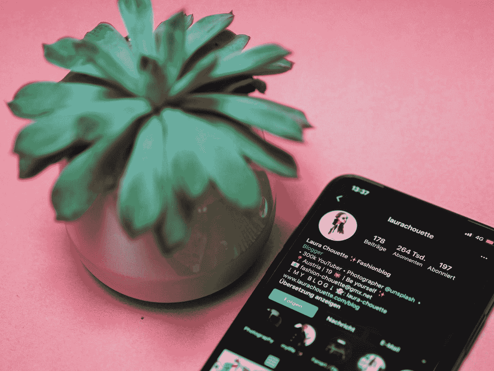

# 我在 Instagram 上试过 Follow-Unfollow 方法

> 原文：<https://medium.datadriveninvestor.com/i-tried-the-follow-unfollow-method-on-instagram-67a4b7106db9?source=collection_archive---------0----------------------->

## 正如我所料，这是浪费时间。

Photo by [Laura Chouette](https://unsplash.com/@laurachouette?utm_source=medium&utm_medium=referral) on [Unsplash](https://unsplash.com?utm_source=medium&utm_medium=referral)

follow-unfollow 方法大概是 Instagram 上生长最常见的“黑客”了。

这个想法很简单:你关注你所在领域的很多账户，几天后你就不再关注它们了。

这种方法在 Instagram 上已经使用多年，可以在平台上快速增长账户。事实是，这个方法很有效。一些账户通过这种方式每周增长数百名粉丝，他们很快获得了大量的社交证明。不用说，如果你想推出一家公司或一个品牌，如果 Instagram 应该是你的主要营销渠道，使用这种方法似乎是显而易见的。

 [## 影响者在聚光灯下表演|数据驱动的投资者

### 影响者营销是一个脱颖而出的游戏。结果是一个令人难忘的-和可信的-连接到一个产品或…

www.datadriveninvestor.com](https://www.datadriveninvestor.com/2020/01/15/influencers-perform-in-the-spotlight/) 

随着时间的推移，这种方法越来越少被使用，因为 Instagram 现在能够识别帐户是否使用这种技术。

然而，我注意到一些帐户仍然在使用它，一些“专家”仍然建议这样做。所以我决定尝试一下。

# **insta gram 上的跟随-取消跟随方法:它是如何工作的**

这项技术的要点是每天关注你所在领域的大量客户，同时希望这些客户会关注你，也希望这些客户将来会对你的内容感兴趣。

几天后，不管这些账户是否跟随你，你都要取消跟随。这样做可以降低你的关注率，让你的账户看起来更干净。这也有助于保持提要的可控性。

当你在 Instagram 上关注某人时，他们会收到通知。在查看他们的通知时，如果他们对你做的事情感兴趣，或者如果他们只是因为你先跟踪他们而感到跟踪你的社会压力，他们可能会查看你的个人资料并跟踪你。

理论上，这个方法看起来很棒，似乎很有效。但是它也有不好的一面。

# **为什么 Follow-Unfollow 方法会危及你的 Instagram 账户**

Instagram 不喜欢人们使用快捷方式和“黑客”来增加他们的帐户。

原因很简单:如果你能控制你的增长，你就不需要在 Instagram 上购买广告。

Instagram 正变得越来越难在该平台上发展，以推动用户付费，从而有机地恢复他们的影响力和参与度。

如果你使用“黑客”或任何其他类型的捷径来比其他人成长得更快，Instagram 将不会喜欢它，并将确保这种方法不再对你有效。

Instagram 现在可以检测你每天关注和取消关注的账户数量，如果他们认为你在一天或一小时内互动过多，他们会对你进行行动阻止。

如果你行动受阻，除了等待几个小时或几天之外，你不能再用你的帐户做任何事情，这取决于你受到的惩罚。

如果你经常被禁止行动，Instagram 甚至可以删除你的账户，使其永久无法访问。

基本上:你必须小心使用这种方法，因为它可能会产生非常严重的后果。

# **我在 Instagram 上关注和取消关注别人的经历**

我从一个我不再使用的旧 Instagram 主题页面开始。它拥有大约 27000 名粉丝。我又开始发帖向 Instagram 展示我是活跃的。

过了几天，发表了六篇文章后，我开始使用“不追随”的方法。

我全是用手做的。机器人似乎工作不太好，它们似乎吸引了你的帐户的大量注意力。所以我决定自己做，保持简单自由。

一开始我有点害羞，我没有每天关注很多账户。渐渐地，我开始每小时跟踪大约 20 个人。我有一段时间没有行动受阻。

我的第一个惊喜是这个方法奏效了。我很快平均每周有 250 个新粉丝，这相当不错。但我的参与率似乎更低。我的关注者数量在增加，而我的平均赞数是一样的。

几个星期后，在达到 35000 个追随者后，我决定停下来，看看我的账户在不遵循跟随-取消跟随方法的情况下会怎么样。那时我很震惊:我的参与度显著下降，我没有更多的追随者，我甚至失去了一些。

我从平均每张照片 450 个赞到 80 个赞，并且我每天失去大约 10 个粉丝。

我的账户变得隐形了。我没有在标签上排名。我没有出现在探索页面上。我被困住了；我的账户现在已经死了。

我试着比平时发更多的帖子。我尝试策划更好的内容；没有什么能让我回到我的参与度。

# **我对跟随-不跟随方法的想法**

我不得不说，我很惊讶地看到我的帐户增长如此之快。但是代价是什么呢？

一旦我停止使用这个方法，我的账号就死了，没有人会看到我的帖子。我留下了一个比我开始时更大的账户，但参与率很低，追随者甚至都没有留下来。

虽然我认为关注-取消关注方法可以帮助非常小的账户获得一些不错的曝光率(我说的是关注者少于 1000 人的账户)，但关注-取消关注方法似乎弊大于利。

主要的问题是，一旦你开始使用“跟随-不跟随”方法，你就会陷入困境，你必须继续使用这种技术，以免受到惩罚。你可能会说，没什么大不了的，但如果 Instagram 决定更严厉地惩罚这些账户呢？或者，如果他们现在可以使用这种方法立即禁止帐户，那会怎么样？此外，即使一周增长 250 名追随者相当不错，但过一段时间后，增长就会变得有限。你无法衡量追随-不追随的做法，你必须非常小心每天追随的人数，以确保你的账户不会被封禁。

follow-unfollow 方法只是一种捷径。它给你带来了快速的满足感，但从长远来看，它并不适合你的客户，而且它也不是在这个平台上成长的最佳方式。

你有没有觉得你在 Instagram 上尝试了一切去成长？希望接下来的事情是你实现目标的最后一件事。

在您的收件箱& **中获取[最好的 Instagram 成长知识](https://charlestumiottojackson.ck.page/regularmedium)立即免费下载我的 Instagram 小抄**。