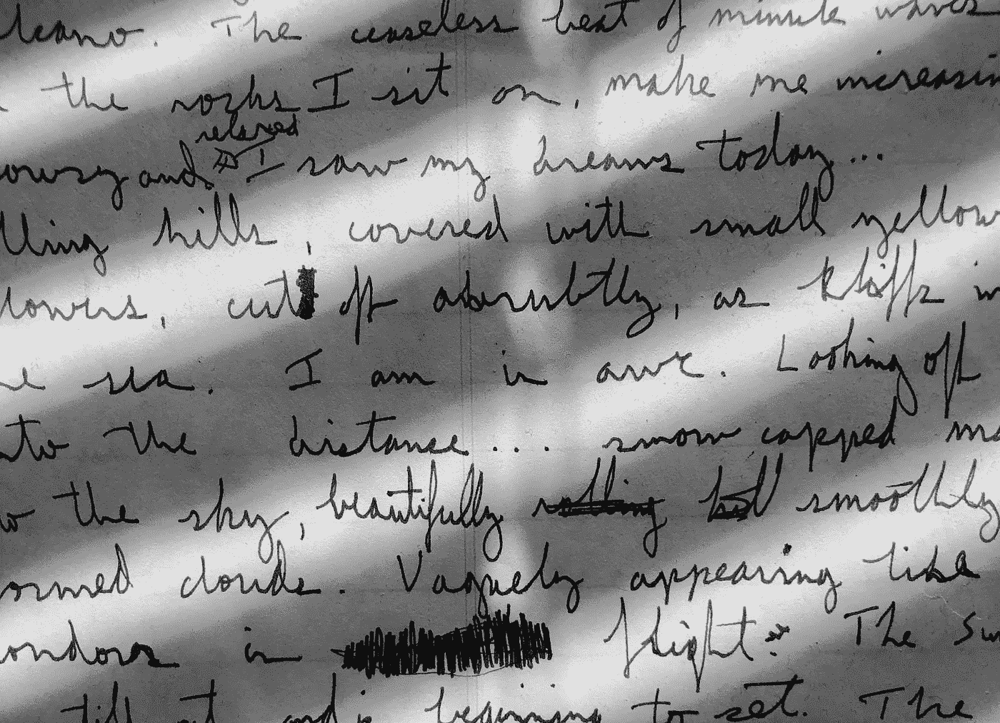
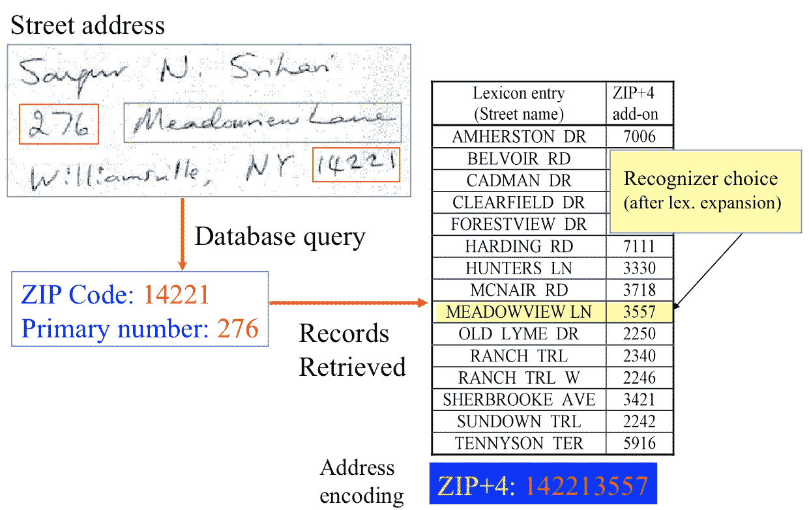
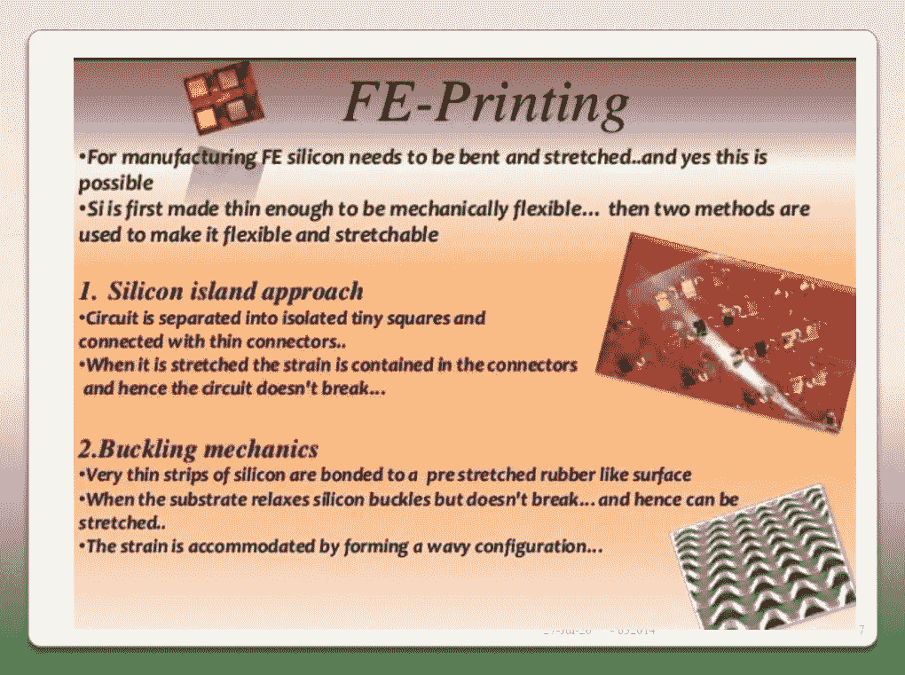
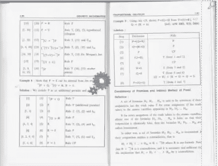
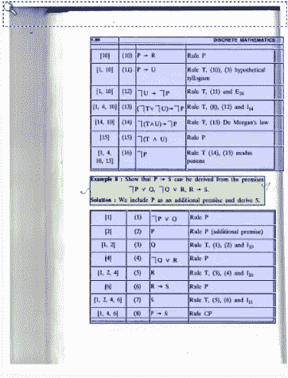
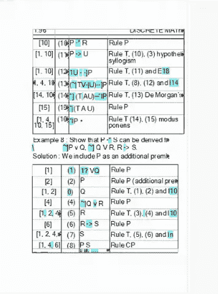

# 我在网上考试中使用了 OCR，这让考试变得非常简单

> 原文：<https://medium.datadriveninvestor.com/i-used-ocr-in-my-online-exams-and-it-made-them-remarkably-easier-9da545615b4c?source=collection_archive---------21----------------------->

Photo by [Wes Hicks](https://unsplash.com/@sickhews?utm_source=medium&utm_medium=referral) on [Unsplash](https://unsplash.com?utm_source=medium&utm_medium=referral)

## 大学生的救命恩人

当你带着一件只有你拥有而别人没有的武器在艰苦的磨砺中轻松前行时，那种感觉真好。

下面是我如何在我的在线考试中使用 OCR，并使它们对我来说变得容易得多，而其他人却为它们而奋斗。

# 首先，什么是光学字符识别，它的用途是什么？

OCR(光学字符识别)是一个基本的软件解决方案，可以将手写文本或图像文本转换为可编辑的文本。

也就是说，它能识别文本，你可以编辑它。一旦纸质文件经过光学字符识别处理，文本就可以用文字处理软件如微软的 word 进行保存、搜索和编辑。

(Cropped) Photo by [Micah Boswell](https://unsplash.com/@micahboswell?utm_source=unsplash&utm_medium=referral&utm_content=creditCopyText) on [Unsplash](https://unsplash.com/s/photos/text?utm_source=unsplash&utm_medium=referral&utm_content=creditCopyText)

在它可用之前，将印刷文档数字化的唯一选择是坐在电脑前重新输入，这需要很长时间，并且要对不准确性和人为错误做出妥协。

这是一项鲜为人知的技术，但却非常重要。它广泛应用于数据输入自动化、收费站和邮局的车牌识别。

## 邮局中的 OCR 示例:

[Lawrence87 at en.wikipedia](https://commons.wikimedia.org/wiki/File:Address_Recognition.png), CC0, via Wikimedia Commons

在美国邮政局，超过 95%的手写邮件都是自动分拣的。

## 它是如何工作的？

⬜⬜⬜⬜⬜⬜🔳🔳⬜⬜⬜⬜⬜⬜⬜
⬜⬜⬜⬜⬜⬜🔳🔳⬜⬜⬜⬜⬜⬜⬜
⬜⬜⬜⬜⬜🔳🔳🔳🔳⬜⬜⬜⬜⬜⬜
⬜⬜⬜⬜⬜🔳🔳⬜🔳⬜⬜⬜⬜⬜⬜
⬜⬜⬜⬜🔳🔳⬜⬜🔳🔳⬜⬜⬜⬜⬜
⬜⬜⬜⬜🔳🔳⬜⬜🔳🔳⬜⬜⬜⬜⬜
⬜⬜⬜🔳🔳⬜⬜⬜⬜🔳🔳⬜⬜⬜⬜
⬜⬜⬜🔳🔳⬜⬜⬜⬜🔳🔳⬜⬜⬜⬜
⬜⬜⬜🔳🔳⬜⬜⬜⬜🔳⬜🔳⬜⬜⬜
⬜⬜🔳⬜⬜🔳🔳🔳🔳⬜⬜🔳⬜⬜⬜
⬜⬜🔳🔳🔳🔳🔳🔳🔳🔳🔳🔳🔳⬜⬜
⬜🔳🔳⬜⬜⬜⬜⬜⬜⬜⬜🔳🔳⬜⬜
⬜🔳🔳⬜⬜⬜⬜⬜⬜⬜⬜⬜🔳🔳⬜
🔳🔳⬜⬜⬜⬜⬜⬜⬜⬜⬜⬜🔳🔳⬜
🔳🔳⬜⬜⬜⬜⬜⬜⬜⬜⬜⬜⬜🔳🔳

这里所有的方块代表屏幕上的像素。这是字母“A”的像素模式。OCR 引擎包含预装的每种语言的每个字母、数字和符号。

当它遍历文档时，如果某个特定字符的像素与任何预加载的字符非常匹配，它就会确认该字符。如果它不能确认字符(很少发生)，它会要求你输入，所以它得到训练。

# 我是如何使用 OCR 的——我的在线考试

## 我们的考试模式:

我们的在线考试是开放的互联网(可能你是第一次听说)。这意味着我们可以在互联网上寻找答案。然而，这并不像你想象的那么简单。试卷被设定到一个很高的水平，我们称之为 HOTS(高阶思维技能)。

为了写好试卷，我们必须对每个概念做好充分的准备。那些打算不学习，只是在考试时依赖网络的学生确实不及格。

## 我们的教员资料——它们看起来怎么样？

这是图片，不是文字。所以，如果出现一个关于‘硅岛方法’的问题，你不能按 Ctrl+F 并搜索关键字来获得正确的页面。

我知道，考试的时候在 2000 页中搜索一个话题是一件令人兴奋的事情。

## (非技术类)学生在考试中做什么？

我们的教员在材料部分上传了大约 30 份 PPT 和 pdf。我们至少要知道考试时要参考和写作的题目的位置。学生们将它们全部下载到一个文件夹中，希望他们能够在考试中找到正确的页面。

PPT 包含大量信息，其中大部分不是文本，而是图像。所以，他们没能及时找到正确的答案，后来他们非常后悔。尽管对优秀的学生也有例外。

# 我做了什么来克服这一切？OCR！

我用的是 [Abbyy FineReader 15](https://pdf.abbyy.com/) ，这是 OCR 处理最强大最准确的工具之一。我在 OCR 编辑器中合并并打开我所有的 pdf 和 PPT，它会扫描文档上的每个小点。

如果文档的图片是水平的或倾斜的，该软件还可以校正文档的方向。现在，我可以很容易地搜索一个词，它会把我带到那个页面。

这需要大量的时间、电池和处理能力。在这个过程中，我的笔记本电脑也会有点发热。最终的 pdf 非常大(大约 200-300 MB ),因为它现在增加了许多细节。

# 看起来怎么样？

## 在处理过程中:

## 最终输出:

Before and after processing the document

教科书的照片现在被转换成可搜索和可编辑的文本。现在你搜索一些单词，它会把你带到那个页面。

## Abbyy 离线工作–仍然强大:

Screenshot from Google Photos

你也可以在谷歌照片和镜头中进行在线光学字符识别。Abbyy 只能离线执行令人难以置信的 OCR。在线 OCR 引擎没有这个强大。该软件基于人工智能和人工智能工作，并已在大量训练数据上进行训练。

所以出错的几率非常低。如果你发现一个错误，你也可以向他们报告，这样他们会再次训练软件，并在下次更新时解决错误。

Photo by [Isabella and Louisa Fischer](https://unsplash.com/@twinsfisch?utm_source=medium&utm_medium=referral) on [Unsplash](https://unsplash.com?utm_source=medium&utm_medium=referral)

它并没有在考试中直接给我答案，但却让我在两个小时的紧张时间里更容易找到答案。所以，它帮了大忙。

在我在线考试的用例中，这就是 OCR 的简单定义和作用。希望…不是希望。你很享受。