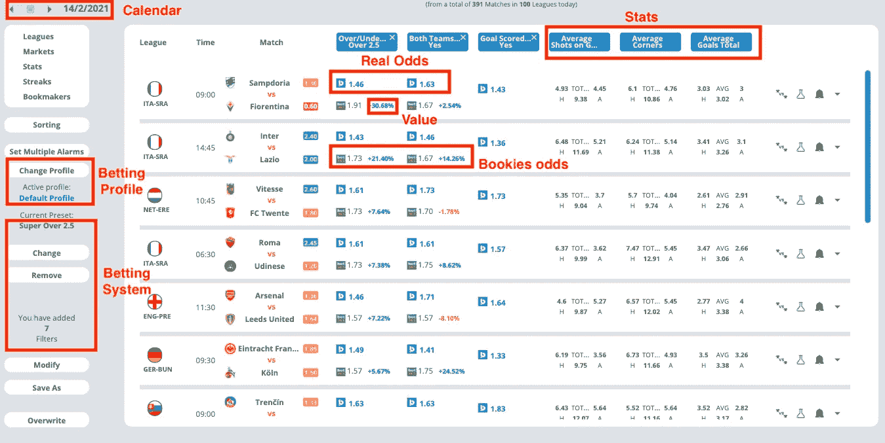
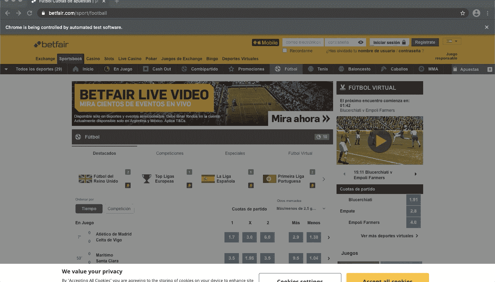
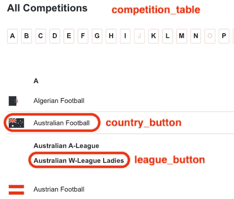
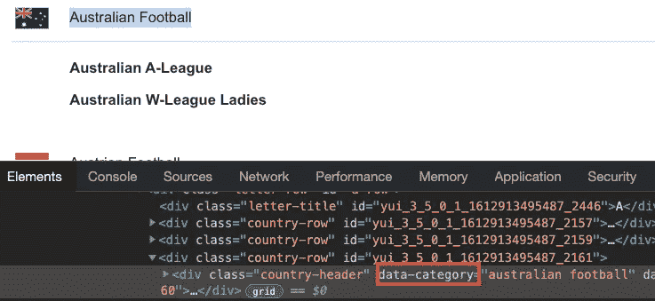
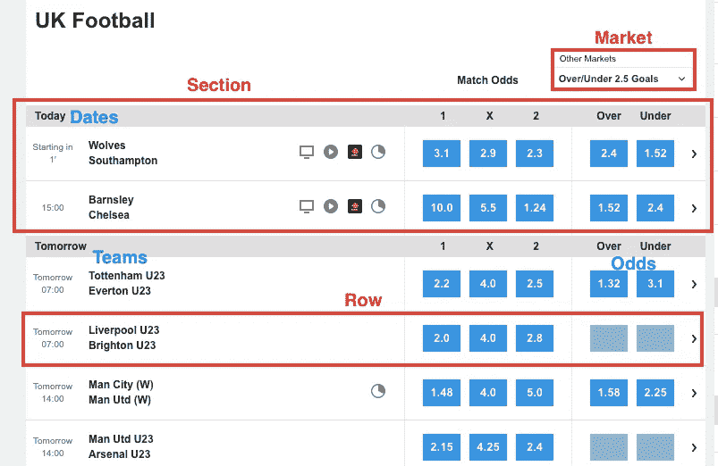

# 我曾经每年花 180 美元购买一个有利可图的赌博工具。今年我用 Python 做了一个

> 原文：<https://medium.datadriveninvestor.com/i-used-to-pay-180-yr-for-a-profitable-betting-tool-this-year-i-built-one-in-python-dda1a9b9581f?source=collection_archive---------1----------------------->

## 完整的代码创建一个足球博彩工具与熊猫和硒。


Photo by [Jefferson Santos](https://unsplash.com/@jefflssantos?utm_source=medium&utm_medium=referral) on [Unsplash](https://unsplash.com?utm_source=medium&utm_medium=referral)

我曾经为一个博彩工具支付年费，该工具根据实际赔率、统计数据和博彩公司的赔率向我推荐潜在的足球比赛。我对这个工具的准确性很满意，但是现在我可以编码了，我决定通过使用可用的免费数据用 Python 来构建这个工具。一开始，我认为我可能需要几个月的时间来建造它；然而，这比预期的要容易。在这个循序渐进的教程中，我将向你展示我是如何做到的。

这个项目的最终结果看起来像是帮助我创建盈利系统的 *"B* etpractice" 工具。你可以在本文末尾和我的 Github 上验证我们将创建的熊猫数据帧看起来和下图一模一样(当然，没有花哨的界面)



Screenshot of Betting tool (Betpractice)

这个系统的一部分是基于一种叫做[价值下注](https://medium.com/swlh/how-to-make-money-when-the-bookies-get-it-wrong-and-lose-f494017ca697)的策略，我在之前的一篇文章中提到过。请确保您完全熟悉价值下注的概念，以便我们将要编写的代码对您有意义。如果你从未听说过它，检查下面的文章。

[](https://medium.com/swlh/how-to-make-money-when-the-bookies-get-it-wrong-and-lose-f494017ca697) [## 当庄家搞错了，输了，如何赚钱

### 利用 Python 从博彩公司的错误中获利的另一种方法。

medium.com](https://medium.com/swlh/how-to-make-money-when-the-bookies-get-it-wrong-and-lose-f494017ca697) 

为了创建我们的投注工具，我们需要两个输入— **博彩公司赔率**和**历史足球数据**。在收集了这些数据之后，你可以为任何博彩市场创建一个系统。**在本教程中，我将制作一个系统，显示潜在比赛的日历，为市场“超/低于目标”和“双方得分”(BTTS)下注。**正如你在上面的图片中看到的，潜在的比赛有一个最低要求，即平均进球数(9)、射门数(9)和角球数。他们也有 2.0 的最大真实赔率(50%概率)。在构建系统时将考虑这些参数。

事实上，通过这些过滤器的比赛代表了经常失球或进球的球队。由于这一点，我们将能够确定潜在的匹配，以投注“超过 2.5 个目标”和“BTTS”。最后，我们计算赌注的值，并按最高值对潜在匹配进行排序。价值下注在上图中以绿色显示，它们代表“公平的赔率”

本教程将分为两个部分:

**第一节:刮庄家赔率(硒+熊猫)**

1.  **刮赛前赔率**:在 Selenium 中，我们会用`WebdriverWait`、`Expected Conditions(EC)` 和`Select`刮赔率。此外，我们将使用 Python 列表、字典、`for`循环、`try-except`块等。
2.  **清理和转换赛前赔率数据**:来自博彩公司的赔率数据有不同的形式，因此我们需要对它们进行适当的格式化，以使它们与历史数据相匹配。熊猫图书馆在这方面派上了用场。

*输出部分 1:庄家赔率*

**第 2 部分:构建赌博工具(熊猫)**

*输入部分 1:博彩公司赔率+历史足球数据*

1.  **数据清理:**首先，我们将使用`pd.read_csv()`获取历史足球数据。然后我们会清理庄家的赔率和历史数据。稍后，我们将使用 Fuzzywuzzy 来匹配博彩公司写的球队名称和在历史足球数据. csv 中找到的球队名称。
2.  **创建投注档案:**投注档案包含特定的赛季，可以帮助我们计算统计数据和实际赔率。虽然我们的历史数据包含 5 年的记录，但我们将只使用最近 2 个赛季的投注概况。
3.  **计算数据:**因为我们的系统是“进球过多”和“BTTS”，我们将计算每支球队的平均进球数、总命中率和总角球数。
4.  **创建市场过滤器:**首先，我们将编写一个公式来计算一场比赛的真实赔率。然后，我们使用这些真实的赔率作为一个过滤器，以及找到价值赌注。我们还将根据日期和统计数据过滤匹配。
5.  **寻找价值匹配:**我们将按照最高价值对潜在匹配进行排序。

*输出:按下注值排序的“超过 2.5 个目标”的潜在匹配下注列表。*

我会尽力解释系统背后的概念和我在 Python 中使用的代码，但是如果有什么不清楚的地方，请随时问我。

我们将使用 2 个脚本。我们将使用第一个脚本通过 Selenium 抓取数据(第 1 节)，第二个脚本处理数据并构建工具(第 2 节)。

# 编码时间到了

我们将从博彩网站 Betfair(代码中的链接)收集赛前赔率，因为它是全球最受欢迎的博彩网站之一；然而，请随意从任何博彩网站刮赔率。你可以遵循我创建的其他教程，在那里我解释了如何从 3 个投注网站刮赔率。然而，请记住**我们将在本周的许多欧洲联赛中为所有即将到来的比赛收集赔率，所以代码将与我以前写的文章明显不同。**

在第 1 部分结束时，刮擦工具将能够完成以下任务。



首先，我们接受 cookie 弹出窗口，然后我们将网站语言设置为英语，这样我们就可以在多个比赛中导航，并获得接下来 7 天的博彩赔率。

如果你觉得你可以自己完成，跳过第一部分，但是要确保你得到的数据和我们在第一部分得到的数据相似。开始编码吧！刮刀的完整代码可在第 1 节的末尾找到。

# 第一部分:排除万难

# 1.**用硒刮赛前赔率**

## 导入库并更改 Chromedriver 默认选项

我们需要导入`Options`来改变 chromedriver 的默认选项；`By`、`WebDriverWait`、`EC`、`time`等待特定条件发生(显式等待)，以及`time`等待特定时间量(隐式等待)。

我们要编辑的默认选项是“无头模式”和“窗口大小”您可以通过编写`option.headless=False` 来禁用无头模式，并使用`driver.maximize_window()`而不是`options.add_argument(‘window-size=1920x1080’)` ，如完整代码所示。

分解代码:

*   `options = Options()`创建选项类的实例
*   `options.headless = True` 开启无头模式
*   `options.add_argument(‘window-size=1920x1080’)` 以自定义尺寸打开窗口

## 初始化存储并循环每个联赛

在接下来的步骤中，我们将为一个足球联赛创建一个数据框架。这就是为什么我们需要将每个数据帧存储在我称为`dict_frames`的字典中。我们还需要创建另一个字典来帮助我们的 scraper 识别我们想要从中获取数据的联赛。

字典的关键字是国家的名称(如网站上所写的)，而值是列表的形式。每个列表包含每个国家的联赛。你可以删除或添加任何其他国家/联盟，但记住要按照网站英文版所示来写(我将在下面的“点击特定联盟”小节中展示如何选择名称)。

一旦我们创建了字典，我们需要遍历每个国家和联盟。这样，我们将为每个联盟打开一个 chrome 窗口，收集赔率和其他重要数据。

分解代码:

*   `webdriver.Chrome(path, options = options)` 应用我们之前在 chromedriver 中所做的更改
*   `driver.get` 打开浏览器
*   `web` 代表博彩网站的网址，而`path` 代表 chrome 驱动程序在你电脑中的路径
*   `driver.maximize_window()` 最大化 chrome 窗口。当我不在无头模式下工作时，我通常需要它
*   `time.sleep(2)`是隐式等待。您也可以使用显式等待，如我在“选项 1”注释中所示
*   `accept` 是我们每次访问这个网站都会弹出的“接受所有 cookies”按钮吗


Screenshot of the accept button

要获得 accept 按钮的 XPath，右键单击并“检查”元素。完成此操作后，您将看到一行高亮显示。右键单击，然后复制并粘贴 XPath。

## 从下拉菜单中切换语言

在我们抓取数据之前，我们需要将网站语言切换为英语。为此，我们编写以下代码。

分解代码:

*   `language_box` 是包含网站所有可用语言的框。我们用类名`ssc-hlsw`定位它，你可以通过检查右上角的语言框来验证这个类名。


Screenshot of language_box

*   `WebDriverWait(language_box,5).until(EC.element_to_be_clickable((By.CLASS_NAME, ‘ssc-en_GB’))).click()` 点击英语图标。

最后，我们需要让 selenium 等待网站加载所有英文内容。为此，我们需要选择一个引用来进行显式等待。在这种情况下，我将使用“高于/低于 2.5 目标”作为参考，所以我们将等待下拉列表在`span`标记中包含英文的`text`元素`Over/Under 2.5 Goals`。这显示在下面的代码中。

*   `WebDriverWait(driver, 10).until(EC.element_to_be_clickable((By.XPATH, '//span[contains(text(), "Over/Under 2.5 Goals")]')))`

## 点击特定的联赛(在循环内)

一旦所有的内容都是英文的，我们就必须按照这个顺序来得到每个联盟的赔率。

点击比赛→点击国名→点击联赛名。为此，我们编写了以下代码。

分解代码:

*   `header` 是包含“竞赛”按钮的框。检查下面的框，你会得到它的类名。


Screenshot of the header

*   `competition` 是我们需要点击的“竞赛”按钮，因此会显示国家列表。我们定位带有`contains`选项的按钮，以匹配在`a`标签内的`title`内包含`COMPETITIONS`的元素。
*   在我们点击`country_button` 和 `league_button` 之前，最好先定位下图所示的`competition_table` 。



Screenshot — Competition table

要找到`competition_table`，右键单击比赛表并寻找`id.` ，它应该看起来像这样`mod-multipickazmenu-1061-container`

*   `country_button` 和 `league_button` 显示网站上所有可用的联赛。国家/地区的 XPath 具有以下形式。

```
'.//div[contains(@data-category, "australian football")]'
```

这将定位一个在`div`标签内的`data-category`中包含`“australian football”`的元素。为了找到`data-category,`，检查如下图所示的元件。



也就是说，在我们的代码中，我们替换了特定数据联盟的名称(例如，`“australian football”)` 替换了`country`变量，这样我们就可以遍历`dict_countries`字典中的每个国家。最终的 XPath 如下所示。

```
WebDriverWait(competitions_table, 5).until(EC.element_to_be_clickable((By.XPATH, './/div[contains(@data-category,' +'"' + country + '"' + ')]')))
```

对于`league_button.`，我们遵循相同的步骤

## 收集团队名称、赔率和日期

最后，我们准备收集我们想要的数据。首先，我们在下拉列表中选择任何可用的博彩市场。在本例中，我将选择从“超过/低于 2.5 个进球”和“两个队都得分？”。我们还需要一个字典`dict_odds`来存储`list_odds`、`teams`和`list_dates`列表，这些列表将包含我们将要抓取的数据。

这是刮各个联赛数据的方案。



正如你所看到的，它有一个类似于我们在以前的文章中用来获得赛前赔率或现场赔率的序列。首先，我们遍历每个博彩市场，然后用`chooser`变量从`dropdown`菜单中选择它们。然后我们遍历每个`section` 来拆分每个日期的数据。最后，我们循环遍历每一个`row` ，它代表一场足球比赛。

在这种情况下，我将只解释那些在以前的文章中没有包括的细节。如果你对剩下的代码有任何问题，尽管问我。

分解代码:

*   `section_date = section_date * len(rows)` 帮助我们创建一个日期列表，每个`section.` 中的`rows`的长度存储在`list_dates`中
*   `list_dates = [element for section in list_dates for element in section]` 解包`list_dates`中存储的嵌套列表
*   `dict_odds` 存储抓取的数据。`%s % i`帮助我们根据`enumerate(markets)`改变按键的名称
*   `driver.quit()` 关闭浏览器

# 2.**清理和转换赛前赔率数据**

一旦我们完成了抓取部分，我们需要正确地格式化数据。**请记住，我们将在第 1 小节开始的** `**for**` **循环中执行此操作。**

## 为每个联盟创建数据框架

我们必须为我们刮到的每个博彩市场赔率创建一个数据框架。在这个例子中，我划掉了“超过/低于 2.5 个目标”和“两个队都得分”，所以我创建了`df_over_under`和`df_btts` 帧。

分解代码:

*   `pd.DataFrame` 根据我们之前创建的列表创建一个数据框架
*   `pd.concat` 将两个数据帧连接成一个数据帧，我称之为`df_betfair`
*   `.fillna('')`用空值填充任何`NaN`值，而。replace()用一个空值替换任何包含单词“SUSPENDED”的数据。
*   `.applymap()`将公式`.strip()`应用于`df_betfair` 数据帧的每个字符串元素

## 在熊猫数据框架中管理时间

我们需要将网站中使用的时间格式转换为标准格式 YYYY–MM–DD。

分解代码:

*   `datetime.date.today()` 创建了一个`today`变量，我们将使用它来标识我们正在抓取的日期。
*   `datetime.timedelta(days=1)` 加 1 天得到`tomorrow`变量

除了当天(“今天”)或第二天(“明天”)进行的比赛之外，网站使用的格式看起来像这样“2 月 13 日星期六**”**`(%A, %d %B)`。我们需要将所有内容格式化为 YYYY–MM–DD`(%Y %d %B)`

*   `re.sub()` 用网站(%A，%d %B)中使用的标准时间格式替换网站上显示的词语，如“进行中”、“今天”和“明天”
*   `x.split(‘,’)[1]` 获取“2 月 13 日星期六**”**中逗号后的所有内容
*   `datetime.datetime.strptime()` 将日期格式转换为 YYYY–MM–DD`(%Y %d %B)`

最后，我们用`dict_frames[dict_countries[country][league]] = df_betfair` 将包含每个联赛的`df_betfair`数据帧存储在`dict_frames`字典中，用`pickle.dump()` **保存文件，我们将** `**dict_frames**` **保存为名称** `**dict_betfair**` **，以备后用。**

*祝贺你！我们完成了脚本 1 (Selenium)的工作。你可以在我的*[*Github*](https://github.com/ifrankandrade/betting-tool.git)*上找到我们第一个脚本的代码。现在是时候开始脚本 2(熊猫)的工作了*

请记住，收集的数据只包含未来 4 天左右比赛的赔率。因此，我强烈建议您将第一个脚本自动化，这样它就可以在每周三、周日运行，永远不会出现数据不足的情况。在下面的文章中，我用三个简单的步骤展示了如何做到这一点。

[](https://medium.com/datadriveninvestor/automate-your-python-scripts-in-3-steps-mac-and-windows-3c6fb0fb5bc2) [## 通过 3 个步骤自动化您的 Python 脚本——Mac 和 Windows

### 厌倦了重复的任务？自动化您的脚本并节省大量宝贵的时间。

medium.com](https://medium.com/datadriveninvestor/automate-your-python-scripts-in-3-steps-mac-and-windows-3c6fb0fb5bc2) 

# **第 2 部分:构建下注工具**

## 导入库

这些是我们将在第 2 节中使用的库。

# 1.**数据**清洗

## 清洗必发赔率

首先，我们酸洗我们在第 1 节刮的框架(`dict_betfair**)**`)。然后我们创建 2 个字典，我们将使用它们来匹配 Betfair 名称和历史数据名称。

分解代码:

*   `.str.extract(r’(.+)\n(.+)’)` 按照正则表达式模式提取字符串。使用的正则表达式表示“在' \n '之间选择两个元素”
*   `dict_home_name_matching[league]` 是包含主队名称的数据帧

## 获取和清除历史数据

我们需要下载我们之前刮过赔率的联赛的历史足球数据。为此，我们使用`dict_countries` 来指定包含在下载 CSV 文件的链接中的名称(例如，“SP1”=“西班牙联赛”)。所有数据都存储在`dict_historical_data`中。稍后我们将使用它来管理两个数据帧:`df_historical_data`和`df_profile`。

分解代码:

*   `pd.read_csv()` 读取 CSV 文件。“意大利乙级联赛”CSV 文件的编码有冲突，所以我使用`‘unicode_escape’`作为该特定文件的编码。
*   `df.assign()` 为现有列或新列赋值
*   `.rename()` 重命名列的名称

之后，您可以使用`pickle.dump()`保存`dict_historical_data` ，以便在本周使用。你需要运行这个来更新最近几周的比赛。

## 匹配球队名称并替换 Betfair 数据框架中的历史数据球队名称

我们需要一个标准的团队名称。这就是为什么我们使用`fuzzywuzzy` 库来匹配名称并替换 Betfair 数据框架中的历史数据团队名称。

为此，我们将使用我们在“清理 Betfair 赔率”步骤中创建的`dict_home_name_matching` 和`dict_away_name_matching` 。然后我们更新`dict_betfair,` 的值，这样我们就得到标准的团队名称。

分解代码:

*   `.unique()` 给出 dataframe 列的唯一元素。`fuzzywuzz` 需要列表形式的名称，所以我们使用`.tolist()` 来转换列表中的数组。
*   `.apply(lambda x: ...)` 将公式应用于特定 dataframe 列的所有元素。
*   `process.extractOne(x, all_teams, scorer=fuzz.token_set_ratio))`给出 Betfair 队名(x)与 historical_data 队名(all_teams)之间最高`score`的匹配。在这种情况下,`fuzz.token_set_ratio` 计分器做得很好，但是你可以改变标准。
*   `.apply(pd.Series)` 将结果转换成 dataframe 的两列。在这种情况下，匹配给出了两个输出，所以我创建了列`teams_matched`和`score`
*   `.update({})` 更新了字典中的值

# 2.创建个人资料以计算实际赔率和统计数据

虽然我们获得了 5 年的历史数据，但我们必须小心，因为只有最近几年才有所有可用的统计数据。为此，我将数据分为两个数据帧`df_historical_data` 和`df_profile`。然而，大多数时候，我们使用`df_profile`。这将用于计算真实的赔率和统计数据，因此我们可以过滤球队，并保留潜在的游戏下注。

分解代码:

*   `pd.concat()` 连接`dict_historical_data`内的所有帧
*   `.isin()` 仅考虑我们包含在`seasons`列表中的元素
*   `.rename()` 重命名列的名称
*   `df_profiles` 代表两个季节的历史数据

# 3.计算统计数据

我们将计算平均进球数、总命中率和总角球数。最后 2 个是主队在有主场优势时的射门次数/角球次数，以及客队在没有主场优势时的射门次数/角球次数(换句话说，只有主队产生的射门次数/角球次数，而不是收到的射门次数/角球次数)

然而，这些进球代表了主队在有主场优势时进球和失球的总和，以及客队在没有主场优势时进球和失球的总和。

分解代码:

*   `.groupby(‘home_team’).mean()` 将有主场优势的球队参加的所有比赛分组，然后计算进球、射门和角球的平均值
*   `df_stats` 代表我们将用来过滤匹配的统计数据

# 4.创建市场过滤器

## 过滤器 1(日期)和过滤器 2(统计数据)

现在我们已经计算了统计数据，我们可以根据自己的需要过滤游戏了。首先，我们只选择特定日期的游戏，这样我们就可以像本文开头演示的那样创建一个日历。这个日历将有助于过滤比赛，并获得潜在的游戏下注。

统计过滤器如下:平均进球数> 2.5，总命中率> 9，总角球数> 9。满足这些要求的球队统计表明比赛可能有很多进球。

我们还需要代表没有统计数据的团队的`promoted_teams` 。他们很可能是晋级的队伍，所以比赛中没有关于他们的数据。我们将为他们的属性赋予`0` 值。

分解代码:

*   `home` 和`away`是在特定数据下比赛的主客场球队列表
*   返回一个迭代器。迭代器生成一系列元组，包含来自每个可迭代的`home`和`away`的元素
*   `df_filters` 代表特定日期的所有比赛，其平均进球数> 2.5，总射门数> 9，总角球数> 9

## 过滤器 3(实际赔率)

我们需要过滤“两个队都得分”和“超过 2.5 个进球”的真实赔率大于 2 的比赛(我们希望比赛至少有 50%的概率)

为了计算实际赔率，我们使用上面的公式，如果你看过我以前发表的文章“[价值赌注](https://medium.com/swlh/how-to-make-money-when-the-bookies-get-it-wrong-and-lose-f494017ca697)”，你可能会很熟悉。

一旦我们有了公式，我们就用下面的代码把它应用到`df_filters` 数据帧。

分解代码:

*   `lambda x,y: calculate_real_odds()` 简化了`calculate_real_odds`，所以我们可以用它来计算通过前面过滤器的匹配的真实几率
*   `df_filters` 代表特定日期的所有比赛，其平均进球数> 2.5，目标总射门数> 9，总角球数> 9，实际赔率 btts < 2，实际赔率超过 2.5 < 2

# 5.寻找价值赌注

最后，我们创建一个数据框架`df_system` ，它将包含每个潜在游戏的值。我们将根据“超过 2.5 倍”赔率的最高赌注值对数据帧进行排序。

分解代码:

*   `.str.extract()`通过遵循正则表达式模式`r’(.+)\n.+’`获取赔率的第一个元素(大于 2.5 或 btts=True)
*   `df_system['V_OVER']`代表必发中超过 2.5 倍赔率的数值

*祝贺您，现在您有了一个按赌注价值排序的“超过 2.5 个目标”的潜在匹配赌注列表！您可以在我的 Github 上查看 Jupyter 笔记本，以验证最终的数据帧是否与本文开头显示的图片相同。*

这些都是有潜力的游戏，但你不必全部下注。现在你可以分析一下，赌那些有潜力的游戏好不好。该工具还提供了比赛中的徒手分析，这很容易编码。我在我的 [Github](https://github.com/ifrankandrade/betting-tool.git) 上包含了最后一小部分以及第 1 和第 2 部分的脚本。

*希望本教程对你有用！*