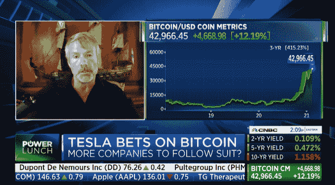
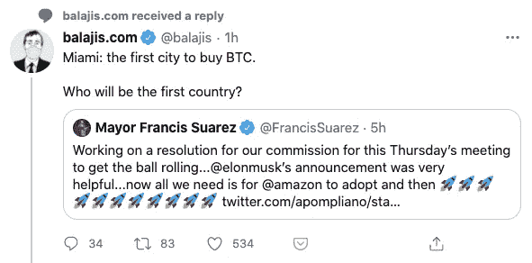

# 我错了。这不是 2017 年

> 原文：<https://medium.datadriveninvestor.com/i-was-wrong-this-isnt-2017-e4fa94125e8b?source=collection_archive---------27----------------------->

We’re likely to see more of this

去年 8 月，比特币的价格正在上涨。有一个新的“热”的东西叫做 DeFi 和产量农业也在蓬勃发展。我对 2017 年发生的事情感到恐惧(*价格几乎达到 2 万美元，然后跌至$3K，ICOs 的兴衰)*，我告诉一个朋友，回调即将到来，这种狂热看起来和 2017 年完全一样——见鬼，这是一年中的同一时间，有数十亿美元流向了名为寿司的项目！？

但我错了。**过去是一位伟大的老师，但将其作为未来的指南并不是很有用**，这是一个很好的提醒。在过去的 2 年里，自标志性的 2017 年加密牛市以来，许多事情都发生了变化，这一次必须有所不同。你不得不**越过价格和收益，看看世界上正在发生的事情，很明显这是不可避免的**。

[随着特斯拉购买价值 15 亿美元的比特币的消息传出，其价格涨到了 44000 美元](https://www.cnbc.com/2021/02/08/tesla-buys-1point5-billion-in-bitcoin.html)。**我写这篇文章不是为了回答你的问题“现在是购买比特币的正确时机吗？”而是强调一些宏观变化，在我看来，这些变化为正在发生的事情奠定了基础。价格只是真实情况的一个信号——它就像你我都能看到的冰山一角，但在表面之下还有很多事情在发生。我希望这能激励你更深入地挖掘，弄清楚到底发生了什么。像所有其他事情一样，没有什么灵丹妙药可以解释一切*(我敢肯定许多物理学家不会同意)*，我强烈建议你把这看作是我的思考，最多是一个小小的推动。**

很难在一篇文章中做到公正，我不想仅仅是倾倒信息，但与此同时，综合是一种技能，也是我正在努力提高的。所以我会这么做-

在这篇文章中，我将简单地列出关键主题并分享它们的简介，在接下来的几周里，我将深入探讨各个主题。在咨询术语中，这是“议程”幻灯片。

# 2017–2019

1.  **大规模教育**:数百万人开始学习密码，包括我在内，虽然许多人损失了金钱，但他们没有失去这些知识。
2.  技术变得更简单:像钱包、交易所这样的加密产品变得更加用户友好，更容易理解。

# 2020

1.  **Defi 和 Yield Farming** :有了分散化的金融，你现在可以赚取“利息”，远远高于你储蓄账户的利率。
2.  随着疫情经济的崩溃，各国政府宣布了一揽子刺激计划(并印发了钞票)。人们开始怀疑“如果这么容易，我的钱有多大价值？”
3.  **K 形复苏:**股市繁荣，但企业纷纷关门。很奇怪吧？经济的不同部分以不同的速度复苏，这凸显了一些非常严重的根本性缺陷
4.  **PayPal、Square、Microstrategy:** 一些机构现在开始购买比特币，并教其他人如何操作

# 2021?

有了关于教育的那份说明，感觉我们已经完成了一个循环，又开始了一个新的循环。下一步是什么？迈阿密似乎是第一个采用加密货币的城市。市长是一个非常酷的人，他说他们打算用比特币支付员工的工资。

用不了多久，就会有一个国家发布类似的公告。

因此，我错误地认为现在是 2017 年。比特币的价格可能会下跌或继续上涨，没有人知道会发生什么，但我们已经在加密领域实现了一个阶跃函数变化。

我相信还会有更多意想不到的事情发生，但我从这一切中学到的一件事是花更少的时间看价格，花更多的时间去理解表面下发生的事情。

更多内容请关注…