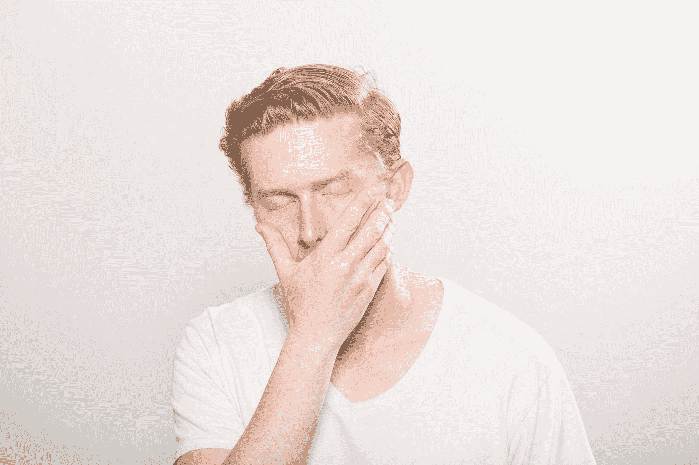
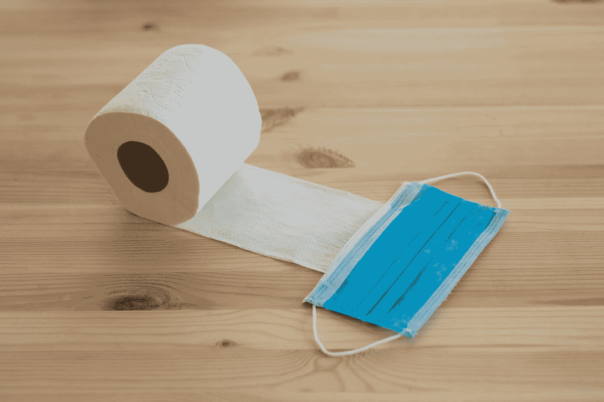
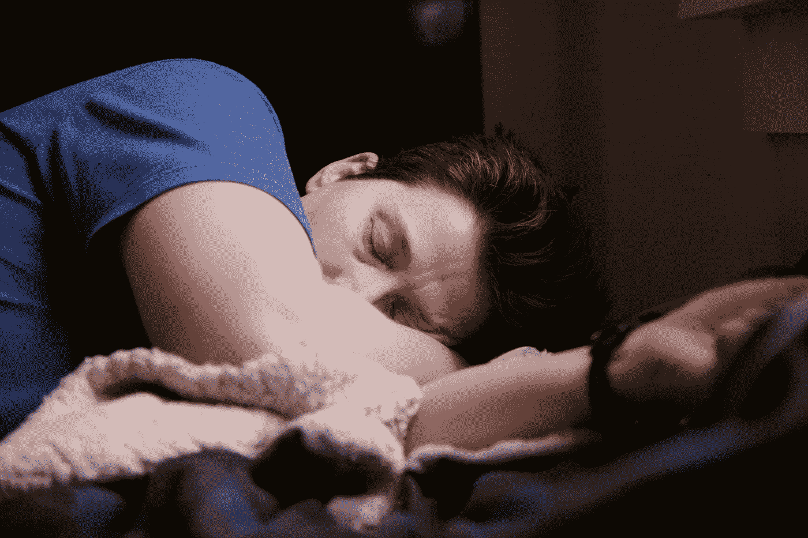

# 我跑了一夜，发现自己开始了 57 天的折磨和探索之旅

> 原文：<https://medium.datadriveninvestor.com/i-went-for-a-run-overnight-and-found-myself-on-a-57-day-journey-of-torment-and-discovery-a656a173007?source=collection_archive---------8----------------------->

COVID-20 如何让我成为一名作家

Photo by [David Marcu](https://unsplash.com/@davidmarcu?utm_source=medium&utm_medium=referral) on [Unsplash](https://unsplash.com?utm_source=medium&utm_medium=referral)

成为一名跑步爱好者意味着做一些对其他人来说听起来不太有趣的事情。

这是一项耐力运动，在荒野和许多不可预测的挑战中进行。野生动物、恶劣天气、伤害和无数其他可能的问题。

然而，以这种方式体验自然是值得的。

> “如果你想跑，那就跑一英里。如果你想体验另一种生活，那就去跑马拉松吧。”— **艾米尔·扎托贝克**

五月的一个星期五晚上，我和三个朋友决定在太平洋山顶道上跑 27 英里。

为了好玩。

当时我并不知道，但这将是一段不同旅程的开始。

痛苦、苦难和祝福的悲惨旅程。

我们会讲到最后一部分。但首先会有点难看。

所以和我在一起。

我也不知道这将是几个月来我最后一次踏上征途。但是任何情况下都有积极的一面。

如果痛苦是一份礼物，而问题是机会，那么我面前就有一些非常好的机会！

但首先，这一切是如何开始的。

晚上在小路上跑步真的很特别。5 月 8 日是满月的前一天，这是我们旅程的开始。天很亮。几乎如此明亮，我们不需要我们的头灯运行在华丽的滚动路径离开卡洪路口前往银木湖。

一些东西在我的胃里隆隆作响，我感到奇怪的恶心。天气条件和风景都很完美。我的消化系统没有。我知道如果这种情况继续下去，这将是一个漫长的夜晚。我对这个想法并不高兴，但也没有怀疑任何不寻常的事情。当你决定不睡觉而是整夜跑步时，你的身体会产生奇怪的反馈。

 [## 商业无国界:如何走向全球？数据驱动的投资者

### 首先，你要形成你的主要目标。例如，寻找投资，固定你的市场…

www.datadriveninvestor.com](https://www.datadriveninvestor.com/2020/07/14/business-without-borders-how-to-go-global/) 

所以我整晚都跟在我的三个朋友后面，不停地思考如果这些胃部不适变成更紧急的事情，我可能会“去”哪里。我完全靠毅力熬过来了。

在最后一段漫长的攀爬中，我感觉像死了一样，但我知道还有一段很长的下坡路通向汽车，早餐在另一边。我决定不管感觉有多糟糕，都要让下坡跑完。

是时候硬着头皮完成了。笑一笑。吃点早餐。和朋友们一起喝啤酒。回家休息吧。

Photo by [Wil Stewart](https://unsplash.com/@wilstewart3?utm_source=medium&utm_medium=referral) on [Unsplash](https://unsplash.com?utm_source=medium&utm_medium=referral)

星期六是一个模糊的日子，我真的不知道为什么我感觉如此可怕。我已经跑了整整一个晚上没有睡觉。还需要什么解释？

周六晚上我早早就上床睡觉了，感觉自己只需要睡一会儿，明天早上一切都会好起来。我在一个无家可归者的部门有一个定期的志愿者工作，我在周日早上做。我打算好好休息一下，然后去上菜。那肯定会让我的生活恢复正常。

我按计划在周日早上去了无家可归者部做志愿者。但是在开车回家的路上，我开始感觉到有些事情非常不对劲。恶心越来越严重，我的肠胃系统在和我战斗。我也感觉到一种奇怪的精神障碍。

为了谨慎起见，我决定我们不要去我妻子的父母家过母亲节。我不相信我有 COVID，但为了以防万一，取消它似乎是明智的。

周一早上。底部掉出来了。我几乎坐不起来。恶心得厉害，我经常想吐。身体疼痛。严重的胃肠不适。寒战。发烧。思维模糊，极度疲劳。没胃口。啊哦。

Photo by [Kyle Glenn](https://unsplash.com/@kylejglenn?utm_source=medium&utm_medium=referral) on [Unsplash](https://unsplash.com?utm_source=medium&utm_medium=referral)

我可以和我的医生进行视频通话，他说“听起来你得了 COVID。你需要自我隔离并接受测试。你还应该假设你的妻子和女儿已经暴露，所以他们也需要隔离。”

我们照做了。我不得不通知我接触过的每一个人，他们很有可能接触过这种病毒。教会需要通知当局，志愿者需要更换，以免给任何人带来风险。

我预约了一个免下车 COVID 测试站点。但由于恶心、腹部不适和疲劳，我几乎无法坐起来。在这一点上，似乎很明显，我是许多感染 COVID 的人之一。只是需要一个积极的结果。

这些症状与我听到的没有呼吸问题的情况相符。我感到胸闷。我的肠胃系统正在对我发动一场游击战。

我在努力保持这个“G 级”。

这么说吧，我终于明白了为什么人们会囤积卫生纸。

Photo by [engin akyurt](https://unsplash.com/@enginakyurt?utm_source=medium&utm_medium=referral) on [Unsplash](https://unsplash.com?utm_source=medium&utm_medium=referral)

但是测试结果出来了。没有。

我的医生不为所动。“我们在实践中发现，这些测试相当不可靠”，他告诉我。"你应该去做一次抗体测试."

我做到了。没有。此时，我已经怀孕两周了。这场腹部战争已经平静了许多。我不再发烧或发冷。我想事情可能就要结束了。事实是，末日还没有到来。

隔离变得孤独。你不和家人一起吃饭。我这样做已经 15 天了，但我仍然只能呆在家里的后屋里。我的大脑模糊不清，恶心是永远存在的。压力大时，我通常的放松方式是去跑步。逃跑是不可能的。或者走路。或者别的什么。在我的州没有太多选择。

我设法看完了几本书，但即使是阅读也是一个挑战。我会感到一阵阵的疲劳，这意味着我根本不能做任何事情。我以前从未经历过这种程度的疲劳。

我已经完成了一次 100 英里的耐力跑和两次 60 英里的耐力跑，还有很多马拉松长跑。

在经历了这些事件之后，我并没有像这次疾病中每天席卷我的疲劳浪潮那样感到疲倦。

Photo by [Shane](https://unsplash.com/@theyshane?utm_source=medium&utm_medium=referral) on [Unsplash](https://unsplash.com?utm_source=medium&utm_medium=referral)

我就知道事情会变好的。但是每天都是一样的。阵亡将士纪念日来了又去。梅来了又走了。6 月 1 日是这个谜的第 25 天。我做了所有能想到的血液测试。

困在同样的四堵墙里，有着同样的问题。每一天。我不能出去跑步。我不能开车到离家几英里以外的地方。在接下来的一天里，我甚至不能以适中的速度行走，否则就会完全筋疲力尽。做让我成为“我”的事情是不可能的。

*但是写作呢？我能试试吗？在过去的 10 年里，我的写作主要由电子邮件组成。*

我想过了。也许没有其他选择是件幸事。但是我该写些什么呢？我选择了商业，因为这是我所知道的。

我不知道媒体或任何其他在线出版物。我想也许我可以给小报纸写专栏。我不知道是否有人会把它打印出来，但我开始写作，因为我不能做太多其他的事情。

这些症状最终会过去，也许我可以发表一篇专栏文章。那会很酷。

Photo by [Chris Spiegl](https://unsplash.com/@chrisspiegl?utm_source=medium&utm_medium=referral) on [Unsplash](https://unsplash.com?utm_source=medium&utm_medium=referral)

更多的日子过去了。更多测试，包括另一项 COVID 测试。没有答案，只有更多的问题。我从我的专家那里听到的最奇怪的怀疑是斑疹伤寒。测试结果也是阴性。

所有这些测试都一直呈阴性，但疲劳、恶心和脑雾的波动仍在继续。我经常会感到困惑，我是否已经完成了一项任务，或者我只是想完成它。我的认知状态受到了损害。日复一日。

所以我尽可能地继续写作。写作成了所有沮丧、困惑和孤独的一种释放。有点像多年前的越野跑。我开始真正享受写作的时光。但是没有一家报纸会回复我。

好吧，也许我写的没那么好。我不太确定编辑们想要什么。但是我内心有些东西在发展。我希望有人能读懂我要说的话。

7 月 3 日，在我神秘健康问题的第 57 天，恶心和日常疲劳开始减轻。

*57 天！*

我可能永远也不会得到一个解释，是什么导致了这种折磨。我的专家没有东西可以测试了。症状终于缓解了。

他让我去看传染病医生。他们非常忙，这是可以理解的。我打过电话的传染病专家没有一个会考虑现在把我当成病人。除非我有新冠肺炎。

> 也许是 COVID-20。

我的专家告诉我“你没有疯。”

我不知道这是要讨论的。

“你肯定有事发生。”

不管什么原因。这很残酷，给我的生活带来了 57 天的浩劫。

但它让我对写作有了新的热情。

如果我没有被困在我的家里和我的头脑里，我不可能开始写故事。我的生意受到了影响，但我回来了，还在写作。

Photo by [Marc-Olivier Jodoin](https://unsplash.com/@marcojodoin?utm_source=medium&utm_medium=referral) on [Unsplash](https://unsplash.com?utm_source=medium&utm_medium=referral)

我知道。没有多少人看到我的作品。我没有得到那么多的“掌声”。我有两位数的粉丝。老实说，这些人中的大多数都是我亲自要求跟踪我的人。我还没有真正弄清楚如何培养观众。

但是我找到了新的激情。

这是我一生中最艰难的经历之一。每种情况下都有积极的一面。

你是如何将痛苦转化为机遇的？分享你的故事。你经历了什么，从中得到了什么祝福？

布伦特·拉普诺是南加州的国际金融理财师和注册退出规划顾问。[这里是他其他文章的链接。](https://www.brentrupnow.com/blog)

**访问专家视图—** [**订阅 DDI 英特尔**](https://datadriveninvestor.com/ddi-intel)