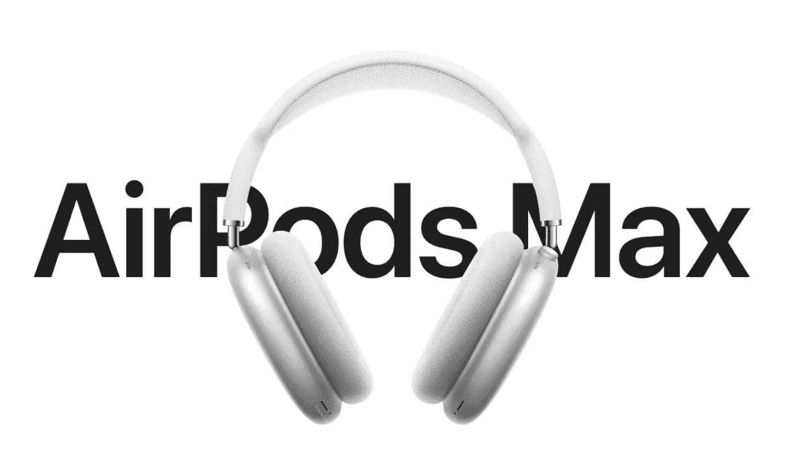
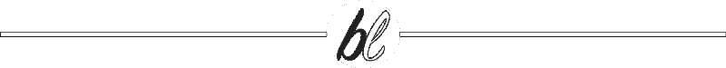

# 一旦 AirPods Max 在我的国家上市，我将不会得到它

> 原文：<https://medium.datadriveninvestor.com/i-wont-be-getting-the-airpods-max-once-it-is-available-in-my-country-817cc3652b1b?source=collection_archive---------35----------------------->

## 大提示:跟价格有关系

Image by [Apple](https://www.apple.com/my/airpods-max/)

人们总是把一个人与他们所做的任何事情中的佼佼者联系在一起。是的，我可能有偏见，因为我是他们产品的忠实粉丝，但同时，我也发现自己比其他人更喜欢他们的产品。

我更喜欢他们的生态系统，我更喜欢他们的操作系统，我只是更喜欢他们的产品。

这可能就是为什么尽管他们的产品在我的国家很贵，但我拥有一部 iPhone 5S，一部 iPhone 12 Mini，一部 iPad Mini 4，一部 Apple Watch Series 5，一部 Apple TV 第三代，一部 Apple TV 4K，一部 MacBook Air 11”和一对 AirPods 第二代

很快，我希望能增加一个 MacBook Air M1 芯片，一个 iPad Air 第四代和一个 27 英寸的 iMac。

不过，我不会把不久前发布的新款 AirPods Max 加入这个系列。目前，它在我的国家(马来西亚)仍然不可用，但即使它是，我也不会得到它。

正如我上面提到的，苹果产品并不便宜，根据你生活在哪个国家，价格会有所不同。不同的是，那个国家的普通人如何能买得起这些被许多人渴望的产品。

例如，目前美国的最低时薪大约是 7 美元。乘以每天 8 小时，每周工作 6 天，你会得到每月 1456 美元。最高规格的 iPhone 12 Pro Max (512GB)售价为 1399 美元。这意味着一个拿最低工资的普通美国人可以用一个月的工资购买顶级 iPhone。

让我们和我的国家比较一下。

我国的最低时薪大约是 1.30 美元。同样，让我们把它乘以每天 8 小时，每周工作 6 天，我们将得到每月 270 美元。因此，对于一个普通的马来西亚人来说，购买一部和普通美国人完全一样的手机，大约需要他们 5 个月的工资，而美国人只需要一个月。

现在，考虑到 AirPods Max 的售价为 549 美元，这仍然相当于一个普通马来西亚人两个月的工资。

老实说，花那么多钱买一副耳机真的是大多数人都不会做的事——包括我自己。我的意思是，如果你问我，即使我有钱，我真的会买 AirPods Max 吗？我会告诉你，我会的，除非我真的有 549 美元可以挥霍。

否则，我不会。

我无法证明买一副比苹果最便宜的手机 iPhone SE 还要贵的耳机是合理的。顺便说一下，一对 AirPods Max 可以轻松地给我买 3 对我非常喜欢的 AirPods 2。

 [## 阿尔法折叠和 GPT -激进的技术颠覆将如何影响我们的未来|数据驱动…

### 2019 年，我写了如果你关心 AI，你需要关注的前 10 个人。最近有两个机构提到…

www.datadriveninvestor.com](https://www.datadriveninvestor.com/2021/01/07/alpha-fold-and-gpt-how-radical-technology-disruptions-will-affect-our-future/) 

是的，它拥有许多伟大的技术，尽管设计(尤其是它的外壳)不是你愿意花那么多钱买的东西。

尽管它包装了技术，但索尼等其他品牌也有类似的产品，价格只是它的一小部分。

我看过很多 YouTubers 名人测试 AirPods Max 的评论，大多数人都说，尽管它有多好，但它的价格并不合理。当然，我们都知道苹果仍然会卖出很多，因为每当苹果发布一款产品时，情况就是这样。他们有一个庞大的忠实粉丝群(包括我自己)，那些买得起他们产品的人会继续购买。

老实说，如果我用美元赚的和我用马来西亚林吉特赚的一样多，我的房子里会堆满苹果的东西，因为我会很富有！但是因为我不赚美元，我不得不慢慢来，真正挑选我需要先买哪个苹果产品。我不能就这么疯掉(尽管如果我中了彩票我会疯掉)，因为我实在是不能这么做。

但同样，它会卖得很好，如果苹果计划发布更便宜版本的传言是真的，那么它会卖得更好。

然而，对于这位作者来说，这不会发生——无论如何不会马上发生。

老实说，如果我买的是 AirPods Max，我花的钱只有 MacBook Air 的一半。见鬼，我甚至可以用 AirPods Max 的价格买到基本规格的 iPad Air 第四代，但不是同样的价值。

这就是为什么当 AirPods Max 最终到达我的国家时，我不会得到它，并且可能永远也不会得到它，因为在这个价格点上，我无法证明它是合理的。

我用这个价格从 AirPods Max 中获得的价值还不够。但是如果它对你有用，那么，无论如何，去吧。

我只是暂时继续享受我的 AirPods 2。

获取专家视图— [**订阅 DDI 英特尔**](https://datadriveninvestor.com/ddi-intel)