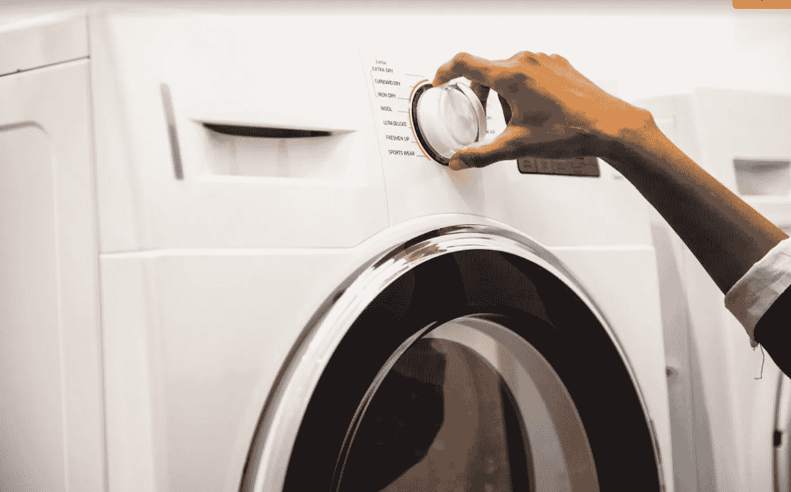

# 我不会眨一下眼睛

> 原文：<https://medium.datadriveninvestor.com/i-wouldnt-batna-an-eye-91068e02247c?source=collection_archive---------13----------------------->

CC Image of Washing Machine

许多年前，在搬到多伦多时，我发现自己扔掉了旧电器，为新电器让路。我在 Craigslist 上做了一个衣物烘干机的广告，找到了一个买家。一个中年妇女出现了，她想扔掉烘干机，我主动提出帮她从地下室抬上楼梯。

令人痛心。我曾经拜访过斯坦福大学的一名博士生，他写了一篇关于直升机团队搬运物品的论文。这件事发生在我遇到安德鲁之前，我会用不同的方式来处理。

在狭小的空间里很难协调举起重物。我担心很多事情:

*   我会伤害她吗？
*   我会伤害自己吗？
*   我真的有能力举起这个沉重的器具吗？
*   我会弄坏电器或造成损坏吗？

经过大约 10 分钟的小心操作，我们到达了前面的台阶。她转向我，从干衣机上要了 50 美元。我又气又痛，很不好意思地，我屈服了。

现在，回想起来，我不知道这是她有预谋的，还是只是一时的灵感。我愿意认为大多数人是好的，并以有原则的方式运作。然而，在展望未来的谈判时，我从那次谈判中学到了很多。

不久之后，我成了许多书的贪婪读者，包括罗伯特·卡尔迪尼的《T2 的影响》和罗杰·费舍尔的《T4 走向成功》和《超越失败》。在我敲诈之前，我读过《交易的艺术》,但我从中获得的唯一启示是，要想获得成功，你应该表现得像个硬汉。

后来，我在许多课程中学到了谈判协议的最佳替代方案(BATNA)的概念，以及如果有任何谈判，提前准备一个替代方案是增加积极成果可能性的一种方式。还有租赁利益原则——“谁最不在乎，谁就赢”。

然而，对我来说，这是更好地理解身体心态如何影响我的表现。我说的不是(现已揭穿)[权力姿态](https://www.sciencedaily.com/releases/2017/09/170911095932.htm#:~:text=Now%20comes%20the%20most%20definitive,do%20not%20improve%20your%20life.&text=The%20work%2C%20published%20in%20the,yourself%20expansive%20mattered%20at%20all.)。我说的是真正的物理影响:

*   睡眠不足
*   饥饿
*   咖啡因

虽然在某些情况下，这是不可能的，但在许多情况下，一个人可以推迟谈判，而不会削弱自己的结果。至少，一个人可以削弱他们的立场，以弥补这些可能产生的影响，比如当你知道你累了的时候，以不同的要价开始。

虽然我已经有点僵化了，我可能会告诉上面故事中的人走开，因为我们已经有了一个协议，我可以说我需要喘口气，或者更好的是，考虑一下。这将为我提供足够的空间来降低我的心率，让我思考得更清楚。

正如反赌瘾广告所说——“知道你的极限，并在极限内玩”。