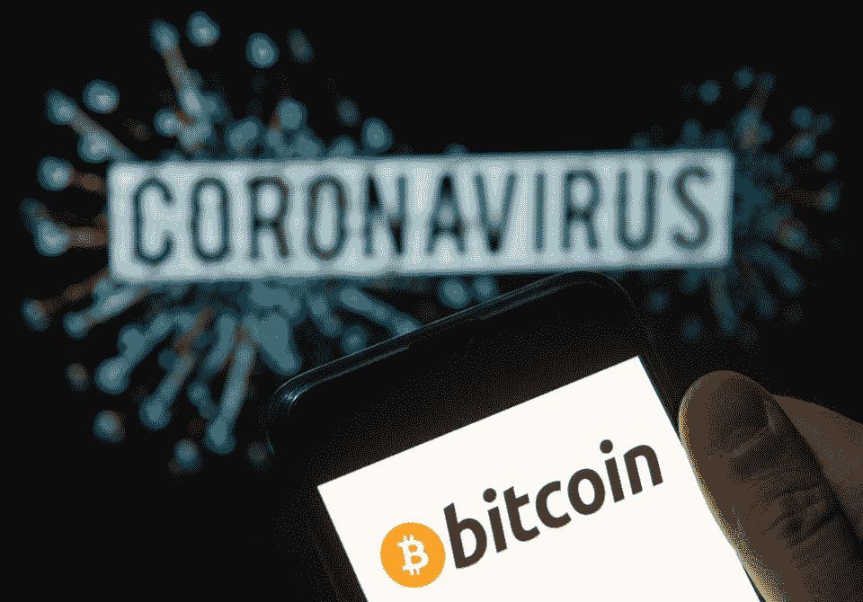
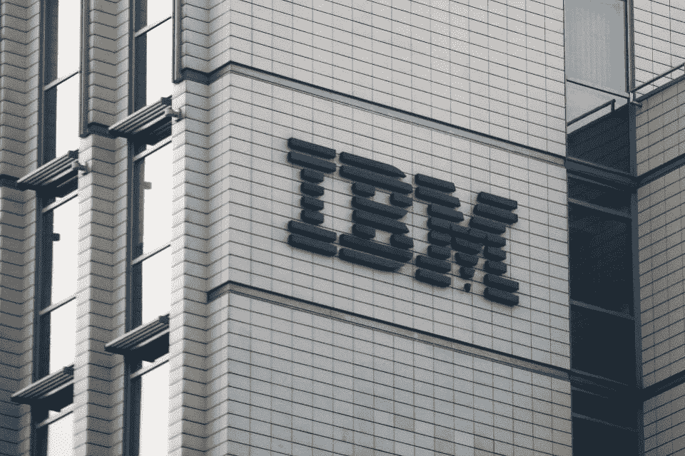

# IBM 不断增长的区块链网络可以加强我们的供应链，以应对新冠肺炎

> 原文：<https://medium.datadriveninvestor.com/ibms-growing-blockchain-networks-could-strengthen-our-supply-chain-in-response-to-covid-19-cfc9a037bcec?source=collection_archive---------18----------------------->

新冠肺炎疫情暴露了危机时期产品和服务变化的不足之处。我们的供应链在以人为中心的事件中承受着压力，可能难以适应。为了让我们的全球供应链在面对意外事件时更有弹性，买家和卖家需要根据未来事件的预期重新思考他们的方法。区块链网络可能是答案。但这项技术仍处于起步阶段。考虑到新冠肺炎给我们的社会带来了多大的变化，我会见了 IBM 和 Hyperledger 的高管，讨论了区块链创造一个更好的供应系统的潜力。

WASHINGTON, DC — APRIL 06: Medical professionals work at a drive-thru coronavirus testing site run by George Washington University Hospital on April 6, 2020 in Washington, DC. Monday was the first day the test site was open, making it the fourth location in the District of Columbia doing COVID-19 testing. (Photo by Drew Angerer/Getty Images)

我们的系统出了什么问题？

供应链是从原材料到各种产品的提炼、设计、制造和运输的生产过程中所有参与者的总和。有一连串的事件促成了我们所购物品的可获得性。它们看起来很简单，但是组织越大，这些步骤就越复杂。

 [## 5 个可以拯救环境的潜在区块链用例|数据驱动的投资者

### 区块链技术已经成为创新和颠覆的代名词。而医疗保健等几个行业…

www.datadriveninvestor.com](https://www.datadriveninvestor.com/2020/03/06/5-potential-blockchain-use-cases-that-can-save-the-environment/) 

链条中的任何一个环节都可能阻止商品流向我们的零售店。事实上，随着新冠肺炎改变了我们目前的生活方式，我们可以直接看到，一些被认为是必不可少的产品并不容易获得。一个流行的例子是卫生纸短缺。为什么大型零售商库存不足以满足需求？为什么货架有时会空着或者货源有限？答案是需求激增和由于零售商[中断发货](https://www.nytimes.com/2020/03/13/business/toilet-paper-shortage.html)，从当地供应商或潜在的其他国家，如中国或印度。

但是我们供应的中断不仅仅包括卫生纸。我们如何分配和移动医院设备或人员到紧急地区也是一个供应链问题。

信息供应链也会影响卫生保健专业人员和科学家[对问题传播的理解](https://www.forbes.com/sites/robertanzalone/2020/03/28/ibms-blockchain-will-support-the-mipasa-covid-19-data-project/#65ff4fad474f)。数据在数据库和系统中收集、统计和协调，帮助我们研究新冠肺炎的变化和应对措施。但是数据处理会产生错误和不一致，这需要在源系统之间进行协调。由于缺乏数据可见性，任何一个环节的中断都会限制货物和服务的运输能力。换句话说，我们需要的东西在哪里？

每个链条都不一样。药品供应管理不同于食品供应链。每个行业都有自己的规定和标准；有些相似，有些独特。在每个供应链中有许多不同的标准，从全球定位要求到数据库使用的软件。

一位专家来源，[伊尔凡·可汗先生](https://www.forbes.com/sites/forbestechcouncil/2019/04/08/three-common-supply-chain-weaknesses-and-strategies-to-overcome-them/#4308f30e253d)，在 2019 年 4 月的一篇福布斯文章中解释了三个供应疲软:

**现代供应链是被动的，而不是主动的** —也就是说，市场冲击无法预测，我们当前的供应系统很难适应变化。

**现代供应链缺乏可见性**——即货物在哪里运输。对于库存经理来说，这是一个有问题的变量。

**总的来说，现代供应链缺乏问责制** —即供应链中断可能缺乏错误的后果(这包括从盗窃到目的地错误的一切)。许多公司都有专门减轻这种风险的团队。

中国——2020/03/24:在这张照片中，我们看到了加密货币电子货币比特币的标志……[+]

SOPA 图片/LightRocket via Getty Images

**区块链能做些什么来改善供应链？**

区块链技术可以创造更主动、更可靠的供应链，因为该技术不仅让用户获得高度的数据可见性，还让他们相信交易的准确性。区块链网络，就像本文中介绍的例子一样，允许在一个系统上记录每一笔交易，无论是公共的还是私人的，并由每个参与者在其网络上的节点进行协调。每笔交易都被记录下来，并由该网络的参与者确认。这种网络确认就是我们所说的供应链透明。

这种创新可以改变我们管理欺诈和盗窃的方式，降低供应链成本，缩短交易时间，进行支付并改善身份确认，以及其他好处。但就本文的范围而言，我们将只关注区块链如何在新冠肺炎这样的极端情况下改善反应和管理。

IBM 负责区块链技术的副总裁杰里·科莫(Jerry Cuomo)表示，“目前正在招募区块链来帮助支持冠状病毒救援工作。在这场危机中，医院、急救人员、政府和供应商有大量的信息可以分享:从人们的健康状况到药物的可用性。一个典型的数据库可以用来存储这些数据，但最近看过新闻的人都知道，在疫情期间，信息变化很快。如果数据库由单个管理员更新，更新之间可能会有延迟或人为错误。总会有一些理由怀疑这些信息是否是最新的和准确的。”

正是这种对透明度和数据准确性的承诺带来了至关重要的变化。分布式分类帐，我们在本文中通常称为区块链，在维护交易隐私的同时，在供应商、系统、采购经理和买方之间创建数据信任。

科莫接着说，“在一场存在如此多变量的危机中，对准确性的额外承诺意味着专业人士可以花更少的时间担心他们的数据，而花更多的时间制定策略，如何将数据应用于手头的问题。”并继续说，“也许正是因为这些原因，美国国土安全部最近将区块链经理列为国家重要和关键的基础设施工人。”

鉴于最近新冠肺炎改变日常生活的事件，区块链网络可能有助于更快地运送货物，因为替代供应商可以比现在更快地被确定和接受。通过在中断期间更好地了解供应商和产品库存，许多买家可以确定供应商将产品发送到哪里，以重新分配到新的来源，并将货物重定向到最需要的地方。想象一下这样一个网络，在这个网络中，可以跨多个组织识别个人身份，验证他们的医疗保健证书，并通过医疗可用性网络在全国范围内进行分配，这个网络比我们今天几乎可以实时实现的网络更加全面。

IBM 将区块链视为一项创新，在危机期间，可以加快对需要帮助的地区的援助。库莫先生说，“在任何灾难中，向最需要的人提供援助的过程都因堆积如山的文书工作和重复的程序而变得复杂。为了加快失业救济、疫苗、食品和住房补贴等援助的流动，区块链技术可以创建一个单一的信息源，供多个国家、州和地方机构共享，以帮助恢复工作。区块链技术甚至可以用来解决解决疫情问题所需的更广泛的恢复工作。”

分布式账本技术(DLT)一直是供应链创新的天然选择，在复杂的全球系统中，建立信任和单一信息来源已被证明是难以实现的。但直到最近，区块链解决方案才获得了关注。早期采用者认为，区块链可以通过提供更大的透明度和问责制来帮助全球供应链变得更加可靠。

2020 年 2 月 28 日，在波兰克拉科夫的办公楼上可以看到 IBM 的标志。(Jakub 摄影… [+]

NurPhoto via Getty Images

蓝色巨人的区块链正准备扩张，但他们会来吗，即使是在新冠肺炎之后？

IBM 是企业区块链技术的早期采用者。他们投资于不同的供应网络，从商品交换到数据和服务交换。鉴于区块链网络的新生期，他们已经在这一领域积累了丰富的经验，并处于其技术平台的第二代。

描述 IBM 在这一领域的领导和实验的广度不是一件容易的事情。IBM 一直在与 200 多个跨行业的生产区块链网络合作。已经有更多试点和项目达到这一点。IBM 的新任首席执行官 Arvind Krishna 也是该技术的支持者，标志着该领域的持续努力。

一些人认为区块链的创新，就像 IBM 开发的新业务一样，还没有兑现他们的承诺。许多公司在实施这种解决方案方面进展缓慢。

IBM 采取了一种不同寻常的方法，投资于区块链生态系统，该系统专门用于解决现有的行业问题。他们希望解决更大的问题会产生网络效应，最终帮助整个行业实现现代化和转型。

也许 DLT 网络的采用速度很慢，但大公司似乎更经常地进行尝试。这似乎表明，IBM 在这一领域的努力有助于推动这一势头。

三个显著的例子是 IBM 的食品信托，支持食品供应的可见性；TradeLens，与马士基的联合项目，支持航运和物流供应链；以及旨在帮助改善供应商管理的“信任你的供应商(TYS)”网络。这些网络中的每一个都代表着一个不断增长的用户群。

更重要的是，他们开门营业。这些网络不仅仅是一个概念验证，在新冠肺炎的经历之后，更广泛的客户可能会更认真地对待它们。

2019 年 8 月刚刚推出的“信任你的供应商网络(TYS)”已有约 1000 家活跃供应商参与。像百威英博、思科葛兰素史克、联想、诺基亚、施耐德电气和沃达丰这样的大公司都在这个网络上，今年晚些时候还将宣布其他 25 家大公司的买家。这些公司共同使用它来解决供应商发现、验证和客户入职等常见问题。

另一家区块链供应企业是 IBM Food Trust。超过 200 个组织使用它来跟踪和记录从农场到商店的食品原料。沃尔玛正在利用 FoodTrust 支持其食品可追溯性计划。IBM Food Trust 现已广泛应用于食品行业，在其区块链上完成了 1800 万笔交易，涉及 17，000 种产品。商店货架上近 600 万件包装食品和 500，000 件产品的追踪已经完成。

专注于医疗保健和生命科学行业的 IBM 全球区块链解决方案负责人 Mark Treshock 解释了区块链计划最初增长缓慢的原因，“很难创建竞争对手寻求合作的网络”，并继续解释说，“任何行业的公司都需要看到共享信息的好处。”

特雷肖克先生认为，在未来，建立旨在解决整个行业许多问题的公用事业网络，可以帮助建立积极主动的供应网络。“我们不仅通过建立更好的技术，而且通过建立以目的为导向的区块链生态系统来解决所有网络参与者的共同挑战，无论是绿叶蔬菜的可追溯性、钴的道德采购，还是使银行能够加快向合格组织提供贸易融资，我们都在取得进展，并通过商定的方法或标准来管理网络和信息共享。”

看看区块链在新冠肺炎之后如何发展将会很有趣。如果我们预计未来的事件具有与我们在 3 月份和现在的 4 月份看到的相同的潜力，区块链领导的解决方案可以提供一个更具弹性的供应系统，结合云技术和机器人技术及其他创新，可以解决本文中提到的问题。

本文的信息由公司和独立的信息源提供。并非所有参与者都被引用。IBM 高管提供了他们贡献的背景。诺基亚和沃尔玛公司提出了他们对供应链管理中采用区块链的想法。IBM 供应链副总裁 Steve Rogers 和医疗保健和生命科学领域全球区块链解决方案负责人 Mark Treshock 接受了本文采访。独立研究支持他们的说法，以及对 Hyperledger 项目执行主任布莱恩·贝伦多夫的其他采访。区块链副总裁 Jerry Cuomo 也为本文接受了采访。

*最初发表于*[*【https://www.forbes.com】*](https://www.forbes.com/sites/robertanzalone/2020/04/08/ibms-growing-blockchain-networks-could-strengthen-our-supply-chain-in-response-to-covid-19/)*。*