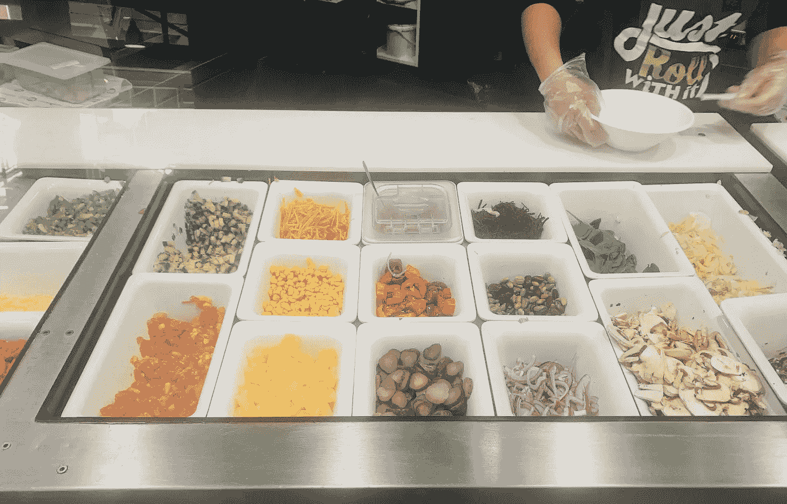

# 我想要一份沙拉，谢谢…

> 原文：<https://medium.datadriveninvestor.com/id-like-to-have-a-salad-please-191e0af8c523?source=collection_archive---------19----------------------->

你有没有注意到人们经历过“自己做”沙拉或三明治的经历？你有没有注意到为了吃到你的食物，你不得不经历的问题和快速决策的数量？

1.  你想点什么？
2.  多大尺寸——小号、中号还是大号？
3.  在这里吃还是带走？
4.  您想用什么方式付款——现金还是电子转账？客户提出的附加问题—您有 pay wave 吗？
5.  哪种面包——全麦面包还是白面包？
6.  你想在包裹里放什么？从以下食物中选择——生菜、黄瓜、小黄瓜、墨西哥胡椒、甜椒、菠萝、洋葱、毛豆、甜菜根、胡萝卜、玉米、西红柿，还有很多。
7.  有奶酪吗——羊乳酪还是切达干酪？
8.  有调味汁吗？从 12 个中选 2 个。
9.  盐和胡椒？
10.  烤的还是不烤的？

唷！你已经通过了装配线。我必须说，在回答了以上所有的问题后，我确实觉得我赚到了我的那顿饭。

 [## 宝贵的经验引领数字化成功之路|数据驱动的投资者

### 浮躁在线相当于数字营销的弊端。以错误的方式——或者根本没有——蒙混搜索引擎…

www.datadriveninvestor.com](https://www.datadriveninvestor.com/2020/10/08/valuable-lessons-lead-the-way-to-digital-success/) 

但是你认为人们需要这么多选择吗？根据希克定律*——“做决定所需的时间随着选择的数量和复杂性而增加”，所以*也许有一种方法可以简化这种体验？

作为一名顾客，我找到了自己优化这一过程的方法——我的秘诀是，一旦我发现自己喜欢什么，每次都点同样的东西。在我想冒险的日子里，我会调整我的装配线:-)

你呢？

## 获得专家视图— [订阅 DDI 英特尔](https://datadriveninvestor.com/ddi-intel)