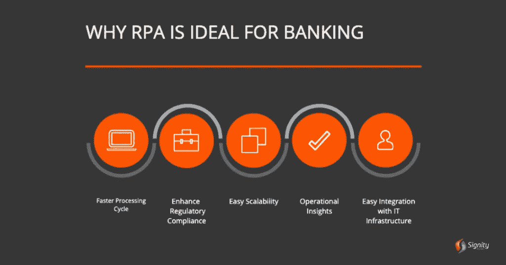
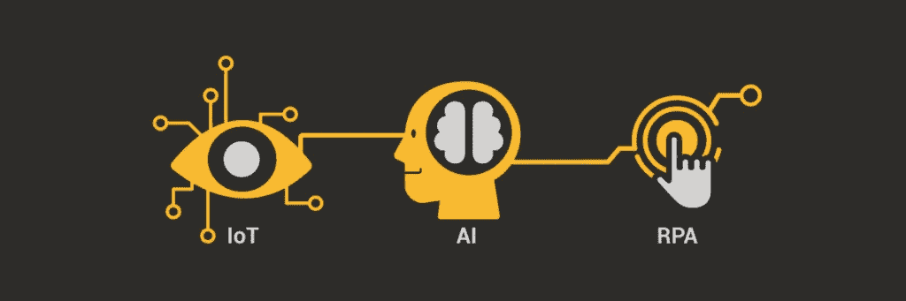
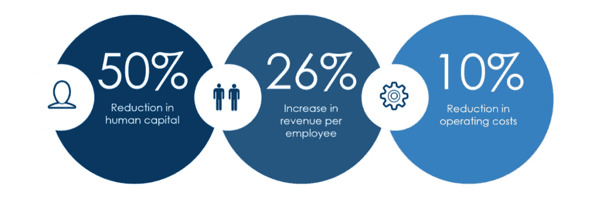
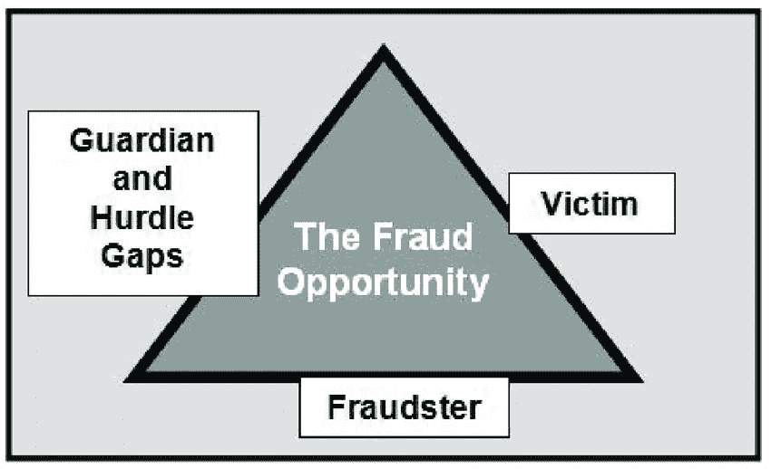
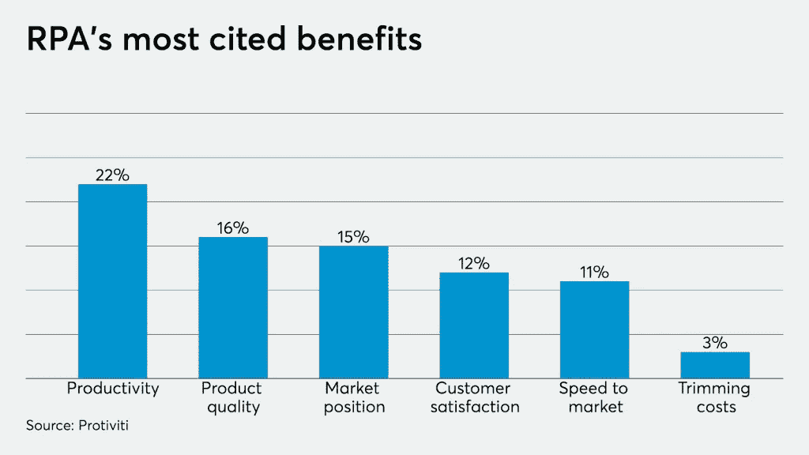

# 利用机器人流程自动化识别和打击欺诈

> 原文：<https://medium.datadriveninvestor.com/identifying-and-combating-fraud-with-robotic-process-automation-f9adc8b153a6?source=collection_archive---------3----------------------->

在当今的数字世界中，提供给普通公众并由普通公众参与的金融服务需要复杂的系统来收集、连接和关联相关数据——否则，这些金融科技系统将不可避免地停止运行。

这听起来可能像是对尖端金融科技技术的贬损，例如实施 RPA 进行欺诈检测，但事实并非如此。

相反，像客户尽职调查和法规遵从性这样的流程占用了金融公司的大部分时间和资源——我们并没有夸大其词。

> 机器人流程自动化提供了有效自动化这些流程的潜力，并将其转化为省时、经济的工作流程。

**但是等等；**

# 什么是机器人过程自动化？

> **“RPA 是自动化领域的最新发展，也是机器人革命的催化剂。”**

换句话说，RPA“机器人”(软件机器人)支持重复的、经常结构化的、基于规则的业务流程的自动化。他们这样做的方式是通过在遗留系统中模拟不同的人与各种软件的交互。

难怪，新时代的初创公司、企业和组织会在欺诈检测中采用 RPA。

然而，说得好听一点——这是对 RPA 非常有限的理解。为了从本质上理解机器人流程自动化，包括挑战、用例、不同的应用等等，请阅读我们不久前编写的这份 [**深入 RPA 指南**](https://www.signitysolutions.com/blog/rpa-robotic-process-automation/) 。

# 但是，为什么我们建议您查看 RPA 实施指南呢？

因为这将拓宽您的视野，使您能够更好地理解欺诈检测中的 RPA**。**

虽然 RPA 经常与多个银行和保险流程**(参见: [**RPA 用例 for F & A**](https://www.signitysolutions.com/blog/rpa-in-finance-accounting/) **)** 集成，但它在与主要自动化技术如**机器学习、自然语言流程、** [**人工神经网络**](https://www.signitysolutions.com/ai-machine-learning-development-services) 集成时会发现新的认知能力。**

总之，这些自动化技术可以代替数据分析师和其他经过认证的 FTE 人员，自动处理结构化和非结构化数据。

 [## 自动化已准备好带领我们走出危机，并赋予人们权力-以下是|数据驱动…

### 随着我们准备进入 2020 年下半年，并试图在全球预防性关闭后重新开启经济…

www.datadriveninvestor.com](https://www.datadriveninvestor.com/2020/06/23/automation-is-poised-to-lead-us-out-of-the-crisis-and-empower-people-here-is-how/) 

银行、保险公司和其他金融机构采用这种新时代的 RPA 技术来识别和打击欺诈——从多个服务线提取数据，而不是创建一堆[金融宏](https://www.proschoolonline.com/blog/macros-important-for-financial-modeling#:~:text=A%20macro%20is%20a%20collection,accurately%20and%20much%20more%20dependable.)。

现在，你们当中的怀疑者可能会说，当我们有传统的金融宏时，**为什么要在欺诈检测中使用 RPA 呢？**

**这是你的答案(不过，请注意——这是主观的)**

通过传统的自动化技术识别、打击和遏制欺诈会带来几个问题，而不是一个。

## 首先，传统的自动化和其他金融宏是不灵活的，因为它们缺乏交叉集成、实时行为分析、数据分析等核心选项。

有了这个基本的了解，让我们确定 RPA 如何帮助识别和遏制金融欺诈。

# RPA 如何用于打击金融欺诈？

> **与普遍看法相反，你不能用你的全部员工来代替 RPA 机器人。**

也就是说，如果你认为你可以给机械战警分配一张桌子并从中获利，那你可能错了。

如上所述，RPA 指的是软件机器人，它们自动完成对任何人来说都太单调的重复而平凡的任务。

**受益？廉价的解决方案。更快的流程。没有笔误。**

将自动化技术引入任何业务的财务方面，意味着利用它们的认知能力，并训练 RPA 机器人搜索和审查涉及识别、跟踪和标记欺诈活动的流程。

# 以下是 RPA 如何帮助降低欺诈风险:

# 1.重新评估当前流程

RPA 机器人可以自动及时审查当前和以前的金融交易，以识别指示非法(通常是欺诈性)活动和盗版的不均衡模式。

## 即使我们考虑一般情况:

RPA 的实施要求金融机构彻底理解、记录和评估具有最高成本效益潜力的流程。

随着金融专业人员经历这些阶段，他们对业务流程有了更深入的了解，并识别出高风险的金融领域。

**无论哪种方式，这些工作都有助于业务发起人和金融专业人士识别漏洞，并遏制业务流程中的欺诈行为。**

# 2.消除人为错误

这是先发制人，以确定正确的机会进行金融欺诈。用简单的术语来说

## "欺诈是一种机会犯罪。"

为了让这样的机会出现，员工要么必须不断地与财务流程互动和修补，要么错过微妙而关键的细节——造成差距。

如果发现这些缺口，可能会导致巨大的财务损失，在更糟糕的情况下，会迫使企业解散资产并终止运营。

**然而，当企业战略性地将 RPA 集成到经过深思熟虑和精心设计的业务流程中时，人与人之间的互动就会大大减少。**

**结果呢？**

企业员工可以将他们的注意力转移到其他高优先级任务上，限制与涉及数字和其他关键数据的高风险流程的交互。

> **一个额外的好处-** 随着人际交往的减少，笔误显著下降。

# 3.加强贸易监测

随着洗钱活动的增加，主要行业甚至国家都在采取智能自动化措施来打击金融恐怖主义和洗钱活动。您认为这些实体采用哪种技术来应对这些金融欺诈？

> **自动化讲台上突出显示了集成 RPA 的软件渠道。**

RPA 机器人在与其他自动化技术集成时，可以评估潜在欺诈的交易，并向危险的部门/领域标记高价值交易。

鉴于能够搜寻杂乱无章的信息和非结构化数据，RPA 机器人可以更准确地处理此类紧急情况；远胜于任何 FTE 员工。

# 4.自动删除临时块

银行操作和处理成千上万的账户，其中大部分会连续几个月不动。有时，当银行怀疑这些账户有任何可疑活动时，他们会将其置于临时封锁之下。

这些临时块过期了，但是块仍然存在——除非由金融专业人员手动解除阻止。

RPA 机器人可以有效地用于识别具有这些块的帐户，访问他们过去的活动，并取消限制。但是，只有当帐户活动符合已建立的封禁标准时，这种情况才有可能发生。

# 5.自动威胁检测

## “RPA 机器人非常适合结构化数据。”

监控数以千计的网站对一个人来说是一件大事，但对 RPA 机器人来说却算不了什么。让我们看两个 RPA 可以帮助自动检测威胁的案例:

# 6.侵犯版权

RPA 机器人通过快速监控可疑网站的专利、商业秘密和其他重要数据来防止侵犯版权。

# 7.产品定价

为了促进销售，一些公司可能会以更低的价格出售你的产品(一个技术上不可行的价格)。RPA 机器人收集和汇总定价数据，以检查您的产品是否在网上不道德地销售，或者低于设定的建议零售价。

# RPA 是欺诈检测的最佳解决方案吗？

我们希望答案是简单的“是”或“否”,但在欺诈检测方面，RPA 跨越了两种分类的界限。

RPA 最初是一项基本的自动化技术，但已经发展成为一个成熟的自主自动化系统，能够理解非结构化数据并发号施令。

如果我们采用简单的 RPA 自动化，它可能无法有效检测欺诈或记录不均衡的模式。但当我们使用这些简单的 RPA 机器人，但具有机器学习能力时，事情发生了转变。

机器学习算法执行一致的测试，唯一目的是识别交易中的异常和相关模式；增强的认知能力有助于这些机器人破译和报告这些金融异常作为欺诈活动。

# 在欺诈检测中使用 RPA 的挑战

机器人流程自动化为企业提供了 [**广泛的好处**](https://www.signitysolutions.com/blog/benefits-rpa-in-business/)——欺诈检测就是其中之一。但是，在欺诈检测中考虑和实施 RPA，以及遏制金融欺诈风险流程，需要深入的主题知识、专业技能和严格的监控。

你可以在公司内部做这件事，但这并不可取。

## 为什么？

实施 RPA 解决方案和升级基础架构并不便宜。更好的选择是 [**雇佣 RPA 实施专家**](https://www.signitysolutions.com/robotic-process-automation-rpa/) ，让他们评估您业务流程的自动化机会。

虽然在最初的实施阶段有点昂贵，但是 RPA 为银行、金融机构甚至您的企业提供了竞争优势。它不仅有助于欺诈检测，还能确保您的企业忽略无用的尝试，将成本保持在最低水平。

## **本博客原载于 2020 年 6 月 23 日** [**重大解决方案**](https://www.signitysolutions.com/blog/rpa-in-fraud-detection/) **。**

## 访问专家视图— [订阅 DDI 英特尔](https://datadriveninvestor.com/ddi-intel)

***申请成为 DDIChat 专家*** [***这里***](https://app.ddichat.com/expertsignup) ***。
使用 DDI 的方法:***[***https://datadriveninvestor.com/collaborate***](https://datadriveninvestor.com/collaborate) ***访问我们的***[***https://www.datadriveninvestor.com/***](https://www.datadriveninvestor.com/)