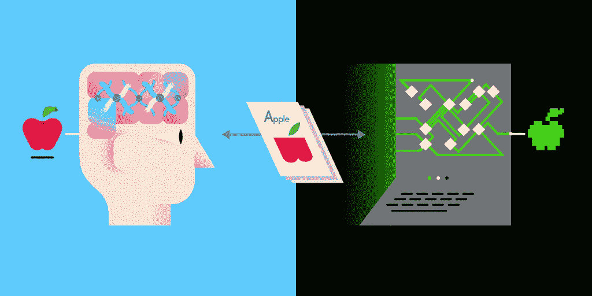
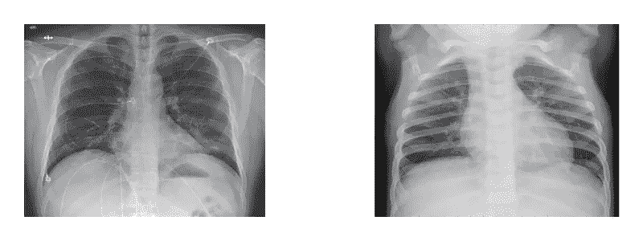
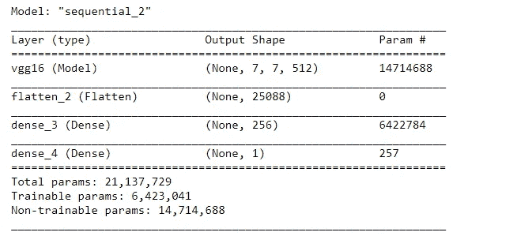
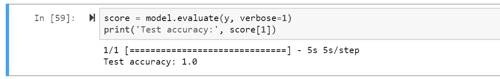
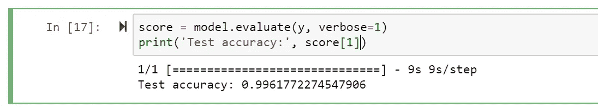
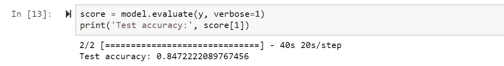

# 用禽流感病毒鉴定新冠肺炎诱发的肺炎

> 原文：<https://medium.datadriveninvestor.com/identifying-covid-19-induced-pneumonia-with-ai-5ae7fb5ee97b?source=collection_archive---------7----------------------->

## 基于迁移学习的 Keras VGG16 在胸片肺炎检测中的应用

当前的新冠肺炎疫情给医疗系统带来了巨大的压力，医院超负荷运转，缺乏检测能力，甚至出现了假冒的新冠肺炎检测试剂盒。由于胸部 x 光片通常用于识别肺炎的迹象，我认为确定病毒性和细菌性肺炎感染将是一个有趣的挑战！

## 为什么要做胸透？

胸透是一种针对 T4 呼吸系统疾病的 T2 成像研究。在严重的新冠肺炎病例中，胸部 x 光显示出肺炎的迹象，这些 x 光可以帮助更好地了解患者肺部的健康状况。

相比之下，CT 扫描是一种更加昂贵的专业成像研究，它使用 X 射线对胸部进行 3D 成像。虽然 CT 为诊断提供了更好的图像，但 X 射线更加普遍*(我只能找到 X 射线的数据)*。

## 时间紧迫

x 射线分析需要放射学专家的专业知识，即使在疫情之外，等待时间也很长。等待结果的平均时间约为 **11 天**，约为 2 周。虽然放射科医生平均需要 20 分钟来检查一张 x 光片，但工作量一直在增加。通过减少诊断肺炎的时间，患者可以更快地接受治疗！

> **免责声明:** *我的目的是学习和试验应用我的技能的方法(同时也有乐趣)，我不是医学专业人士。我姐姐回答了我所有关于肺炎的问题，谢谢姐姐！)*
> 
> X 射线不是用于诊断新冠肺炎病，而是用于诊断肺炎，你不能仅仅通过胸部 X 射线对新冠肺炎做出有把握的诊断。也就是说，能够诊断肺炎以及它是来自细菌还是病毒来源，可以帮助决定采用哪种确认方法。基本上我的意思是 X 射线是诊断新冠肺炎的多学科方法的一部分。



Image Credit: [https://www.cybiant.com/wp-content/uploads/2020/01/CKC-ANN-Gif.gif](https://www.cybiant.com/wp-content/uploads/2020/01/CKC-ANN-Gif.gif)

# 🃏的游戏计划

我们将收集健康患者、病毒性肺炎患者、细菌性肺炎患者和 COVID 患者的 X 射线数据。我们将构建一个 VGG19 模型，实现迁移学习，并测试该模型在三种不同场景中的分类能力:

1.  COVID 与正常
2.  病毒性肺炎 vs 细菌性肺炎 vs 正常
3.  COVID vs 病毒性肺炎 vs 细菌性肺炎 vs 正常

然后进行后期分析，重新优化模型，多做探索！

# 等等，什么是迁移学习？🎯

这是一个**深度学习概念**，你获取一个**现有的**保存的模型，它已经花时间对大量数据进行了训练，并将它从经验中学习到的**特性**应用到你的新问题中。(有点像你可以借用某人演奏古典钢琴的经验和专业知识，然后把它演奏得更有活力。)

您可以调整和改变它们以适应您的情况，比如只使用部分训练模型，而不使用其他层。转移学习让你**利用**相关**任务的过去知识**来解决当前问题。

[](https://www.datadriveninvestor.com/2020/02/12/has-general-ai-exceeded-the-intellectual-capacity-of-humans/) [## AI 将军是否已经超过了人类的智力容量？数据驱动的投资者

### 不仅在游戏中，而且在劳动力市场上，机器都比人类聪明。在今天的许多领域，使用…

www.datadriveninvestor.com](https://www.datadriveninvestor.com/2020/02/12/has-general-ai-exceeded-the-intellectual-capacity-of-humans/) 

由于我们借用了一个已经在提取特征方面受过训练的模型，我可以通过减少**数据**来解决这个问题，这是我在寻找 x 射线数据时遇到的问题。

# VGG16 —很复杂🏆

VGG16 听起来像科幻小说中的东西，但它实际上只是一种[卷积神经网络(CNN)](https://medium.com/@ariel.yc.liu/how-convolutional-neural-networks-learn-to-classify-images-d02ac860f5df) **架构**。 [*(背景知识看我之前在 CNN 上的文章在这里！)*](https://medium.com/@ariel.yc.liu/how-convolutional-neural-networks-learn-to-classify-images-d02ac860f5df)

它在 2014 年赢得了 Imagenet 竞赛，并以其为**图像识别**量身定制的视觉模型架构而闻名。VGG16 是由卷积层和最大池层的多种排列组成的大型网络。

我在 Keras 中使用了 VGG16 模型，但是逐行构建也很简单，就像 Keras 中的任何其他**顺序**模型一样。


Image Credit: [https://www.researchgate.net/profile/Max_Ferguson/publication/322512435/figure/fig3/AS:697390994567179@1543282378794/Fig-A1-The-standard-VGG-16-network-architecture-as-proposed-in-32-Note-that-only.png](https://www.researchgate.net/profile/Max_Ferguson/publication/322512435/figure/fig3/AS:697390994567179@1543282378794/Fig-A1-The-standard-VGG-16-network-architecture-as-proposed-in-32-Note-that-only.png)

# 收集 x 光片🔎

幸运的是，我只需将两个数据集结合起来就可以形成我的训练数据。Kaggle 有一个很好的胸部 x 光数据集，包括健康肺的样本，以及病毒性和细菌性肺炎的样本。蒙特利尔大学的约瑟夫·保罗·寇恩博士是一位受上帝保佑的人，他收集了一组来自新冠肺炎患者的胸部 x 光片。这样，我们就有了完整的训练数据！

```
[# Prepping the image data for training](https://keras.io/preprocessing/image/)
X = ImageDataGenerator().flow_from_directory(directory="train", target_size=(224,224), class_mode="binary")
y = ImageDataGenerator().flow_from_directory(directory="test", target_size=(224,224), class_mode="binary") 
```



COVID infected patient on the left, and healthy patient on the right

# 建立🧠模型

我导入了预训练的 VGG16 模型用于迁移学习，并在顺序模型中添加了我自己的密集层。由于这是一个**二元分类**问题，我为最终输出层选择了一个简单的 **sigmoid** 激活函数。稍后，当我训练模型执行多类分类时，输出图层将会更改。

```
conv = VGG16(include_top=False, weights='imagenet', input_shape=(224, 224, 3))
conv.trainable = Falsemodel = Sequential()
model.add(conv)
model.add(Flatten())
model.add(Dense(256, activation='relu'))
model.add(Dense(1, activation='sigmoid'))
model.summary()
```



The Model Structure

# 训练模型🔧

然后我开始编译模型。由于我们要解决的第一个问题是一个**二进制分类问题**，我从“二进制交叉熵”开始，后来使用了“分类交叉熵”。对于**优化器**，用于在训练期间更新权重的算法我使用了 Adam，但是调整了**学习** **速率**，因为模型在技术上已经被训练了一些。

```
model.compile(loss='binary_crossentropy', optimizer=optimizers.Adam(lr=learn_rate), metrics=['accuracy'])
```

然后我对模型进行了训练，实现了两个回调，**早期** **停止**和**模型** **检查点**。

```
hi = model.fit_generator(generator=X, steps_per_epoch=st_epo, epochs=n_epo, validation_data=y, callbacks=[checkpoint,earlystop])
```

## 提前停止🛑

这是一种 Keras 回调，有助于确保你在训练中取得进展，而不是浪费时间。 [*(查阅 Keras 回调指南)*](https://keras.io/callbacks/)

提前停止监控某个**指标**在这种情况下，如果模型的性能没有实质性的改进，验证准确性和**提前停止****训练**。但是你也必须意识到，进步并不总是线性的，训练在开始改善之前可能会停滞甚至减少，这就是为什么你应该有一个**缓冲**或**延迟**触发。

```
earlystop = EarlyStopping(monitor='val_acc', min_delta=0, patience=40, verbose=1, mode='auto')monitor: metric to be monitor
min_delta: minimum valid change in val_acc to matter
patience: Epochs with the same metric value with no improvement that triggers the end of training
verbose 1: show progress bar
mode: In this case activates when val_acc stops increasing
```

## 模型检查点🚩

这实际上和游戏一样，每隔一段时间你就**保存**你的进度。在该回调中，当某个**度量**(最有可能的准确度)在当前时期上升一个增量时。网络及其权重作为. h5 文件保存在由多维数据数组构成的**分层** **数据** **格式**中。

```
checkpoint = ModelCheckpoint("Pneumonia.h5", monitor='val_acc', verbose=1, save_best_only=True, mode='auto', period=1)monitor: metric to monitor
verbose: show progress bar
save_best_only: The latest model overwrites the past version
mode: The choice to save file in this case it's based on the maximization of val_acc
period: Amount of epochs between checkpoints
```

# 结果✨

## **COVID vs Normal — %100**

该模型能够完全正确地执行任务，还需要更多的数据进行进一步的测试。



**病毒性肺炎 vs 细菌性肺炎 vs 正常— %99**

它能够以大约 99%的准确度区分这三种情况。



**肺炎 vs 病毒性肺炎 vs 细菌性肺炎 vs 正常— %80**

结束时约为 **80%** 很难将 COVID 与病毒性肺炎数据区分开来，因为 COVID 是一种病毒，它会导致肺炎症状。



我发现训练有素、经验丰富的**放射科医生**可以区分病毒性肺炎和细菌性肺炎，我的模型可以做到这一点。但是不可能区分 COVID 诱导的病毒性肺炎和其他病毒性肺炎，这就是为什么你需要进行**病毒性** **测试**。

这是有意义的，因为胸部 x 光或 CT 扫描被用作初步工具来**监测疾病的进展**或评估严重程度，而**而非**诊断 COVID。而像**病毒咽拭子**这样的病毒测试是一种针对该疾病的特定测试，能够从图像发现中确认任何怀疑。

# 关键概念📌

*   **迁移学习—** 使用**已训练的特征**现有**模型并将其应用于相关问题**
*   **VGG16 —** 一种为图像识别而设计的 **CNN 架构**
*   **提前停止—** 知道何时**停止训练**当不再有任何**改进的时候**
*   **模型检查点——当**指标**(如精确度)大幅增加时保存**模型

如果你想在未来阅读更多的文章，给我的帐户一个关注！

与此同时，请随时在 ariel.yc.liu@gmail.com 与我联系，或者在 LinkedIn 上与我联系。

你也可以在这里阅读我的每月简讯[！](http://eepurl.com/gYMHFv)

或者访问我的个人网站查看我的全部作品集[这里](http://liuariel.com/)！

下次见！👋