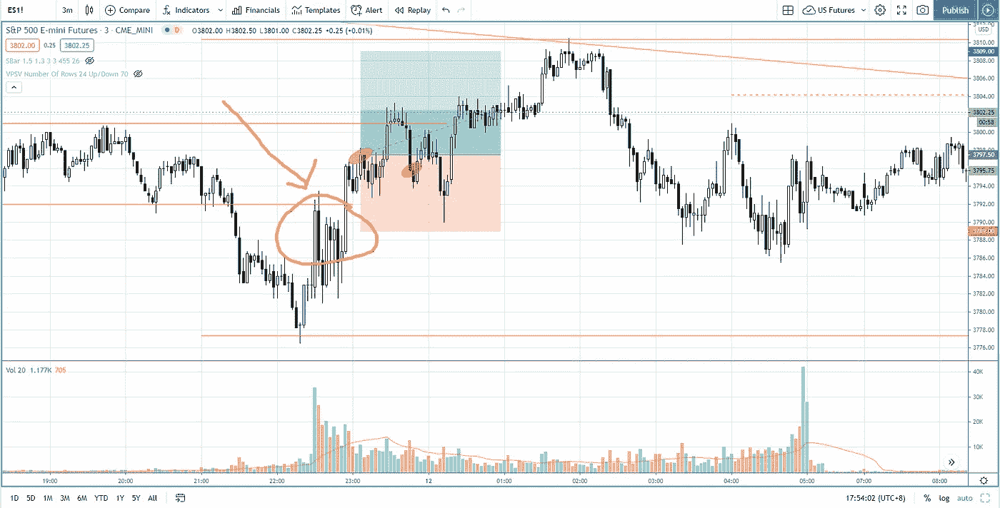

# 将失败的信号识别为最佳交易入口——标准普尔 500 日交易

> 原文：<https://medium.datadriveninvestor.com/identifying-failed-signal-as-best-trading-entries-s-p-500-day-trading-682171cbeb8?source=collection_archive---------28----------------------->

失败的信号是交易进场的最好信号。在“交易回顾”部分，了解如何将失败的信号识别为交易条目，以便利用趋势。

观看视频，了解 2021 年 1 月 6 日交易时段标准普尔 500 指数期货的**市场分析。在这个视频中，你将看到上一个交易日的市场回顾和三分钟的交易回顾(包括进场、出场和背后的原理)。展望未来，我将涵盖偏见，要注意的关键水平，我稍后的交易计划。**

## 时间戳

*   [1:00](https://www.youtube.com/watch?v=d5FOzU222J8&t=60s) 市场回顾
*   [2:02](https://www.youtube.com/watch?v=d5FOzU222J8&t=122s) 推力缩短
*   [4:05](https://www.youtube.com/watch?v=d5FOzU222J8&t=245s) 行业回顾
*   疲软的迹象看跌市场方向
*   [8:12](https://www.youtube.com/watch?v=d5FOzU222J8&t=492s) 交易进入失败信号
*   [12:48](https://www.youtube.com/watch?v=d5FOzU222J8&t=768s) 当前股市展望

如果你还没有看我在上一次会议中的[市场分析视频](https://www.youtube.com/watch?v=7tJREVbn7AM)，以便更好地与市场回顾和贸易评论相关联。

**偏向** —中性(日内交易)；看涨(长期)

**关键点位** —阻力:3825，3810；支持:3775，3720

**潜在设置** —在关键级别寻找潜在反转。

# 资源

**每周市场展望&最佳交易建议**直达您的收件箱:[https://www.tradeprecise.com/](https://www.tradeprecise.com/)

**职业免费**制图平台:创建账户→[www.TradingView.com](https://bit.ly/2U2Femd)

**非美国居民？** ( **马来西亚、新加坡**、澳大利亚、新西兰、欧洲等):[点击此处，存款 2000 新加坡元](https://ji.hn/sgtiger)即可获得**免费股票(价值 100++美元&老虎经纪**的欢迎礼物)

美国居民？[点击此处，存款 1500 美元](https://ji.hn/ustradeup)，就有机会在 TradeUP 获得**份免费的 AMZN(价值 3000++** ) & **份欢迎礼物**

**从媒体获取无限文章** —加入以下:[https://priceactiontrading.medium.com/membership](https://priceactiontrading.medium.com/membership)

Photo by Author — Ming Jong Tey

# 进一步阅读

 [## 抓住底部和上升趋势开始的 3 个简单步骤——标准普尔 500 日交易

### 找出如何使用这 3 个简单的步骤来抓住底部，并参与上升趋势的开始，当一天…

medium.com](https://medium.com/datadriveninvestor/3-simple-steps-to-catch-the-bottom-and-the-start-of-the-uptrend-s-p-500-day-trading-5b1097b081a0)  [## 小范围分销的点和图目标——标准普尔 500 日交易

### 了解如何用点和图(P&F)在 3 分钟的时间范围内预测下跌目标…

medium.com](https://medium.com/datadriveninvestor/point-figure-target-for-a-small-distribution-range-s-p-500-day-trading-6ac7c1bddf59)  [## 如何在标准普尔 500 日交易中使用成交量价差分析作为计时工具

### 了解如何使用交易量价差分析来确定标准普尔 500 期货日内交易的时间…

medium.com](https://medium.com/datadriveninvestor/how-to-use-volume-spread-analysis-as-a-timing-tool-in-s-p-500-day-trading-4848d65fe283) 

Photo by Author — Ming Jong Tey

披露:如果您点击本文中的链接进行购买或开立账户，并将所需金额存入推荐的经纪人账户，我们将免费为您赚取佣金。

免责声明:本演示中的信息仅用于教育目的，不应作为投资建议。