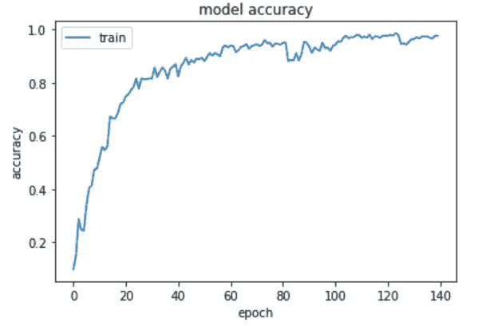

# 通过卷积神经网络识别图像中的食物

> 原文：<https://medium.datadriveninvestor.com/identifying-food-in-images-through-convolutional-neural-networks-a301984ccac3?source=collection_archive---------3----------------------->

Photo by [Charles](https://unsplash.com/@charlesdeluvio?utm_source=medium&utm_medium=referral) on [Unsplash](https://unsplash.com?utm_source=medium&utm_medium=referral)

渥太华大学发布了一组各种类型食物的图像数据集，目的是创建一个可以识别食物并估计其营养价值的模型。作为概念的证明，我决定创建一个识别食物的模型。

 [## 修复摄影|数据驱动的投资者

### 汤姆·津伯洛夫在转向摄影之前曾在南加州大学学习音乐。作为一个…

www.datadriveninvestor.com](https://www.datadriveninvestor.com/2019/03/22/fixing-photography/) 

*食物检测数据集(FooDD)* 由 3000 张图片组成，这些图片被组织到 20 个文件夹中，从苹果到西瓜。这些图像的大部分是由研究人员自己拍摄的。其中 19 个文件夹被细分为使用的相机类型和背景中的光照量。一类包含从互联网搜索获得的图像。

# 步骤 1:准备数据

这个项目的第一步是为机器学习模型准备数据。为了实现这一点，我首先决定通过导入灰度来简化图像数据，因为灰度图像比 RGB 图像需要更少的信息来处理。然后，我调整了每个图像的大小，以便运行时间和 RAM 的使用保持在最低水平。下面是这一步的代码，以及对代码每一部分的简要解释。

# 步骤 2:构建模型

现在我们的数据已经准备好了，我们可以开始建立机器学习模型了。我将在这个项目中使用卷积神经网络(CNN)算法。简而言之，CNN 拍摄一幅图像，并对图像中不同的物体赋予重要性。该算法进一步缩小图像，以便进一步简化处理。该算法然后处理该图像并编译数据。每当模型通过这种算法时，它在处理数据和正确分类方面变得更有效。我还根据算法运行的次数测试了模型的准确性。一个事件就是一个时代。下面是这一步的代码，其中对代码的每一部分都做了简要的解释。

我用 140 个时期运行了这个模型，结果显示对图像中的食物进行正确分类的准确率为 97%。下图说明了历元数和精确度之间的关系。

# 步骤 3:对图像进行分类

创建模型后，下一步也是最后一步是创建一个函数，该函数可以获取新图像并对食物进行分类。因为模型是用调整大小的灰度图像训练的，所以每个新图像也必须调整大小并转换成灰度图像。下面是转换新图像并将其归类为 19 种食物之一的代码，以及代码各部分的简要说明。

# 结论

我在上面创建的模型似乎能够正确地对 food 中的食物进行分类。虽然它能够在 FooDD 中对图像进行分类，但在更普遍的环境中，该模型可能不会那么准确。例如，我测试了这个模型，给它一个未成熟(也就是绿色)的香蕉图像。该模型将这种香蕉归类为黄瓜，大概是因为它又长又瘦，还是绿色的。该模型当然有效，但它可能没有足够的数据将绿香蕉归类为香蕉。该模型的准确性可以通过提供不同类型食物的更多图像数据来提高。

我的项目*到此结束。*要查看这个故事的所有代码，请访问 https://github.com/lanzo-siega/FooDD-classification。为了及时了解我未来的项目，请在 Medium 上关注我，或者在 https://www.linkedin.com/in/lanzo-siega/[的 LinkedIn 上关注我。感谢您的阅读！](https://www.linkedin.com/in/lanzo-siega/)

# 参考

页（page 的缩写）Pouladzadeh、A. Yassine 和 S. Shirmohammadi，“FooDD:使用食品图像进行卡路里测量的食品检测数据集”，载于*图像分析和处理的新趋势— ICIAP 2015 研讨会*，V. Murino、E. Puppo、D. Sona、M. Cristani 和 C. Sansone，《计算机科学讲义》，Springer，第 9281 卷，2015 年，ISBN:978–3–319–23221–8，第 441 页 DOI:[10.1007/978–3–319–23222–5 _ 54](http://dx.doi.org/10.1007/978-3-319-23222-5_54)