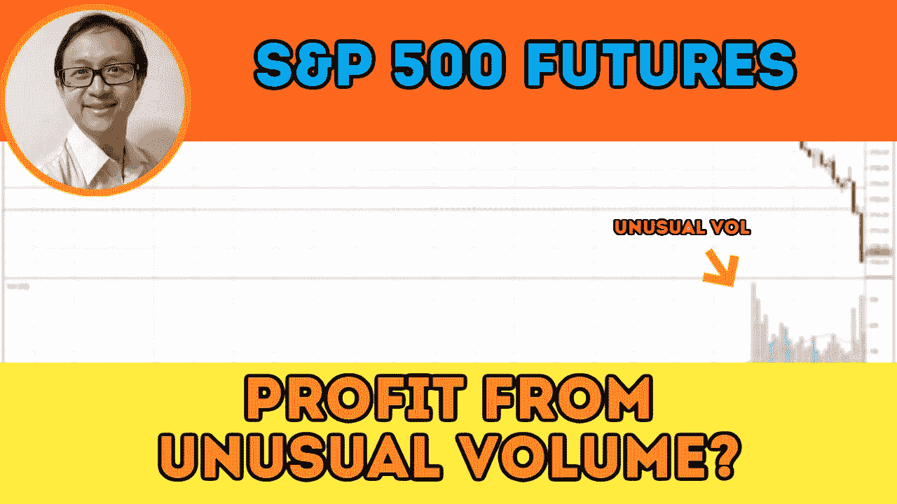

# 用异常的交易量和价格确定市场方向——标准普尔 500 日交易

> 原文：<https://medium.datadriveninvestor.com/identifying-market-direction-with-unusual-volume-and-price-s-p-500-day-trading-eec9fb9854b5?source=collection_archive---------6----------------------->

了解如何在没有任何技术指标的情况下，在日内交易标准普尔 500 期货时，用异常的成交量和价格来确定趋势的市场方向。

观看视频，了解 2021 年 1 月 6 日交易时段标准普尔 500 指数的**市场分析。在这个视频中，你将看到上一个交易日的市场回顾和三分钟的交易回顾(包括进场、出场和背后的原理)。展望未来，我将涵盖偏见，要注意的关键水平，我稍后的交易计划。**

## 时间戳

*   [0:52](https://www.youtube.com/watch?v=7tJREVbn7AM&t=52s) 市场回顾
*   [4:20](https://www.youtube.com/watch?v=7tJREVbn7AM&t=260s) 贸易回顾
*   [6:55](https://www.youtube.com/watch?v=7tJREVbn7AM&t=415s) 看跌市场方向
*   [7:20](https://www.youtube.com/watch?v=7tJREVbn7AM&t=440s) 异常音量
*   [10:20](https://www.youtube.com/watch?v=7tJREVbn7AM&t=620s) 比较异常量
*   [12:30](https://www.youtube.com/watch?v=7tJREVbn7AM&t=750s) 威科夫的努力与结果
*   [15:00](https://www.youtube.com/watch?v=7tJREVbn7AM&t=900s) 交易进场机会
*   [17:45](https://www.youtube.com/watch?v=7tJREVbn7AM&t=1065s) 当前股市展望

如果你还没有看我在上一次会议中的[市场分析视频](https://www.youtube.com/watch?v=P0Ir_YXMyD8)，以便更好地与市场回顾和贸易评论相关联。

**偏向** —中性(日内交易)；看涨(长期)

**关键点位** —阻力:3770，3720；支持:3670–3680

**潜在设置** —在关键级别寻找潜在反转。

# 资源

**每周市场展望&最佳交易建议**直达您的收件箱:[https://www.tradeprecise.com/](https://www.tradeprecise.com/)

**专业免费**制图平台:创建账户→[www.TradingView.com](https://bit.ly/2U2Femd)

**非美国居民？** ( **、新加波**、澳洲、纽西兰、欧洲等……):[点击此处，存款 2000 新币](https://ji.hn/sgtiger)即可获得**免费股票(价值 100++ &美元)老虎经纪公司的欢迎礼物**

美国居民？[点击此处，当您存入 1500 美元](https://ji.hn/ustradeup)时，就有机会在 TradeUP 上获得一份**免费的 AMZN 股票(价值 3000++美元** ) & **欢迎礼物**

**无限制访问媒体文章** —加入以下:[https://priceactiontrading.medium.com/membership](https://priceactiontrading.medium.com/membership)

# 进一步阅读

 [## 凯西·伍德警告市场即将调整——标准普尔 500 价格走势分析

### 在 2020 年 12 月 18 日对彭博的采访中，方舟投资公司的首席执行官兼首席信息官凯西·伍德警告说…

medium.com](https://medium.com/datadriveninvestor/cathie-wood-warns-market-correction-soon-price-action-analysis-on-s-p-500-7e621e013310)  [## 第 51 周标准普尔 500 股市综述——表现最佳的 9 只生物技术股票

### 第 50 周股市综述中提到的指数在 2020 年 12 月 14 日达到历史高点后的回调…

medium.com](https://medium.com/datadriveninvestor/week-51-s-p-500-stock-market-roundup-top-9-best-performing-biotechnology-stocks-826544927e9d)  [## 第 50 周标准普尔 500 股市综述及股票观察名单更新

### 供应的增加在 2020 年 12 月 9 日打击了标准普尔 500 期货，随后是相对较高的 3 天反应…

priceactiontrading.medium.com](https://priceactiontrading.medium.com/week-50-s-p-500-stock-market-roundup-stock-watchlist-update-b068799a3b23) 

Photo by Author — Ming Jong Tey

披露:如果您点击本文中的链接进行购买或开立账户，并将所需金额存入推荐的经纪人账户，我们将免费为您赚取佣金。

免责声明:本演示中的信息仅用于教育目的，不应作为投资建议。