# 如果现金为王，那么美元现金目前是世界总统

> 原文：<https://medium.datadriveninvestor.com/if-cash-is-king-then-dollar-cash-currently-is-world-president-fdd52bdcf4fa?source=collection_archive---------3----------------------->

**总结**

*   一个关于冠状病毒传奇进入主流媒体前 5 天如何开始的故事。
*   对美元的需求是巨大的，这加剧了整个金融市场的混乱，我们应该期待继续升值。
*   我们已经从资本回流过渡到由短缺主导的新局面，资本回流最初导致美元疲软，因为套利交易结构正在解除。
*   信贷/融资渠道的崩溃(3m FRA-OIS 利差和 TED 利差)，继续推动对美元的巨大需求，因为它传达了短缺。

“历史永远不会重演，但它会押韵，”马克·吐温说。如果事情发展的速度可能让你感到困惑，历史告诉我们，基于 2008 年的上一次流动性事件和后来发生的剧烈波动，世界储备货币的波动和升值可能才刚刚开始。

一切可以出售的东西都以美元为单位出售。如果我们认为这种情况会很快好转，那就太愚蠢了——也许要等到新的新冠肺炎病例开始减少。我们可能会开始听到干预外汇市场的言论——如果不削弱美元的话，至少是为了平息混乱的市场。

 [## 算法交易的机器学习|数据驱动的投资者

### 当你的一个朋友在脸书上传你的新海滩照，平台建议给你的脸加上标签，这是…

www.datadriveninvestor.com](https://www.datadriveninvestor.com/2019/01/30/machine-learning-for-stock-market-investing/) 

**这是一个关于市场如何从长期套利交易敞口到资本回流，最终导致美元流动性紧缩的故事，以及为什么展望未来，我们应该预计美元将继续升值。**

国际清算银行关于 G10 外汇交易额的数据提供了一种衡量外汇市场流动性的方法，并显示了美元(不出所料)在总交易中占 88%的比例。欧元和日元的流动性也相当高，而挪威克朗、瑞典克朗和新西兰元的流动性排名垫底。

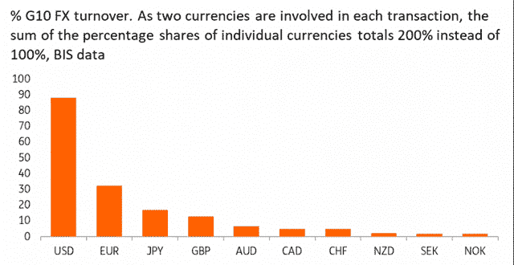

劳尔·保罗(全球宏观投资者)最近说:

“我刚刚平仓了股票、石油和 HYG 的所有空头头寸，不久前还平仓了债券。我现在 100%关注美元，这是一个毁灭性的球。我认为，当局没有机会了解市场的动态。一个接一个，他们正在关闭。随着全球金融架构的关键部分完全停止运转，所有流动性都消失了。最终结果将是我们有生之年从未见过的对美元的争夺。20 世纪 30 年代是我们最后一次看到这种情况，当时资金涌入美国，最终迫使美元对黄金贬值。正如我一直所说的那样，这一次，美元体系正处于危险之中。它将通过美元走强，而不是走弱来发挥作用。我看不到任何阻止这种情况的机制。油价在几周内跌至 22 美元，这是全球融资市场无法承受的冲击。随着世界的关闭，没有足够的美元产生。没有缓解这一问题的筹资机制。我认为互换额度是行不通的。没有办法创造出离岸市场所需的 15 万亿美元，同时弥补美国国内的美元短缺。这对新兴市场和全球经济以及银行体系来说，将会变得非常非常糟糕。美国在后监管时代有自己的一系列问题。后 GFC 时代的所有全球监管都将不得不取消，但我不确定我们有时间去改变。最后，我们需要从头开始创建一个新的系统。长期以来，全球央行一直在告诉我们这一点。这需要时间来完成，央行的资产负债表将爆炸式增长到从未想象过的水平。我们创造了完美风暴。一场无法想象的全球金融、经济和潜在的人道主义危机将夺走一切，我们必须阻止它。"

谈到一个可能的范式转变和见证历史上最大的债务扩张，你可以参考我的文章:[“为世界历史书写新篇章”](https://www.trading-manifesto.com/blog/writing-a-new-chapter-for-world-history)。

**故事如何开始:**

不久前，准确地说是今年 1 月 17 日，也就是冠状病毒事件进入主流媒体的 5 天前，我们目睹了外汇波动的历史新低。

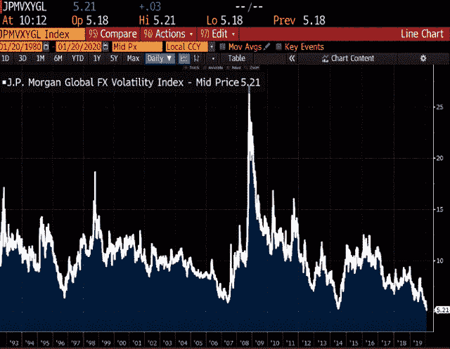

作为这种低交易量环境的副产品，外汇(FX)投机者开始流行借入一种低利率货币，将其用作融资货币。

虽然任何世界货币都可以成为融资货币。最近，由于激进的货币刺激政策导致低利率，欧元、日元和瑞士法郎都是首选的融资货币。套利交易的要点在于，融资货币为货币套利交易提供资金有两个主要目的。第一显然是在利差上赚钱。第二个目标是从资本增值中获利。图 1

欧元兑美元 4H 图(2020 年 1 月 17 日至 2 月 17 日，红色)图 1:

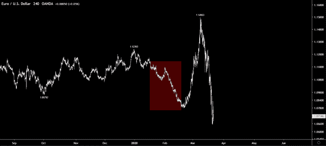

一个有效的套息交易策略不仅仅是做多收益率最高的货币，做空收益率最低的货币。当前的利率水平固然重要，但更重要的是未来的利率走向。例如，如果美国央行在澳大利亚央行结束紧缩之际加息，美元兑澳元可能升值。此外，套利交易只有在市场自满或乐观的时候才会发生。不确定性、担忧和恐惧会导致投资者平仓套利交易。

这就是事情的经过。

正如我们所看到的，由于新冠肺炎卷所表达的措施，如 VIX 尖峰与摆动喜欢我们没有看到自 GFC 以来，有一个突然的冲击。

作为调整投资组合以适应新现实的一部分，融资货币空头头寸被平仓，导致欧元、瑞郎和日元强劲升值。图 2

欧元兑美元 4H 图(2 月 17 日-3 月 9 日，红色)图 2:

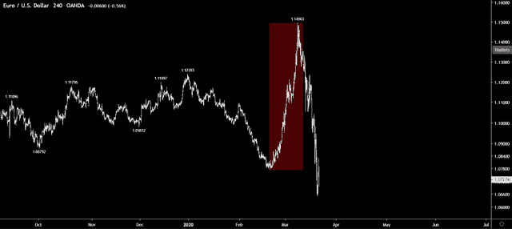

以上强调的风险突然出现，主要原因包括对冲导致的被迫抛售融资货币、杠杆过高导致的追加保证金通知。这一事件就是我们所说的，随着套息交易多头交易的崩溃，资本回流至融资货币。

**美元流动性危机时代**

随着套利交易的大量减少，大部分资金回流至融资货币，市场现已非常迅速地转向平衡美元多头头寸。

因此，在美元方面，随着套利交易结构的解除，我们已经从最初导致美元疲软的资本回流(见图 3)过渡到以美元短缺为主导的新情景。

DXY 日线图(图 3)

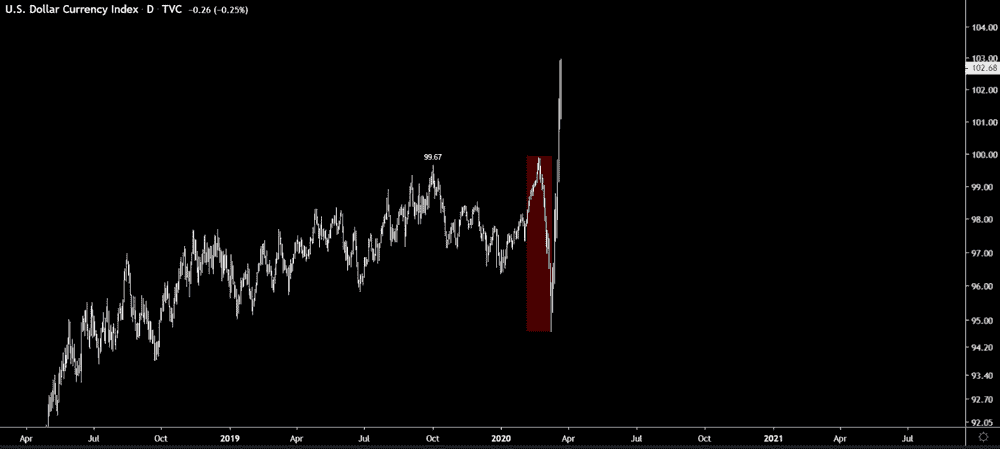

就像消费者开始抢购卫生纸一样，世界各地的公司和机构都造成了美元短缺，因为一些参与者囤积了超过他们立即需要的货币，以应对对冠状病毒的担忧。在困难时期，各种公司、银行和投资者都想持有美元。它是世界储备货币，被认为是最安全的。

随着世界各地的机构和公司争相降低信贷额度并寻求美元来满足融资需求，美元兑其他货币继续飙升。美联储的回应是向其他外国央行打开水龙头，但迄今为止，其努力未能平息美元的极度上行波动。图 4a、4b

欧元兑美元 4H 图(3 月 9 日-3 月 20 日，红色)图 4a:

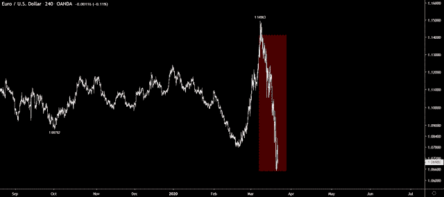

因此，随着金融市场的倾斜，对美元的需求是巨大的，这加剧了整个金融市场的混乱。需求来自各种渠道——银行、美元计价债券的发行者；出售美元资产的投资者；为美国业务寻找现金的公司；以及希望帮助客户的外资银行。所有这些都在给人民币施压。投资者一直在世界各地抛售金融资产，这加剧了对美元的需求，并导致美元贬值。抛售也像滚雪球一样，引发了更多的资产抛售，以及对美元的更多需求。

正因为如此，随着被迫抛售和大规模清算开始，我们正处于被认为是全球现金热潮的开端。

截至 2020 年 3 月 21 日，另一位投资组合经理表示:

在过去的几个小时里，我从我的一些在军队和国家安全部门工作的联系人那里听说(其他成员也证实了这一点),美国政府很有可能在不久的将来宣布对所有公民进行全国范围的隔离(在接下来的 72 小时内)。军队和国民警卫队正在动员，执行为期数周的封锁任务，防止骚乱和抢劫。这意味着，所有非必要的企业都将关闭，所有人都将被迫呆在家里。如果发生这种情况，市场也有可能关闭。几天前，由于信贷市场基本崩溃，我把我的整个投资组合都换成了现金。如果隔离生效，现金是更好的选择。

DXY 日线图(3 月 9 日-3 月 20 日，红色)图 4b:

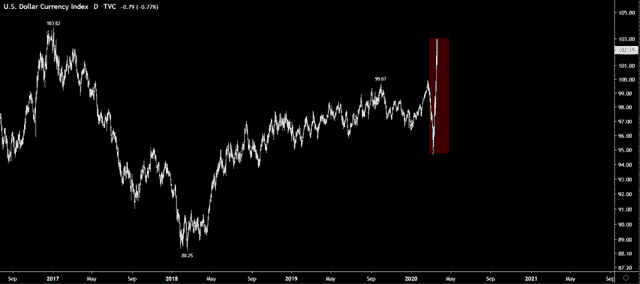

**泰德和弗拉-OIS 利差**

TED 和 FRA-OIS 利差的扩大——被许多人视为银行业风险的代表——反映了人们的担忧，即随着新型冠状病毒对经济造成损害，企业将陷入困境。这使得银行间借贷风险更大，因为如果公司倒闭，银行将遭受损失。感知到的额外风险意味着银行将要求更高的利息支付，从而导致利差的增加。泰德和伦敦银行同业拆借利率-OIS 告诉你，当机构关闭流动性。

TED spread:

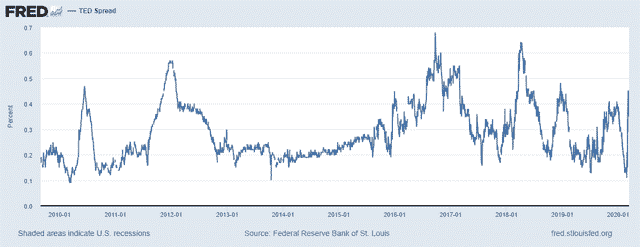

**TED 息差继续扩大，显示了外国美元市场的压力，因为 13 万亿美元(根据国际清算银行的数据)的外债寻求美元来偿还这些债务。**

除了大规模 QE 之外，美联储最近将货币互换从每周一次改为每天一次，以解决这一问题。早在 2008 年，美联储用了大约 6 周的时间通过货币互换和 QE 打破了 TED 高峰。这一次的风险更大，因为美元走强是从更高的水平开始的。

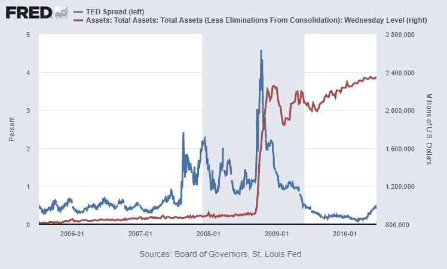

2008 年的 TED 利差和美元指数:

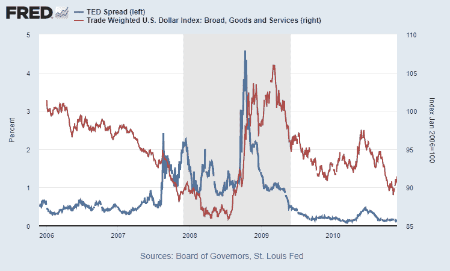

重要的是，与 TED 利差一样，FRA-OIS 利差(见下图)告诉投资者银行之间有多紧张。如果 LIBOR 走高，扩大了与联邦基金利率的利差，这是流动性萎缩的信号。当价格上涨时，比如银行间贷款价格上涨，就会增加融资成本，降低需求，并以融资成本上升的形式，带走原本可以贷出的额外资金。

法国-OIS 价差:

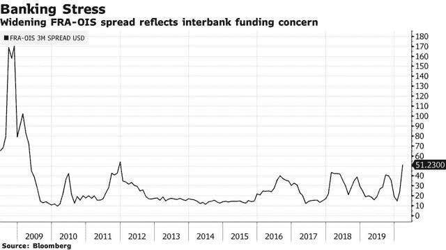

美联储的措施是不够的，因为他们愿意贷款，但银行不想通过贷款给面临倒闭风险的企业来持有一袋高风险的赌注。实质上是让那些有机会获得美联储资金的人不感兴趣，让那些有兴趣但没有合法途径的人感兴趣。

从框架或结构的角度来看，信贷/融资状况恶化得越严重，市场就越难以正常运转。

股市动荡、极高波动性下的资本错位(VIX)以及信贷/融资渠道崩溃(3m FRA-OIS 利差和 TED 利差)所表现出的信心完全丧失，继续推动对美元的巨大需求，因为这表明美元短缺。

*最初发表于*【www.trading-manifesto.com】