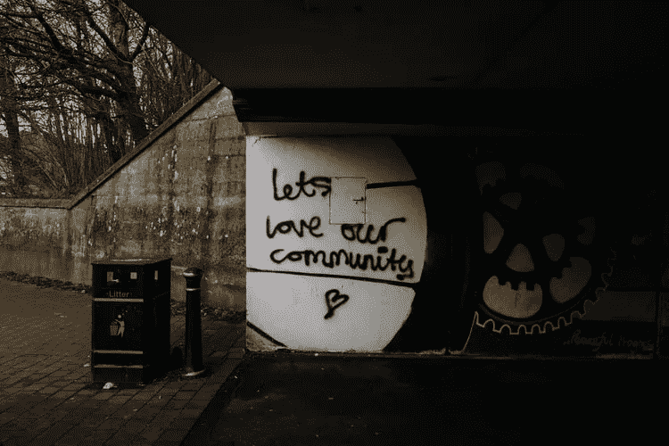

# 如果养育一个孩子需要一个村庄，那么建立一个企业需要一个社区

> 原文：<https://medium.datadriveninvestor.com/if-it-takes-a-village-to-raise-a-child-then-it-takes-a-community-to-build-a-business-ca377356738d?source=collection_archive---------6----------------------->

[https://unsplash.com/@parktroopers](https://unsplash.com/@parktroopers)

你有没有问过自己为什么会有社交媒体营销的热潮？为什么品牌在内容创作和社交媒体管理上花费数千美元？

有很多问题要问？但简单的答案是，企业需要为他们的顾客创造一个安全的地方，让他们觉得他们是某个事物的一部分。

先说一点原因。

科技让人们创业变得非常容易。建立一个社交媒体账户和建立一个网站不会花费你一天的时间。你可以在几个小时内成为一名企业主。

有什么含义？顾客每天都会看到广告。无论他们走到哪里，都会看到这样或那样的广告试图向他们推销东西。

人们现在变得警惕起来。从广告中直接购买的人数大幅下降。你必须吸引他们，并通过一个漏斗让他们从你这里购买。

这就像去一个市场，那里许多店主都在告诉你从他们那里购买。在那个时候，你会变得有防备心，去你觉得舒服的卖家商店——你一直向他买东西的那个人。

今天的企业也是如此。有太多的人在玩同一个游戏，如果你不能赢得顾客的心，就没有人会来找你。

 [## 数据驱动始于数据素养|数据驱动的投资者

### 光是听到“数据”这个词就令人生畏。老实说，只有 21%的全球员工对自己的工作充满信心

www.datadriveninvestor.com](https://www.datadriveninvestor.com/2020/03/22/data-driven-starts-with-data-literacy/) 

在这个时代，赢得客户芳心的方法是创建他们可以参与的社区。一切都数字化了，所以为你的客户组织特别活动可能不如举办在线会议有效。这让我们回到为什么品牌在社交媒体上投资如此之多。这有助于创建虚拟社区，让您的客户有兴趣再次与您合作。

# 你如何围绕你的业务建立你的社区

[https://unsplash.com/@mikejerskine](https://unsplash.com/@mikejerskine)

## 找到原因

当我们帮助别人时，我们会有一种感觉。这是一种永不衰老的美好感觉。

利用这一点。世界上有很多问题你都可以解决。更好的是，你甚至不用花自己的钱。

你知道你买的那些产品，它们包含这样的信息:商品的收益将用于帮助解决世界饥饿问题，抗击癌症，或者帮助某个地方的饥饿儿童。你可以实施这个策略。

这对你的品牌来说是一个双赢的局面，因为一方面，你利用了已经在为这一事业奋斗的更广泛的社区，然后，你围绕你的品牌建立了一个社区。

当你把你的品牌定位为帮助者，你就吸引了更多的人到你身边。

## 在社交媒体上给予价值

如果你一直在阅读我的内容，你会注意到，在我谈论发展你的品牌的每个帖子中，我总是谈论*价值。*是因为人天生自私。

他们使用你的品牌是因为你能给他们带来好处。我们就是这样。所以，你必须利用它。

您可以创建一个私人群组，为您的客户提供独家信息和优惠。你可以选择一个你喜欢的话题，并确保你不断地提供关于它们的信息。

这些团体给你的顾客；

1.  边界
2.  情感安全
3.  归属感和认同感
4.  个人投资
5.  一个共同的符号系统。

通过在群体中包含生活所遵循的规则和规范，你就设定了界限。当他们知道不当行为会让他们受到惩罚时，他们会感觉更像一个社区。你可以在 Reddit 上看到这样的例子，叫做 Subreddits，群体成员以某种方式交流。这使得人们想要留在群体中，最终让他们感觉自己是一个圈内人。

通过把它变成一个私人团体，让那些和你在一起已经有一定年头的人或者高级会员加入，你给了他们情感上的安全感。他们会感到满意的是，并不是每个人都具备成为团体成员的条件。

你可以创造一个只有你的社区成员理解的运动或迷因。你所在社区的人们会有一种归属感和认同感。尽量确保小组中的人互相交谈。一开始可能会很难，但随着时间的推移，人们会放松下来，交流也会变得流畅。

创建虚拟会议或活动，让人们投入时间参与其中。可以是网上研讨会或 IG live。当他们把时间或金钱投入到你组织的事情中时，他们看起来会更投入，因为没有人喜欢放弃他们的投资。

当你能为你的社区提供独一无二的服务时，他们会感到受欢迎。你可以为会员提供礼物、优惠券和邀请函。这样，你会看到他们告诉他们的朋友关于你的品牌，你会有人来找你。

## 对任何事情都要有耐心

你对一切都要有耐心。如果你才刚开始，你的专属团体就没有意义了。你想要一个只有一个成员的专属群组吗？

在你开始尝试建立一个社区的那一天，你可能无法接触到 1000 人，但你必须坚持下去。

用免费的东西吸引人们。善待他们；不要急于卖给他们任何东西。不断给他们价值，反复做，直到他们离不开你的品牌。

表现得太过强势令人反感。慢慢来，不要第一天就把你的产品摆在他们面前。允许他们适应并按照自己的节奏做事。

你的工作只是提供一个舒适的地方*(也就是你的社区)*和，当他们足够舒适的时候，你就可以提供你的产品了。

**感谢您阅读**