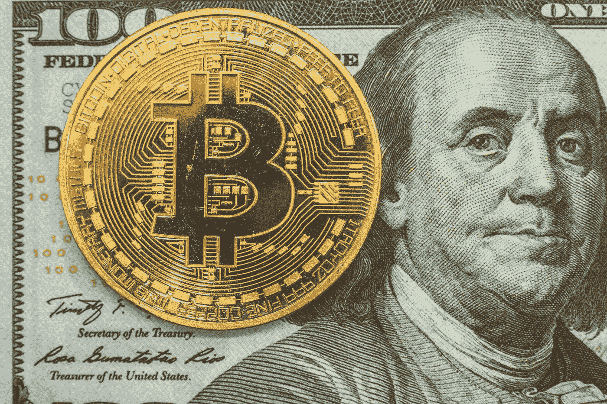

# 如果金钱不是真实的，我们的真实世界明天会是什么样子？

> 原文：<https://medium.datadriveninvestor.com/if-money-is-not-real-what-will-our-real-world-look-like-tomorrow-a5274a2101f8?source=collection_archive---------4----------------------->

Is money real? Bermix Studio on Unsplash

## 本尼斯和塔布曼的货币

我们经常听说，我们的经济，我们的货币体系，你的银行账户和信用卡余额，只是数字化和电子存储的数字。因此，它们不是真实的东西。

但是如果我们所有的钱都是虚构的，为什么经济崩溃的威胁如此危险？

新冠肺炎改变了世界。就业和医疗成本、工作保障、教育和内乱都受到了影响和放大。对大多数人来说不是好事。但与此同时，关于在哪里进行市政投资的争论愈演愈烈。

一些人想要一个更安全的安全网，将就业与医疗保险脱钩。一些人想要更多的“法律和秩序”，以及对权力掮客的税收减免。这是一场和贝弗利山一样古老的斗争:金钱万能，劳资纠纷不断。

 [## 对有商业头脑的投资者有用的行为经济学概念|数据驱动的投资者

### 在美国企业界，高斯统计，对我们周围世界的确定性解释，以及理性…

www.datadriveninvestor.com](https://www.datadriveninvestor.com/2020/07/09/helpful-behavioral-economics-concepts-for-the-business-minded/) 

虽然我们不能同意是否应该把我们的钱用于更好的心理健康护理或穿着防暴装备和盔甲的高科技警察，或者我们是否应该投资于全民公共收入或喷气式战斗机，但争论的基础是一个默认的协议，即税收本身是有价值的。

钱，或者更准确地说，钱的虚构是一致的。那些为了他们真正的宗教信仰或意大利面食谱而争吵不休的人，都同意一美元比救世主或有争议的雕像或旗帜更值得拥有、觊觎、努力争取，甚至崇拜。

甚至我们虚构的钱应该描绘安德鲁·杰克森还是哈丽雅特·塔布曼也有待讨论。

简而言之，尽管金钱是一种极其不可靠的虚构，但只有少数扁平的地球人或大脚迷收集坚果或浆果，而不是万能的美元。

我们建立了一个系统，发明了一种有价值的货币，只要人们赋予它价值。另一方面，当一个经济体完全崩溃时，所有虚构的投资都会随着 2007 年津巴布韦的快速升值而消失。

## 生态心理学家视角下的经济

我是一名生态心理学家。心理学家和生态学家看待事物的角度不同。内乱、种族主义、经济崩溃、有限的资源、流行病、气候危机和经济都是一个混乱整体的一部分。我们看到现在所有的森林都在燃烧，俄勒冈州波特兰最近的动乱就像线一样编织在一起，一个相当混乱，但却是彩色的星球。

许多人认为它正在瓦解，这引起了人们的担忧和不安全感。

生态原则并不总是与我们人类的发明完美融合。这是因为大自然投入了数十亿年来进化共生关系，以保护和调节水文系统和可持续生态系统平衡等因素。

智人出现了，并进化出足够大的大脑，决定通过告诉我们自己 Yuval Noah Harari 所说的“故事”可以获得更多

## 你的部落描述了你

然而，我们在我们自己之间争斗，关于我们的上帝故事，我们的阶级故事，我们的性别，或肤色，故事，因为我们的心理程序不喜欢认知失调。我们倾向于部落化，创造内部群体和外部群体。例如，对于一些共和党人来说，黑人的命也是命是个例外。对于一些寻求保护古老家园的美国土著人来说，埃克森美孚公司是个异类。

诸如此类。你属于多少个团体就属于多少个团体。如果你是华尔街的投资者，女权主义者的母亲，也是一个喜欢潜水和烤面包的女儿，你至少有五个会员资格。我们每个人可能都有几百个。

由于这个原因，一些统一的原则——比如金钱，或者经济的概念——必须被创造出来以提供安全。金钱是一个统一的虚构，不管你有多少其他大相径庭的从属关系，它都给你权力按照自己的利益行事。

它的力量来自于它的实用性。有了钱，不管是塑料的、纸的还是电子的，你可以买华尔街的出版物、面粉、与你的儿子和妈妈的午餐，如果你还在工作的话，也许还可以买一些潜水装备。

因此，我们每个人都想要并且需要钱。我们在认知上把自己与它的“虚构”分开，并且通过切断与物质世界及其令人不安的有限资源和受威胁的生物圈的联系，我们进一步把自己分开。

这是一个真实的食物网和一张电子表格之间的区别，电子表格上有你所有的债务、账单、账目和总收入数据。青蛙不在乎你往它们的池塘里扔了多少硬币，但你在乎，因为你可能需要这些硬币来制造胰岛素。事实上，青蛙对昆虫更感兴趣，因为亚马逊大火导致它们的池塘干涸。

在生态学家或心理学家看来，亚马逊大火包括亚马逊雨林、杰夫·贝索斯笔下的亚马逊，甚至亚马逊超级英雄，因为就像种族主义一样，父权制的衰落也体现在你的食物、医疗保健、消费品等成本中。

一个巨大的，破烂的，基于故事的世界有许多松散的结尾。

## 跳跃蛙跳和寻找替罪羊

那么，我们这个物种的差异并不在于我们制造工具、建造家园或文化。那就是我们讲故事。一个抽象的思想变得如此强大以至于统治了世界，然而，如果我们忽视和/或过度开发我们的世界，或者依赖于它的任何我们的生物同胞，包括那些外部群体的部落，也会使我们处于危险之中。

作为一个物种，我们在物质世界中生活了亿万年。然后我们找到了农业，爆发出记录我们的故事的狂热，并转移到室内。我们凭借这一独特的特征领先于所有其他物种。

我们的思想支配着我们的行为。仅举一个例子，新冠肺炎是历史上多次病毒爆发中的一种人畜共患疾病，多次爆发导致数百万人死亡。这是因为我们没有投入更多的资金来寻找更合理地食用动物的方法。我们不管理我们的外部化成本，也不衡量支持国内或野生动物贸易的限度。结果是大流行病爆发，气候危机，栖息地丧失等等。，计入成本。

十有八九，作为我们的青蛙朋友，如果我们希望为所有人创造一个稳定的经济和可持续的资源，我们应该吃更多的昆虫蛋白和实验室肉类。

但是，对我们这种人来说，寻找替罪羊要方便得多，也舒服得多。

看看新冠肺炎的真正原因，(我们不计后果地销售肉类)，并与我们目前实际关注的问题进行对比。我们正在把面具政治化，或者把我们所有宝贵的时间和精力都花在数应该指责多少人，以及应该指责哪个政党上。

似乎只有愚蠢的物种才会为了找个替罪羊而抛弃他们支持的世界，但这基本上就是我们所做的。我们放弃了自己的个人力量，尤其是当我们在一个岌岌可危的世界中感到不安的时候。我们无意识地害怕我们的小说有一天会赶上我们。

我们创造了从青蛙的角度看毫无意义的小说。谁实际上是红色的，谁是蓝色的？谁与“白种人”或黑种人相分离，我们当中又有谁与我们呼吸的空气、我们所在的水或创造生命本身的植物或动物相分离呢？

我认为青蛙知道食物的价值大于金钱，但在我们知道这一点之前，我们还需要从它们身上学到更多的东西。

## 明天的世界

如果我们慢慢解开资本主义和世界文明是否会崩溃？或者我们使用我们创造性的抽象能力来创新和设计公平的解决方案？我们都屈服于流行病及其余波吗？还是我们在文化战争中治愈了瘟疫，实现了平等？

我们抽象思维的另一个方面是，我们首先通过问这样的问题走了一条心理捷径。我们倾向于把一切都变成二元的，因此，简单的选择。黑/白，一/零，富/穷，男/女，被拯救/被诅咒…

但在我们的现实世界中，我们不是二元对立的，我们是编织在一起的整体。

事实是，对一些人来说，世界每天都在崩溃，而对另一些人来说，世界每天都在被重新想象和重新创造。

是的，越来越多的人叫嚣着宣布他们对邦联旗帜和面具佩戴的立场，但悄悄地，更有意义的是，研究人员和科学家正在寻找疫苗和更好的社会公平路线。

鉴于新冠肺炎席卷全球的经济飓风，以及仍在继续的民众动乱，人们得过且过，这种情况可能会持续一段时间。

我们是否投资为幸存者创造一个更强大、更有支持力的世界，取决于我们的价值观，以及我们的推拉、抵制和协助角色。我们的银行账户和债务上限的虚构可能会消失，但更有可能的是，我们将继续创造足够的结构性虚构，让大多数人努力实现前进三步、后退两步的进步。

我们正在进行一项世界从未尝试过的伟大实验:在一个有限的星球上养活 80 亿人。这需要一个地球村。

**进入专家视角—** [**订阅 DDI 英特尔**](https://datadriveninvestor.com/ddi-intel)