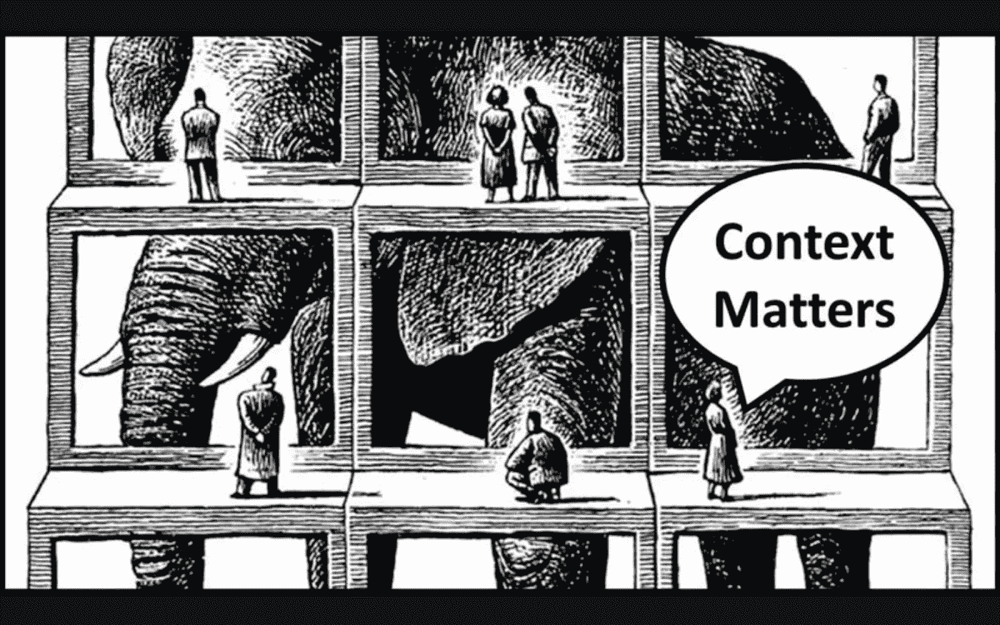

# 如果没有上下文，为什么一开始就要合作呢？

> 原文：<https://medium.datadriveninvestor.com/if-not-contextual-why-collaborate-in-the-first-place-635716fa324e?source=collection_archive---------18----------------------->

人们为了工作而合作，结果却被遗忘，这是没有意义的。

**Image Source: UX Collective**

关于在一个组织内领导数字化转型的许多想法和讨论主要集中在“**协作工作**”上。

人们相信，随着组织越来越年轻化，随着最近几代人步入职场，管理层需要转变他们的运营方式。

到目前为止，当我们听到组织运作时，我们得到的提醒都是大多数“T2”管理任务。无论是后台注册还是满足面向客户的需求。尽管协作在知识经济中一直是一种至关重要的需求，但直到最近它才开始出现。

随着技术的颠覆，普通消费者和创造者的行为都发生了巨大的变化。这是一个购买者变成提供者，提供者变成购买者的循环。

同样，随着社交网络的入侵和点对点的知识共享平台，信息丰富度达到了顶峰，之后恢复“**预约/预定喂食**”变得不可能。产生了按需市场**,在该市场中，需求/想要被尽可能即时地确认。**

> **随着员工带着与客户同等的需求进入公司，类似的行为开始在公司内部复制。**

**客户一直处于阶梯的顶端，因为他们与公司的业绩直接相关。从外部来看，这是一个令人满意的理由，解释了为什么顾客在经济链条中占据首要位置，而组织内部的人则不那么重要。**

**参考之前的场景，现在员工的作用和消费者一样强大，我们每个人都渴望学习，企业家心态成为新的生活方式，员工满意度是组织扩大规模的关键。**

> **如今的员工更加注重选择更符合他们个性的组织文化。**

**他们寻找符合他们标准的同事，他们对同事非常有同理心，对他们所做的事情充满热情。在工作中合作的趋势在组织中很普遍。**

**员工深深投入到**协作文化**中，并喜欢在工作场所使用工具，在与团队成员/外部参与者一起工作时或在工作之外与同事联系时扩大这种文化。**

**协作工具需要服务于"**不丢失上下文**"的目的，同时使协作和交流更容易。理想情况下，它不能是一个将用户带回“T2”切换标签“T3”禁锢的独立平台。同时非常感谢 [Slack API](https://medium.com/u/272cd95a3742?source=post_page-----635716fa324e--------------------------------) 、脸书[Workplace、](https://medium.com/u/c548fe6bc926?source=post_page-----635716fa324e--------------------------------) [Zoho](https://medium.com/u/fa8587072b22?source=post_page-----635716fa324e--------------------------------) Cliq 等工具。有一大块不见了。**

**通常**最终用户/员工**知道他们在使用孤立工具时所经历的痛苦，但组织对此一无所知。因为他们缺乏能力去真正理解在所有这些工具中缺失的因素是“**语境**”。**

**仅仅通过**集成执行工作的工具**和进行工作沟通的工具是无法实现上下文协作**的。在工作中实现这种无缝过渡的更好方法是创建一个**独特的/新的界面**，让员工在一个标签/工具/地方协作和工作。****

> **没有上下文的协作只是杂乱的。**

**查看本指南，了解协作及其重要性**——**[**2020 年商业协作快速指南**](https://kissflow.com/collaboration/quick-guide-to-business-collaboration-2020/)**