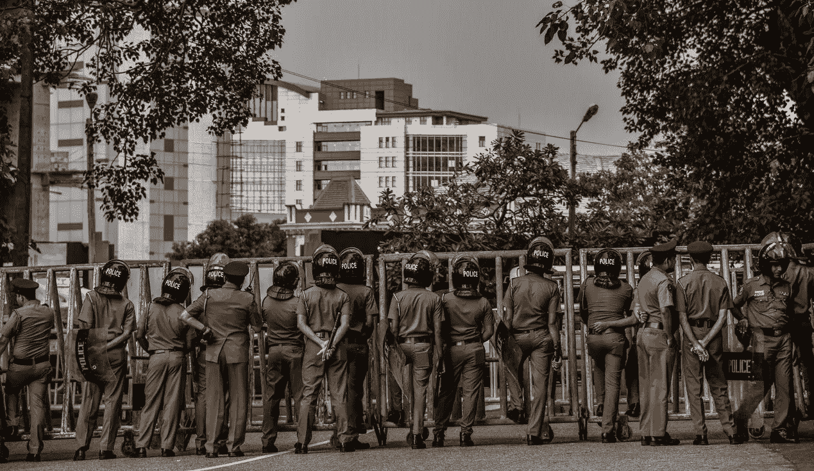

# 如果特朗普赢得 2020 年，我们就会变成基列

> 原文：<https://medium.datadriveninvestor.com/if-trump-wins-2020-we-stand-to-turn-into-gilead-2d36cce5b5e9?source=collection_archive---------2----------------------->

## 波特兰右翼革命的大门刚刚打开。

Photo by sk via Pexels

今天早上，我正坐在沙发上，喝着咖啡，突然手机里传来一条可怕的消息。是的，这是耸人听闻的。是的，这是制造恐惧。是的，这篇文章带有明显的媒体偏见，目的是激怒左派。它也确实在发生。

为了恢复波特兰的法律和秩序，[联邦特工已经被派往该地区](https://www.washingtonpost.com/nation/2020/07/17/portland-protests-federal-arrests/)。他们穿着迷彩服。他们佩戴着普通的警徽。他们有武器。他们在没有标记的货车里。他们在拘留人。

我在这里不是为了争论波特兰是否需要联邦政府的存在，以及在这个城市持续的抗议活动中谁对谁错。法律和秩序是由一群人维护的，没有人知道是谁、什么、为什么或如何维护，这与事实无关。

Screenshot of my phone alert this morning.

它直接出自玛格丽特·阿特伍德的《T4》女仆的故事。革命以公共利益和秩序的名义从街头暴力开始。达到这个目的的手段是武力和恐惧。基列开始在街上恐慌，公民被不明身份的民兵拘留。

我认为我们会在一个女性被迫成为厌恶女性的福音派领袖的整个文化的性奴隶的国家结束吗？不，不是字面意思。

我是否认为我们正处于某种重大起义的边缘，这种起义将是暴力的，并将在我们的历史书上留下永久的印记？是的。

我们国家正处于权力斗争之中，这场斗争能走多远取决于一件事:特朗普是否会继续留在白宫。如果他留下，我们就有成为阿特伍德的基列的危险。

> 如果一个没有身份证明的武装分子在一辆没有标志的面包车里可以拘留一个公民，而没有任何人知道这正在发生，在这一点上任何事情都是可能的。

我们可以试图阻止它，但我失去了信心，我们可以与总统的每一个无视理性的行动。在第二个任期内，从总统手中夺走控制权的每一种方法都有可能出现可怕的偏差。

## 参议院

参议院很有可能转投蓝色阵营。民主党需要赢得四个席位才能推翻参议院并控制政府两院。如果民主党能保住道格·琼斯在阿拉巴马州的席位，有四个州(科罗拉多州、亚利桑那州、缅因州和北卡罗来纳州)可以完成这项工作。

我讨厌认为这无关紧要，但随着特朗普连任，这可能无关紧要。

波特兰那些开着无标记货车的人并不是应国会的要求和批准来到这里的。如果特朗普留在白宫，无论谁控制参议院，他都将继续单边行动。

蓝色参议院唯一的王牌是特朗普第二任期头两年的弹劾。如果等到下半年，可能就来不及了。

## 愤怒的总统反弹

如果特朗普获胜，并且不得不忍受民主党参议院阻止共和党的每一项举措或寻求逆转自己的政策，他将失去理智。

关于特朗普，我们知道的一个无可辩驳的事实是，他想要、需要和要求控制和权力。他将继续的愤怒和恐怖运动将会煽动他的追随者。

正如我们现在看到的，愤怒转化为行动。民主党人受够了，他们不懈地努力赢得战场，让更多的人进入大大小小的政治办公室。如果你认为愤怒的共和党人不会做同样的事情，那就再想想吧。

## 钟摆总是摆向另一边

历史已经向我们证明了一件事:弱者会生气，会咬人。在这种情况下，处于劣势的是国会。

> 让我们坦率地说，国会被用作控制总统办公室的手段。

这发生在克林顿的第一个任期结束后，小布什的第二个任期结束时，以及奥巴马任期的整个后半段。如果特朗普赢了，共和党人会再来一次，竭尽全力拿下中期选举。而且会很难看。

我们将有一年的时间为几十年来最糟糕的中期选举做准备。

武力被用作结束权力斗争的手段。一名被联邦特工拘留的抗议者引起了严重关注。他不知道是谁在拘留他，这些人看起来与以法律和秩序的名义走上街头的右翼极端分子没有什么不同。

任何发生这种情况的国家都会为大规模滥用权力和恐惧驱动的敌意收购埋下伏笔。抗议者停下来，出于恐惧，服从了武装人员的要求。

如果这一切正在发生，它会在哪里结束？我们刚刚打开了正常化警察国家的大门，公民对此无能为力。这个警察国家正被一个不稳定、危险的总统领导着，人们越是挑战他，他就变得越精神错乱。

感觉对我们国家来说我最害怕的威胁是我们，这太可怕了。我们不需要联邦政府部署的民兵来恢复我们国家的法律和秩序。我们需要一个领导者。现在，我们还没有。如果特朗普连任，情况会变得更糟。

瓦妮莎老爹是一名作家、编辑、植物迷、音乐迷，也是🎙 [***的主持人，我没有考虑过***](https://open.spotify.com/show/1iP4vTmQzpAzvEhj8jeDNs) *，一个关于观点的播客。如需联系信息或了解更多关于她的信息，请访问*[***【www.vanessatorre.com】***](http://www.vanessatorre.com/)*和* [***注册她的简讯***](https://lp.constantcontactpages.com/su/6TmEjuh/newkid) *。*

## *我们正处于某种边缘，无论是什么，都令人不安:

 [## 共和党应该害怕民主党女性选民

### 我们在看。我们被动员了。我们受够了。我们在投票。

medium.com](https://medium.com/fearless-she-wrote/the-gop-should-be-terrified-of-democratic-women-voters-caa80766c409)  [## 如果没有“暴徒”，我们就不是美国人

### 为了理解我们的现在，也许我们应该理解我们的过去。

medium.com](https://medium.com/@vanessatorre/we-wouldnt-be-americans-if-not-for-thugs-ff2c116ddf08)  [## 不是数据驱动的政治辩论投资者

### 《纽约时报》在 2020 年 6 月 3 日在线发表了阿肯色州参议员汤姆…

www.datadriveninvestor.com](https://www.datadriveninvestor.com/2020/06/08/the-political-debate-that-has-not-been/) 

**访问专家视图—** [**订阅 DDI 英特尔**](https://datadriveninvestor.com/ddi-intel)