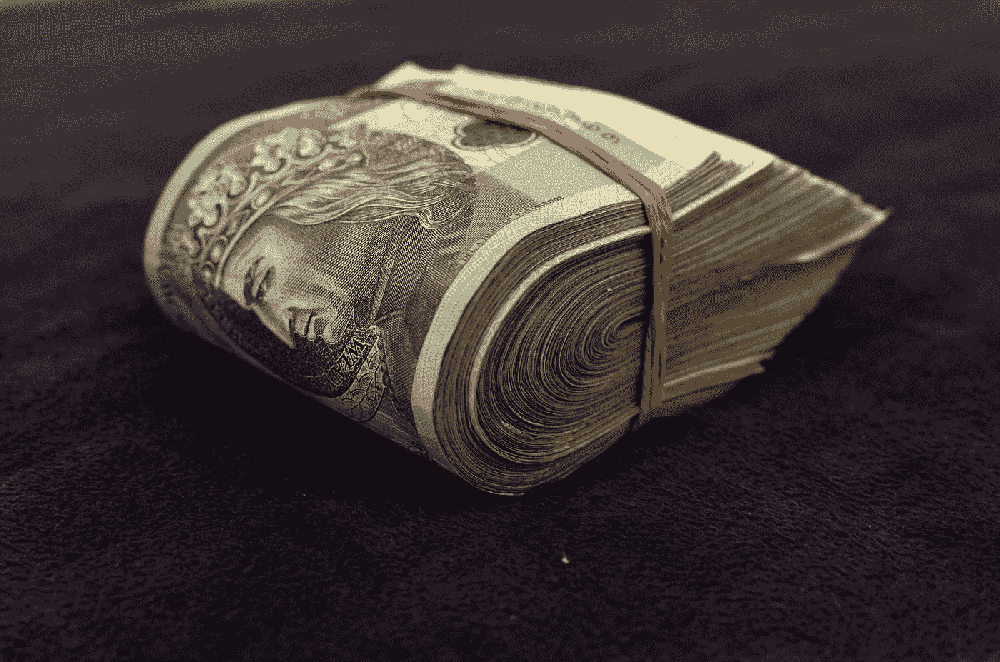

# 如果给你 10 万美元，让你想怎么花就怎么花，你会花在哪里？

> 原文：<https://medium.datadriveninvestor.com/if-you-are-given-100-000-to-spend-as-you-like-where-would-you-spend-it-916779f118c8?source=collection_archive---------8----------------------->

## 我问了一堆朋友这个问题。

Photo by [Piotr Łaskawski](https://unsplash.com/@tot87?utm_source=medium&utm_medium=referral) on [Unsplash](https://unsplash.com?utm_source=medium&utm_medium=referral)

在 1985 年的一部电影中， ***布鲁斯特的百万富翁，*** 布鲁斯特，主角(由理查德·普赖尔饰演)，从他素未谋面的叔叔那里继承了 3 亿美元。

但是他必须完成一项有几个条件的挑战。

为了得到遗产，他必须在 30 天内花掉 3000 万美元。但是在 30 天后:

*   他不应该拥有任何资产
*   他不能把钱给别人
*   他不能通过购买和破坏有价值的物品来浪费它
*   他必须为他购买的服务获得价值
*   他在赌博中可能会输掉 5%
*   他可以捐 5%给慈善机构，赌输 5%

最后，他不能告诉任何人这个挑战。

布鲁斯特的年收入从未超过一万美元，他租了一套昂贵的酒店套房，以高昂的薪水雇佣私人员工，还下了不良的赌注。他做一些疯狂的事情，比如竞选纽约市市长，购买 100 万美元的邮票，用在明信片上，雇佣最昂贵的室内设计师为他设计酒店房间，只住一个晚上。

无法花费 3000 万美元，布鲁斯特变得厌倦了金钱，并意识到这笔钱的真正价值，这是他的叔叔一直想要的。

我经常想，如果人们发现自己处于类似的情况，他们会怎么做。

3000 万美元是一大笔钱，但如果像你我这样的人得到一大笔钱，并被告知可以花在我们喜欢的任何地方，那会怎么样呢？

我选定了 10 万美元，我想我会通过询问周围的人来进行实验。

> 如果给你 10 万美元想怎么花就怎么花，你会花在哪里？

# 上面这个问题成了我最喜欢的破冰。

人们对这个问题的反应值得注意。

起初，他们不想表现得足够勇敢去回应。然后他们想取笑我。他们想知道我什么时候分发钱。

但是通过一些鼓励和一点探索，我开始得到有趣的回复。

不同的人在他们生活的不同时期会选择不同的东西来花钱。我丈夫无疑会把钱投资到股票上，我的女儿们会去旅游，我的一个朋友说她会每周至少雇一次佣人。

另一个朋友想在她的余生中去巡游。旅行是常见的事情(当然，我是在 Covid 时代之前问这个问题的)

 [## 首次创业的 4 个资金管理技巧|数据驱动的投资者

### 超过 82%的企业倒闭是由于财务管理不善和现金流问题。开始新的…

www.datadriveninvestor.com](https://www.datadriveninvestor.com/2020/10/23/4-money-management-tips-for-first-time-entrepreneurs/) 

# 最近我在一个论坛上提出了这个问题。

以下是一些回答。

> 如果那 10 万美元还在，我会自愿接受。
> 
> 这笔钱将用于偿还短期债务，购买一辆不同的家庭用车(我们的车就要报废了)，把一部分存进银行，作为我们孩子的教育基金，把剩下的钱存起来，当我们可能再次旅行时，用于一次美好的家庭度假(可能是夏威夷)。
> 
> 哦，我太自私了。当然有些是为了慈善。我们很乐意支持几个组织。

> 这些天我可能会花在政治广告上。然而，除此之外，我可能会把三分之一捐给慈善组织，其余的投资于环保股票。不过，去希腊旅行也不错。我目前退休了，有一笔舒适的储蓄，所以我不需要偿还债务之类的。

> 我看了这个，但是我挣扎着回答。然而，如果我回到我们刚搬到新西兰的时候，我会把它用来偿还抵押贷款。我们渴望尽快还钱。这是我唯一能想到的。即使在那个时候，我也不渴望超出我预算的东西。我认为 10 万美元是一大笔钱，而且我个人认为，除了还贷之外，把它用在其他地方是一种极大的奢侈。
> 
> 今天，我不知道该拿它怎么办。贷款早就还了。如果有人给我那笔钱，我可能会捐给圣约翰救护机构，让他们买些救护车。

> 瞒着我妻子。她正在争取亚马逊购物者名人堂。开个玩笑…算是吧。
> 
> 我会(为了学习)投资自己，然后把剩下的钱存入某种有息账户，试着忘掉它。我过去实际上收到过一次性付款，我对这一经历不再抱有幻想。
> 
> 我现在不像个消费者了。不那么迷恋“好东西”它们让我想起了肥皂泡——都很漂亮，闪闪发光。空无一人。我开始意识到，比起花钱，我更喜欢有钱。和家人一起留下美好回忆的钱是个例外。花在优质学习体验上的钱也是如此。

# 这个问题没有对错之分。

但是大多数人，即使是受过教育、看上去精明的人，也不知道如何处理意外之财。

研究表明，70%的人在收到钱后的三年内会失去所有的意外之财。

10 万美元并不是一笔巨款，你需要一个财务顾问来告诉你如何充分利用它。

# 很有可能你会在生活中得到一笔意外之财。

根据 Cerulli Associates 最近的一项研究，未来 25 年，美国将发生大规模的财富转移。估计有 68 万亿美元将易手，随着该国的老龄化人口将这些资产转移到慈善事业及其继承人。

我很想知道，如果你得到 10 万美元，并得到花光它的指示，你会做什么。

请在评论区写信告诉我。

我会在下一篇文章中告诉你我的回答。

— — — — — — — — — — — — — — — — — — — — — — — —

想让你的写作更上一层楼吗？订阅我的时事通讯，[一个异想天开的作家](https://neera.substack.com/welcome)。

— — — — — — — — — — — — — — — — — — — — — — — —

这个故事最早出现在 www.neeramahajan.com 的[。](http://www.neeramahajan.com./)

如果你喜欢它，你可能也会喜欢这个。

 [## 如何让左脑停止思考

### 给你的右脑一个表达自己的机会。

medium.com](https://medium.com/illumination/how-to-stop-your-left-brain-from-thinking-533afed73bdf) 

## 访问专家视图— [订阅 DDI 英特尔](https://datadriveninvestor.com/ddi-intel)