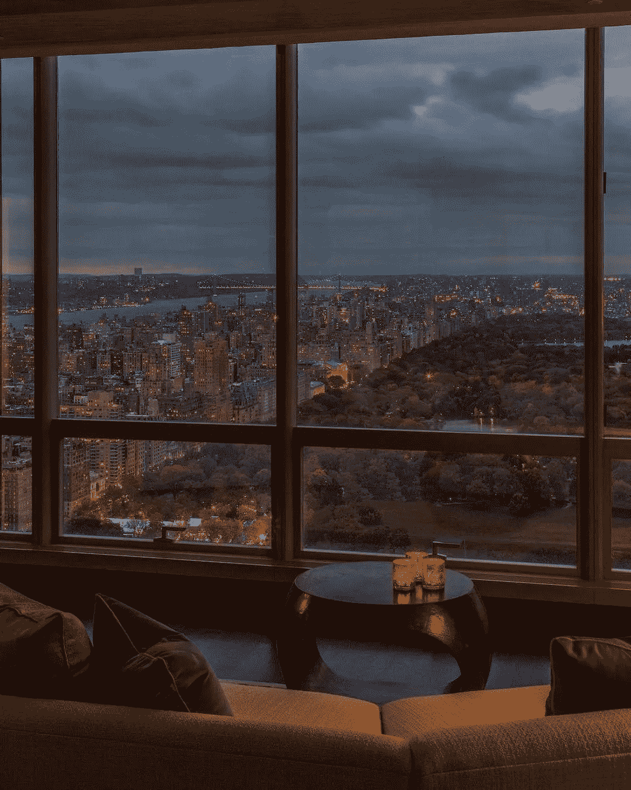

# 波动是游戏的一部分。准备好利用它。

> 原文：<https://medium.datadriveninvestor.com/if-you-are-not-adding-to-your-best-companies-you-are-letting-money-on-the-table-43026aa71a75?source=collection_archive---------29----------------------->

## 如果你没有增加你最好的公司，[你就把钱留在桌子上了](https://diegolucasq.medium.com/building-your-wealth-729b284f2f4a)

[今年，我的投资组合增长了近两倍。](https://medium.com/makingofamillionaire/building-up-your-net-worth-3e3175c46d29)这要归功于交易平台、自由市场甚至比特币等公司。这种表现的代价是忍受巨大跌幅的痛苦。

交易台现在接近 700 美元。今年 3 月，在交易价格超过 250 美元后，该股触及 140 美元。[我已经持有这家公司两年多了](https://medium.com/datadriveninvestor/how-increased-my-investments-by-improving-my-budgeting-4b8b54c7fe10)，这已经不是第一次出现这种情况了。

[这是向最好看齐的代价。](https://medium.com/datadriveninvestor/taking-small-actions-that-will-make-you-rich-ad46b9d145bc)

拥有这些远见卓识的首席执行官的公司正在扰乱他们的行业并快速增长，由于难以理解他们的业务和估计他们的长期增长率，这些公司受到这些缺点的困扰。

> 可以理解的是，股票价格会波动。
> 
> 然而，你的情绪不应该随着价格波动。

杰夫·格林的公司已经连续两年实现利润，收入平均增长超过 30%，资产回报率超过 20%，毛利润增加，整体表现出色。

尽管有这样的增长，但由于联网电视市场的早期性质，很难预测该公司是否会保持这一增长水平。尽管 Jeff 和他的团队每个季度都在交付)。

胜利者总是要在任何领域证明自己。对于投资来说，这不会有什么不同。

继续持有你的赢家，[享受这些时刻来增加它们](https://medium.com/datadriveninvestor/how-to-protect-your-portfolio-at-all-times-c3ec407dd7a1)，[正如我今天所做的，买入更多交易台和自由市场的股票。](https://medium.com/makingofamillionaire/getting-rich-without-abdicating-of-your-life-56773c2d34f0)